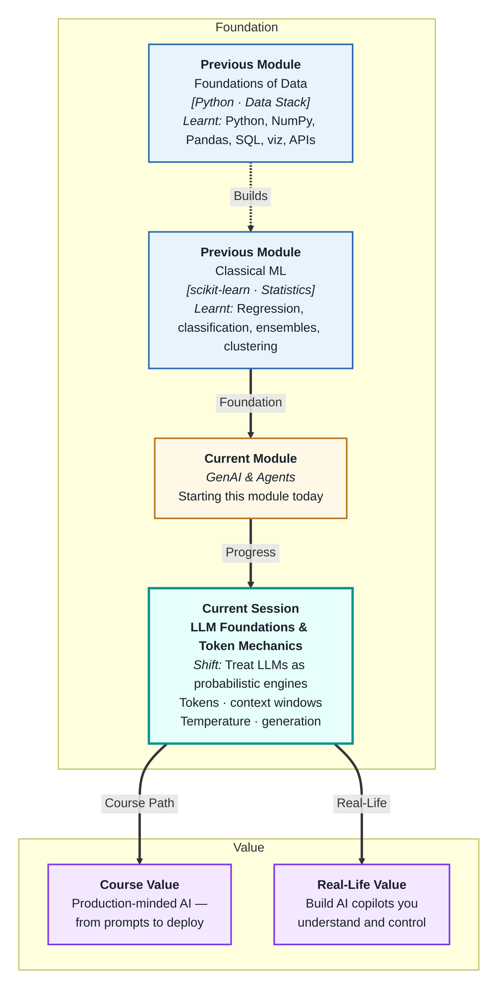
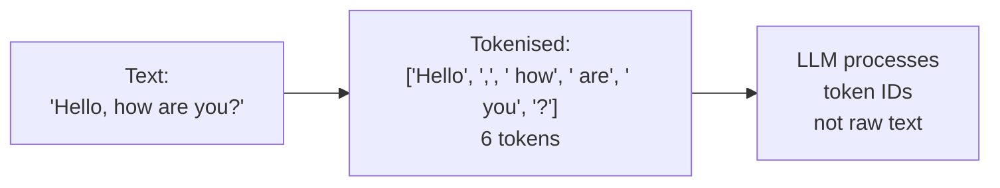
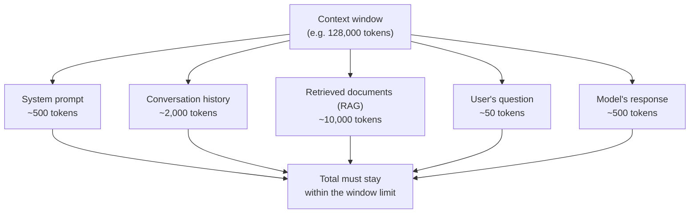
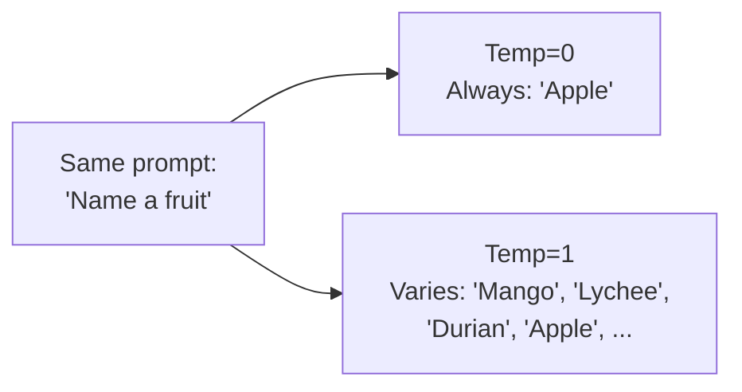
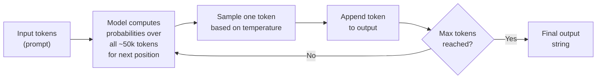
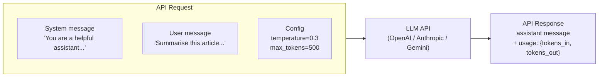

# LLM Foundations & Token Mechanics
---

## Mental Map

## What You'll Learn

In this pre-read, you'll discover:

- What a **token** is — the actual unit an LLM reads and writes, not a word
- How the **context window** limits everything an LLM can "see" at once
- What **temperature** controls and how it shapes the style of output
- Why LLMs are **probabilistic** — the same prompt can produce different results
- How all these mechanics connect to what you will build in this module

---

## A. Tokens — The Real Unit of Language Models

> 💡 **Analogy:** A chef does not count ingredients by "dishes" — they count by grams and millilitres. An LLM does not count by words — it counts by **tokens**. Tokens are the precise unit the model reads, processes, and generates.

**One-line definition:** A **token** is a chunk of text — roughly 3–4 characters or about ¾ of a word — that is the atomic unit an LLM processes. All input is split into tokens before the model reads it; all output is generated token by token.

**Why tokens matter:**

| Fact | Practical consequence |
|---|---|
| 1000 words ≈ 750 tokens | Pricing is per token — longer prompts cost more |
| A Python function ≈ 30–100 tokens | Code counts differently than prose |
| Non-English languages use more tokens per word | Same sentence costs more in some languages |
| "ChatGPT" is one token; "chat GPT" is two | Spacing and capitalisation change tokenisation |

**Token vocabulary:** Every LLM has a fixed vocabulary of 30,000–100,000 tokens. Rare words and symbols are split into sub-word pieces. The word "unbelievable" might be tokenised as "un", "believ", "able" — three tokens.

---

## B. Context Window — The Model's Working Memory

> 💡 **Analogy:** A human reading a 1,000-page novel cannot hold every page in mind at once — they rely on what they last read. An LLM has the same constraint: it can only "see" as many tokens as its **context window** allows. Anything outside the window is invisible to the model.

**One-line definition:** The **context window** is the maximum number of tokens an LLM can process at once — it includes your system prompt, conversation history, retrieved documents, and the user's question, all counted together.

**Key implications:**

| Situation | What happens |
|---|---|
| Conversation grows too long | Oldest messages must be dropped or summarised |
| Large document injected | Less room for conversation history |
| Response generation | Output tokens count against the same window |
| RAG system | Retrieved chunks must fit; choose chunk sizes carefully |

**Context window sizes across common models (approximate):**

| Model family | Context window |
|---|---|
| GPT-3.5 | 16k tokens |
| GPT-4o | 128k tokens |
| Claude 3.5 Sonnet | 200k tokens |
| Gemini 1.5 Pro | 1 million tokens |

Larger windows are not always better — filling a large window with irrelevant text degrades quality. **What you put in the window matters as much as how much fits.**

---

## C. Temperature — Controlling Randomness

> 💡 **Analogy:** A dial on a music mixer labelled "creativity" — turn it low for a precise, consistent recording; turn it high for wild improvisation. **Temperature** is that dial for LLMs: low temperature makes the model focused and predictable; high temperature makes it more varied and surprising.

**One-line definition:** **Temperature** is a parameter (typically 0–2) that controls how randomly an LLM samples from its probability distribution when generating the next token — lower is more deterministic, higher is more creative.

| Temperature | Behaviour | Best for |
|---|---|---|
| 0.0 | Nearly deterministic — always picks the most likely next token | Code, structured data, factual Q&A |
| 0.3–0.5 | Focused but slightly varied — consistent with some flexibility | Summaries, analysis, extraction |
| 0.7–1.0 | Creative and varied — different outputs on same input | Brainstorming, drafting, storytelling |
| 1.5–2.0 | Very random — outputs can be incoherent | Experimental generation only |

**Practical default:** Start with temperature=0.7 for most tasks. Drop to 0.0–0.2 when you need consistency (code generation, JSON extraction). Raise to 1.0+ only when you explicitly want creative variation.

---

## D. Probabilistic Generation — Why LLMs Are Not Calculators

> 💡 **Analogy:** A calculator always gives the same answer to 2 + 2. A good human storyteller asked "what happens next?" gives a different but equally valid answer each time. **LLMs are storytellers**, not calculators — they predict the most plausible continuation, not the uniquely correct one.

**One-line definition:** **Probabilistic generation** means that an LLM produces output by sampling from a probability distribution over possible next tokens at each step — making it inherently non-deterministic and capable of different valid completions for the same input.

**How generation works — step by step:**

**Key consequences for building applications:**

| Behaviour | Implication |
|---|---|
| Same prompt, different output | Never assume exact reproducibility |
| Long outputs drift more | Early tokens influence later generation |
| Model can be confidently wrong | Always validate outputs for critical tasks |
| Probabilities depend on training data | Model "knows" what was common in training, not absolute truth |

**Hallucination** is a direct consequence of probabilistic generation: the model generates plausible-sounding tokens even when the most likely continuation is factually incorrect. Grounding (RAG, structured outputs) is how you defend against it.

---

## E. Putting It Together — The LLM API Mental Model

> 💡 **Analogy:** A power socket delivers electricity on demand — you do not need to understand the power station to use it. An LLM API is the same: you send text in (tokens in), and receive text back (tokens out), all managed through a simple call. But understanding what is happening inside makes you a far more effective user.

**One-line definition:** The **LLM API mental model** is: you send a sequence of messages (consuming context-window tokens), the model generates a completion token-by-token at the configured temperature, and you receive the assembled text back.

**The four numbers you always check:**

| Number | Where to find it | Why it matters |
|---|---|---|
| `prompt_tokens` | API response usage | Cost and context-window usage |
| `completion_tokens` | API response usage | Cost and response length |
| `total_tokens` | Sum of both | Proximity to context window limit |
| `finish_reason` | API response | `stop` = normal; `length` = hit max_tokens limit |

In this module you will build applications that control all of these. Understanding tokens, context, and temperature is the foundation every session builds on.

---

## Practice Exercises

**1. Pattern Recognition**  
A prompt contains: 500-token system message, 3,000-token document, and a 50-token question. The model has a 4,096-token context window. (a) How many tokens are used by inputs? (b) How many tokens remain for the response? (c) What would you do if you needed the model to respond with 1,000 tokens?

**2. Concept Detective**  
A developer runs the same "extract JSON from this text" prompt ten times with temperature=1.0 and gets ten slightly different JSON structures. Using sections C and D, explain why this happens, whether it is a bug or expected behaviour, and what single parameter change would make the outputs consistent.

**3. Real-Life Application**  
Describe three real applications where the choice of temperature has a significant impact on user experience: one where temperature should be near 0, one where 0.7 is appropriate, and one where a high temperature might actually help. For each, explain what would go wrong if you chose the opposite extreme.

**4. Spot the Error**  
A team builds a customer-support bot with a 128k-token context window. They append the full conversation history to every request without ever summarising or trimming. After 100 messages, the API starts returning errors. Using sections B and E, explain what is happening and describe two strategies to keep the conversation within the window.

**5. Planning Ahead**  
You are building an AI assistant that answers questions about a 200-page company policy document. The document is 60,000 tokens. Users ask short questions (~50 tokens). The model has a 32k-token context window. Using the concepts from this session, describe the problem you face, explain why you cannot simply inject the whole document, and outline (in plain terms) one approach that would let you answer questions accurately within the window.

---

> ✅ **You're done!** You now understand the fundamental mechanics of LLMs: tokens (the unit of processing), context windows (the limits of memory), temperature (the dial on randomness), and probabilistic generation (why outputs vary). Everything in this module — prompting, APIs, RAG, agents, deployment — is built on these four ideas. Next: **Prompt Engineering & Reasoning Techniques**, where you will learn to control LLM behaviour precisely through deliberate prompt design.
