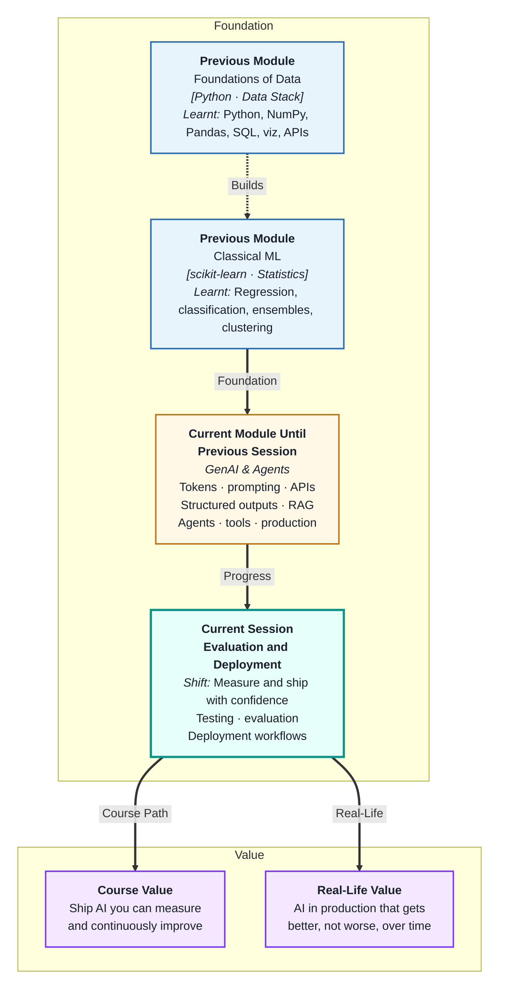
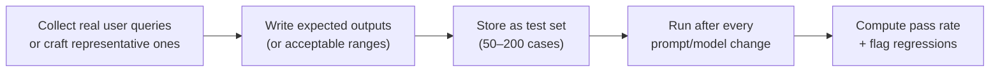
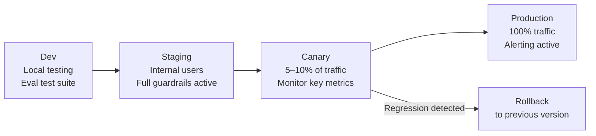
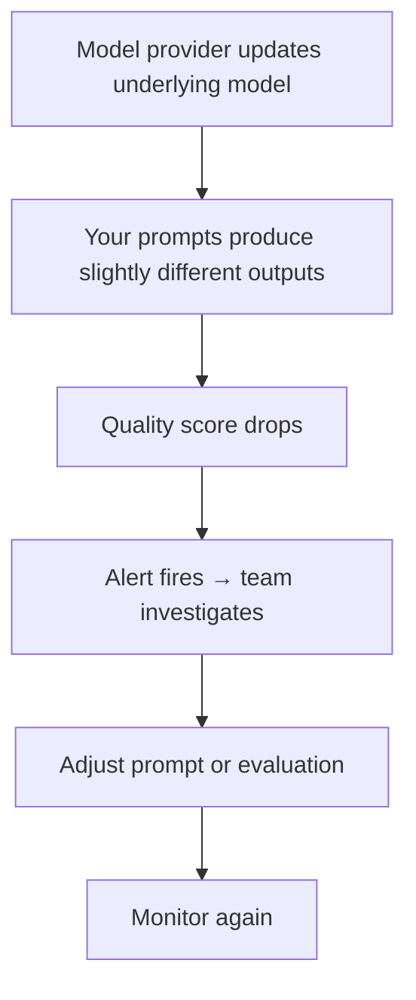

# Evaluation and Deployment
---

## Mental Map



## What You'll Learn

In this pre-read, you'll discover:

- Why evaluating LLM systems is fundamentally different from evaluating classical ML models
- How to build an **evaluation test suite** for prompt-based AI features
- What **LLM-as-judge** evaluation is and when it is appropriate
- How **deployment workflows** differ for AI features vs traditional software
- How to monitor a deployed AI system to detect degradation before users do

---

## A. Why LLM Evaluation Is Different

> 💡 **Analogy:** Grading a maths exam is easy — the answer is right or wrong. Grading an essay is harder — correctness, fluency, relevance, and tone all matter. **LLM evaluation** is much closer to essay grading: outputs are often valid in multiple forms, and quality requires multi-dimensional assessment.

**One-line definition:** **LLM evaluation** differs from classical ML evaluation because LLM outputs are free-text, probabilistic, and multi-dimensional — requiring custom metrics, human judgment, or secondary LLM scoring rather than a single accuracy number.

**Classical ML vs LLM evaluation:**

| Dimension | Classical ML | LLM |
|---|---|---|
| Output type | Fixed labels or numbers | Free text, JSON, or code |
| Correctness | Binary: right or wrong | Spectrum: accurate, partially correct, hallucinated |
| Single metric | Accuracy, F1, RMSE | No single universal metric |
| Reproducibility | Same input → same output | Same input → variable output (at temp>0) |
| Evaluation cost | Fast (computed automatically) | Slow (requires human or LLM judge) |

**Dimensions of LLM quality:**

| Dimension | Question it answers |
|---|---|
| Accuracy / groundedness | Is the answer factually correct and supported by context? |
| Relevance | Does the answer address the actual question? |
| Completeness | Are all required parts of the answer present? |
| Format compliance | Does the output match the required schema? |
| Tone / style | Is the language appropriate for the context? |
| Safety | Does the output avoid harmful or policy-violating content? |

---

## B. Building an Evaluation Test Suite

> 💡 **Analogy:** A software team has a regression test suite — a set of known inputs and expected outputs that run automatically after every change. An AI team needs the same: a **golden test set** that verifies the system still produces acceptable outputs after prompt changes or model upgrades.

**One-line definition:** An **LLM evaluation test suite** is a curated set of input–expected-output pairs that is run against the system to detect regressions, measure quality improvements, and validate prompt or model changes before shipping.

**Building the test suite:**



**Test case types:**

| Type | Description | Example |
|---|---|---|
| Happy path | Normal, expected input | "Summarise this 200-word article" |
| Edge case | Unusual or boundary input | Empty document, single word input |
| Adversarial | Input designed to break the system | Prompt injection attempt |
| Domain-specific | Input from your actual use case | A real customer support ticket |
| Regression | Cases that previously failed | Inputs that caused hallucinations before |

**What to record for each test case:**

```json
{
  "id": "TC-042",
  "input": "What is the refund policy for digital downloads?",
  "expected": "Digital downloads are non-refundable",
  "evaluation_type": "contains_key_phrase",
  "key_phrase": "non-refundable"
}
```

---

## C. LLM-as-Judge — Automated Quality Evaluation

> 💡 **Analogy:** Hiring a senior editor to review every article in a magazine is expensive and slow. Training a junior editor using the senior editor's rubric to do first-pass reviews at scale is practical. **LLM-as-judge** is that junior editor — using a second LLM call to score the output of the first.

**One-line definition:** **LLM-as-judge** evaluation uses a second LLM call (with a carefully designed scoring prompt) to evaluate the quality of the first LLM's output — enabling automated, scalable quality assessment without human review of every response.

**LLM-as-judge prompt template:**

```
SYSTEM:
You are an expert evaluator. Score the following AI response on three criteria.

USER:
Question: {question}
Context provided: {retrieved_context}
AI Response: {response}

Score each criterion from 1 to 5:
1. Accuracy: Is the response factually correct based on the context?
2. Relevance: Does the response directly answer the question?
3. Groundedness: Does the response stay within what the context supports?

Respond in JSON: {"accuracy": int, "relevance": int, "groundedness": int, "notes": str}
```

**When LLM-as-judge is appropriate:**

| Situation | Use LLM-as-judge? | Why |
|---|---|---|
| Large-scale batch evaluation (1000s of items) | Yes | Human review is impractical |
| Final approval before production | No — supplement with human review | LLM judges can be biased |
| Daily monitoring of deployed system | Yes | Cost-effective quality signal |
| High-stakes decisions (medical, legal) | No alone | Requires human sign-off |

---

## D. Deployment Workflows for AI Systems

> 💡 **Analogy:** A new drug is not given to all patients immediately after lab tests — it goes through staged trials (Phase 1, 2, 3) with increasing user numbers. **AI deployment staging** follows the same logic: test with few users first, measure, then expand.

**One-line definition:** A **deployment workflow** for AI systems is a staged process — dev → staging → canary → production — that releases changes to progressively larger user groups while monitoring for quality regressions.

**AI deployment stages:**



**What is different about AI deployments:**

| Aspect | Traditional software | AI system |
|---|---|---|
| Breaking change | Code change | Prompt change, model version change, RAG data update |
| Rollback | Revert code | Revert to previous prompt + model version |
| Testing | Unit tests pass/fail | Eval suite pass rate stays above threshold |
| Blue-green deploy | Traffic switch | Model A/B test with metrics comparison |

**Versioning what you must version:**

- System prompt (treat it as code — store in git)
- Model name and version (`gpt-4o-2024-08-06`, not just `gpt-4o`)
- Vector DB index version (when you re-embed documents)
- Pydantic schemas for structured outputs

---

## E. Monitoring a Live AI System

> 💡 **Analogy:** A hospital's vital signs monitor does not just beep when the patient crashes — it alerts nurses when metrics trend toward dangerous values, long before a crisis. **AI system monitoring** works the same: alert on drift before it becomes failure.

**One-line definition:** **AI system monitoring** means tracking operational metrics (latency, error rate, cost), quality metrics (eval score, guardrail trigger rate), and data drift (input distribution changes) in real time — with alerts that fire before users experience degradation.

**Metrics to monitor in production:**

| Metric | What it signals | Alert threshold |
|---|---|---|
| Latency p95 | Slow responses → bad UX | > 3 seconds |
| Error rate | API failures, validation failures | > 2% of requests |
| Guardrail trigger rate | Unusual input patterns, abuse | > 5% (spike) |
| Token cost per request | Prompt bloat, runaway agents | > 2× baseline |
| LLM-as-judge score (rolling avg) | Quality degradation | Drop > 0.3 points |
| Schema validation failure rate | Model output drifting | > 1% |

**The AI quality degradation cycle:**



**Key insight:** LLM providers can update models silently (e.g. a safety update). Without monitoring, you might not notice that your carefully tuned prompt now behaves differently — until users complain. Continuous evaluation of production traffic prevents this.

---

## Practice Exercises

**1. Pattern Recognition**  
Design a 10-case evaluation test suite for an LLM system that classifies customer support tickets into: billing, shipping, technical, account, other. Include: 2 happy path cases, 2 edge cases (ambiguous or multi-category), 1 adversarial case (prompt injection attempt), and 1 regression case (a category that historically gets confused). Write the JSON structure for each test case.

**2. Concept Detective**  
A RAG-based FAQ chatbot had an average LLM-as-judge accuracy score of 4.2/5 in January. In March, after the underlying model provider updated their model, the score dropped to 3.1/5 with no changes to the codebase. Using sections A and E, explain what likely changed, why the drop happened without a code change, and what monitoring alert would have caught this earlier.

**3. Real-Life Application**  
Design the deployment workflow for each of the following: (a) updating the system prompt for a customer-service chatbot, (b) re-indexing the RAG knowledge base with 50 new documents, (c) switching from GPT-4o to a different LLM provider. For each: what must be versioned, how you would test before deploying to all users, and what rollback looks like if quality degrades.

**4. Spot the Error**  
A team builds an LLM evaluation system that uses LLM-as-judge for all evaluations and uses the judge's scores to automatically approve or reject each new prompt version before deployment — with no human review at any stage. Using section C, explain the risks of this fully-automated approach, which types of errors LLM-as-judge may miss, and how you would add a human checkpoint without making the process impractically slow.

**5. Planning Ahead**  
You are the AI lead responsible for a B2B contract analysis tool used by 50 legal teams. The tool uses an LLM to extract key clauses from contracts and flags risks. Design the complete evaluation and deployment strategy: (a) evaluation test suite structure and size, (b) LLM-as-judge scoring prompt for this domain, (c) deployment stages and canary criteria, (d) production monitoring metrics and alert thresholds, and (e) what happens when a model provider update degrades extraction quality.

---

> ✅ **You've completed the GenAI & Agents module!** You now have the full stack: LLM mechanics, prompt engineering, API integration, structured outputs, embeddings and RAG, reasoning agents with tools and memory, production hardening, and evaluation with deployment discipline. You are equipped to build AI systems that are not just clever in a notebook — but reliable, measurable, and production-ready.
