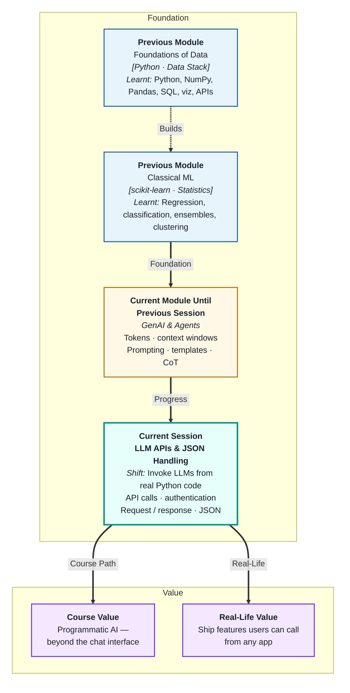
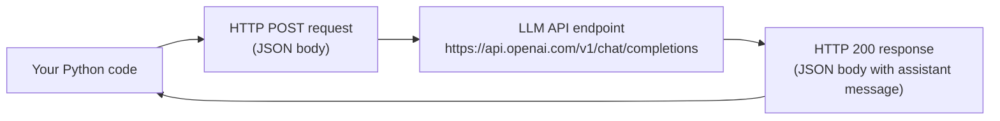
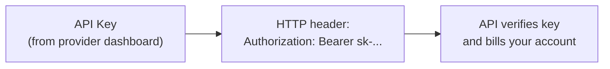
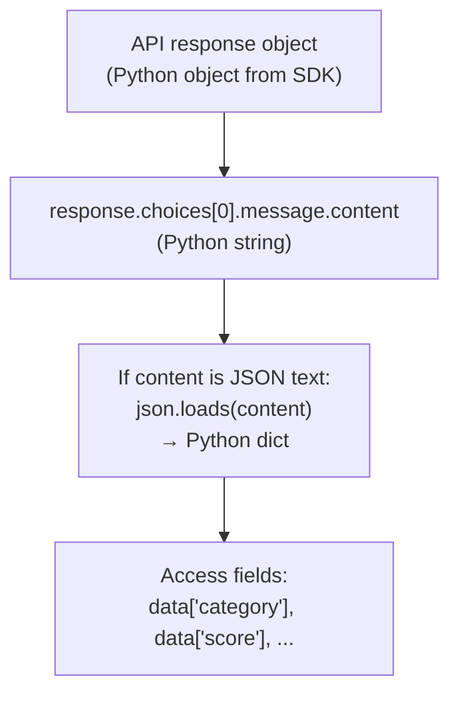
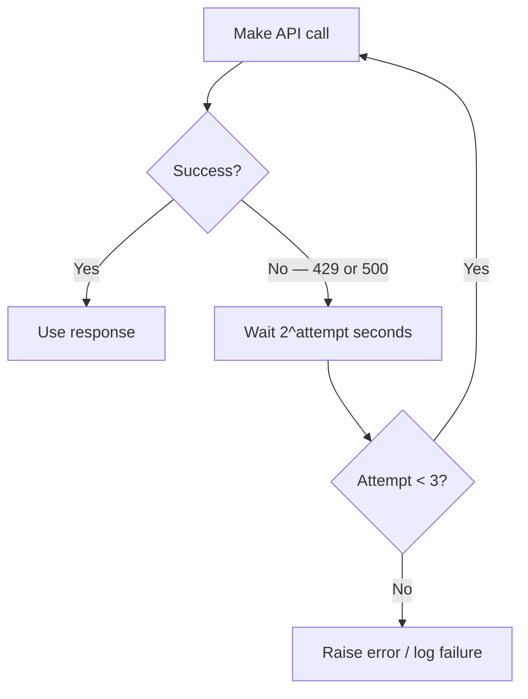

# LLM APIs & JSON Handling
---

## Mental Map



## What You'll Learn

In this pre-read, you'll discover:

- What an **LLM API** is and how it differs from using a chat interface
- How **authentication** works with API keys — and how to store them safely
- What the **request and response structure** looks like in practice
- How to **parse JSON** from an API response in Python
- How to handle common **errors and edge cases** when calling LLM APIs

---

## A. The LLM API — From Chat to Code

> 💡 **Analogy:** Using ChatGPT in a browser is like ordering at a restaurant — you interact directly. Calling the OpenAI API from Python is like having a kitchen in your office — you can programmatically order, customise, and integrate the result into anything you are building.

**One-line definition:** An **LLM API** is an HTTP endpoint that accepts a structured JSON request (containing your messages, model name, and parameters) and returns a JSON response containing the model's completion and usage statistics.



**What moves across the wire:**

| Direction | Data | Format |
|---|---|---|
| Request | Model, messages, temperature, max_tokens | JSON |
| Response | Assistant message, token usage, finish_reason | JSON |

**Why code instead of the chat interface?**

- Process thousands of items automatically (batch summarisation, classification)
- Integrate AI output into databases, APIs, dashboards
- Control parameters precisely for every call
- Build products that other users interact with

---

## B. Authentication — API Keys and Safe Storage

> 💡 **Analogy:** An API key is like a building access card — it proves identity and enables access. Lost or exposed, it lets anyone charge to your account and access your data. **Storing it safely** is as critical as using it correctly.

**One-line definition:** An **API key** is a secret token passed in the HTTP request header that authenticates your application to the LLM provider — it must never be hardcoded in source code or committed to version control.

**How authentication works:**



**Safe storage rules:**

| Rule | What to do | What NOT to do |
|---|---|---|
| Store in environment variables | `os.environ['OPENAI_API_KEY']` | Hardcode `api_key = "sk-abc123..."` in code |
| Use `.env` files locally | `python-dotenv` library | Commit `.env` to git |
| Use secrets manager in production | AWS Secrets Manager, GitHub Secrets | Print the key in logs |
| Rotate keys if exposed | Revoke old key, generate new one | Hope nobody noticed |

**Minimal safe setup:**

```python
import os
from openai import OpenAI

client = OpenAI(api_key=os.environ["OPENAI_API_KEY"])
```

The key comes from the environment — never from the source file.

---

## C. Request and Response Structure

> 💡 **Analogy:** A well-structured form at a government office has specific fields — name, date, reason, signature. The LLM API request is a JSON form with specific required fields. The response is a filled-in return form — predictable and machine-readable.

**One-line definition:** An LLM API **request** is a JSON object specifying the model, a list of role-tagged messages, and optional parameters; the **response** is a JSON object containing the assistant's message, token counts, and finish reason.

**Request structure (OpenAI format):**

```json
{
  "model": "gpt-4o",
  "messages": [
    {"role": "system", "content": "You are a helpful assistant."},
    {"role": "user",   "content": "What is the capital of France?"}
  ],
  "temperature": 0.3,
  "max_tokens": 100
}
```

**Response structure:**

```json
{
  "id": "chatcmpl-abc123",
  "choices": [
    {
      "message": {
        "role": "assistant",
        "content": "The capital of France is Paris."
      },
      "finish_reason": "stop"
    }
  ],
  "usage": {
    "prompt_tokens": 28,
    "completion_tokens": 9,
    "total_tokens": 37
  }
}
```

**Key fields to always read:**

| Field | Location | Why |
|---|---|---|
| `choices[0].message.content` | Response | The actual answer |
| `choices[0].finish_reason` | Response | `stop`=normal; `length`=truncated |
| `usage.total_tokens` | Response | Monitor cost and context usage |

---

## D. JSON Parsing — From String to Python Dict

> 💡 **Analogy:** The API hands you a locked box (a JSON string). `json.loads()` is the key — it opens the box and gives you the contents as a Python dictionary you can work with directly.

**One-line definition:** **JSON parsing** converts the string returned by the LLM API into a Python dictionary or list that your code can index, iterate, and pass to other functions.

**The two layers of parsing:**



**Layer 1 — Extracting the content string:**

```python
response = client.chat.completions.create(...)
text = response.choices[0].message.content
```

**Layer 2 — Parsing JSON if the content is structured:**

```python
import json

try:
    data = json.loads(text)
    print(data["category"])
except json.JSONDecodeError as e:
    print(f"Model did not return valid JSON: {e}")
    print(f"Raw output: {text}")
```

**Common failure modes:**

| Problem | Cause | Fix |
|---|---|---|
| `JSONDecodeError` | Model added prose around the JSON | Stricter prompt; retry logic |
| Missing key | Model omitted a required field | Validate with schema or Pydantic |
| Wrong type | Model returned `"42"` instead of `42` | Type-cast after parsing |

Always wrap JSON parsing in a try/except — LLM outputs are never 100% guaranteed to be valid JSON even with explicit instructions.

---

## E. Error Handling and Rate Limits

> 💡 **Analogy:** A busy restaurant kitchen has a ticket system — if too many orders arrive at once, new tickets are queued or returned. LLM APIs work the same way: if you send too many requests too fast, the API returns a rate-limit error, not a model response. **Error handling** is how your code stays calm when this happens.

**One-line definition:** **Error handling** for LLM APIs means catching HTTP errors (authentication failures, rate limits, server errors), implementing retry logic for transient failures, and logging unexpected responses for debugging.

**Common API error codes:**

| HTTP status | Meaning | Action |
|---|---|---|
| 401 | Invalid API key | Check key; do not retry |
| 429 | Rate limit exceeded | Wait and retry with backoff |
| 500 | Server error | Retry after a short wait |
| 503 | Service unavailable | Retry; consider fallback |

**Simple retry with exponential backoff:**



**Production checklist for every API call:**

- [ ] API key loaded from environment — never hardcoded
- [ ] `try/except` around the call and around JSON parsing
- [ ] `finish_reason` checked — handle `"length"` truncations
- [ ] Token usage logged — to track cost and proximity to limits
- [ ] Retry logic implemented for 429 and 500 errors

---

## Practice Exercises

**1. Pattern Recognition**  
A Python script calls the OpenAI API and receives this response object. Extract: (a) the assistant's message text, (b) whether the response was truncated, (c) the total token usage. Write the Python code for each extraction using the response structure from section C.

**2. Concept Detective**  
A developer stores the API key as `API_KEY = "sk-abc..."` at the top of their Python file and pushes it to a public GitHub repository. Using section B, explain what risks this creates, what an attacker could do with it, and the four steps to remediate the situation immediately.

**3. Real-Life Application**  
Design the error-handling strategy for three scenarios: (a) a batch job processing 10,000 customer emails overnight, (b) a real-time chatbot where users expect instant responses, (c) a data pipeline that calls the API once per hour. For each: what errors matter most, how you would handle rate limits, and what fallback behaviour you would implement.

**4. Spot the Error**  
A developer writes this code: `result = json.loads(response.choices[0].message.content)` — no try/except, no check of `finish_reason`. The batch job runs on 500 items and crashes on item #23 with `JSONDecodeError`. Using sections D and E, identify all the problems and rewrite the logic to handle failures gracefully without stopping the batch.

**5. Planning Ahead**  
You are building a Python service that classifies incoming customer support tickets using an LLM. Each ticket must be classified (category + urgency) and stored in a database. Design the full API call flow: how the request is structured, how you parse the JSON response, how you handle a `finish_reason: "length"` response, how you retry on failures, and what you log for monitoring.

---

> ✅ **You're done!** You now know how to call an LLM API programmatically — structuring requests, reading responses, parsing JSON safely, and handling errors. Next: **Structured Outputs & Validation**, where you will go further — enforcing that the model's output always matches a precise schema, making AI integration as reliable as a database query.
