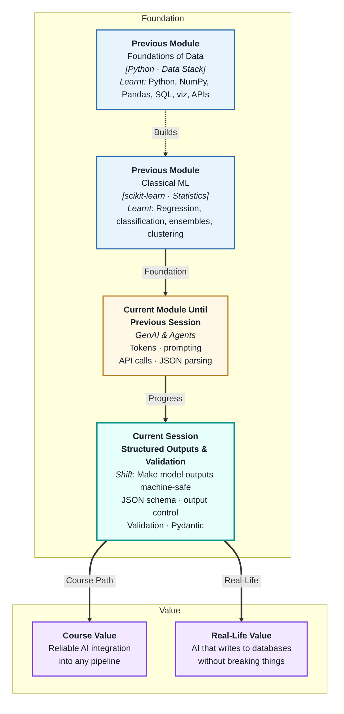
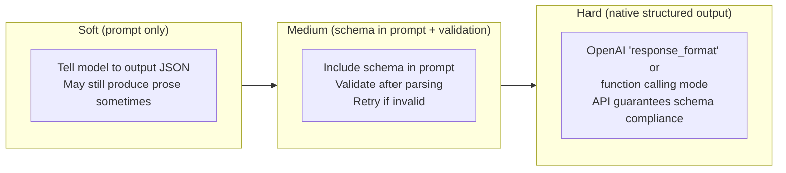
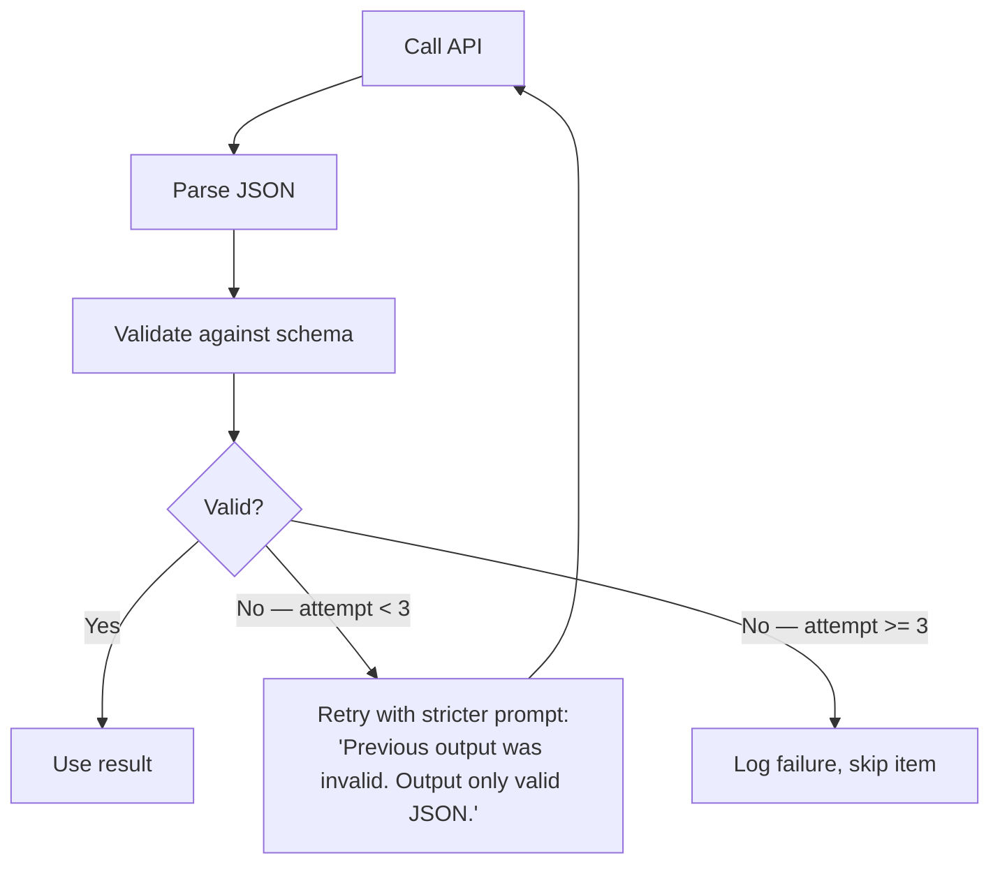

# Structured Outputs & Validation
---

## Mental Map



## What You'll Learn

In this pre-read, you'll discover:

- What a **JSON schema** is and why it is the contract between your LLM and your pipeline
- How **output control** techniques — from prompting to native API modes — enforce structure
- How **Pydantic** models validate and type-check LLM outputs in Python
- What happens when validation fails — and how to handle it gracefully
- How to design schemas that capture everything you need from an LLM response

---

## A. The Problem: LLMs Are Naturally Prose Machines

> 💡 **Analogy:** A talented writer asked to "fill in this form" often writes a beautiful essay instead. You asked for a form, not an essay. **Structured outputs** are the equivalent of giving the model an actual form to fill in — not just describing what you want.

**One-line definition:** **Structured output** means constraining the LLM to produce output in a defined, machine-parseable format (usually JSON) that matches a predefined schema — making it possible to use the output programmatically without fragile text parsing.

**The problem in practice:**

```mermaid
flowchart TD
    U["Unstructured approach"] --> P1["Prompt: 'Extract name and amount from this invoice'"]
    P1 --> O1["Output: 'The invoice shows that Rahul Sharma\npurchased items worth ₹4,500...'"]
    O1 --> FAIL["Cannot reliably parse → pipeline breaks"]

    S["Structured approach"] --> P2["Prompt: 'Return JSON: {\"name\": str, \"amount\": float}'"]
    P2 --> O2["Output: {\"name\": \"Rahul Sharma\", \"amount\": 4500.0}"]
    O2 --> OK["json.loads() works reliably"]
```

The difference is not the model — it is the constraint you imposed on the output.

---

## B. JSON Schema — The Contract

> 💡 **Analogy:** A building permit is a formal contract specifying exactly what must be submitted — floor plans in a specific format, dimensions in metres, materials listed by category. A **JSON schema** is that contract for LLM outputs: it defines exactly what fields, types, and constraints the response must satisfy.

**One-line definition:** A **JSON schema** is a formal description of the expected structure of a JSON object — specifying field names, data types, required vs optional fields, and allowed values — that serves as both the prompt instruction and the validation target.

**Schema anatomy:**

```json
{
  "type": "object",
  "required": ["ticket_id", "category", "urgency", "summary"],
  "properties": {
    "ticket_id": {"type": "string"},
    "category":  {"type": "string", "enum": ["billing", "shipping", "technical", "other"]},
    "urgency":   {"type": "string", "enum": ["low", "medium", "high"]},
    "summary":   {"type": "string", "maxLength": 200},
    "amount":    {"type": "number", "minimum": 0}
  }
}
```

| Schema element | What it enforces |
|---|---|
| `"required"` | These fields must be present |
| `"enum"` | Only these values are valid |
| `"type"` | Field must be this Python type |
| `"maxLength"` | String cannot exceed this length |
| `"minimum"` | Number must be at least this value |

**How to use the schema in a prompt:**

Include the schema in the system prompt explicitly: "Respond only with JSON that matches this schema: `{...}`" — and repeat the constraint: "Do not add any text outside the JSON."

---

## C. Output Control Techniques

> 💡 **Analogy:** Three levels of persuading someone to follow a process: ask nicely (prompt), give them a checklist they must tick (schema in prompt), or use a machine that physically prevents deviations (constrained decoding). LLM output control has the same three levels.

**One-line definition:** **Output control** is the set of techniques used to enforce structured outputs from LLMs — ranging from prompt instructions (soft) to native API structured-output modes (hard).



**OpenAI native structured output (response_format):**

```python
response = client.chat.completions.create(
    model="gpt-4o",
    messages=[...],
    response_format={"type": "json_object"}
)
```

With `json_object` mode, the API guarantees valid JSON — but not that it matches *your specific schema*. For full schema enforcement, use function calling or the newer `response_format` with a schema object.

**The retry pattern — when soft control fails:**



---

## D. Pydantic — Pythonic Schema Validation

> 💡 **Analogy:** A customs inspector does not just look at a form — they verify each field: is the passport number the right format? Is the declared amount a number? **Pydantic** does this for LLM outputs: it defines a Python class that describes the expected data and automatically validates every field when you try to create an instance.

**One-line definition:** **Pydantic** is a Python library that defines data schemas as classes with type annotations and validates that incoming data (like parsed LLM JSON) matches the schema — raising clear errors when it does not.

**A Pydantic model for the ticket example:**

```python
from pydantic import BaseModel, Field
from typing import Literal

class TicketClassification(BaseModel):
    ticket_id: str
    category: Literal["billing", "shipping", "technical", "other"]
    urgency: Literal["low", "medium", "high"]
    summary: str = Field(max_length=200)
    amount: float | None = None  # optional field

# Usage
import json
raw = response.choices[0].message.content
data = TicketClassification(**json.loads(raw))
print(data.category)   # always a valid enum value
print(data.urgency)    # always "low", "medium", or "high"
```

**What Pydantic catches that `json.loads()` does not:**

| Issue | `json.loads()` | Pydantic |
|---|---|---|
| Wrong type (`"42"` instead of `42`) | Returns string | Coerces or raises `ValidationError` |
| Missing required field | Returns dict without it | Raises `ValidationError` |
| Invalid enum value | Returns the invalid string | Raises `ValidationError` |
| Extra unexpected fields | Included silently | Can be set to ignore or reject |

---

## E. Designing Schemas for Real Tasks

> 💡 **Analogy:** A hospital patient intake form is designed by doctors who know what information affects treatment decisions. A **well-designed output schema** comes from the same process: start with what the downstream system actually needs, then work back to define each field.

**One-line definition:** A **good output schema** captures exactly the information the downstream system needs — no more, no less — with types and constraints chosen to prevent errors rather than just document them.

**Schema design principles:**

| Principle | Guideline |
|---|---|
| Start from the consumer | Ask "what will use this data?" before naming fields |
| Use `enum` for categories | Never let the model invent its own category names |
| Separate extraction from inference | One field for extracted text, another for derived score |
| Make optional fields explicit | Use `null`-able types for fields that may not be present |
| Keep it flat | Avoid deeply nested schemas — they are harder to validate and harder for the model to fill |

**Three worked schema designs:**

| Task | Key fields | Constraints |
|---|---|---|
| Invoice extraction | `vendor`, `amount`, `date`, `line_items[]` | amount > 0; date in ISO format |
| Resume screening | `name`, `years_experience`, `skills[]`, `fit_score` | fit_score 1–5; skills as string array |
| Sentiment analysis | `sentiment`, `confidence`, `key_phrases[]` | sentiment: positive/neutral/negative; confidence 0.0–1.0 |

**The test for a good schema:** Can you write a unit test for it? If you can write `assert result.category in valid_categories`, the schema is doing its job.

---

## Practice Exercises

**1. Pattern Recognition**  
Write a JSON schema for extracting information from a job posting: job title (string), company (string), location (string or null), salary range (object with min and max as numbers, optional), required skills (array of strings), and employment type (one of: full-time, part-time, contract, internship). Then write the corresponding Pydantic class.

**2. Concept Detective**  
An LLM returns this JSON for a ticket classification: `{"category": "Billing Issue", "urgency": "URGENT", "summary": "Customer cannot pay."}`. Your schema says `category` must be one of `["billing","shipping","technical","other"]` and `urgency` must be one of `["low","medium","high"]`. Using sections B and D, identify every validation error, explain what the model did wrong, and describe the two ways to fix it.

**3. Real-Life Application**  
Design output schemas for three real systems: (a) an LLM that reads news articles and populates a market intelligence database, (b) an LLM that extracts key clauses from lease agreements for a legal team, (c) an LLM that summarises customer call transcripts for a CRM. For each: list the fields, their types, any enum constraints, and which fields are optional.

**4. Spot the Error**  
A developer writes this validation logic: "if 'category' in result and 'urgency' in result: use the result." A later audit finds 300 records where category = "Urgent Billing" and urgency = "3" (a number, not a string). Using sections B, C, and D, explain why this validation was insufficient and rewrite the validation logic to catch both errors.

**5. Planning Ahead**  
You are building a pipeline that uses an LLM to extract structured data from 50,000 scanned medical referral letters. Each letter must produce: patient name, referring doctor, urgency level (1–5), primary condition (free text), and whether the letter mentions any allergies (boolean). Design the complete output handling strategy: the schema, the Pydantic model, the retry logic for invalid outputs, what to do when three retries all fail, and how you would monitor the validation failure rate over time.

---

> ✅ **You're done!** You now know how to make LLM outputs machine-safe — using JSON schemas as contracts, Pydantic for validation, and retry logic when the model doesn't comply. Next: **Embeddings & Vector Search**, where you will learn how LLMs represent meaning as numbers — enabling you to search documents by concept, not just keyword.
