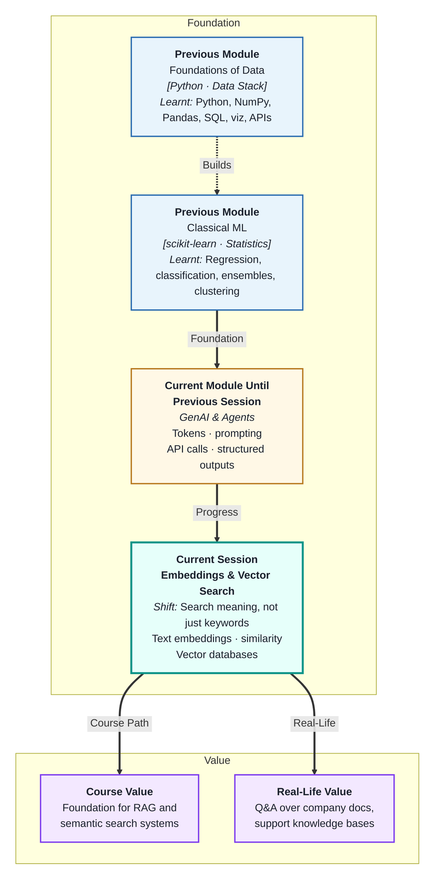
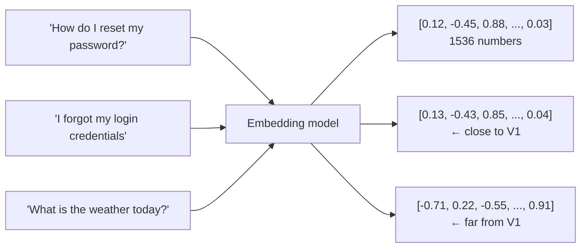
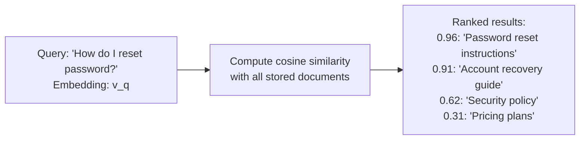
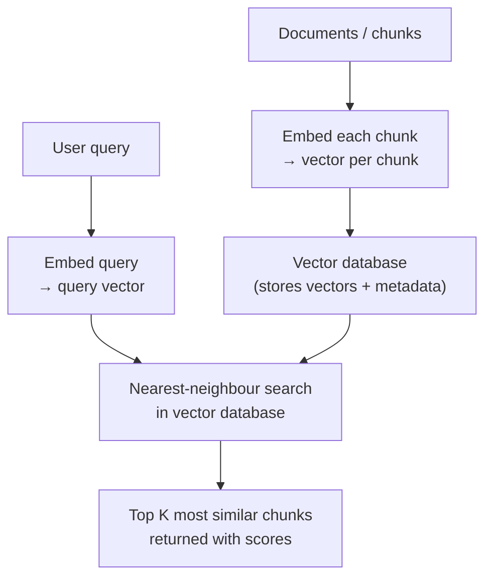
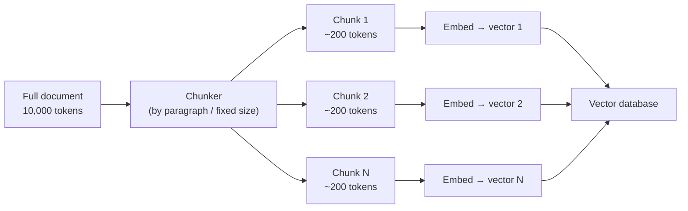

# Embeddings & Vector Search
---

## Mental Map



## What You'll Learn

In this pre-read, you'll discover:

- What a **text embedding** is — and why it lets computers understand meaning, not just match words
- How **cosine similarity** measures semantic closeness between two pieces of text
- What a **vector database** is and how it stores and retrieves embeddings efficiently
- How vector search differs from keyword search — and when each is better
- How embeddings form the foundation for the **RAG** system you will build next session

---

## A. What Is a Text Embedding?

> 💡 **Analogy:** A map uses coordinates (latitude, longitude) to locate every place on Earth. Two places close on the map are close in the real world. A **text embedding** is a coordinate system for meaning: texts that mean similar things end up close together in the coordinate space.

**One-line definition:** A **text embedding** is a list of numbers (a vector) that represents the meaning of a piece of text — produced by a model trained to place semantically similar texts near each other in a high-dimensional space.



**Key properties:**

| Property | Meaning |
|---|---|
| Fixed length | Every text produces a vector of the same size (e.g. 1536 dimensions) |
| Meaning-preserving | Similar sentences → nearby vectors |
| Language-agnostic | "Hello" and "Bonjour" may embed near each other |
| Sentence-level | The full text is compressed into one vector |

**What embeddings capture:** Synonyms, paraphrases, and conceptually related ideas all cluster together. "Car", "automobile", and "vehicle" will have nearby embeddings. "Cat" will be further away, and "inflation rate" will be very far.

---

## B. Cosine Similarity — Measuring Closeness

> 💡 **Analogy:** Two arrows pointing in nearly the same direction are similar regardless of their length. **Cosine similarity** measures the angle between two embedding vectors — it captures whether they point in the same "semantic direction," not how long they are.

**One-line definition:** **Cosine similarity** is a number between −1 and 1 that measures how similar two embedding vectors are — 1 means identical direction (very similar meaning), 0 means unrelated, −1 means opposite meaning.

```
cosine_similarity(A, B) = (A · B) / (|A| × |B|)
```

| Score | Interpretation |
|---|---|
| 0.95–1.00 | Near-duplicate or paraphrase |
| 0.80–0.94 | Closely related (same topic, similar intent) |
| 0.60–0.79 | Somewhat related |
| Below 0.60 | Likely unrelated |



**Why cosine over Euclidean distance?**

Euclidean distance is sensitive to vector magnitude (length). Cosine similarity normalises for length, focusing purely on direction — which is what "similar meaning" corresponds to in embedding space.

---

## C. Vector Databases — Storing and Retrieving at Scale

> 💡 **Analogy:** A traditional library catalogue searches by exact keyword. A vector database is more like a librarian who has read every book and can say "this is conceptually related to what you want" — even if no words match. It finds nearest neighbours by meaning, not text.

**One-line definition:** A **vector database** stores embedding vectors alongside their source texts and provides fast nearest-neighbour search — returning the most semantically similar items to a query vector in milliseconds, even across millions of documents.



**Popular vector databases:**

| Tool | Type | Notes |
|---|---|---|
| FAISS | Library (in-memory) | Fast, good for prototypes |
| Chroma | Local database | Simple API, great for learning |
| Pinecone | Managed cloud service | Production-scale |
| Weaviate | Open-source cloud or local | Hybrid search support |
| pgvector | PostgreSQL extension | If you already use Postgres |

**Choosing for this course:** Chroma is ideal for learning — it runs locally, requires no account, and has a clean Python API.

---

## D. Vector Search vs Keyword Search

> 💡 **Analogy:** Keyword search finds documents that contain the exact words you typed. Semantic search finds documents that *mean* what you asked, even if they use completely different words. "Vehicle registration" and "car licence" are zero overlap keywords but very high semantic similarity.

**One-line definition:** **Vector search** finds documents by semantic similarity to a query, retrieving conceptually related content even when exact words differ; **keyword search** finds documents containing the exact query terms — both have strengths and failure modes.

| Dimension | Keyword search (BM25, TF-IDF) | Vector search |
|---|---|---|
| Matching | Exact word overlap | Semantic similarity |
| Handles synonyms | No | Yes |
| Handles jargon | Only if in corpus | Only if in training |
| Speed at scale | Very fast | Fast (with ANN index) |
| Interpretability | Easy to explain | "Nearest neighbour" |
| Failure mode | Misses paraphrases | Can retrieve off-topic if embeddings are poor |

**Hybrid search** combines both — keyword search for exact matches (product codes, proper names) and vector search for intent and semantics. Many production RAG systems use hybrid retrieval.

---

## E. Chunking Strategy — Preparing Documents for Embedding

> 💡 **Analogy:** You cannot embed a 100-page book as one vector — the single vector would average out all meaning. You also should not embed each sentence independently — each loses context. **Chunking** is the art of slicing documents into pieces that are small enough to embed meaningfully but large enough to be useful when retrieved.

**One-line definition:** **Chunking** is the process of splitting source documents into segments of appropriate size before embedding — balancing the need for focused, specific embeddings against the need for sufficient context in each retrieved chunk.



**Chunking strategies:**

| Strategy | Method | Use when |
|---|---|---|
| Fixed-size | Every 500 tokens with 50-token overlap | Simple, works for most prose |
| By paragraph | Split on double newlines | When paragraph = one idea |
| By section | Split on headings | Structured documents (manuals, reports) |
| Sentence-level | NLTK/spaCy sentence splitter | Fine-grained search on short answers |

**Overlap matters:** Adding 50-token overlap between adjacent chunks means a concept that straddles a chunk boundary appears in both chunks — so neither chunk loses it entirely.

---

## Practice Exercises

**1. Pattern Recognition**  
Three sentences: "The company's Q3 revenue was ₹120 crore", "Third-quarter earnings reached 120 crore rupees", "The CEO announced a new product line." (a) Which two would you expect to have highest cosine similarity and why? (b) Would a keyword search with the query "quarterly revenue" find all three, some, or none? (c) Would a vector search with the same query find all three, some, or none?

**2. Concept Detective**  
A developer builds a Q&A system on a 500-page policy manual. They embed the entire document as a single vector. When a user asks "What is the leave encashment policy?", the system retrieves the entire document and inserts it into the context window. Using sections C and E, explain the two problems with this approach and how chunking solves both.

**3. Real-Life Application**  
Describe a vector search use case for each of the following: (a) an e-commerce site with 500,000 product descriptions, (b) a legal firm with 20 years of archived case notes, (c) a customer-support system with 10,000 resolved ticket summaries. For each: what the user's query looks like, what the embedded corpus contains, and what a successful retrieval result looks like.

**4. Spot the Error**  
A team chunks a 200-page HR handbook into 2,000-token chunks (no overlap). A user asks "Can I carry over unused leave to next year?" The answer spans the last two sentences of chunk 14 and the first sentence of chunk 15. Using section E, explain why the retrieval fails to return the complete answer and what chunking change would fix it.

**5. Planning Ahead**  
You are building a semantic search system over your company's 3,000 Slack messages and 500 policy documents. Describe the end-to-end pipeline: what tool you would use to embed, how you would chunk the policy documents vs the Slack messages, which vector database you would use and why, what the query flow looks like when an employee asks "Who do I contact for a new laptop?", and how you would evaluate whether your retrieval is finding the right documents.

---

> ✅ **You're done!** You now understand embeddings (meaning as vectors), cosine similarity (measuring closeness), vector databases (fast retrieval at scale), and chunking (preparing documents for search). These are the building blocks of RAG — the architecture that grounds LLM answers in your own documents. Next: **RAG Systems & Context Retrieval**, where you will assemble all these pieces into a complete, grounded question-answering system.
