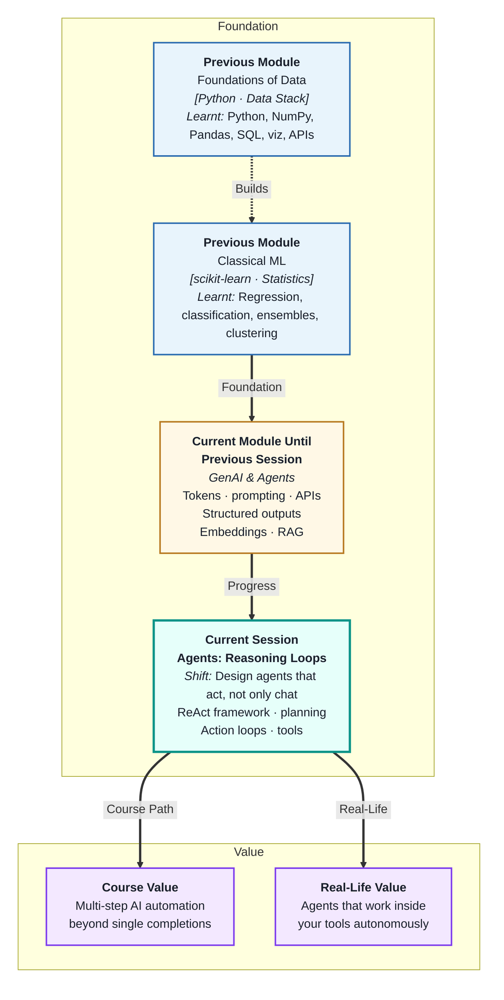
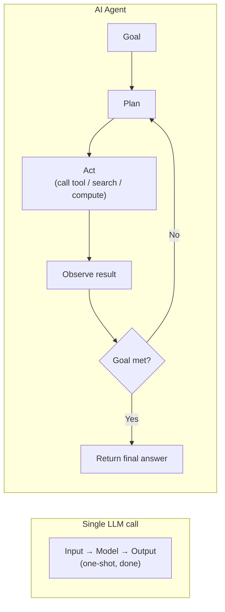
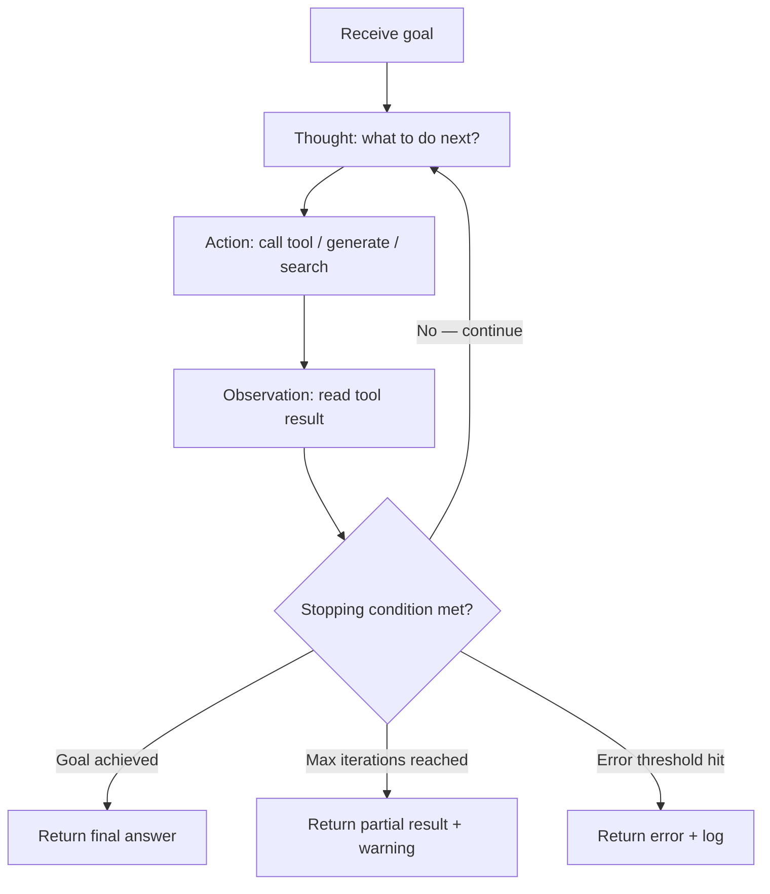
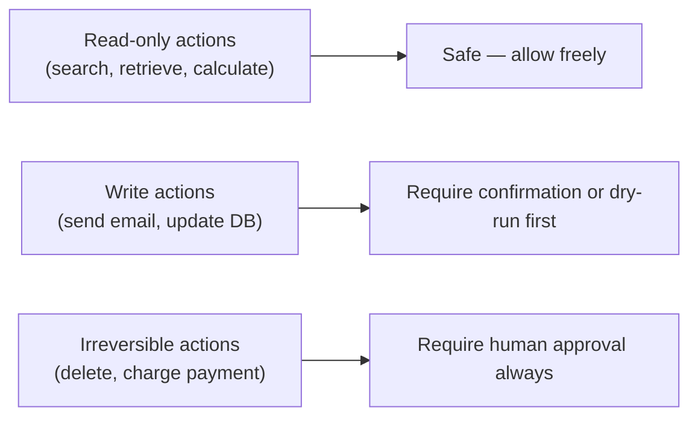

# Agents: Reasoning Loops
---

## Mental Map



## What You'll Learn

In this pre-read, you'll discover:

- What an **AI agent** is — and how it differs from a single LLM completion
- How the **ReAct framework** structures agent reasoning as Thought → Action → Observation loops
- What **planning** means for an agent tackling a multi-step goal
- How **action loops** repeat until a task is done or a stopping condition is met
- What can go wrong in reasoning loops — and how to build in safety controls

---

## A. What Is an AI Agent?

> 💡 **Analogy:** A single LLM completion is like asking a colleague one question and getting one answer. An **agent** is like assigning a junior colleague a week-long project: they plan what to do, take steps, check results, adjust, and come back to you with the finished deliverable.

**One-line definition:** An **AI agent** is a system that uses an LLM as its reasoning engine to autonomously plan and execute a sequence of actions — calling tools, processing results, and deciding what to do next — until it achieves a specified goal.



**What distinguishes an agent:**

| Property | Single LLM call | Agent |
|---|---|---|
| Number of LLM calls | One | Many (loop) |
| Tool access | None (by default) | Yes — search, code, APIs |
| Persistence | Stateless | Maintains state across steps |
| Autonomy | Responds to prompt | Decides next action |
| Goal-directedness | Answers a question | Works toward a goal |

---

## B. The ReAct Framework — Thought, Action, Observation

> 💡 **Analogy:** A detective solves a case by: thinking about what they know (Thought), taking an investigative action (Action), and noting what they find (Observation) — then repeating until they have enough to conclude. **ReAct** is that detective loop for AI agents.

**One-line definition:** **ReAct (Reason + Act)** is a prompting framework that structures agent reasoning as alternating **Thought** (reasoning step), **Action** (tool call), and **Observation** (tool result) steps — making the agent's chain of reasoning transparent and debuggable.

**A ReAct trace example (research task):**

```
Goal: "Find the current price of NIFTY and tell me if it is above its 50-day average."

Thought: I need to get the current NIFTY price and the 50-day average.
         I'll search for the current price first.
Action: search("NIFTY 50 current price today")
Observation: NIFTY 50 is at 22,450 as of 14:30 IST.

Thought: Now I need the 50-day moving average.
Action: search("NIFTY 50 50-day moving average")
Observation: The 50-day moving average is 21,800.

Thought: Current price (22,450) > 50-day average (21,800).
         The answer is: yes, NIFTY is above its 50-day average.
Action: finish("NIFTY 50 at 22,450 is above its 50-day average of 21,800.")
```

**Why write out Thoughts?**

1. It forces the model to reason before acting (chain-of-thought effect)
2. The trace is human-readable — you can debug why the agent took a wrong path
3. The Observation from each Action informs the next Thought — real iterative reasoning

---

## C. Planning — Breaking Goals into Steps

> 💡 **Analogy:** A project manager with a large deliverable does not jump to coding — they first decompose the project into tasks, sequence them, and identify dependencies. **Agent planning** is that decomposition: before acting, the agent reasons about what steps the goal requires.

**One-line definition:** **Planning** in an agent context means the LLM generates a sequence of sub-tasks from a high-level goal — explicitly listing what must be done, in what order, before executing any action.

**Two planning approaches:**

| Approach | How | Strength |
|---|---|---|
| **Zero-shot planning** | Ask model to list steps before executing | Simple; works for predictable tasks |
| **Dynamic planning** | Re-plan after each Observation based on new info | Handles unexpected results; more robust |

**Zero-shot plan example:**

```
Goal: "Summarise the top 3 news stories about AI today and email them."

Plan:
1. Search for top AI news stories from today.
2. Extract titles and summaries for the top 3.
3. Format as a short email body.
4. Call the send_email tool with the composed body.
```

**When to re-plan:**

- When a tool call returns an error or unexpected result
- When an Observation reveals the task is different than assumed
- When the initial plan has dependencies that turn out not to hold

Dynamic planning is more robust but uses more LLM calls — use it for complex, unpredictable tasks.

---

## D. Action Loops — Running Until Done

> 💡 **Analogy:** A washing machine runs cycles until the load is clean — not just once. If the pre-wash cycle reveals heavy stains, it runs an extra cycle. **Action loops** do the same for agents: the agent keeps looping through Thought–Action–Observation until the goal is met or a stopping condition triggers.

**One-line definition:** An **action loop** is the iterative mechanism that drives an agent forward — each iteration: reason about current state, choose an action, observe the result, decide whether the goal is met or another iteration is needed.



**Stopping conditions — always define them:**

| Condition | Why it matters |
|---|---|
| Goal achieved (LLM decides) | Normal termination |
| Max iterations (e.g. 10) | Prevents infinite loops if goal is unreachable |
| Error count threshold | Stops after 3 tool failures — avoids burning API budget |
| Timeout | Wall-clock limit for latency-sensitive use cases |

**Never run an agent without a max iterations limit.** A buggy goal description or a missing tool can cause an agent to loop indefinitely, generating hundreds of API calls and significant cost.

---

## E. Safety, Control, and Common Failure Modes

> 💡 **Analogy:** A forklift operator has a safety dead-man switch — the machine stops if the operator is not actively holding it. AI agents need the equivalent: **human-in-the-loop checkpoints** and **action constraints** that stop the agent before irreversible actions.

**One-line definition:** Agent **safety controls** are mechanisms — action whitelists, human approval gates, dry-run modes, and max-iteration limits — that prevent agents from taking harmful, expensive, or irreversible actions without appropriate oversight.

**Common agent failure modes:**

| Failure | Description | Prevention |
|---|---|---|
| Infinite loop | Agent cannot achieve goal and keeps trying | Max iterations hard limit |
| Compounding errors | Wrong Action 1 leads to wrong Action 2 leads to cascade | Observation validation; re-plan on error |
| Tool hallucination | Agent calls a tool that does not exist | Explicit tool registry; validate before calling |
| Scope creep | Agent takes unintended side actions | Whitelist allowed tools and actions |
| Prompt injection | User input manipulates the agent's reasoning | Sanitise user input; separate system and user context |

**Trust levels for actions:**



For learning and prototyping: only allow read-only tools. Add write-capable tools incrementally with explicit safeguards.

---

## Practice Exercises

**1. Pattern Recognition**  
Write a complete ReAct trace (Thought, Action, Observation steps) for this goal: "Find the total revenue for the top 3 AI companies in 2025 and calculate the combined total." Assume you have a `web_search(query)` tool and a `calculator(expression)` tool. Show at least 4 steps before reaching a final answer.

**2. Concept Detective**  
An agent is given the goal "book the cheapest flight to Mumbai for next Friday." After step 5, it has searched for flights three times with slightly different queries and found three different prices. It cannot decide which is cheapest and loops back to search again. Using section D, identify which stopping condition is missing, how many iterations this agent might run, and what the correct stopping and resolution logic should be.

**3. Real-Life Application**  
Design ReAct-based agents for three real tasks: (a) monitor a competitor's website daily and email a summary of changes, (b) answer an employee's HR question by searching policy documents and the company FAQ, (c) triage an incoming customer support email by classifying it, searching for relevant solutions, and drafting a reply. For each: list the tools available, sketch the first two Thought–Action–Observation steps, and name the stopping condition.

**4. Spot the Error**  
An agent is designed to process invoices: it reads each invoice, extracts the amount, and calls `update_payment_record(invoice_id, amount)` automatically. There is no confirmation step. During a test run, a badly formatted invoice causes the agent to extract the wrong amount and update a real payment record with the incorrect value. Using section E, identify what safety control was missing and redesign the agent workflow to prevent this.

**5. Planning Ahead**  
You are building a research agent that: (a) receives a topic, (b) searches the web for 3–5 recent articles, (c) extracts key claims from each, (d) checks for contradictions across sources, and (e) produces a structured summary report. Design the full agent: ReAct loop structure, tools needed, planning strategy (zero-shot or dynamic), stopping conditions, safety controls, and how you would test it before running on real topics.

---

> ✅ **You're done!** You now understand how AI agents differ from single LLM calls — they plan, act, observe, and loop until goals are achieved. The ReAct framework makes this reasoning transparent. But agents need tools to act. Next: **Tool Use & Memory**, where you will learn how to give agents access to functions, APIs, and persistent context — turning reasoning loops into real working systems.
