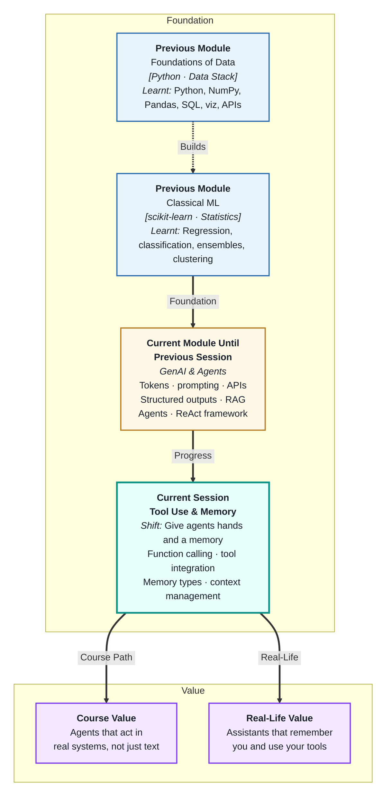
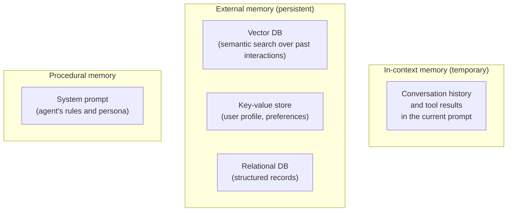
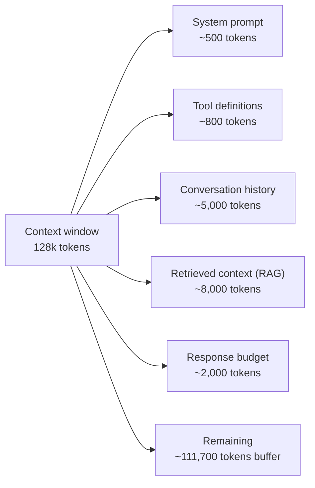

# Tool Use & Memory
---

## Mental Map



## What You'll Learn

In this pre-read, you'll discover:

- What **function calling** is and how it lets the LLM invoke real Python functions
- How to define a **tool registry** that agents can discover and use
- The four types of **memory** an agent can use — and when to use each
- How to manage **conversation context** without running out of window
- How tool results feed back into the agent's reasoning loop

---

## A. Function Calling — Giving the LLM Hands

> 💡 **Analogy:** A brilliant analyst who can only write reports is limited. Give them a phone to call suppliers, a computer to run queries, and a calculator — suddenly they can do real work. **Function calling** gives the LLM those hands: the ability to invoke real code and get real results.

**One-line definition:** **Function calling** (also called tool use) is an LLM API feature where the model can signal that it wants to call a specific Python function with specific arguments — and your code executes that function and returns the result to the model.

```mermaid
flowchart LR
    M["LLM decides:\n'I need to call get_weather(city=\"Mumbai\")'"] --> J["API returns:\n{\"function_call\": {\"name\": \"get_weather\", \"arguments\": \"{\\\"city\\\": \\\"Mumbai\\\"}\"}}"]
    J --> C["Your Python code:\nexecute get_weather('Mumbai')"]
    C --> R["Result:\n{'temp': 34, 'condition': 'Humid'}"]
    R --> M2["Return result to LLM\nas a tool message"]
    M2 --> ANS["LLM generates final answer\nusing the real weather data"]
```

**What function calling is NOT:**

- The LLM does not directly execute code — it only outputs a *request* to call a function
- Your code is responsible for running the function and returning results
- You control exactly which functions are available and when

---

## B. Defining Tools — The Tool Registry

> 💡 **Analogy:** A hotel concierge has a menu of services they can arrange — restaurant bookings, taxis, tours. They do not do everything; they do exactly what is on the menu. A **tool registry** is that menu for agents: an explicit list of functions the model can request, with descriptions of what each does.

**One-line definition:** A **tool registry** is a structured list of available functions with their names, descriptions, and parameter schemas — provided to the LLM so it knows what capabilities it can request and what arguments to supply.

**OpenAI function definition format:**

```json
{
  "name": "search_knowledge_base",
  "description": "Search the company knowledge base for relevant documents. Use this when the user asks about company policies, products, or procedures.",
  "parameters": {
    "type": "object",
    "properties": {
      "query": {
        "type": "string",
        "description": "The search query text"
      },
      "max_results": {
        "type": "integer",
        "description": "Maximum number of results to return",
        "default": 3
      }
    },
    "required": ["query"]
  }
}
```

**Tool design principles:**

| Principle | Guideline |
|---|---|
| One job per tool | `get_customer_info` and `update_customer_info` are separate tools |
| Descriptive names | `search_orders` beats `tool_1` |
| Detailed description | The LLM chooses tools based on description — vague = wrong tool selected |
| Constrained parameters | Use enums and required fields to reduce mistakes |
| Safe by default | Start with read-only tools; add write tools with guardrails |

---

## C. Memory Types — What the Agent Remembers

> 💡 **Analogy:** A person has different types of memory: what happened today (short-term), facts they learned years ago (long-term), rules they follow automatically (procedural), and notes they refer back to (external). **Agent memory** has the same four types, each stored and accessed differently.

**One-line definition:** **Agent memory** refers to how the agent maintains information across steps and sessions — ranging from the context window (in-context, temporary) to vector databases and databases (persistent, retrievable).



**The four memory types:**

| Type | Storage | Persists? | Best for |
|---|---|---|---|
| **In-context** | Current prompt | Current session only | Recent conversation, task state |
| **Semantic (vector)** | Vector database | Yes | "What has this user asked before?" |
| **Episodic (key-value)** | Dictionary / Redis | Yes | User name, preferences, last action |
| **Procedural** | System prompt | Per session | Agent personality, rules, constraints |

---

## D. Context Management — Keeping the Window Usable

> 💡 **Analogy:** A notebook gets full after many pages. A smart note-taker does not throw it away — they summarise old pages into a "key findings" section at the front and continue. **Context management** is that strategy for agent conversations that grow too long for the window.

**One-line definition:** **Context management** is the set of strategies for keeping the agent's active context window within limits — through summarisation, windowing, or externalising older content to memory — without losing important information.

**Common strategies:**

| Strategy | How | Use when |
|---|---|---|
| Fixed window (sliding) | Keep only the last N messages | Short-term task; history not needed |
| Summarisation | Replace old messages with an LLM-generated summary | Long conversations where history matters |
| External memory | Move old turns to vector DB; retrieve when relevant | Long-running assistants with persistent users |
| Selective retention | Keep only tool results and final decisions, not every exchange | Agent loops with many intermediate steps |

**Token budget management:**



Always track your token budget. Hitting the limit mid-task causes truncation errors — plan your budget before building the prompt.

---

## E. Tool Result Handling — Closing the Loop

> 💡 **Analogy:** A surgeon who asks for a scalpel needs it handed back the right way, at the right moment. **Tool result handling** is returning the function output to the model in exactly the right format — so it can use the result to reason and decide next steps.

**One-line definition:** **Tool result handling** is the process of executing the function the model requested, formatting the output as a tool response message, and returning it to the model so it can incorporate the result into its next reasoning step.

**The function-call message flow:**

```
Step 1 — Model requests a tool:
  Role: assistant
  Content: null
  function_call: {"name": "get_order_status", "arguments": "{\"order_id\": \"ORD-4521\"}"}

Step 2 — Your code executes:
  result = get_order_status("ORD-4521")
  # → {"status": "shipped", "eta": "2026-06-07", "carrier": "BlueDart"}

Step 3 — Return result to model:
  Role: tool
  Name: get_order_status
  Content: "{\"status\": \"shipped\", \"eta\": \"2026-06-07\", \"carrier\": \"BlueDart\"}"

Step 4 — Model uses result:
  Role: assistant
  Content: "Your order ORD-4521 has been shipped. Expected delivery: June 7 via BlueDart."
```

**Error handling in tool results:**

If a tool call fails (API error, invalid input, timeout), return a structured error to the model instead of crashing:

```json
{"error": "Order ORD-9999 not found. Please verify the order ID."}
```

The model can then decide whether to retry with a corrected argument, ask the user to clarify, or use an alternative approach — rather than crashing the entire agent loop.

---

## Practice Exercises

**1. Pattern Recognition**  
Write the tool registry definition (in the OpenAI JSON format) for two tools: (a) `get_stock_price(ticker: str) → float` that returns the current price for a stock ticker, and (b) `send_notification(user_id: str, message: str, channel: str) → bool` where channel must be one of "email", "sms", or "push". Include the required descriptions that would help the LLM choose the right tool at the right moment.

**2. Concept Detective**  
An agent assistant has been talking with the same user for 30 minutes across 80 messages. The context window is filling up. A new message arrives: "Remind me — what was my original budget question from the start of our conversation?" Using sections C and D, explain which memory strategy would allow the agent to answer this, why in-context memory alone will not work at this point, and what the agent should have been doing every 20 messages.

**3. Real-Life Application**  
Design the tool set for three agent systems: (a) a travel booking assistant (search flights, search hotels, make reservation, cancel booking), (b) a data analysis assistant (query a database, run a Python calculation, generate a chart, export CSV), (c) a customer service agent (look up account, check order status, initiate return, escalate to human). For each: list the tools, classify each as read-only or write, and note which write tools need a confirmation step.

**4. Spot the Error**  
An agent gets this tool result: `{"flights": [...200 flights...], "total_results": 200}`. The developer returns the entire 200-flight JSON (roughly 15,000 tokens) to the model as a tool response. The agent's context window is 16k tokens. Using section D, explain what will go wrong, what information will be lost, and how you would redesign the tool response to stay within budget while still being useful.

**5. Planning Ahead**  
You are building a personal finance agent that: remembers a user's spending categories from past sessions, answers questions like "How much did I spend on food last month?", alerts the user when a budget threshold is exceeded, and can export a monthly summary. Design the full memory architecture: which memory type stores what, how long-term memories are retrieved, how the context window is managed during a session, and what tools the agent needs to interact with transaction data.

---

> ✅ **You're done!** You now understand how agents are given real capabilities through function calling, how tool registries define what an agent can do, and how memory lets agents persist information across steps and sessions. Next: **Production Systems, APIs & Guardrails**, where you will learn how to wrap these agent capabilities into robust, monitored, production-grade APIs.
