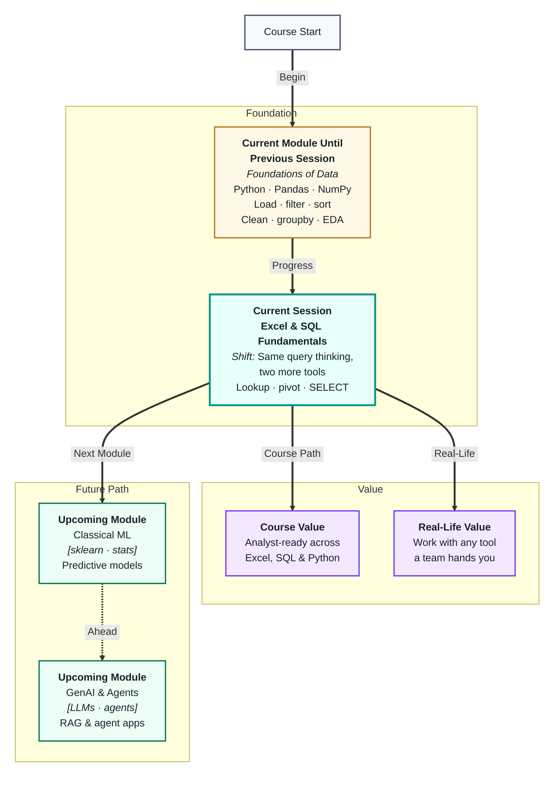
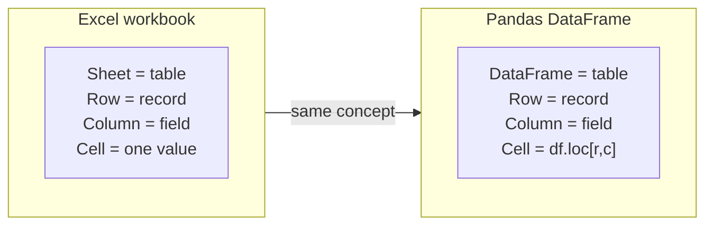
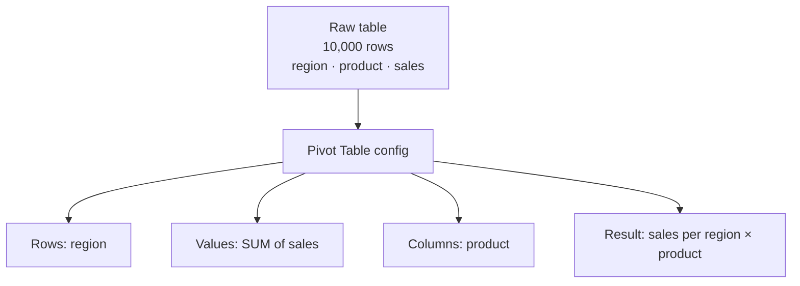
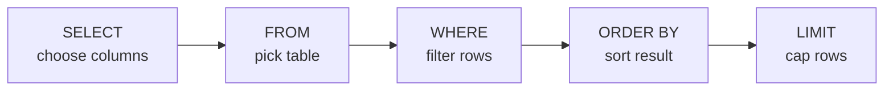
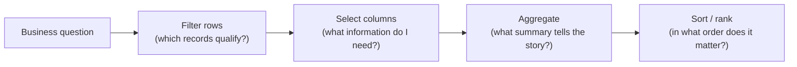

# Excel Analysis & SQL Fundamentals
---

## Mental Map



## What You'll Learn

In this pre-read, you'll discover:

- How Excel organises data and why its structure mirrors a Pandas DataFrame
- How **lookup functions** (`VLOOKUP`, `XLOOKUP`) retrieve values across sheets
- How **Pivot Tables** summarise large datasets with a few clicks — and how they map to `groupby`
- How SQL `SELECT`, `WHERE`, and `ORDER BY` express the same filter-and-sort logic you already know
- How the same **analytical thinking** travels across Excel, SQL, and Python

---

## A. Excel Basics — Familiar Structure, Different Tool

> 💡 **Analogy:** A map of a city looks different in a road atlas, on Google Maps, and on a paper sketch — but the streets are the same. **Excel, Pandas, and SQL** all work on the same idea of rows and columns; they just speak it differently.

**One-line definition:** **Excel** is a spreadsheet tool where data lives in a grid of rows and columns, formulas compute values from cells, and built-in features handle sorting, filtering, and summarising without any code.



**Key Excel concepts:**

| Excel term | Equivalent in Pandas / SQL | What it is |
|---|---|---|
| Worksheet | DataFrame / table | One grid of data |
| Cell reference (A1) | `df.iloc[0, 0]` | One value by position |
| Named range | Variable pointing to a DataFrame | A labelled block of data |
| Formula | Vectorized operation | A calculation on column(s) |
| AutoFilter | Boolean filter mask | Show only rows matching a rule |
| Freeze panes | — | Keep header visible while scrolling |

**Excel strengths vs Python:**

| Task | Better in Excel | Better in Python |
|---|---|---|
| Quick ad-hoc table | ✅ | |
| Reproducible pipeline | | ✅ |
| 1 million+ rows | | ✅ |
| Sharing a chart with non-coders | ✅ | |
| Automating repeated cleaning | | ✅ |

Both tools have a place. In most AI roles, Python handles data at scale; Excel handles communication and quick checks with stakeholders.

---

## B. Lookup Functions — Fetching Values Across Tables

> 💡 **Analogy:** A school office keeps student details in one register and exam scores in another. To find a student's score, a clerk looks up the student ID in the score sheet. **VLOOKUP and XLOOKUP** automate exactly that cross-table lookup.

**One-line definition:** A **lookup function** searches for a value in one column and returns a corresponding value from another column in the same or a different table — like a join done one cell at a time.

**VLOOKUP — the classic:**

```
=VLOOKUP(lookup_value, table_array, col_index_num, [exact_match])
```

| Argument | Plain meaning | Example |
|---|---|---|
| `lookup_value` | What you are searching for | A customer ID in cell A2 |
| `table_array` | The range containing your data | `Customers!A:D` |
| `col_index_num` | Which column to return (1 = first) | `3` for the third column |
| `[exact_match]` | `FALSE` for exact, `TRUE` for approximate | `FALSE` almost always |

**XLOOKUP — the modern replacement:**

```
=XLOOKUP(lookup_value, lookup_array, return_array, [if_not_found])
```

XLOOKUP is more flexible: it searches any direction, handles missing matches gracefully with a custom message, and does not require the lookup column to be first.

**How this maps to Pandas:**


| Excel | Pandas equivalent |
|---|---|
| `VLOOKUP` on one key column | `df.merge(other, on="id")` |
| Return one matching value | `df["col"].map(dict_or_series)` |
| `IFERROR(VLOOKUP(…), "Not found")` | `merge(how="left")` — NaN for no match |

**Common VLOOKUP pitfalls:**
- The lookup column **must be the leftmost** column in the range (XLOOKUP removes this constraint)
- Using `TRUE` for exact match when you meant `FALSE` — causes silent wrong answers
- Referencing a range without `$` (absolute reference) — formula breaks when copied down

---

## C. Pivot Tables — Drag-and-Drop GroupBy

> 💡 **Analogy:** A Pivot Table is like having a `groupby` with a drag-and-drop interface. You pull a column to "Rows," another to "Values," and Excel instantly collapses thousands of rows into one summary — no formula needed.

**One-line definition:** A **Pivot Table** is an interactive summary tool that groups rows by one or more categories and computes aggregates (sum, count, average) for each group, mirroring `df.groupby().agg()` in Pandas.



**Pivot Table → Pandas equivalent:**

| Pivot Table action | Pandas equivalent |
|---|---|
| Drag field to Rows | `groupby("region")` |
| Drag field to Values → Sum | `.agg(total=("sales","sum"))` |
| Drag field to Columns | `groupby(["region","product"])` |
| Filter slicer | `.loc[df["year"]==2024]` before groupby |
| Show % of total | `/ df["sales"].sum() * 100` |

**Why learn both:** Pivot Tables are what your manager or client will already have in their spreadsheet. Knowing the Pandas equivalent means you can reproduce any Pivot Table programmatically, on data 100× larger, and automate it to refresh daily.

---

## D. SQL SELECT, WHERE, and ORDER BY

> 💡 **Analogy:** SQL is like placing a precise order at a café — "I want the chicken sandwich (SELECT), no tomatoes (WHERE), served hottest first (ORDER BY)." Each clause is one specific instruction in your order.

**One-line definition:** `SELECT`, `WHERE`, and `ORDER BY` are the three core SQL clauses that choose *which columns* to show, *which rows* to keep, and *in what order* to display them.

**The anatomy of a basic query:**



**SELECT — pick your columns:**

```sql
SELECT name, salary, city          -- specific columns
SELECT *                           -- all columns (use sparingly)
SELECT name, salary * 1.1 AS new_salary  -- computed column
```

**WHERE — filter rows:**

```sql
WHERE city = 'Mumbai'
WHERE salary > 50000
WHERE city = 'Pune' AND salary > 40000
WHERE city IN ('Mumbai', 'Delhi', 'Pune')
WHERE name LIKE 'A%'               -- names starting with A
WHERE join_date BETWEEN '2023-01-01' AND '2023-12-31'
WHERE manager_id IS NULL           -- missing values
```

**ORDER BY — sort results:**

```sql
ORDER BY salary DESC               -- highest first
ORDER BY city ASC, salary DESC     -- city A→Z, then highest salary within city
```

**Pandas ↔ SQL quick map:**

| SQL | Pandas equivalent |
|---|---|
| `SELECT col1, col2` | `df[["col1","col2"]]` |
| `WHERE col > 100` | `df[df["col"] > 100]` |
| `WHERE col IN (…)` | `df[df["col"].isin([…])]` |
| `WHERE col IS NULL` | `df[df["col"].isna()]` |
| `ORDER BY col DESC` | `df.sort_values("col", ascending=False)` |
| `LIMIT 10` | `.head(10)` |

The thinking is identical — only the syntax changes. If you can write the Pandas version, you already understand the SQL version.

---

## E. The Same Query Thinking Across All Three Tools

> 💡 **Analogy:** "Where is the restroom?" sounds different in English, Hindi, or sign language — but the intent and the answer are the same. **Query thinking** is the intent; Excel, SQL, and Pandas are just three languages for expressing it.

**One-line definition:** **Query thinking** is the skill of framing a data question as a sequence of filter → select → sort → aggregate steps, independent of which tool you use to execute it.

**The universal pattern:**



**One question — three tools:**

> "What is the total sales per region for orders above ₹1000, sorted by total descending?"

| Tool | How you express it |
|---|---|
| Pandas | `df[df["amount"]>1000].groupby("region")["amount"].sum().sort_values(ascending=False)` |
| SQL | `SELECT region, SUM(amount) FROM orders WHERE amount > 1000 GROUP BY region ORDER BY SUM(amount) DESC` |
| Excel | Filter column `amount > 1000` → Pivot Table: Rows = region, Values = SUM of amount → sort Z→A |

**Practical rule:** Learn the thinking once, then translate to whichever tool is in front of you. In this course, that tool is usually Python — but in a job, it is whatever the team uses.

---

## Practice Exercises

**1. Pattern Recognition**  
A colleague sends you an Excel sheet with three worksheets: `Orders`, `Customers`, and `Products`. They want a column in `Orders` that shows each customer's city. Name which Excel function you would use, what the lookup value would be, and how you would do the equivalent in Pandas using one method name.

**2. Concept Detective**  
A VLOOKUP formula returns `#N/A` for about 30% of rows. The lookup column in the source sheet looks correct visually. Name three possible causes and one quick Excel check for each.

**3. Real-Life Application**  
Think of a business report you have seen — a sales dashboard, a school grade sheet, or a sports leaderboard. Describe it in terms of the three query-thinking steps: what filter is applied, which columns are shown, and what aggregation produces the summary number.

**4. Spot the Error**  
A SQL query reads: `SELECT name, city WHERE salary > 50000 FROM employees ORDER BY name`. It errors out immediately. Identify every clause-order mistake and write the corrected query structure in plain words.

**5. Planning Ahead**  
You have an Excel file with 5000 rows of employee data: `emp_id`, `name`, `department`, `salary`, `join_date`, `city`. Plan how you would answer this question using all three tools covered today: "Which departments have an average salary above ₹60,000, sorted highest to lowest?" For each tool, describe the steps — not code or formulas, just the logical actions in order.

---

> ✅ **You're done!** You can now read and work with data in Excel and SQL just as fluently as in Pandas — because the thinking is the same across all three. This cross-tool fluency is what makes you useful on any team, not just Python-first ones. Next up: **Master class: From Tables to Relationships**, which reveals the mathematical structure that makes all these tools work the way they do.
