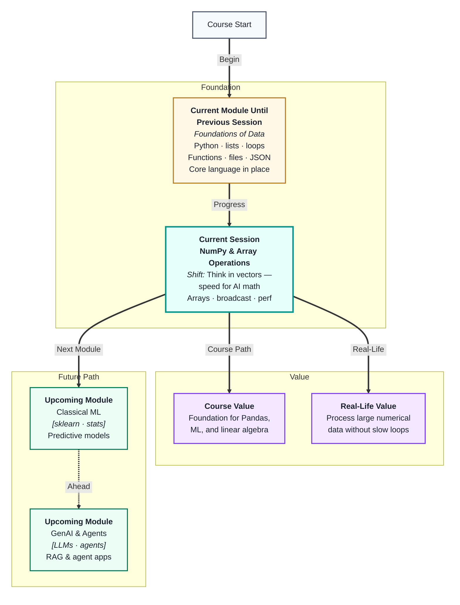
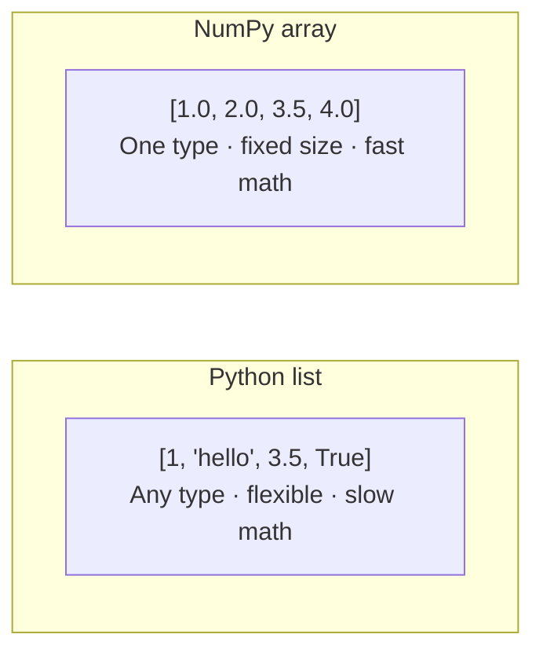
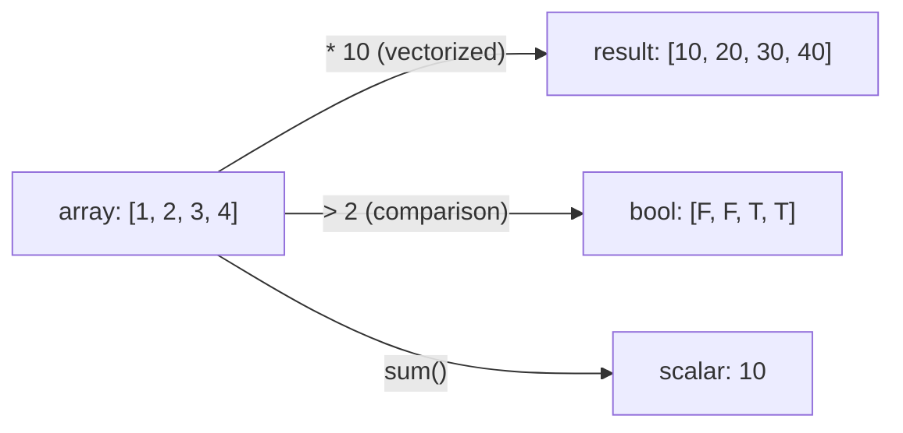
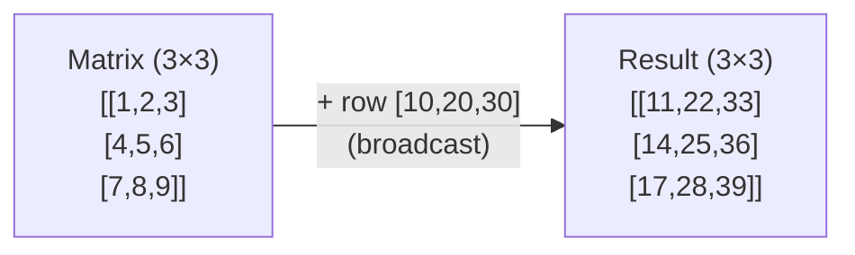
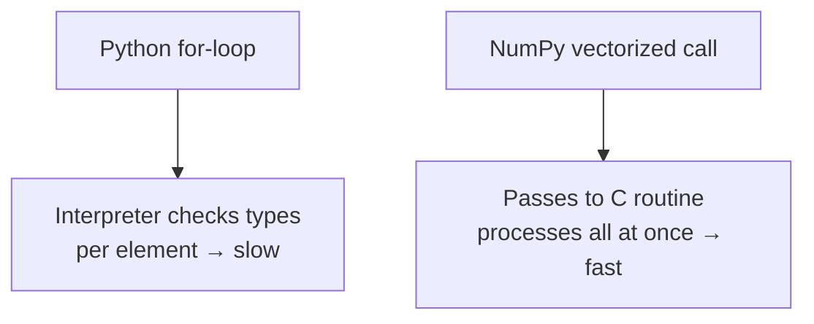

# NumPy Foundations & Array Operations
---

## Mental Map



## What You'll Learn

In this pre-read, you'll discover:

- What a **NumPy array** is and how it differs from a Python list
- How **vectorization** lets you operate on entire arrays without writing loops
- What **broadcasting** means and how NumPy applies it automatically
- Why NumPy is dramatically **faster** than plain Python for numerical work
- How arrays form the foundation for **Pandas, ML models, and linear algebra**

---

## A. What Is a NumPy Array?

> 💡 **Analogy:** A Python list is like a bag that can hold anything — apples, numbers, strings, even other bags. A **NumPy array** is like a tray of identical compartments, each the same size and type — it trades flexibility for raw speed.

**One-line definition:** A **NumPy array** is a fixed-type, fixed-size container for numbers stored in contiguous memory, designed for fast mathematical operations.

You already know Python lists. Arrays feel similar but behave differently in important ways:



| Feature | Python list | NumPy array |
|---|---|---|
| Element types | Any mix | All the same type |
| Memory layout | Scattered | Contiguous block |
| Math operations | Manual loop needed | Built-in, instant |
| Size | Can grow/shrink | Fixed at creation |
| Speed for numbers | Slow | 10–100× faster |

**Creating arrays:**

```
import numpy as np

a = np.array([10, 20, 30, 40])       # 1-D array from a list
b = np.zeros((3, 4))                  # 3 rows × 4 cols of zeros
c = np.arange(0, 10, 2)              # [0, 2, 4, 6, 8]
d = np.linspace(0, 1, 5)             # 5 evenly spaced from 0 to 1
```

**Shape and dimensions:**

- `a.shape` tells you the size of each dimension: `(4,)` for 1-D, `(3, 4)` for 2-D
- `a.ndim` tells you how many dimensions: 1, 2, or more
- `a.dtype` tells you the data type: `int64`, `float64`, etc.

A 1-D array is a row of numbers (like a single column of data). A 2-D array is a grid (like a table). ML models internally represent datasets as 2-D arrays — rows are samples, columns are features.

---

## B. Vectorization — No More Loops

> 💡 **Analogy:** Stamping 1000 envelopes one by one takes an hour. A machine that stamps all 1000 at once takes a second. **Vectorization** is that stamping machine — it applies an operation to every element simultaneously instead of looping one at a time.

**One-line definition:** **Vectorization** means expressing a computation over an entire array in one instruction, letting NumPy execute it at C-level speed without a Python `for` loop.

**The difference in practice:**

```
# Slow Python loop — one element at a time
result = []
for x in data:
    result.append(x * 2)

# Vectorized NumPy — all elements at once
result = data * 2
```

Both produce the same output. The NumPy version is typically 50–200× faster on large arrays because NumPy passes the operation directly to optimised compiled code.

**Vectorized operations work element-wise:**

| Operation | Example | Result |
|---|---|---|
| Arithmetic | `a + b` | Adds matching elements |
| Comparison | `a > 5` | Returns boolean array |
| Math function | `np.sqrt(a)` | Square root of every element |
| Aggregation | `a.sum()`, `a.mean()` | One result across all elements |



**Universal functions (ufuncs):** NumPy functions like `np.sin()`, `np.log()`, `np.exp()` are **ufuncs** — they apply to every element automatically and are as fast as vectorized arithmetic.

**Why this matters for ML:** Entire feature columns are arrays. Training algorithms apply math to millions of values at once. If you wrote loops, training would take hours instead of minutes.

---

## C. Indexing and Slicing Arrays

> 💡 **Analogy:** A hotel room numbering system — floor 3, room 5 gives you one specific room. With arrays, you use row and column numbers (indices) to pick exactly the elements you need, just like navigating a grid.

**One-line definition:** **Indexing** retrieves a specific element by position; **slicing** retrieves a range of elements using `start:stop:step` notation.

**1-D indexing and slicing:**

```
a = np.array([10, 20, 30, 40, 50])

a[0]        # 10  — first element
a[-1]       # 50  — last element
a[1:4]      # [20, 30, 40] — index 1 up to (not including) 4
a[::2]      # [10, 30, 50] — every second element
```

**2-D indexing (row, column):**

```
m = np.array([[1, 2, 3],
              [4, 5, 6],
              [7, 8, 9]])

m[1, 2]     # 6  — row 1, col 2
m[0, :]     # [1, 2, 3] — entire first row
m[:, 1]     # [2, 5, 8] — entire second column
m[0:2, 1:]  # [[2,3],[5,6]] — top-right 2×2 block
```

**Boolean indexing — filter by condition:**

```
a = np.array([15, 3, 42, 8, 27])
a[a > 10]   # [15, 42, 27] — only values greater than 10
```

| Technique | Syntax example | Use when |
|---|---|---|
| Single element | `a[2]` or `m[1,0]` | You want one value |
| Slice | `a[1:4]` | You want a range |
| Step slice | `a[::2]` | Every N-th element |
| Boolean mask | `a[a > 5]` | You want elements that pass a test |

Boolean indexing is what Pandas uses under the hood every time you filter a DataFrame — knowing it in NumPy first makes Pandas filtering feel natural.

---

## D. Broadcasting — Different Shapes, Same Operation

> 💡 **Analogy:** You add 10 to every price on a menu. You do not rewrite the full menu with a +10 column beside it — you just mentally apply the rule to each price. **Broadcasting** is NumPy doing that same stretch automatically when array shapes do not match.

**One-line definition:** **Broadcasting** is NumPy's rule for automatically expanding a smaller array to match the shape of a larger one so element-wise operations work without manual resizing.

**Simple example — scalar and array:**

```
a = np.array([1, 2, 3, 4])
a + 10      # [11, 12, 13, 14]
```

The scalar `10` is "broadcast" across all four elements — NumPy treats it as `[10, 10, 10, 10]` without actually creating that array in memory.

**2-D broadcasting — row vector applied to each row:**



**Broadcasting rules (plain English):**

1. If two arrays have different numbers of dimensions, the smaller one is padded on the left with size-1 dimensions
2. Dimensions of size 1 are stretched to match the other array's size
3. If sizes still do not match and neither is 1, NumPy raises an error

| Shapes | Compatible? | Result shape |
|---|---|---|
| `(4,)` and scalar | Yes | `(4,)` |
| `(3, 4)` and `(4,)` | Yes | `(3, 4)` |
| `(3, 1)` and `(1, 4)` | Yes | `(3, 4)` |
| `(3, 4)` and `(3,)` | No — error | — |

You will encounter broadcasting constantly in ML: subtracting a mean from each column, scaling features, and computing distances all rely on it.

---

## E. Performance — Why NumPy Is Fast

> 💡 **Analogy:** A hand-written letter takes minutes per page. A printer produces thousands of identical pages per minute. Python loops are handwriting; NumPy's compiled C code is the printer — same output, wildly different speed.

**One-line definition:** NumPy is fast because it stores data in **contiguous memory blocks** of a single type and executes operations in **pre-compiled C/Fortran code**, bypassing Python's per-element overhead entirely.

**Where the speed comes from:**



| Operation on 1 million numbers | Python loop | NumPy |
|---|---|---|
| Sum all values | ~200 ms | ~1 ms |
| Multiply by 2 | ~150 ms | ~2 ms |
| Compare > threshold | ~180 ms | ~1 ms |

**Memory efficiency too:** NumPy arrays use a fixed number of bytes per element (e.g. 8 bytes for `float64`). A Python list of floats uses ~28 bytes per element due to object overhead. A million-element array uses ~8 MB in NumPy vs ~224 MB in a Python list.

**Practical rules:**

- Prefer NumPy operations over Python loops whenever you work with numbers
- Use `np.array` instead of appending to a list when building numerical data
- Avoid growing arrays in a loop with `np.append()` — it creates a new copy each time; use a list first, then convert once
- Profile with `%timeit` in notebooks to confirm your vectorized version is actually faster

Everything in Pandas, scikit-learn, and deep learning frameworks (TensorFlow, PyTorch) sits on top of NumPy arrays. Understanding NumPy performance is understanding why the entire AI stack is fast.

---

## Practice Exercises

**1. Pattern Recognition**  
You have a 2-D NumPy array of shape `(100, 5)` representing 100 students and 5 exam scores. Write the index expressions (not code — just describe them in words) to: (a) get the third student's full row, (b) get the second exam column for all students, (c) get the scores of all students who scored above 80 on exam 1.

**2. Concept Detective**  
A teammate writes a loop that iterates over 500,000 sensor readings and appends each reading multiplied by 1.8 to a new list. The script takes 3 minutes to run. Using what you learned about vectorization, explain why it is slow and describe the one-line NumPy replacement that would fix it.

**3. Real-Life Application**  
Name three real-world situations where large amounts of numbers need to be processed quickly (e.g. financial transactions, medical imaging, weather forecasting). For each, say which NumPy concept — arrays, vectorization, broadcasting, or performance — is the most important to that use case and why.

**4. Spot the Error**  
A student tries to add two arrays with shapes `(3, 4)` and `(3,)` and gets an error. They assume broadcasting should handle it. Using the broadcasting rules from section D, explain why this fails and what shape the second array would need to be for the operation to work.

**5. Planning Ahead**  
You receive a dataset of 10,000 house prices as a plain Python list. You need to: (a) convert it to a NumPy array, (b) find all prices above ₹50 lakh, (c) subtract the mean price from every value (centring the data), and (d) divide every value by the standard deviation (scaling). Describe each step in plain words, naming which NumPy concept — indexing, vectorization, or broadcasting — handles each part.

---

> ✅ **You're done!** You now understand the engine beneath almost every data and AI tool you will use: NumPy arrays that think in entire columns at once, vectorized operations that replace slow loops, and broadcasting that stretches shapes automatically. Next session you will build directly on this with **Pandas: Data Loading & Selection** — where NumPy arrays become the friendly, labelled DataFrames you will use every day.
