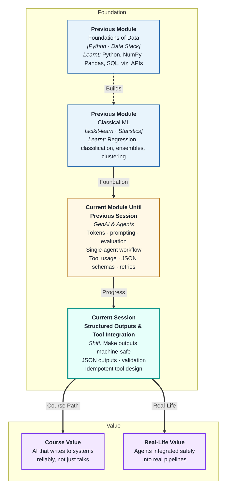
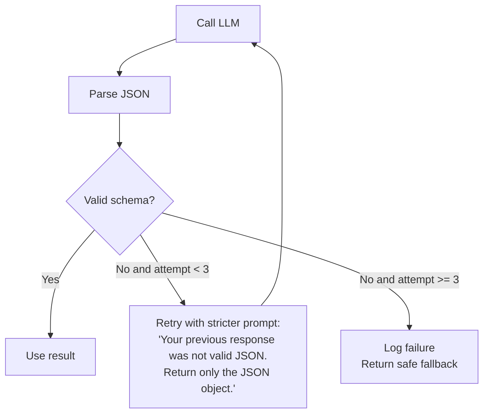
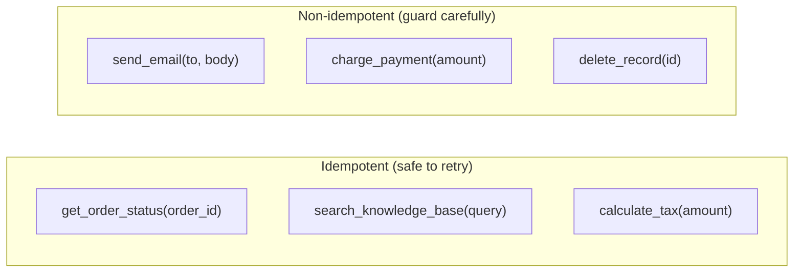
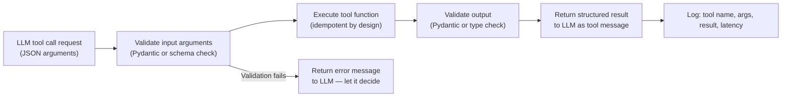

# Structured Outputs and Tool Integration
---

## Mental Map



## What You'll Learn

In this pre-read, you'll discover:

- Why **structured JSON output** is essential when AI connects to real systems
- How to enforce a specific JSON schema from an LLM — and validate it in Python
- What **output validation** is and how Pydantic makes it automatic
- What **idempotent tool design** means and why it protects you from agent mistakes
- How structured outputs and idempotent tools combine for safe agent integration

---

## A. Why Structured Output Matters

> 💡 **Analogy:** A data entry clerk who writes answers in free-form sentences is useful for humans but useless for a database. A clerk who fills a standardised form is useful for both. **Structured outputs** turn LLM responses into standardised forms that any downstream system can read.

**One-line definition:** **Structured output** means constraining the LLM to produce a response in a defined, machine-parseable format (usually JSON) so it can be consumed by code without fragile text parsing.

```mermaid
flowchart TD
    U["Unstructured"] --> P1_["'The order #8823 is currently shipped and\nshould arrive by Friday according to our records.'"]
    P1_ --> X["Cannot reliably extract status or date\n→ pipeline breaks"]

    S["Structured"] --> P2_["{\"order_id\": \"8823\", \"status\": \"shipped\",\n\"eta\": \"2026-06-07\"}"]
    P2_ --> OK["json.loads() → Python dict\n→ write to database directly"]
```

**When structured output is non-negotiable:**

- Writing LLM output to a database row
- Feeding one agent's output as input to the next
- Downstream code that indexes a specific field (e.g. `result["urgency"]`)
- Any scenario where a missing field causes a crash

---

## B. Enforcing JSON Output

> 💡 **Analogy:** A customs form has a checkbox for "citizen / non-citizen" — not a blank text field. The constraint exists to ensure the answer is machine-processable. **Enforcing JSON** means designing the prompt and the API call so the model has no choice but to return a form, not an essay.

**One-line definition:** **Enforcing JSON output** means combining a prompt instruction ("respond only with valid JSON"), an optional API-level constraint (`response_format: json_object`), and validation logic to guarantee machine-readable output.

**Three enforcement layers (strongest to weakest):**

| Layer | How | Strength |
|---|---|---|
| API structured output mode | `response_format={"type": "json_object"}` or schema | Guarantees valid JSON |
| Prompt instruction | "Return only JSON. No prose. Schema: {...}" | Strong hint; model usually complies |
| Post-processing | Strip markdown fences, extract JSON from text | Fragile fallback |

**Prompt instruction that works:**

```
SYSTEM:
You are a ticket classifier. Respond ONLY with a JSON object.
Do not add any text, commentary, or markdown outside the JSON.

Schema:
{
  "category": "billing | shipping | technical | other",
  "urgency": "low | medium | high",
  "summary": "string (max 100 characters)"
}
```

**Retry pattern when output is invalid:**



---

## C. Output Validation with Pydantic

> 💡 **Analogy:** A bouncer at a venue does not just check that a ticket has words on it — they check whether the ticket has the right date, the right venue name, and the right seat number. **Pydantic** is that bouncer for LLM outputs: it checks every field in detail.

**One-line definition:** **Pydantic** is a Python library that defines data schemas as typed classes and automatically validates that parsed LLM JSON matches the schema — raising clear errors when fields are missing, wrong type, or outside allowed values.

```python
from pydantic import BaseModel, Field
from typing import Literal

class TicketClassification(BaseModel):
    category: Literal["billing", "shipping", "technical", "other"]
    urgency: Literal["low", "medium", "high"]
    summary: str = Field(max_length=100)

import json
raw = response.choices[0].message.content
try:
    data = TicketClassification(**json.loads(raw))
    # data.category is guaranteed to be a valid enum value
    # data.summary is guaranteed to be ≤ 100 chars
except Exception as e:
    # Handle validation failure
    pass
```

**What Pydantic catches that `json.loads()` misses:**

| Problem | `json.loads()` | Pydantic |
|---|---|---|
| `"urgency": "URGENT"` (wrong case) | Returns the wrong string | Raises `ValidationError` |
| Missing required field | Dict simply lacks the key | Raises `ValidationError` |
| `"summary": 12345` (wrong type) | Returns an integer | Coerces or raises error |
| `"category": "Billing Issue"` | Returns the invalid string | Raises `ValidationError` |

---

## D. Idempotent Tool Design

> 💡 **Analogy:** A bank's "check balance" button can be pressed 100 times — nothing changes. Its "transfer money" button cannot — each press moves funds. **Idempotent tools** are safe to call multiple times, producing the same result without side effects. Non-idempotent tools need guards.

**One-line definition:** An **idempotent tool** is one that can be called multiple times with the same arguments and always returns the same result without changing any state — making it safe for agents to retry on failure or call speculatively.



**Designing tools for agent safety:**

| Rule | Description | Example |
|---|---|---|
| Separate read from write | Never combine retrieval with mutation | `get_order` + `update_order` as separate tools |
| Add idempotency keys | Give write tools a unique-per-intent ID to prevent duplicate execution | `send_email(idempotency_key=request_id, ...)` |
| Dry-run mode | Write tools should support `dry_run=True` for testing | Agent tests the action without executing it |
| Require confirmation | Irreversible actions need human approval before execution | `delete_file()` → confirm step → execute |

**Why this matters for agents:**

Agents retry. An agent that calls `send_email()` three times because of a transient 500 error sends three emails to the customer. An agent that calls `get_order_status()` three times just wastes API budget. Design write tools with explicit idempotency guards from the start.

---

## E. Putting It Together — Safe Tool Integration

> 💡 **Analogy:** A well-designed ATM takes your card, validates your PIN, confirms the amount, executes the transaction, and keeps a receipt — each step with a check. **Safe tool integration** means the same pipeline for agent tool calls: validate input, execute idempotently, validate output, log everything.

**One-line definition:** **Safe tool integration** combines structured JSON input schemas (so the model passes correct arguments), idempotent execution (so retries are harmless), structured JSON output (so results are parseable), and validation at every boundary.

**The full safe tool call pipeline:**



**Checklist for any agent tool:**

- [ ] Tool has a clear, single responsibility
- [ ] JSON schema is complete with descriptions and required fields
- [ ] Tool is idempotent OR has explicit guards for non-idempotent operations
- [ ] Output is a structured dict, not a raw string
- [ ] All tool calls are logged with input and output
- [ ] Error responses are structured, not raw exceptions

---

## Practice Exercises

**1. Pattern Recognition**  
An LLM returns this JSON for a product extraction task: `{"product_name": "Laptop Pro 15", "price": "₹85,000", "in_stock": "yes"}`. Your Pydantic model expects `price` as a `float` and `in_stock` as a `bool`. Using section C, identify every validation error, explain what the model did wrong, and rewrite the prompt instruction that would produce the correct types.

**2. Concept Detective**  
An agent is sending automated follow-up emails. On Tuesday it processes 200 records. On Wednesday, the same records are re-processed due to a data pipeline error, and 200 customers receive duplicate emails. Using section D, identify which design principle was violated, describe the idempotency mechanism that would have prevented the duplicates, and write the modified tool signature that includes it.

**3. Real-Life Application**  
Design the structured output schema and Pydantic model for three scenarios: (a) extracting key fields from a purchase order (vendor, total amount, line items, payment terms), (b) classifying a news article (topic category, sentiment, key entities), (c) summarising a job application (name, experience years, top 3 skills, fit score 1–5). For each, identify which fields need enum constraints and which are optional.

**4. Spot the Error**  
A developer has a `delete_customer_record(customer_id)` tool in their agent. The agent calls it once, gets a timeout error, and retries automatically — successfully running the deletion twice. The second call throws an error "Customer not found" which the agent logs and ignores. Using sections D and E, explain what went wrong, whether data was lost, and redesign the tool to be safe under retries.

**5. Planning Ahead**  
You are building an invoice processing agent that: (a) receives an invoice image description, (b) extracts structured data (vendor, amount, date, line items), (c) validates the extraction, (d) calls an `insert_invoice(data)` tool to write to the database. Design the full pipeline: the Pydantic model for extracted data, the enforcement strategy (API mode + prompt), the validation step, the idempotency mechanism for the insert tool, and what happens when extraction fails validation after 3 retries.

---

> ✅ **You're done!** You now know how to enforce JSON outputs, validate them with Pydantic, design idempotent tools for safe agent integration, and build the full safe tool call pipeline. Next: **Embeddings and Semantic Retrieval Systems**, where you will learn how LLMs represent meaning as numbers — enabling search by concept, not just by keyword.
