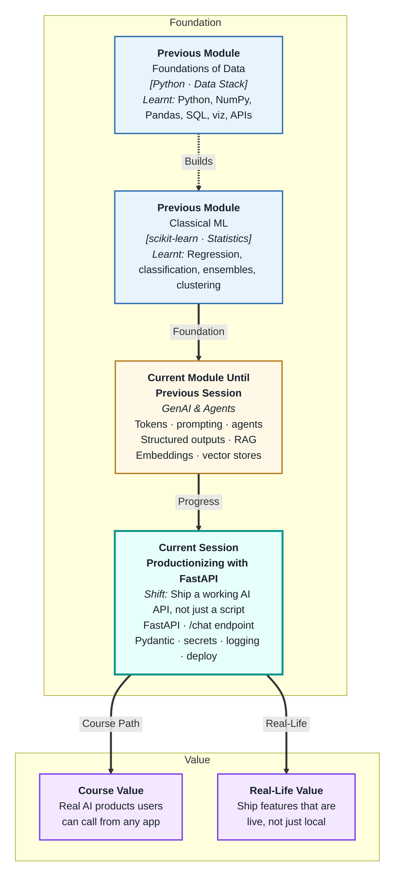
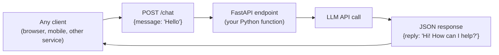
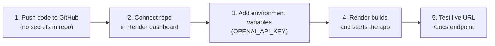

# Productionizing LLM Applications with FastAPI
---

## Mental Map



## What You'll Learn

In this pre-read, you'll discover:

- What **FastAPI** is and why it is the go-to framework for serving LLM features
- How to wrap a `/chat` endpoint around an LLM API call
- How **Pydantic schemas** handle request and response validation automatically
- How to manage **environment variables and secrets** safely in any deployment
- How **logging with request IDs** enables debugging at scale
- How to deploy to **Render or Hugging Face Spaces** — and run a live prompt evaluation

---

## A. FastAPI — The Serving Layer for LLM Features

> 💡 **Analogy:** A great chef's food stays in the kitchen until there is a counter, a menu, and a queue for customers to order from. **FastAPI** is that counter: it exposes your LLM Python code as an HTTP endpoint that any app, mobile client, or service can call.

**One-line definition:** **FastAPI** is a modern Python web framework that serves your LLM functionality as REST API endpoints — handling HTTP routing, request parsing, response formatting, and error handling with minimal boilerplate.



**Why FastAPI for LLM apps:**

| Feature | Benefit |
|---|---|
| Async by default | LLM API calls are slow (1–10s) — async avoids blocking |
| Pydantic integration | Request/response validation is automatic |
| Auto-generated docs | `/docs` gives you a working UI to test your endpoint instantly |
| Type hints | Cleaner code; editor support; fewer runtime errors |

---

## B. The `/chat` Endpoint — Wrapping an LLM Call

> 💡 **Analogy:** A receptionist takes your request, passes it to the expert, waits for the response, and hands it back to you in the right format. The `/chat` endpoint is that receptionist — it receives the user's message, calls the LLM, and returns the formatted reply.

**One-line definition:** A **`/chat` endpoint** is a `POST` route that accepts a user message (and optionally a conversation history), calls the LLM API, and returns the model's response — all behind a standard HTTP interface.

**Minimal `/chat` endpoint:**

```python
from fastapi import FastAPI, HTTPException
from pydantic import BaseModel
import os
from openai import OpenAI

app = FastAPI()
client = OpenAI(api_key=os.environ["OPENAI_API_KEY"])

class ChatRequest(BaseModel):
    message: str
    system_prompt: str = "You are a helpful assistant."

class ChatResponse(BaseModel):
    reply: str
    tokens_used: int

@app.post("/chat", response_model=ChatResponse)
async def chat(req: ChatRequest):
    try:
        response = client.chat.completions.create(
            model="gpt-4o",
            messages=[
                {"role": "system", "content": req.system_prompt},
                {"role": "user",   "content": req.message}
            ],
            temperature=0.7,
            max_tokens=500
        )
        return ChatResponse(
            reply=response.choices[0].message.content,
            tokens_used=response.usage.total_tokens
        )
    except Exception as e:
        raise HTTPException(status_code=500, detail=str(e))
```

**What this gives you automatically:**

- POST `/chat` accepts JSON body validated by `ChatRequest`
- Response is validated and serialised by `ChatResponse`
- `GET /docs` shows a working Swagger UI to test it
- `GET /openapi.json` gives the schema for any client to use

---

## C. Pydantic Schemas — Request and Response Validation

> 💡 **Analogy:** A well-designed form at a clinic has required fields (name, date of birth), optional fields (insurance number), and type constraints (date must be a valid date). **Pydantic schemas** enforce the same discipline on API inputs and outputs automatically.

**One-line definition:** **Pydantic schemas** in FastAPI define the expected types and constraints for request bodies and response objects — FastAPI validates incoming requests against the schema and rejects invalid ones with a clear error before your code ever runs.

**Designing good schemas:**

```python
from pydantic import BaseModel, Field
from typing import Literal, Optional

class Message(BaseModel):
    role: Literal["user", "assistant"]
    content: str = Field(min_length=1, max_length=10_000)

class ChatRequest(BaseModel):
    messages: list[Message]          # Full conversation history
    temperature: float = Field(default=0.7, ge=0.0, le=2.0)
    max_tokens: int = Field(default=500, ge=1, le=4096)
    user_id: Optional[str] = None    # Optional metadata

class ChatResponse(BaseModel):
    reply: str
    tokens_used: int
    finish_reason: str
```

**Validation benefits:**

| Without Pydantic | With Pydantic |
|---|---|
| Temperature=3.5 silently sent to LLM | 422 error returned before calling LLM |
| Empty message string causes LLM confusion | 422 error: "min_length constraint" |
| Missing required field causes crash | 422 error with field name and reason |
| Wrong type (string instead of float) | Automatic coercion or clear error |

---

## D. Environment Variables, Secrets, and Logging

> 💡 **Analogy:** A restaurant does not write the safe combination on the menu. Secrets are kept in locked drawers, not public spaces. **Environment variables** are those locked drawers — your API key lives in the environment, never in source code.

**One-line definition:** **Environment variables** store secrets (API keys, database URLs) separately from code so they can be set per-environment (local, staging, production) without ever appearing in your repository.

**Safe secret management:**

```python
import os
from dotenv import load_dotenv

load_dotenv()  # Loads .env file in development

OPENAI_API_KEY = os.environ["OPENAI_API_KEY"]  # Fails loudly if missing
```

| Environment | Where secrets live |
|---|---|
| Local development | `.env` file (added to `.gitignore`) |
| Render deployment | Environment variables panel in dashboard |
| Hugging Face Spaces | Secrets panel in Space settings |
| Production server | OS environment or secrets manager (Vault, AWS SSM) |

**Logging with request IDs:**

```python
import logging
import uuid

logger = logging.getLogger(__name__)

@app.post("/chat")
async def chat(req: ChatRequest):
    request_id = str(uuid.uuid4())[:8]
    logger.info(f"[{request_id}] user={req.user_id} tokens_in={len(req.messages)}")
    # ... call LLM ...
    logger.info(f"[{request_id}] tokens_used={response.usage.total_tokens} finish={response.choices[0].finish_reason}")
    return ...
```

**Why request IDs matter:** When 100 concurrent users hit your endpoint, logs from all requests interleave. A unique request ID in every log line lets you filter and follow one request's entire lifecycle — from input to LLM call to response.

---

## E. Deployment and Live Prompt Evaluation

> 💡 **Analogy:** A car is only useful after it leaves the factory and can be driven on real roads. **Deployment** is your AI moving from "runs on my laptop" to "accessible by anyone with a URL" — and **live prompt evaluation** is the test drive with real conditions.

**One-line definition:** **Deployment** means running your FastAPI app on a publicly accessible server; **live prompt evaluation** means sending real-world queries to the deployed endpoint and measuring whether outputs meet your quality bar.

**Deployment options for this course:**

| Platform | Cost | Best for | Notes |
|---|---|---|---|
| Render | Free tier | Learning, demos | Auto-deploys from GitHub |
| Hugging Face Spaces | Free (Gradio/FastAPI) | Public demos, sharing | Simple UI, great for portfolios |
| Local (uvicorn) | Free | Development | Not publicly accessible |

**Deploying to Render (5 steps):**



**Live prompt evaluation — what to test:**

After deploying, run your evaluation test set (from session 2) against the live endpoint:

| Test type | What to check |
|---|---|
| Happy path | Does the endpoint return correct, well-formatted responses? |
| Edge case | Does an empty message return a 422 error (not a crash)? |
| Long input | Does a 3,000-token input hit `max_tokens` correctly? |
| Latency | Is p95 response time acceptable for your use case? |
| Error logging | When LLM API returns a 429, does your endpoint log it and retry? |

---

## Practice Exercises

**1. Pattern Recognition**  
Write the Pydantic `ChatRequest` and `ChatResponse` models for a RAG chatbot endpoint. The request should accept: a user message (string, 1–5000 chars), an optional session ID (string), and an optional K value for retrieval (integer 1–10, default 3). The response should return: the answer string, up to 3 source citations (list of strings), and token usage (integer).

**2. Concept Detective**  
A deployed FastAPI endpoint crashes in production with `KeyError: 'OPENAI_API_KEY'`. The developer checks and finds the key is set in their local `.env` file but not in the Render dashboard. Using section D, explain the mistake, what should have been done before deployment, and write the startup check that would catch this at boot time instead of at runtime.

**3. Real-Life Application**  
Design the endpoint structure for three AI features: (a) a `/summarise` endpoint that takes a document (string up to 20k chars) and returns a 3-point summary, (b) a `/classify-ticket` endpoint for customer support triage, (c) a `/rag-query` endpoint that accepts a question and returns an answer with cited sources. For each: define the Pydantic request and response models, and specify what should be logged for each call.

**4. Spot the Error**  
A developer deploys their FastAPI app with this exception handler: `except Exception as e: raise HTTPException(status_code=500, detail=str(e))`. A security tester sends a malformed request that triggers an exception revealing the full OpenAI API key in the detail field. Using sections B and D, explain what was leaked, why it happened, and rewrite the exception handler to log the full error internally while returning only a safe generic message to the caller.

**5. Planning Ahead**  
You are deploying a RAG-based company FAQ bot for 500 employees. The bot must: accept questions, search the policy knowledge base, and return grounded answers with source citations. Design the full production system: Pydantic models for request/response, endpoint structure, secret management (local dev + deployment), logging fields for each call, deployment platform choice and why, and the 5-case live evaluation test you would run immediately after deploying.

---

> ✅ **You're done!** You now know how to take an LLM notebook prototype and turn it into a real, deployed API: FastAPI for the serving layer, Pydantic for validation, environment variables for secrets, request IDs for logging, and a live evaluation run after deployment. Next (and final session): **Orchestration and Agent Workflow Design**, where you will learn how to coordinate multi-step agent flows using LangGraph — connecting nodes, managing state, and handling retries in a structured graph-based workflow.
