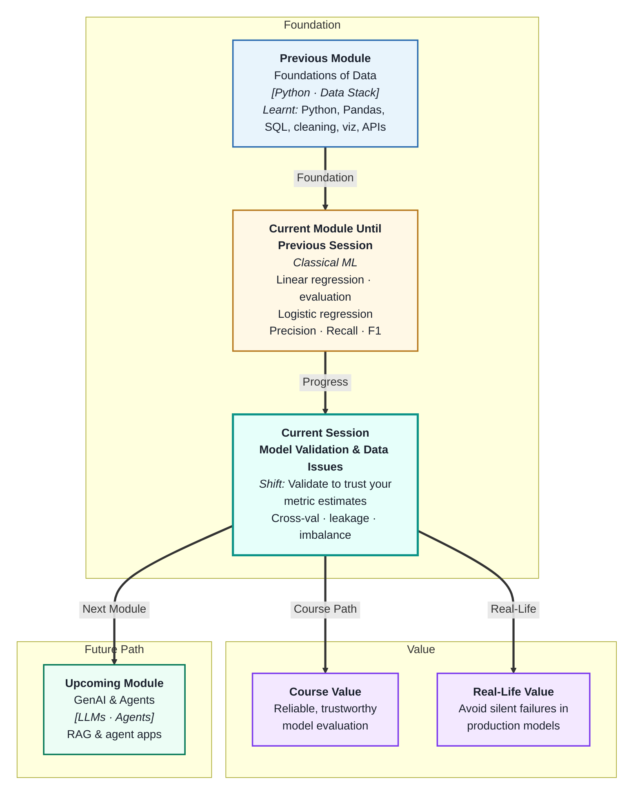
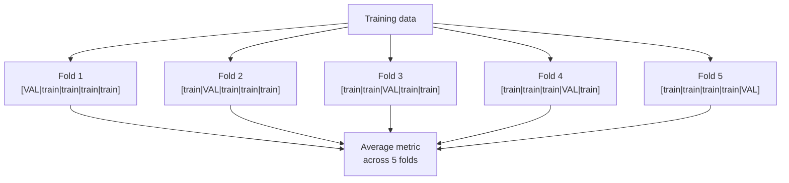
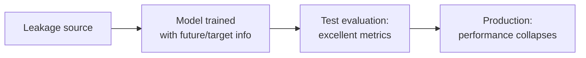
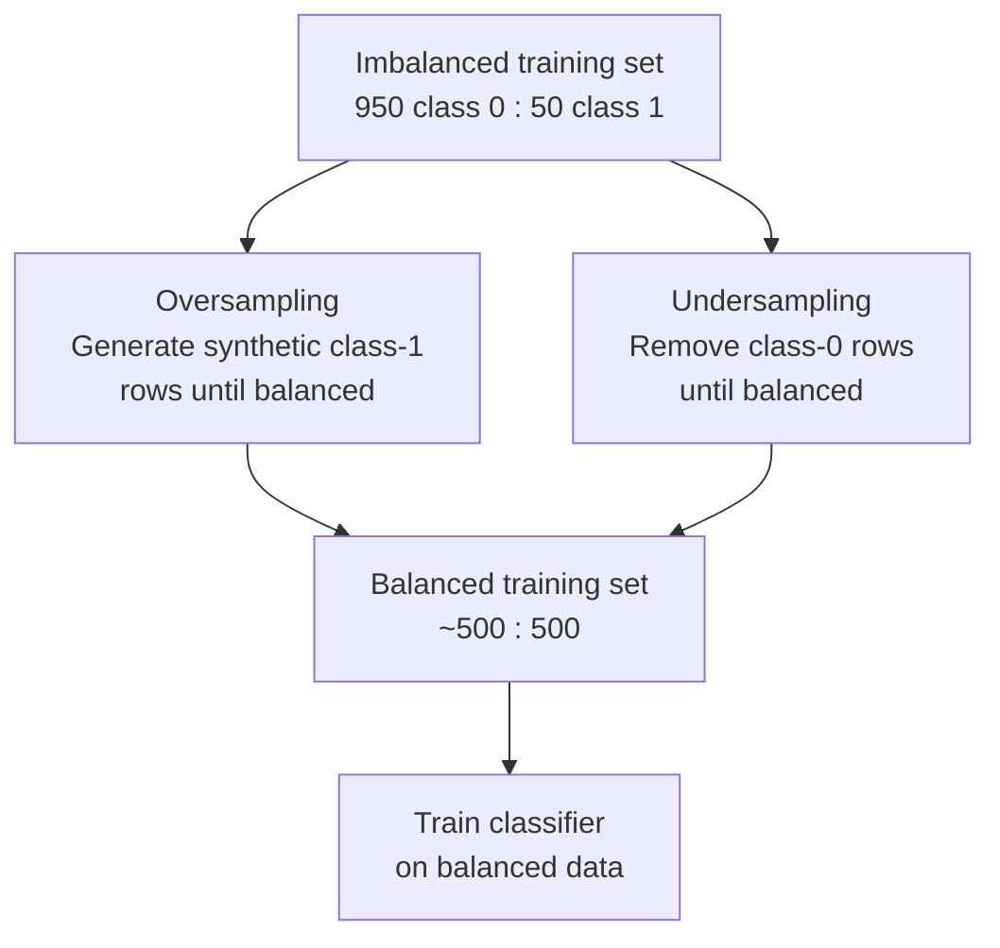

# Model Validation and Data Issues
---

## Mental Map

## What You'll Learn

In this pre-read, you'll discover:

- How **cross-validation** produces more reliable metric estimates than a single validation split
- What **data leakage** is and why it causes models to look far better than they actually are
- How **class imbalance** silently degrades classifier performance
- What **resampling techniques** (oversampling and undersampling) do to address imbalance
- How to build **reliable evaluation practices** that hold up in production

---

## A. Cross-Validation — More Reliable Metric Estimates

> 💡 **Analogy:** Taste-testing a soup from a single spoonful may not reflect the full pot. Tasting from five different spots — top, bottom, left, right, middle — gives you a far more reliable picture. **Cross-validation** does that for model metrics: it samples performance across multiple "views" of the data.

**One-line definition:** **Cross-validation** divides the training data into multiple folds, trains the model on all-but-one fold and evaluates on the held-out fold, repeating for each fold — producing a more stable metric estimate than a single split.

**K-Fold Cross-Validation (the most common method):**

**Why it matters:**

| Single validation split | 5-Fold cross-validation |
|---|---|
| Result depends heavily on which rows went into val set | Result averages out the luck of splitting |
| High variance estimate | Lower variance, more stable estimate |
| No sense of result spread | Gives you mean ± std across folds |
| May be biased if split was unlucky | Unbiased across the full training set |

**Rule of thumb:** Use 5-fold or 10-fold CV. On very small datasets (< 200 rows), use Leave-One-Out (LOO) — train on all but one row, test on that one, repeat for every row.

The test set is still never used during cross-validation — it remains sealed for the final evaluation.

---

## B. Data Leakage — The Silent Accuracy Inflator

> 💡 **Analogy:** A student sneaks a look at the answer key before an exam and scores 100%. Their score tells you nothing about their real knowledge. **Data leakage** is that sneak — the model sees information during training that it could never see in production, making its metrics falsely excellent.

**One-line definition:** **Data leakage** occurs when information from outside the training set (or from the future) is included in the training data — causing the model to appear far more accurate than it will be on real new data.

**Common forms of data leakage:**

| Type | Example | Why it is a problem |
|---|---|---|
| Target leakage | Including "diagnosis" as a feature in a disease prediction model | The feature is the answer — model trivially learns it |
| Future data in training | Using next week's sales to predict this week's churn | In production, the future is unknown |
| Test set contamination | Scaling features using statistics computed from the full dataset (incl. test set) | Test data influenced training preprocessing |
| ID leakage | Customer ID accidentally correlates with target in historical data | Model learns an ID pattern, not a real signal |

**How to prevent leakage:**

1. Always split data **before** any preprocessing (scaling, encoding, imputation)
2. Never include features that are derived from the target variable
3. For time-series data, always use a time-based split — future never trains past
4. Review all features with a domain expert before modelling

---

## C. Class Imbalance — When Data Is Lopsided

> 💡 **Analogy:** A classroom with 95 right-handed and 5 left-handed students. A model that predicts "right-handed" for everyone gets 95% accuracy but is useless for identifying left-handed students. **Class imbalance** makes the majority class dominate everything.

**One-line definition:** **Class imbalance** is when one class in the target variable is much more frequent than another — causing the model to be biased toward the majority class and underperform on the minority class.

**Effect on a classifier:**

| Metric | Imbalanced dataset (95/5) | What it hides |
|---|---|---|
| Accuracy = 95% | Model predicts majority always | Catches 0 minority class |
| Recall (minority) = 0% | Model never predicts minority | The actual business failure |
| Precision (majority) = 95% | All majority predictions are correct | Misleadingly good |

**Real examples of imbalanced datasets:**

| Application | Majority class | Minority class | Typical ratio |
|---|---|---|---|
| Fraud detection | Legit transactions | Fraud | 99:1 |
| Disease screening | Healthy | Diseased | 95:5 |
| Churn prediction | Active customers | Churned | 90:10 |
| Defect detection | Non-defective parts | Defective | 99:1 |

**What to do:**
- Always use stratified splits to maintain class ratios
- Report recall and F1, not accuracy
- Apply resampling (covered in section D)

---

## D. Resampling Techniques

> 💡 **Analogy:** A debate club has 50 members but only 5 from underrepresented backgrounds. To ensure fair representation in discussions, the club either invites more from that group (oversampling) or limits participation from the large group (undersampling). **Resampling** does the same for training data.

**One-line definition:** **Resampling techniques** modify the training data to balance class distribution — either by adding synthetic minority examples (oversampling) or removing majority examples (undersampling) — so the model does not simply learn to predict the majority class.

| Technique | How | Pros | Cons |
|---|---|---|---|
| Random oversampling | Duplicate minority rows | Simple | Can cause overfitting on duplicates |
| SMOTE | Create synthetic minority examples by interpolation | Richer than duplicates | Can create unrealistic examples |
| Random undersampling | Remove majority rows randomly | Reduces training time | Loses potentially useful data |
| Class weights | Tell the model "minority mistakes cost more" | No data modification | Works only if model supports it |

**Important:** Apply resampling **only to the training set** — never to validation or test sets. If you oversample before splitting, you will have synthetic copies of the same row in both train and test, contaminating your evaluation.

---

## E. Reliable Evaluation Practices

> 💡 **Analogy:** A scientific trial must follow a strict protocol — randomisation, blinding, independent review — or its results cannot be trusted. **Reliable evaluation** is the ML equivalent: a documented, leakage-free, reproducible protocol that produces trustworthy metric estimates.

**One-line definition:** **Reliable evaluation practices** are the set of procedural rules that ensure your reported metrics honestly reflect real-world performance — not artefacts of how data was split or preprocessed.

**The gold-standard evaluation checklist:**

| Step | Rule | Why |
|---|---|---|
| 1. Split first | Separate test set before any preprocessing | Prevents leakage |
| 2. Preprocess inside CV | Fit scalers/encoders on training folds only | Prevents test-set contamination |
| 3. Use stratified splits | Maintain class ratios in each split | Prevents misleading metrics on imbalanced data |
| 4. Use CV, not single split | Average across multiple folds | Reduces variance of metric estimate |
| 5. Seal the test set | Touch it only once, at the very end | Prevents test-set contamination |
| 6. Report on test set | State final metrics from the test set | Honest, unbiased estimate |
| 7. Document everything | Record split, CV folds, preprocessing, metric | Reproducibility |

**The most common silent failure:**

A model that achieves 0.95 AUC in development but drops to 0.62 in production. The cause is almost always:
1. Data leakage (future information in training)
2. Distribution shift (production data looks different from training)
3. Test-set contamination (metrics were tuned on the test set)

Following the checklist above prevents all three.

---

## Practice Exercises

**1. Pattern Recognition**  
A 5-fold cross-validation on a fraud model gives F1 scores per fold: `0.71, 0.68, 0.79, 0.70, 0.72`. What is the mean and approximate range? What does this spread tell you about how reliable the estimate is, and what would you be worried about if one fold gave F1 = 0.40?

**2. Concept Detective**  
A model to predict loan default achieves 99.1% accuracy in development but drops to 68% accuracy in production. A colleague suspects data leakage. What three questions would you ask to diagnose which type of leakage occurred, and for each, what would the evidence look like?

**3. Real-Life Application**  
Design a class imbalance strategy for a cancer screening model where 97% of patients are healthy. Describe: which metric you would report (not accuracy), whether you would use oversampling or class weights and why, how you would configure the stratified split, and what recall value would be the minimum acceptable for a medical application.

**4. Spot the Error**  
A data scientist builds a pipeline: (1) applies SMOTE to the full dataset to balance classes, (2) splits data 80/20 into train/test, (3) trains a model and evaluates on the test set. Identify the specific mistake in this pipeline, explain why the test-set metrics are now unreliable, and describe the correct ordering of steps.

**5. Planning Ahead**  
You are building a churn prediction model for a telecom company. The dataset has 100,000 rows, 8% churners. Design the complete validation strategy: how to split the data, how to handle class imbalance, how to use cross-validation, which metrics to track, how to detect if leakage occurred, and how to construct the final test-set evaluation.

---

> ✅ **You're done!** You now understand the three forces that corrupt model evaluation — insufficient validation (one split), leakage (future information in training), and imbalance (majority class bias) — and the practices that neutralise each one. Next: **ROC Curve and Threshold Optimization**, where you will visualise the entire precision-recall tradeoff across all thresholds simultaneously and learn to pick the optimal decision boundary for any business context.
