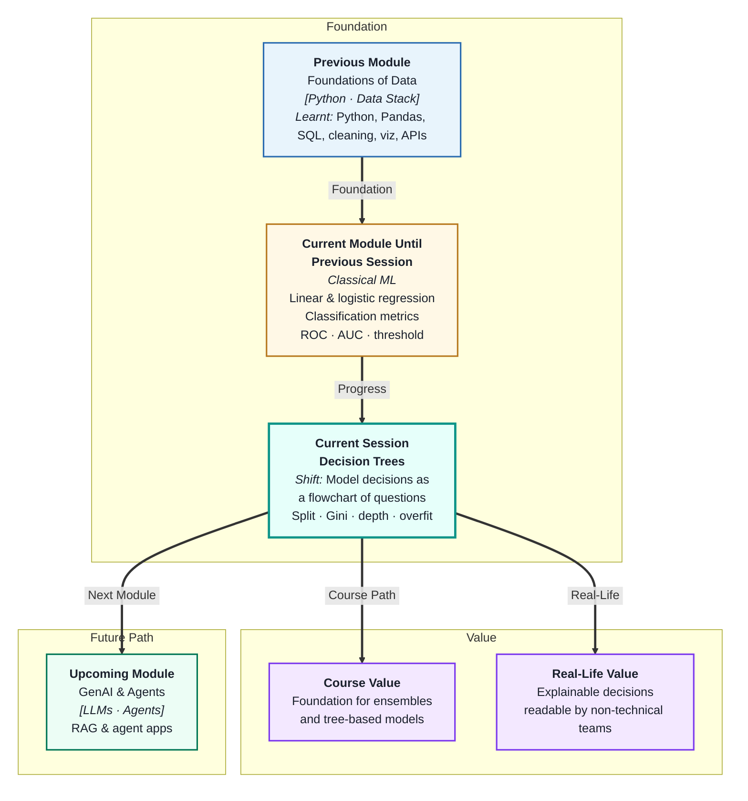
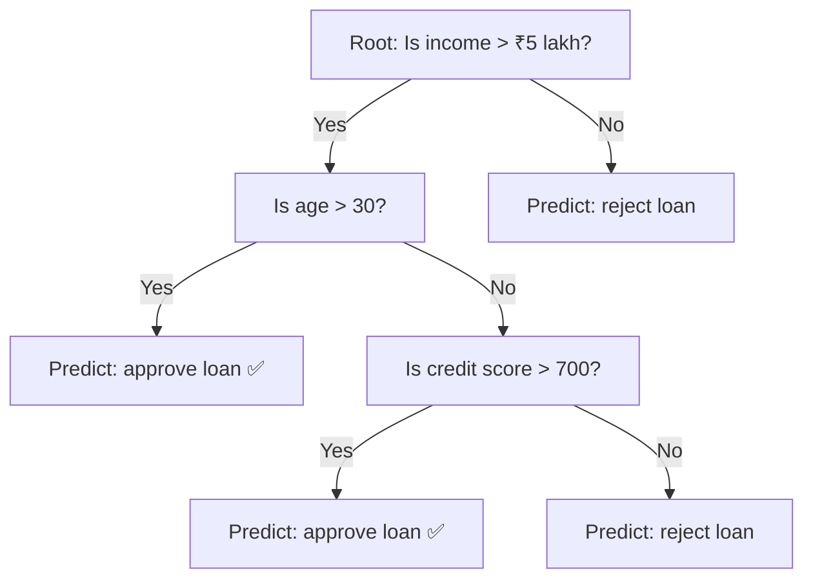
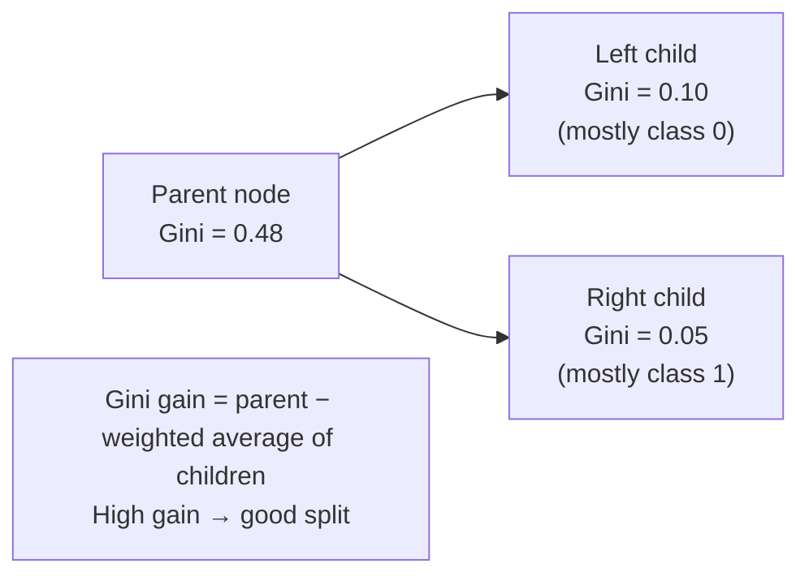
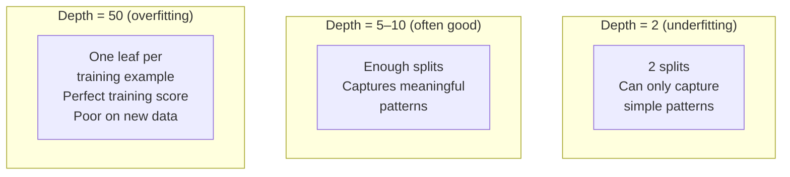
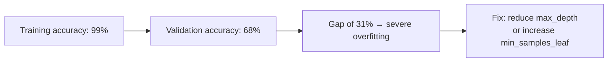

# Decision Trees
---

## Mental Map



## What You'll Learn

In this pre-read, you'll discover:

- How a **decision tree** structures predictions as a sequence of yes/no questions
- What **splitting criteria** like Gini impurity tell the tree which question to ask next
- How tree **depth** controls the complexity and affects overfitting
- Why decision trees overfit easily and how to control it with **pruning and depth limits**
- How to **interpret a trained tree** — a key advantage over black-box models

---

## A. Tree Structure — Decisions as a Flowchart

> 💡 **Analogy:** A doctor diagnosing fever first asks "Is temperature above 38°C?" If yes, they ask "Any rash?" If yes, they suspect measles. That branching chain of yes/no questions is exactly how a **decision tree** works — it routes each data point down a path of questions until it reaches a final answer.

**One-line definition:** A **decision tree** is a model that makes predictions by passing each data point through a series of binary yes/no questions about its features, routing it down branches until it reaches a leaf node that gives the prediction.



**Tree vocabulary:**

| Term | Plain meaning |
|---|---|
| **Root node** | First question — splits the full dataset |
| **Internal node** | Any non-leaf question — further splits a subset |
| **Branch** | The path taken when a condition is true or false |
| **Leaf node** | Final node — gives the prediction (class or value) |
| **Depth** | Number of levels from root to deepest leaf |
| **Split** | One question that divides a node into two groups |

Decision trees work for both **classification** (predict a class) and **regression** (predict a number). The structure is the same; only what the leaf node returns changes.

---

## B. Splitting Criteria — Choosing the Best Question

> 💡 **Analogy:** A librarian sorting books by genre wants to pick the attribute — title, colour, publisher — that creates the most "pure" groups (all fiction together, all non-fiction together). **Splitting criteria** measure purity: the algorithm asks every possible question and picks the one that creates the purest groups.

**One-line definition:** A **splitting criterion** measures how well a given question separates the data into pure groups (one class per group) — the algorithm picks the split with the highest purity gain.

**Gini Impurity — the most common criterion:**

```
Gini = 1 − (p₀² + p₁²)
```

Where p₀ and p₁ are the proportions of each class in a node.

| Node composition | Gini impurity |
|---|---|
| 100% one class | 0.00 — perfectly pure |
| 50% class 0, 50% class 1 | 0.50 — maximally impure |
| 80% class 0, 20% class 1 | 0.32 — moderately impure |

**Information Gain / Entropy** is an alternative criterion that measures uncertainty reduction. In practice, Gini and entropy produce very similar trees — Gini is faster to compute.



The algorithm tries every possible split on every feature and picks the one with the highest Gini gain. This is done greedily at each node — no backtracking.

---

## C. Controlling Depth — Complexity and Overfitting

> 💡 **Analogy:** A junior lawyer asked "describe this contract" gives an increasingly detailed answer the longer you let them talk. At one minute, they cover the key points. At thirty minutes, they are reciting every comma. **Depth** controls how detailed — and how overfit — the tree becomes.

**One-line definition:** **Tree depth** is the number of levels from root to the deepest leaf — a shallow tree underfits, a very deep tree overfits by memorising individual training examples.



**Depth vs performance:**

| Tree depth | Training accuracy | Validation accuracy | Problem |
|---|---|---|---|
| 2–3 | Moderate | Similar to training | Underfitting — too simple |
| 5–15 | Good | Good | Good generalisation ✅ |
| Unlimited | ~100% | Low | Overfitting — memorises training data |

**How to control it:**

| Hyperparameter | What it controls |
|---|---|
| `max_depth` | Maximum number of levels |
| `min_samples_split` | Minimum samples required to split a node |
| `min_samples_leaf` | Minimum samples required in a leaf |
| `max_features` | Number of features considered at each split |

Setting `max_depth=5` is a common safe starting point. Tune it via cross-validation.

---

## D. Overfitting in Trees — And How to Fix It

> 💡 **Analogy:** A tree that grew without pruning has hundreds of thin, wild branches. A well-pruned tree has fewer, stronger branches and looks more orderly — and it produces more consistent fruit. **Tree pruning** removes branches that add complexity without adding real predictive power.

**One-line definition:** A **decision tree overfits** when it grows deep enough to perfectly separate training examples — including noise — creating many narrow leaf nodes that do not generalise; **pruning** removes these unnecessary splits after training.

**Two approaches to controlling overfit:**

| Approach | When | How |
|---|---|---|
| **Pre-pruning** | During training | Set max_depth, min_samples_leaf before fitting |
| **Post-pruning** | After training | Remove nodes whose removal does not hurt val accuracy |

**Recognising overfit in a tree:**



**The tradeoff to remember:** A deeper tree always fits the training data better. The question is always: "does this extra depth generalise?" The answer is found by comparing training and validation metrics — not training alone.

---

## E. Model Interpretation — Reading a Trained Tree

> 💡 **Analogy:** Unlike a black box, a decision tree is more like a printed decision manual that any employee can follow. This transparency is both a **technical advantage** (debugging is easy) and a **business advantage** (regulators and stakeholders can audit decisions).

**One-line definition:** **Decision tree interpretation** means reading the tree's learned rules directly — each path from root to leaf is a human-readable "if–then" rule that explains every individual prediction.

**Example of a readable rule (loan model):**

```
IF income > ₹5 lakh
  AND age > 30
    → Approve (87% confidence)

IF income ≤ ₹5 lakh
    → Reject (92% confidence)
```

**Feature importance from trees:**

Trees naturally measure feature importance as "how much did this feature reduce impurity across all splits?" Features used at higher, broader splits matter more.

| Feature | Importance | Meaning |
|---|---|---|
| `income` | 0.45 | Used at root — most impactful split |
| `credit_score` | 0.31 | Second most important |
| `age` | 0.15 | Useful but less critical |
| `zip_code` | 0.09 | Marginal |

**When tree interpretability matters most:**

| Industry | Why interpretability is critical |
|---|---|
| Banking / lending | Regulations require explainable credit decisions |
| Healthcare | Doctors need to understand and verify predictions |
| Legal | Decisions may need to be defended in court |
| HR | Prevents illegal discrimination in automated hiring |

This interpretability is one reason decision trees — and their successors like Random Forest — are so widely deployed in regulated industries.

---

## Practice Exercises

**1. Pattern Recognition**  
A decision tree is trained to predict whether a customer will buy a product. The tree has three features: `age`, `income`, and `past_purchase`. At the root node, the split is on `income > ₹3 lakh`. Explain: why the algorithm chose income for the root node, what Gini impurity would be at the root if 60% of training examples are buyers and 40% are non-buyers, and what it means for a node to be "pure."

**2. Concept Detective**  
A decision tree achieves training accuracy = 0.98, validation accuracy = 0.63. A Random Forest on the same data achieves training accuracy = 0.91, validation accuracy = 0.85. Using section D, explain what caused the decision tree's problem and why the Random Forest avoided it (hint: next session will explain the mechanism — try to reason from what you already know about depth and overfitting).

**3. Real-Life Application**  
Describe a business problem where the *explainability* of a decision tree matters more than raw accuracy. Name the industry, the decision being made, who needs to understand the model's reasoning, and give an example of a specific rule the tree might learn that a stakeholder would want to verify.

**4. Spot the Error**  
A data scientist trains a decision tree with `max_depth=None` (unlimited) and reports training accuracy = 100% as proof the model works perfectly. Using sections C and D, explain what has actually happened to the tree, why the reported metric is meaningless, and what two hyperparameters they should set to produce a useful model.

**5. Planning Ahead**  
You are building a decision tree to predict employee attrition (leave / stay) using features like `tenure`, `salary`, `manager_rating`, `commute_distance`, and `overtime_hours`. Design the training plan: how you would set initial `max_depth` and `min_samples_leaf`, how you would tune them, what metric you would use (recall, precision, or F1), how you would read the final tree rules to present to HR, and what feature importance would tell you about which factors drive attrition most.

---

> ✅ **You're done!** You now understand how decision trees structure predictions as readable if–then rules, how Gini impurity guides the splitting process, and why unconstrained trees overfit. Next: **Ensemble Methods: Random Forest**, where you will see what happens when you build hundreds of these trees and combine their votes — dramatically improving performance and robustness over any single tree.
