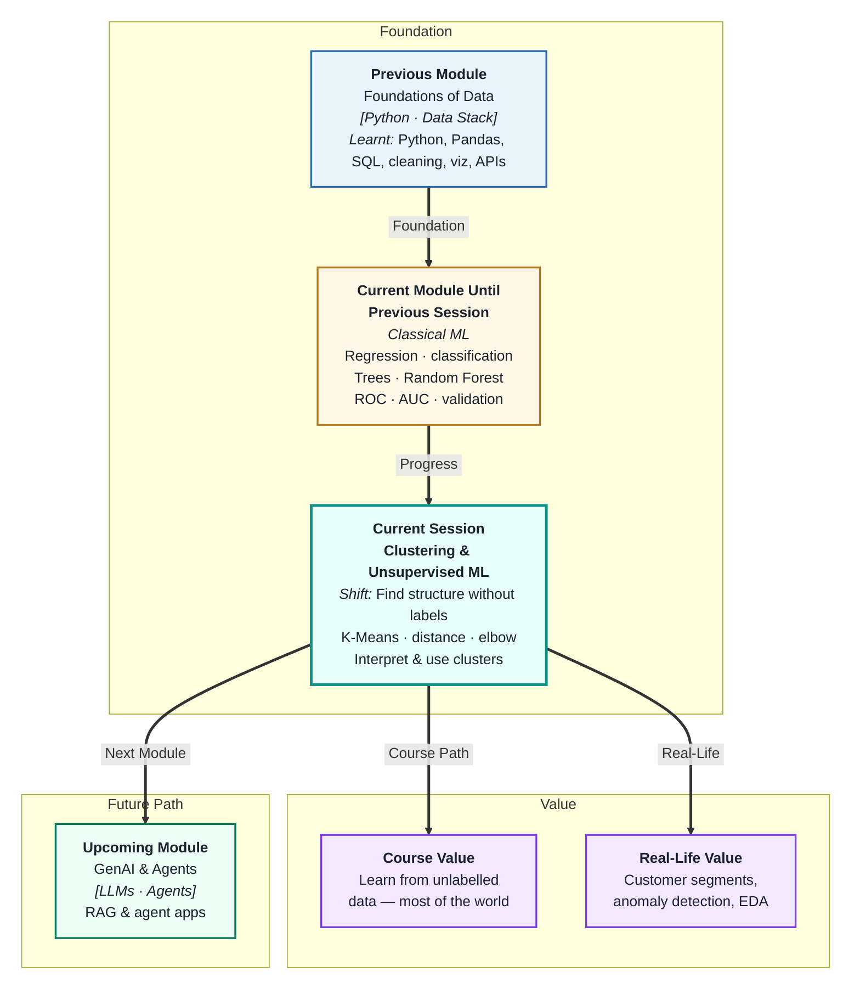
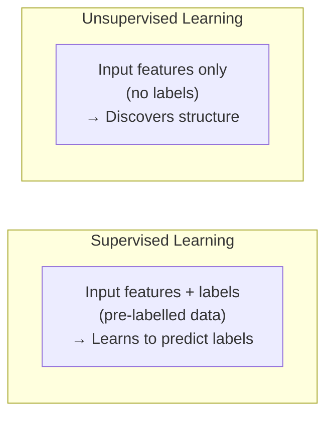
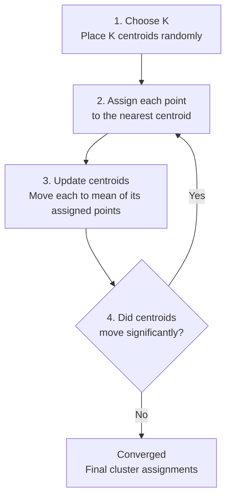
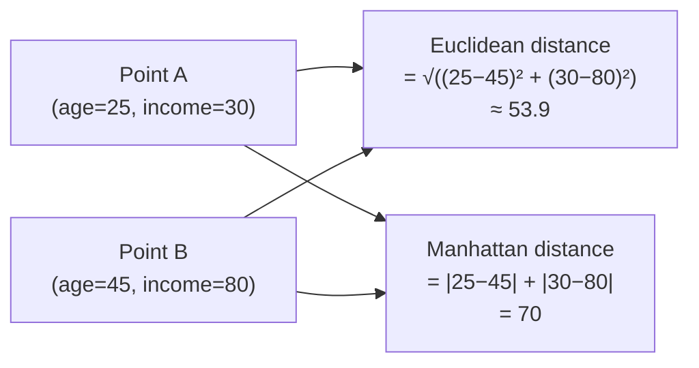
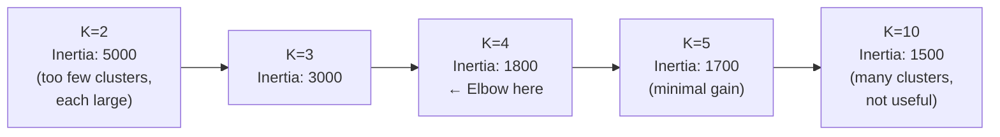

# Clustering and Unsupervised Learning
---

## Mental Map



## What You'll Learn

In this pre-read, you'll discover:

- What **unsupervised learning** is and how it differs from supervised learning
- How **K-Means clustering** finds natural groups in unlabelled data
- What **distance metrics** measure and how they drive cluster formation
- How the **elbow method** helps you choose the right number of clusters (K)
- How to **interpret and label clusters** to turn them into business insights

---

## A. Unsupervised Learning — No Labels, No Problem

> 💡 **Analogy:** A librarian receiving thousands of new books with no subject labels does not give up — they read the books, notice themes and similarities, and organise shelves by inferred categories. **Unsupervised learning** is that process: finding structure in data without being told what to look for.

**One-line definition:** **Unsupervised learning** is a category of ML where the model learns patterns, structure, or groupings from data without any labelled target variable — the algorithm finds order on its own.



**Where unsupervised learning is used:**

| Task | Application | No labels because |
|---|---|---|
| Clustering | Customer segmentation | Nobody labelled customers in advance |
| Anomaly detection | Fraud, defects | Rare events are hard to label exhaustively |
| Dimensionality reduction | Compressing features | No target — just explore the data |
| Topic modelling | Grouping news articles | Articles are not pre-categorised |

**Why most data is unlabelled:**

Labelling requires human effort — expert annotators, time, and cost. Most real-world data (web logs, sensor readings, transaction records) is never labelled. Unsupervised learning lets you extract value from it anyway.

---

## B. K-Means Clustering — Grouping by Similarity

> 💡 **Analogy:** Party organisers grouping attendees into tables use a simple rule: "people who know each other stay together." K-Means uses a mathematical version of that rule: "data points closer together belong to the same group." It starts with K guesses and iteratively refines the groupings until they stabilise.

**One-line definition:** **K-Means clustering** partitions n data points into K groups (clusters) by iteratively assigning each point to its nearest cluster centre (centroid) and then updating each centroid to be the mean of its assigned points.

**The algorithm in 4 steps:**



**What "nearest" means:**

By default, K-Means uses **Euclidean distance** — the straight-line distance between two points. For two features (x₁, x₂):

```
distance = √((x₁_a − x₁_b)² + (x₂_a − x₂_b)²)
```

**Important preprocessing requirement:** Always **scale features** before running K-Means. If one feature is in ₹ lakhs (range 0–100) and another is age (range 18–60), the income feature will dominate all distance calculations. Standardise all features to zero mean and unit variance first.

---

## C. Distance Metrics — Measuring Similarity

> 💡 **Analogy:** Two cities can be compared by: straight-line distance on a map (Euclidean), road distance through the city grid (Manhattan), or how different their names sound (cosine similarity for text). **Distance metrics** are the mathematical version of this choice — different metrics reveal different types of similarity.

**One-line definition:** A **distance metric** is a function that quantifies how different or similar two data points are — the choice of metric fundamentally shapes what "nearby" means and therefore which clusters form.

| Metric | Formula (simplified) | Best for |
|---|---|---|
| **Euclidean** | √(sum of squared differences) | Numeric data, similar scales |
| **Manhattan** | Sum of absolute differences | When large differences are less important |
| **Cosine** | Angle between feature vectors | Text, high-dimensional data |



**Effect of feature scale on distance:**

| Features | No scaling | With scaling |
|---|---|---|
| Income (0–200k) and Age (18–65) | Income dominates distance | Both contribute equally |
| Cluster result | Clusters based mostly on income | Balanced clustering across features |

Scaling is not optional for K-Means — it is mandatory for meaningful clusters.

---

## D. The Elbow Method — Choosing K

> 💡 **Analogy:** When organising a bookshelf, too few categories (2: fiction/non-fiction) is too broad. Too many (200 micro-categories) is impractical. There is a sweet spot where adding another category stops meaningfully improving organisation. The **elbow method** finds that sweet spot for clusters.

**One-line definition:** The **elbow method** plots the total within-cluster sum of squared distances (inertia) for different values of K and identifies the "elbow" — the point where adding more clusters stops producing meaningful improvement.



**How to use it:**

1. Train K-Means for K = 2, 3, 4, … 10 (or more)
2. Record inertia for each K
3. Plot K (x-axis) vs inertia (y-axis)
4. Find the "elbow" — the bend where the curve flattens
5. Choose K at the elbow

**When there is no clear elbow:**

If the curve decreases smoothly without a clear bend, it means the data has no strong natural cluster structure. In this case, choose K based on **business constraints** (e.g. "we can run 4 marketing campaigns, so K=4").

---

## E. Cluster Interpretation and Business Use Cases

> 💡 **Analogy:** A geographer who draws regional boundaries on a map has done the clustering. The real work is then naming each region — "industrial belt," "agricultural zone," "coastal tourism" — and deciding what policies to apply to each. **Cluster interpretation** is that naming and analysis step.

**One-line definition:** **Cluster interpretation** means analysing the statistical profile of each cluster (mean feature values, size, distribution) to assign a human-readable label and derive business actions from it.

**How to interpret clusters:**

After running K-Means, compute the mean of each feature per cluster:

| Cluster | Avg age | Avg income (₹k) | Avg tenure (yrs) | Label |
|---|---|---|---|---|
| 0 | 28 | 35 | 1.2 | Young, entry-level |
| 1 | 45 | 120 | 8.5 | Senior, high-value |
| 2 | 35 | 60 | 3.4 | Mid-career, growing |

Now each cluster has a name and a business action:

| Cluster | Label | Business action |
|---|---|---|
| 0 | Young, entry-level | Retention incentives, career path messaging |
| 1 | Senior, high-value | Premium loyalty programme, personalised offers |
| 2 | Mid-career, growing | Skills development, cross-sell products |

**Real-world business use cases:**

| Industry | Clustering application |
|---|---|
| Retail | Customer segmentation for personalised campaigns |
| Banking | Risk segment identification for product offers |
| Healthcare | Patient grouping for care pathway design |
| E-commerce | Product grouping for recommendation engines |
| Operations | Machine fault type categorisation for maintenance |

**K-Means limitations to know:**

- Assumes spherical, equally-sized clusters (not always true in practice)
- Sensitive to outliers — one extreme point can pull a centroid significantly
- Must choose K in advance — not always obvious
- Not suitable for categorical features directly — use numeric representations or a different algorithm

---

## Practice Exercises

**1. Pattern Recognition**  
A K-Means model with K=3 is trained on customer data (age, monthly spend). After convergence, the centroids are at: (25, 500), (45, 3000), (60, 800). Describe what each cluster likely represents in business terms. What would happen to the clusters if monthly spend was not scaled and ranged from 0 to 50,000 while age ranged from 18 to 70?

**2. Concept Detective**  
An analyst runs K-Means for K=2 to 10 and plots inertia. The inertia drops sharply from K=2 to K=4, then decreases very slowly from K=4 to K=10. Using section D, identify the optimal K, explain what the flat region means about the data, and describe what you would do if the business team insists on K=6 for operational reasons.

**3. Real-Life Application**  
Describe how you would use K-Means clustering in three of the following contexts: (a) grouping e-commerce customers for a marketing campaign, (b) grouping hospital patients by health indicators, (c) identifying fault patterns in manufacturing sensors, (d) grouping news articles by topic. For each: name the features you would use, how many clusters you might start with, and what you would do after clustering to extract actionable insights.

**4. Spot the Error**  
A data scientist runs K-Means on a customer dataset with three features: `age (18–75)`, `annual_salary_INR (0 to 15,00,000)`, and `num_purchases (1–200)`. They do not scale the data first. The resulting clusters look suspiciously income-based, ignoring age and purchase frequency almost entirely. Using section C, explain why this happened and what they should do to fix it.

**5. Planning Ahead**  
You are segmenting 100,000 mobile app users into groups to personalise push notifications. Available features: `session_length`, `sessions_per_week`, `features_used_count`, `days_since_last_session`, `in_app_purchase_amount`. Describe the full clustering pipeline: preprocessing steps, how you would use the elbow method, what K you would start with, how you would name and describe the clusters, and what the product team would do differently for each cluster.

---

> ✅ **You're done!** You now understand how K-Means finds hidden groups in unlabelled data, how distance and scaling shape the results, and how to interpret clusters into actionable business segments. Next (and final session of the module): **Model Selection and End-to-End Pipeline**, where you will learn how to compare all the algorithms you have studied and build a complete, reproducible ML workflow from raw data to deployed model.
