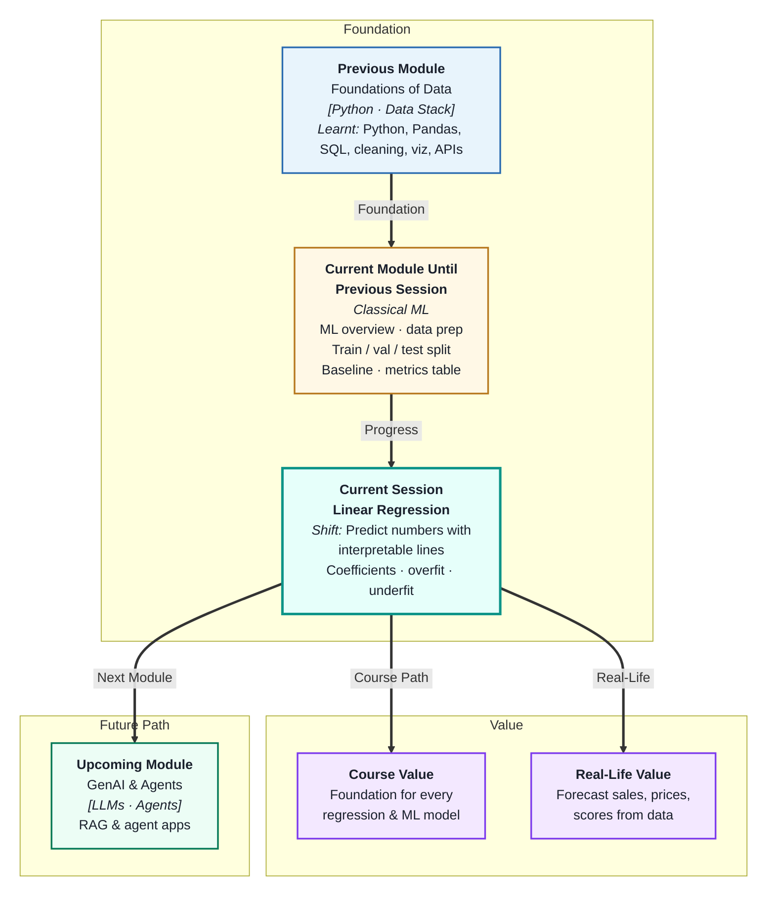
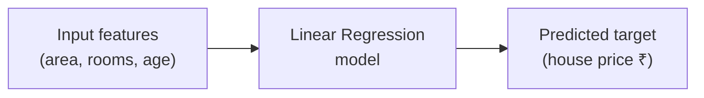
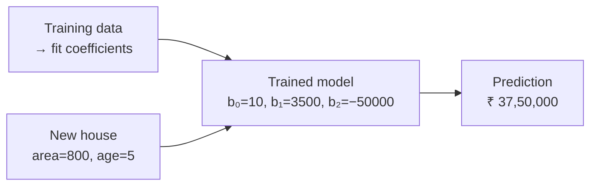
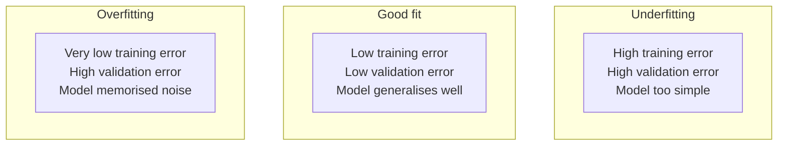

# Linear Regression and Model Interpretation
---

## Mental Map



## What You'll Learn

In this pre-read, you'll discover:

- What a **linear regression model** is and the equation that drives it
- How to read and interpret **coefficients** to understand what the model learned
- How the model makes **predictions** on new, unseen data
- What **overfitting and underfitting** look like and why both are problems
- How to spot which problem your model has using training vs validation error

---

## A. What Is Linear Regression?

> 💡 **Analogy:** You notice that taller people generally weigh more. If you draw a straight line through a scatter plot of height vs weight, you can use that line to *estimate* a new person's weight from their height alone. **Linear regression** finds that best-fitting line from your data automatically.

**One-line definition:** **Linear regression** is a supervised ML model that predicts a continuous numeric target by fitting the straight line (or hyperplane) that minimises the total gap between its predictions and the true values.



**The equation:**

```
ŷ = b₀ + b₁x₁ + b₂x₂ + … + bₙxₙ
```

| Symbol | Name | Meaning |
|---|---|---|
| `ŷ` | Prediction | The value the model outputs |
| `b₀` | Intercept | Predicted value when all features are zero |
| `b₁ … bₙ` | Coefficients | How much ŷ changes per unit increase in each feature |
| `x₁ … xₙ` | Features | The input columns |

**What "fitting" means:** The training process finds the values of `b₀, b₁ … bₙ` that minimise the sum of squared differences between predictions and true labels. This is called **Ordinary Least Squares (OLS)**.

---

## B. Coefficients — Reading What the Model Learned

> 💡 **Analogy:** A recipe coefficient is like a multiplier: "for every extra egg, the cake rises 2 cm." A regression **coefficient** is exactly that — it tells you how much the prediction changes for every one-unit increase in that feature, *holding everything else constant*.

**One-line definition:** A **coefficient** is the model's learned weight for a feature — it tells you the direction (positive or negative) and magnitude of that feature's influence on the prediction.

**Interpreting coefficients:**

| Coefficient | Feature | Interpretation |
|---|---|---|
| +3,500 | `area_sqft` | Each extra sq ft adds ₹3,500 to predicted price |
| −50,000 | `age_years` | Each year of age reduces price by ₹50,000 |
| +1,20,000 | `is_furnished` | A furnished flat predicts ₹1.2 lakh more |
| +200 | `distance_metro` | Each km from metro adds ₹200? — suspicious, worth investigating |

**Key points:**

- A **large positive** coefficient means the feature strongly pushes predictions up
- A **large negative** coefficient means the feature strongly pushes predictions down
- A coefficient **near zero** means the feature has little influence (or is correlated with another)
- **Sign matters** — a negative coefficient on "defect count" makes intuitive sense for a quality model

**Important caveat:** Coefficients are only comparable in magnitude when all features are on the same scale. If `area` is in sq ft (range 0–5000) and `rooms` is an integer (range 1–10), the coefficients look wildly different even if both features matter equally. **Feature scaling** (covered in upcoming sessions) addresses this.

---

## C. Making Predictions

> 💡 **Analogy:** Once you have a calibrated thermometer, reading a temperature is trivial — you just look at the number. Once a regression model is trained (calibrated), making a prediction is equally trivial: plug in the feature values and let the equation compute the result.

**One-line definition:** A **prediction** is what the trained model outputs when you pass new input feature values through its learned equation.



**Step-by-step:**

1. Collect feature values for the new data point
2. Multiply each feature by its learned coefficient
3. Add the intercept
4. The result is the predicted target value

**In practice (scikit-learn):**

```
model.fit(X_train, y_train)       # learn coefficients
y_pred = model.predict(X_val)     # apply equation to new data
```

**Residuals** — the gap between prediction and truth:

```
residual = actual − predicted
```

A residual of zero means a perfect prediction. Large residuals (in absolute value) are the rows your model gets most wrong — examining them often reveals patterns the model missed or data quality issues.

---

## D. Overfitting and Underfitting

> 💡 **Analogy:** A student who memorises every past exam answer word-for-word (overfitting) fails on a slightly rephrased new question. A student who only learns "the answer is always C" (underfitting) fails at everything. Good learning means understanding the *pattern*, not the *examples*.

**One-line definition:** **Overfitting** means the model learned the training data *too specifically* — including noise — and performs poorly on new data; **underfitting** means the model is *too simple* to capture the real pattern in either training or new data.



**Diagnosing which problem you have:**

| Scenario | Training error | Validation error | Problem |
|---|---|---|---|
| Both high | High | High | Underfitting — model too simple |
| Both low | Low | Low | Good generalisation ✅ |
| Gap is large | Low | High | Overfitting — model too complex |

**Common causes:**

| Overfitting | Underfitting |
|---|---|
| Too many features relative to data | Too few features |
| Model is too complex (high-degree polynomial) | Model is too simple (straight line for curved data) |
| Too little training data | Features do not capture the signal |
| No regularisation | Too much regularisation |

The gap between training and validation error is your most honest signal. A model that scores 0.95 on training data and 0.60 on validation data has overfit — it learned the training set, not the real pattern.

---

## E. The Bias–Variance Intuition

> 💡 **Analogy:** An archer who always misses in the same direction has **high bias** (consistently wrong). One who shoots all over the place has **high variance** (inconsistently wrong). The best archer is both accurate on average and consistent — **low bias and low variance**.

**One-line definition:** **Bias** is systematic error from a model that is too simple to capture the real pattern; **variance** is sensitivity error from a model that changes drastically with small changes in training data.

| | Low variance | High variance |
|---|---|---|
| **Low bias** | ✅ Ideal model | Overfitting |
| **High bias** | Underfitting | Bad in every way |

**Key insight:** You cannot minimise both simultaneously with a fixed amount of data — improving one typically worsens the other. This is the **bias–variance tradeoff**, and it explains why more complex models do not always win.

For linear regression specifically:
- A model with too few features has **high bias** — it draws a line through a curved pattern
- A model with too many features (or polynomial terms) has **high variance** — it wiggles through every training point, capturing noise

You will manage this tradeoff directly in the **Regularization** session coming up next.

---

## Practice Exercises

**1. Pattern Recognition**  
A linear regression model is trained to predict monthly electricity bills (₹) from home area (sq ft), number of appliances, and average daily temperature. The coefficients are: intercept = 500, area = 0.8, appliances = 120, temperature = −15. Interpret each coefficient in plain language and say whether the signs (positive/negative) make intuitive sense.

**2. Concept Detective**  
A model scores MAE = 800 on training data and MAE = 4,200 on validation data. Using section D, identify which problem (overfitting or underfitting) this is, explain what the large gap between scores means, and suggest two changes the team could try.

**3. Real-Life Application**  
Name three real business problems where linear regression would be a sensible first model (predict a number). For each: name the target variable, list two or three input features, and say whether you would expect positive or negative coefficients for each feature.

**4. Spot the Error**  
A student compares two models by looking only at their training-set R² scores: Model A = 0.97, Model B = 0.84. They choose Model A. Later the validation R² scores are: A = 0.61, B = 0.80. What mistake did they make in the comparison, and which model should they actually choose?

**5. Planning Ahead**  
You are building a model to predict a student's final exam score from: hours studied, attendance percentage, number of assignments submitted, and previous test score. Describe the full linear regression workflow — how you would split the data, what the baseline is, how you would train the model, how you would interpret the coefficients, and how you would detect overfitting.

---

> ✅ **You're done!** You now understand how linear regression finds a line through data, what its coefficients mean in plain language, and how to spot whether it has overfit or underfit. Next: **Master Class: The Mathematics Behind Learning**, which explains the exact mathematical engine — residuals, least squares, and error minimisation — that powers the model you just learned.
