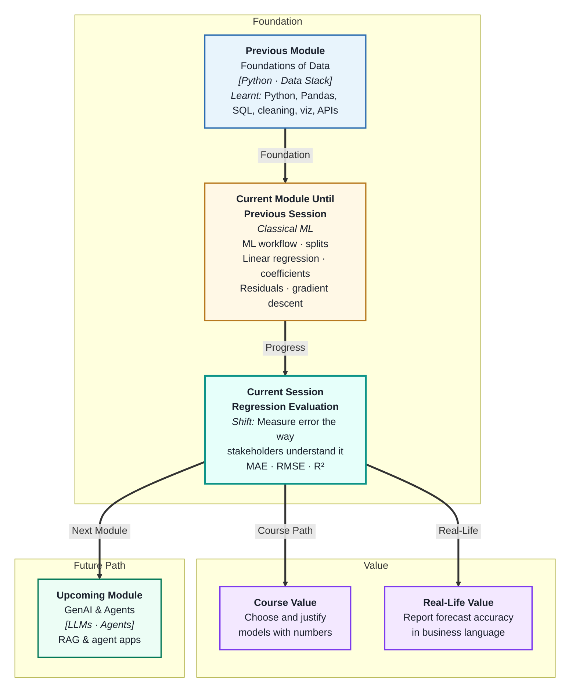
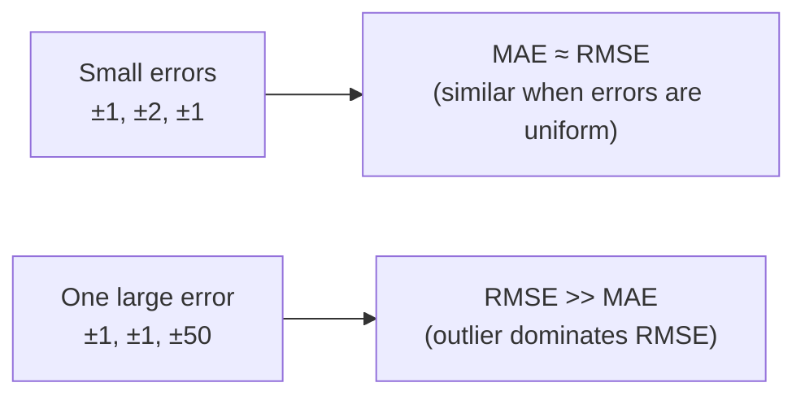
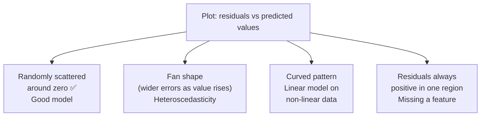

# Regression Evaluation and Error Analysis
---

## Mental Map



## What You'll Learn

In this pre-read, you'll discover:

- What **MAE, RMSE, and R²** measure and how they differ from each other
- How to choose the right metric for your specific prediction problem
- How to **interpret error values** in the units your stakeholders understand
- What residual patterns reveal about what your model is still getting wrong
- How to use a **metric comparison table** to make a justified model choice

---

## A. MAE — Mean Absolute Error

> 💡 **Analogy:** A delivery app tracks how many minutes early or late each rider arrives. The average of those gaps — ignoring whether they were early or late — is MAE. It tells you the *typical* error in the same units as the original prediction.

**One-line definition:** **MAE** is the average absolute difference between predicted and actual values — the simplest, most human-readable regression error metric.

```
MAE = average of |actual − predicted|
```

| Property | Detail |
|---|---|
| Units | Same as the target (e.g. ₹ lakh, minutes, kg) |
| Outlier sensitivity | Low — large errors are not penalised extra |
| Interpretation | "On average, my predictions are off by X units" |
| When to prefer | When all errors matter equally; business has a linear cost per error |

**Example:** If your model predicts house prices and MAE = ₹3.2 lakh, that means on average your predictions are ₹3.2 lakh off the actual sale price — in either direction.

---

## B. RMSE — Root Mean Squared Error

> 💡 **Analogy:** A quality inspector gives bigger penalties for larger defects than for small ones. A shirt with one 10 cm tear is worse than ten 1 cm threads. **RMSE** penalises large errors more than small ones, making it sensitive to outliers.

**One-line definition:** **RMSE** is the square root of the average of squared errors — it is in the same units as the target but gives extra weight to large mistakes.

```
RMSE = √(average of (actual − predicted)²)
```

| Property | Detail |
|---|---|
| Units | Same as the target |
| Outlier sensitivity | High — a single large error inflates RMSE significantly |
| Interpretation | "Typical error, but large mistakes punished more" |
| When to prefer | When large errors are especially costly (medical, finance) |



**MAE vs RMSE — when they diverge:**

If MAE = 4 and RMSE = 12, your model has a few very large errors even if most predictions are close. Investigate those outlier residuals — they often point to a data segment the model handles poorly.

---

## C. R² — Coefficient of Determination

> 💡 **Analogy:** Imagine two forecasters. One knows nothing and just predicts the average temperature every day. The other uses a sophisticated model. **R²** measures how much better the second forecaster is compared to the first — as a percentage of total variance explained.

**One-line definition:** **R²** measures the proportion of variance in the target that the model explains — ranging from 0 (no better than the mean baseline) to 1 (perfect predictions).

```
R² = 1 − (sum of squared residuals) / (total sum of squares)
```

| R² value | Interpretation |
|---|---|
| 1.00 | Perfect — model explains all variance |
| 0.85 | Good — model explains 85% of variation |
| 0.50 | Moderate — explains half |
| 0.00 | Useless — no better than predicting the mean |
| Negative | Worse than the mean baseline |

**R² does not tell you if predictions are close in absolute terms.** A model with R² = 0.90 on house prices could still be off by ₹10 lakh on average — always read R² alongside MAE or RMSE.

| Metric | Answers |
|---|---|
| MAE | "How far off am I, on average, in real units?" |
| RMSE | "How far off am I, penalising big mistakes more?" |
| R² | "What fraction of the pattern did I explain?" |

---

## D. Reading Residual Patterns

> 💡 **Analogy:** A doctor reviewing X-rays does not just look at one number — they look at the *pattern* of abnormalities. **Residual analysis** is the doctor's review for ML: looking at the pattern of your errors to diagnose what the model still misses.

**One-line definition:** **Residual analysis** examines the pattern of prediction errors to detect systematic problems — bias in certain value ranges, heteroscedasticity, or ignored relationships.



**What different patterns mean:**

| Residual pattern | Diagnosis | Possible fix |
|---|---|---|
| Random, centered on zero | Model is well-specified | ✅ Done |
| Fan shape (widening) | Variance grows with predicted value | Log-transform target |
| Curved pattern | Linear model for non-linear data | Add polynomial features |
| Positive residuals in one segment | Model underestimates a subgroup | Add a segment-specific feature |
| Negative outliers | Model overestimates a few rows | Check for data errors or anomalies |

Always plot residuals before reporting a model. A good R² can hide a curved residual pattern that a different model would fix easily.

---

## E. Choosing the Right Metric and Building a Comparison Table

> 💡 **Analogy:** A race is judged differently depending on the sport — a sprinter is timed to the millisecond; a marathon runner's position matters more than exact time. **Choosing the right metric** means matching the measure to what the business actually cares about.

**One-line definition:** Selecting an **evaluation metric** means choosing the number that best reflects the cost of prediction errors in your specific business context — then using it consistently across all model comparisons.

**Decision guide:**

| Situation | Recommended metric | Reason |
|---|---|---|
| All errors cost the same | MAE | Simple, linear penalty |
| Big errors are very costly | RMSE | Squares large errors |
| Need to communicate to non-technical stakeholders | MAE | "Off by X units" is intuitive |
| Comparing models on relative improvement | R² | "We explain 15% more variance" |
| Both large and small errors matter | Both MAE and RMSE | Report together |

**Model comparison table — always build this:**

| Model | MAE (₹ lakh) | RMSE (₹ lakh) | R² | Notes |
|---|---|---|---|---|
| Baseline (mean) | 12.0 | 18.5 | 0.00 | No learning |
| Linear Regression | 6.2 | 9.8 | 0.61 | Good start |
| Ridge Regression | 5.9 | 9.1 | 0.65 | Slight improvement |
| Best candidate | 5.4 | 8.3 | 0.70 | Chosen model |

The table makes your decision transparent and reproducible. Anyone reviewing your work can see why you chose a model — not just "it felt better."

---

## Practice Exercises

**1. Pattern Recognition**  
A model predicts exam scores (out of 100). Residuals for five students are: `+2, −1, +18, −3, +1`. Compute MAE manually. Then explain why RMSE would be significantly higher than MAE for this set of residuals, and which student's prediction you should investigate first.

**2. Concept Detective**  
Model A has MAE = 5 and RMSE = 6. Model B has MAE = 5 and RMSE = 14. Both have the same average error — but a business analyst says Model B is unacceptable for a finance application. Using sections B and E, explain the analyst's reasoning.

**3. Real-Life Application**  
Name three real regression problems with different error cost structures: (a) one where MAE is the right metric, (b) one where RMSE is better, (c) one where R² is the most useful communication tool. For each, explain who the stakeholder is and why that metric matches their concern.

**4. Spot the Error**  
A data scientist plots residuals vs predicted values and sees a clear U-shaped curve — residuals are positive for low predictions, near zero in the middle, then positive again for high predictions. They dismiss it saying "R² is 0.82 so the model is fine." What pattern has been missed, what does it indicate about the model, and what should they do?

**5. Planning Ahead**  
You are evaluating two models for predicting monthly electricity bills: Model A (MAE=₹180, RMSE=₹210, R²=0.78) and Model B (MAE=₹175, RMSE=₹380, R²=0.79). The client is an electricity company worried about very large billing errors causing customer complaints. Which model would you recommend, how would you justify it using the metrics, and what residual plot would you create to confirm your choice?

---

> ✅ **You're done!** You can now read MAE, RMSE, and R² fluently — not just as numbers but as answers to specific business questions about prediction quality. You also know how to investigate residual patterns to catch problems an R² score hides. Next: **Regularization Techniques**, where you will learn to control overfitting directly by adding a penalty to the model's complexity.
