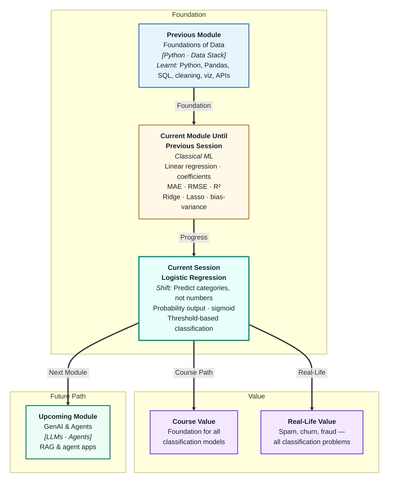
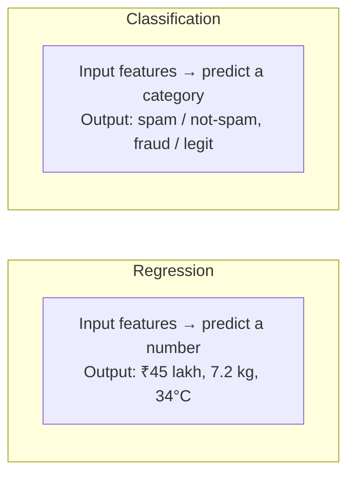
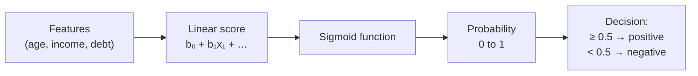
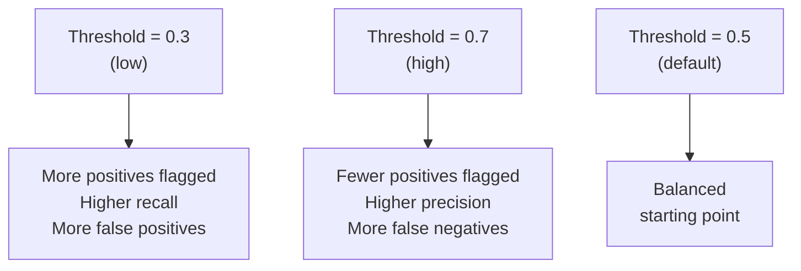

# Logistic Regression for Classification
---

## Mental Map



## What You'll Learn

In this pre-read, you'll discover:

- Why **classification** is different from regression — and what changes in the model
- How **logistic regression** converts a linear score into a probability between 0 and 1
- What the **sigmoid function** does and why it is the key to probability outputs
- How a **threshold** turns probabilities into a yes/no decision
- How to adjust the threshold to favour catching more positives vs making fewer false alarms

---

## A. From Regression to Classification

> 💡 **Analogy:** A thermometer gives a continuous number — 36.5°C. A doctor uses that number to make a *decision* — "normal" or "fever." **Classification** is the decision layer on top of a score: it maps a number to a category.

**One-line definition:** **Classification** is a supervised ML task where the model predicts a discrete category (like spam/not-spam or churn/no-churn) rather than a continuous number.



**Why not use linear regression for classification?**

Linear regression can output any number — including values outside [0, 1] — which makes no sense for probabilities. It also treats the two classes as equally spaced points on a number line, which creates systematic errors on imbalanced data.

Logistic regression solves both problems by squashing the output into a probability.

| Problem type | Output | Example |
|---|---|---|
| Regression | Any real number | House price, temperature |
| Binary classification | 0 or 1 (one of two classes) | Spam or not spam |
| Multi-class classification | One of K classes | Cat, dog, or bird |

---

## B. The Logistic Regression Model

> 💡 **Analogy:** A loan officer scores an application from −∞ to +∞ based on financial signals. Then they use an S-shaped conversion chart to turn that score into "probability of default: 0–100%." **Logistic regression** builds that conversion chart from data automatically.

**One-line definition:** **Logistic regression** computes a linear score from input features (just like linear regression), then passes it through the **sigmoid function** to convert it into a probability between 0 and 1.

**Step 1 — Compute a linear score:**

```
score = b₀ + b₁x₁ + b₂x₂ + … + bₙxₙ
```

**Step 2 — Apply the sigmoid function:**

```
probability = 1 / (1 + e^(−score))
```



**The sigmoid's key property:** No matter how large or small the input score, the output is always between 0 and 1. A very large positive score → probability near 1. A very large negative score → probability near 0. The curve is S-shaped.

| Linear score | Sigmoid output | Interpretation |
|---|---|---|
| +5 | ~0.99 | Almost certainly positive class |
| +1 | ~0.73 | Likely positive |
| 0 | 0.50 | Uncertain — on the boundary |
| −1 | ~0.27 | Likely negative |
| −5 | ~0.01 | Almost certainly negative class |

---

## C. Threshold-Based Classification

> 💡 **Analogy:** A smoke alarm goes off when smoke concentration exceeds a certain level — its **threshold**. Set it too high and fires go undetected. Set it too low and it triggers on toast. **Classification thresholds** have the same tradeoff.

**One-line definition:** A **threshold** converts a probability score into a class label — any probability above the threshold is labelled positive; below is labelled negative.

**Default threshold = 0.5:**

```
if probability >= 0.5 → predict class 1 (positive)
if probability  < 0.5 → predict class 0 (negative)
```

**Why adjust the threshold?**

The default 0.5 treats false positives and false negatives as equally costly. In many real problems, they are not:

| Application | Costly mistake | Threshold adjustment |
|---|---|---|
| Fraud detection | Missing fraud (false negative) | Lower threshold → catch more fraud |
| Spam filter | Blocking real emails (false positive) | Raise threshold → fewer false alarms |
| Cancer screening | Missing a positive (false negative) | Lower threshold → flag more for review |
| Loan approval | Approving a defaulter (false positive) | Raise threshold → fewer risky approvals |



The right threshold is a **business decision**, not a mathematical one. You will learn to evaluate threshold choices systematically using the confusion matrix and ROC curve in the next two sessions.

---

## D. Interpreting Logistic Regression Coefficients

> 💡 **Analogy:** A traffic light coefficient is like knowing "each additional minute of congestion adds 0.3 to the delay score." Logistic regression coefficients work the same way — but on the *log-odds scale* rather than directly on probabilities.

**One-line definition:** In logistic regression, each coefficient tells you how much the **log-odds** of the positive class changes per one-unit increase in that feature — positive means higher probability, negative means lower.

**Plain interpretation rules:**

- **Positive coefficient** → higher feature value → higher probability of positive class
- **Negative coefficient** → higher feature value → lower probability of positive class
- **Large absolute value** → strong influence on the prediction
- **Near zero** → weak or no influence

**Example — churn prediction:**

| Feature | Coefficient | Interpretation |
|---|---|---|
| `tenure_months` | −0.04 | Longer customers less likely to churn |
| `support_tickets` | +0.8 | More complaints → higher churn probability |
| `is_premium` | −1.2 | Premium subscribers much less likely to churn |
| `last_login_days` | +0.3 | Longer since last login → higher churn risk |

Coefficients give you actionable intelligence: the feature with the largest positive coefficient is the biggest driver of the positive outcome. This is why logistic regression is widely used in banking and marketing — it is both predictive and explainable.

---

## E. Multiclass Classification — Beyond Yes/No

> 💡 **Analogy:** Sorting mail into two bins (spam / not spam) is binary classification. Sorting into ten zip-code bins is multiclass. The sorting logic is the same — you just have more bins.

**One-line definition:** **Multiclass classification** predicts one label from three or more categories; logistic regression handles this by training one model per class (One-vs-Rest) or using the softmax extension.

| Strategy | How it works | Example |
|---|---|---|
| One-vs-Rest (OvR) | Train K binary classifiers; pick highest probability | Dog vs rest, Cat vs rest, Bird vs rest |
| Softmax / Multinomial | One model, outputs probabilities summing to 1 | Direct K-class probability distribution |

**Key difference from binary:**

| Binary logistic regression | Multiclass |
|---|---|
| One threshold | K decision boundaries |
| Output: one probability | Output: K probabilities summing to 1 |
| Predict class with p ≥ threshold | Predict class with highest probability |

For this course, binary classification is the main focus — multiclass follows the same principles. In upcoming sessions (Decision Trees, Random Forest) you will see models that handle multiclass naturally without needing the OvR trick.

---

## Practice Exercises

**1. Pattern Recognition**  
A logistic regression model for email spam returns these probabilities for five emails: `0.92, 0.34, 0.51, 0.78, 0.12`. Using the default threshold of 0.5, label each as spam or not-spam. Then re-label using a stricter threshold of 0.7. How many labels changed, and which direction did they move?

**2. Concept Detective**  
A churn model gives a customer probability = 0.48. With the default threshold, this customer is predicted "will not churn" and receives no retention offer. Two weeks later they cancel. A manager says "the model failed." Using sections C and D, explain whether the model failed or whether the threshold was wrong for this business context.

**3. Real-Life Application**  
Name three binary classification problems from daily life (e.g. approve/reject a loan, detect/not-detect a defect, pass/fail a quality check). For each: name the positive class, say which mistake is costlier (false positive or false negative), and recommend whether the threshold should be lowered or raised from 0.5.

**4. Spot the Error**  
A student uses linear regression to predict whether a customer will churn (target: 1 = churn, 0 = no churn). The model predicts values like 1.4, −0.2, and 0.7 for different customers. Using section A, explain two specific problems with using linear regression for this task instead of logistic regression.

**5. Planning Ahead**  
You are building a fraud detection model using logistic regression on transaction features (amount, time_of_day, merchant_category, location_mismatch). Describe the full workflow: what the model outputs, why you would start with threshold 0.5, how you would decide whether to lower or raise it for fraud detection, which feature coefficient you would explain first to a bank manager, and what baseline you would compare against.

---

> ✅ **You're done!** You now understand how logistic regression converts features into probabilities and how a threshold turns those probabilities into decisions. The key insight: the *threshold* is a business lever, not a fixed rule. Next: **Classification Metrics and Performance Evaluation**, where you will learn exactly how to measure whether those decisions are good — and how to communicate that to stakeholders.
