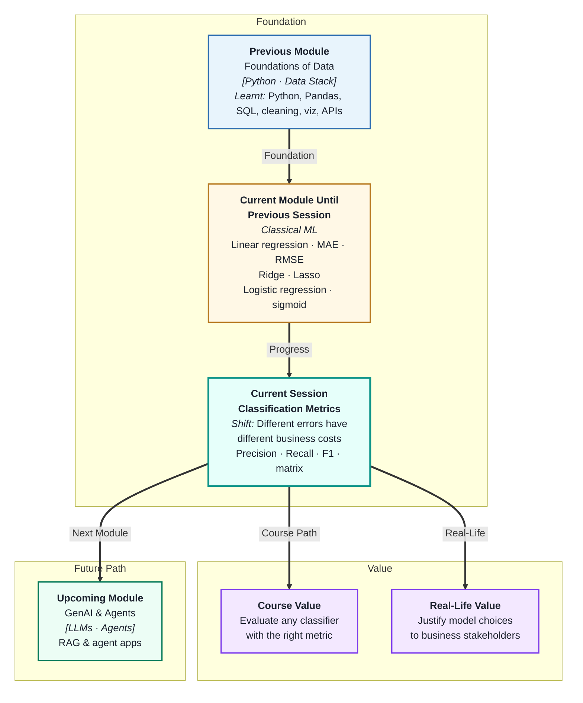
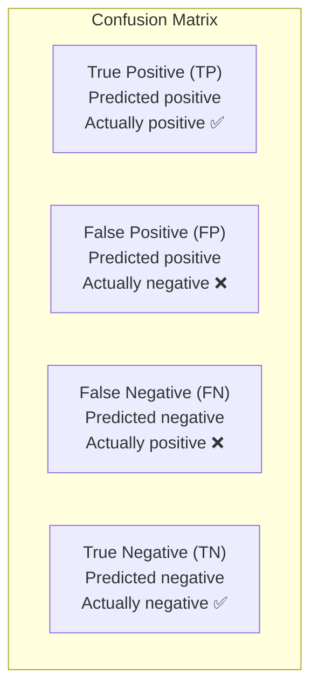
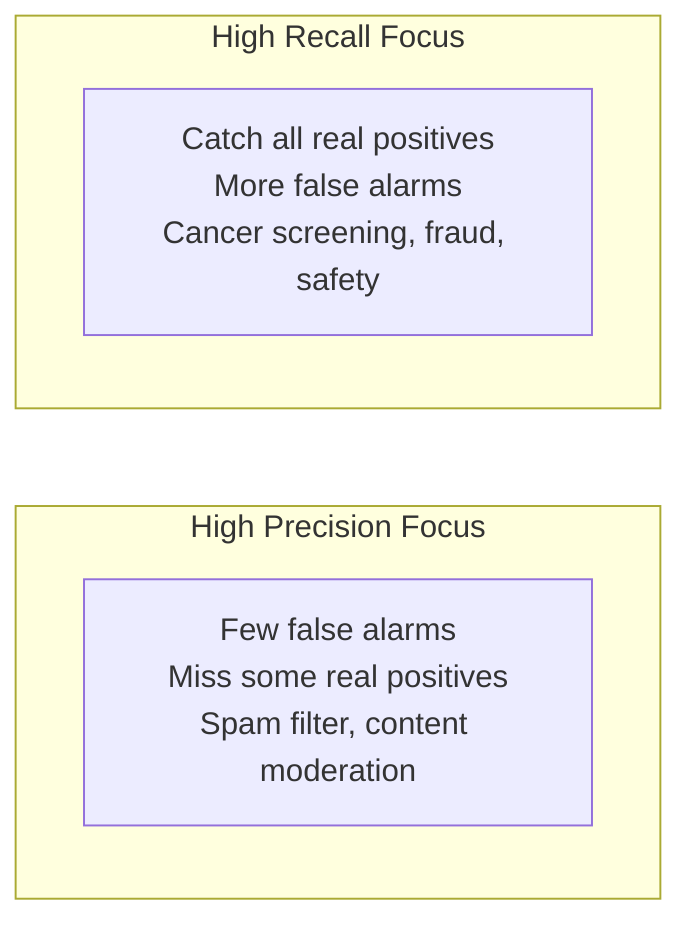
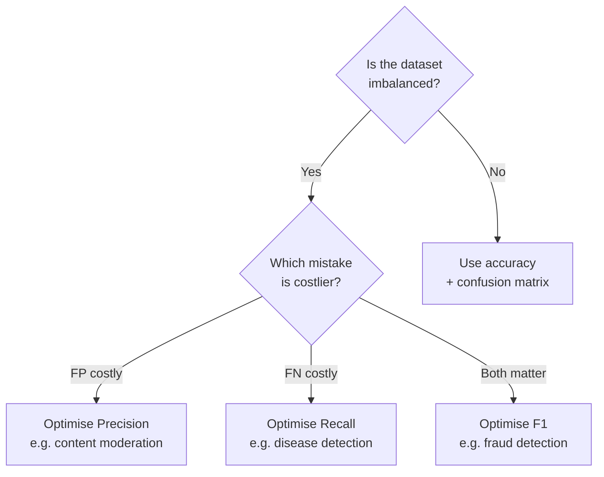

# Classification Metrics and Performance Evaluation
---

## Mental Map



## What You'll Learn

In this pre-read, you'll discover:

- What the **confusion matrix** is and what its four cells mean
- How **accuracy, precision, recall, and F1-score** differ — and when to use each
- Why accuracy alone is dangerously misleading on imbalanced datasets
- How to interpret **metric trade-offs** in terms of business consequences
- How to connect metrics to real decisions a business needs to make

---

## A. The Confusion Matrix — The Full Picture

> 💡 **Analogy:** A security guard is evaluated not just on how many threats they stopped — but also on how many innocent people they stopped by mistake, and how many threats they missed. The **confusion matrix** is that full four-cell report card for a classifier.

**One-line definition:** A **confusion matrix** is a 2×2 table that breaks down a classifier's predictions into four categories based on whether predictions were correct or incorrect for each class.



| Cell | Name | Plain meaning | Example (fraud detection) |
|---|---|---|---|
| TP | True Positive | Correctly predicted positive | Fraud flagged — was fraud |
| TN | True Negative | Correctly predicted negative | Legit transaction — was legit |
| FP | False Positive | Wrongly predicted positive | Legit flagged as fraud |
| FN | False Negative | Wrongly predicted negative | Fraud missed — not flagged |

**The two types of mistakes (FP and FN) have very different costs** depending on the application. This is why you need more than just accuracy to evaluate a classifier.

---

## B. Accuracy — When It Works and When It Lies

> 💡 **Analogy:** A hospital that treats 1,000 patients, 990 of whom are healthy, could have a "99% success rate" by just sending everyone home. That is **accuracy misleading you** on an imbalanced dataset — it rewards doing nothing.

**One-line definition:** **Accuracy** is the percentage of all predictions that are correct — but it is unreliable when one class is much more frequent than the other.

```
Accuracy = (TP + TN) / (TP + TN + FP + FN)
```

| Scenario | Accuracy | Honest assessment |
|---|---|---|
| Balanced classes (50/50) | Reliable metric | Check alongside confusion matrix |
| Imbalanced (95% negative) | Misleading — baseline predicts 95% | Always check precision and recall too |

**The accuracy paradox example:**

Dataset: 950 "no fraud" and 50 "fraud" transactions.
Baseline model: Always predict "no fraud."
Accuracy = 950/1000 = **95%** — excellent looking!
But it catches **zero fraud cases**. Accuracy hid the failure completely.

Always check the confusion matrix before trusting accuracy.

---

## C. Precision and Recall — Measuring the Right Errors

> 💡 **Analogy:** A fish net with large holes (high precision, low recall) only keeps big fish — catches few fish overall but rarely catches unwanted small ones. A net with tiny holes (high recall, low precision) catches almost everything but brings in a lot of trash too. The right net depends on what you are fishing for.

**Precision — "Of the positives I predicted, how many were actually positive?"**

```
Precision = TP / (TP + FP)
```

Use when **false positives are costly** — e.g. flagging innocent customers as fraudsters, blocking legitimate emails as spam.

**Recall — "Of the actual positives, how many did I catch?"**

```
Recall = TP / (TP + FN)
```

Use when **false negatives are costly** — e.g. missing a disease diagnosis, failing to detect a real security threat.



| Application | Priority | Why |
|---|---|---|
| Spam filter | Precision | Missing real emails is very costly |
| Cancer screening | Recall | Missing cancer is life-threatening |
| Fraud detection | Recall | Missing fraud costs the bank money |
| Job application shortlist | Precision | Reviewing bad candidates wastes time |

---

## D. F1-Score — Balancing Precision and Recall

> 💡 **Analogy:** A sports team needs both offensive and defensive skills. A metric that only tracks goals scored (recall) ignores bad defence. One that only tracks clean sheets (precision) ignores bad offence. The **F1-score** is the combined performance rating — it rewards teams that are good at both.

**One-line definition:** The **F1-score** is the harmonic mean of precision and recall — it gives a single number that balances both, and is low if either one is poor.

```
F1 = 2 × (Precision × Recall) / (Precision + Recall)
```

**Why harmonic mean, not average?**

Harmonic mean punishes imbalance more than a simple average. If precision = 0.9 and recall = 0.1:
- Simple average = 0.5 (looks okay)
- F1 = 2 × (0.9 × 0.1) / (0.9 + 0.1) = **0.18** (correctly shows the model is poor)

| Metric | Formula | Use when |
|---|---|---|
| Accuracy | (TP+TN)/(all) | Balanced classes, simple reporting |
| Precision | TP/(TP+FP) | False positives are costly |
| Recall | TP/(TP+FN) | False negatives are costly |
| F1-score | Harmonic(P,R) | Both matter, imbalanced classes |

---

## E. Business Interpretation of Metrics

> 💡 **Analogy:** A financial report uses different numbers for different audiences: revenue for the sales team, cost per acquisition for marketing, net margin for the CFO. **Metric choice** is about speaking the language of the person making the decision — not picking the highest number.

**One-line definition:** **Business interpretation of metrics** means connecting each ML metric to the actual cost or benefit it represents — so model selection serves the organisation's real objectives.

**Translating metrics into business language:**

| ML metric | Business translation | Example |
|---|---|---|
| Precision = 0.85 | "85% of flagged cases actually needed action" | Of 100 fraud alerts sent to the analyst team, 85 were real |
| Recall = 0.72 | "We caught 72% of all real positives" | Of 100 actual frauds, we detected 72 |
| F1 = 0.78 | "Balanced fraud detection performance" | Good at both finding fraud and not wasting analyst time |
| Accuracy = 0.96 | "96% of transactions classified correctly" | Beware: probably misleading on imbalanced data |

**Metric decision framework:**



When presenting results to a non-technical audience, translate the metric into a concrete statement: "Our model catches 7 out of every 10 fraudulent transactions before they are processed" is more actionable than "Recall = 0.70."

---

## Practice Exercises

**1. Pattern Recognition**  
A fraud model produces this confusion matrix: TP=45, FP=15, FN=5, TN=935. Calculate accuracy, precision, recall, and F1. Then explain which number a fraud analyst would care about most, and why the 98% accuracy is not a useful headline for this application.

**2. Concept Detective**  
Model A: Precision=0.95, Recall=0.30. Model B: Precision=0.60, Recall=0.90. A hospital is choosing a model to flag patients for a follow-up cancer screening. Using section C, explain which model to choose, what each model's mistake pattern looks like, and what the medical cost of each type of mistake is.

**3. Real-Life Application**  
For each of the following applications, state which metric (precision, recall, or F1) is the primary target and explain the business consequence of getting it wrong: (a) automated loan rejection, (b) smoke detector in a data centre, (c) product recommendation engine, (d) airport security screening.

**4. Spot the Error**  
A data scientist builds a churn prediction model on a dataset where 5% of customers actually churn. Their model achieves 95.2% accuracy and they declare it production-ready. A product manager asks: "How many churning customers does it actually catch?" The data scientist realises they never checked this. What should they do first, and what is the likely answer about the model's recall?

**5. Planning Ahead**  
You are building a credit card fraud model. Design the evaluation plan: which metrics you would compute, which you would use to compare two candidate models, what value of recall you would set as a minimum threshold before considering a model acceptable, how you would explain the chosen model's performance to the risk team (in non-technical language), and what the consequence is if you accidentally optimise for precision instead of recall.

---

> ✅ **You're done!** You can now read a confusion matrix fluently and choose the right metric for the right problem — precision when false alarms are costly, recall when misses are dangerous, and F1 when both matter. Next: **Model Validation and Data Issues**, where you will learn to make your metric estimates trustworthy using cross-validation and handle the silent killers — data leakage and class imbalance.
