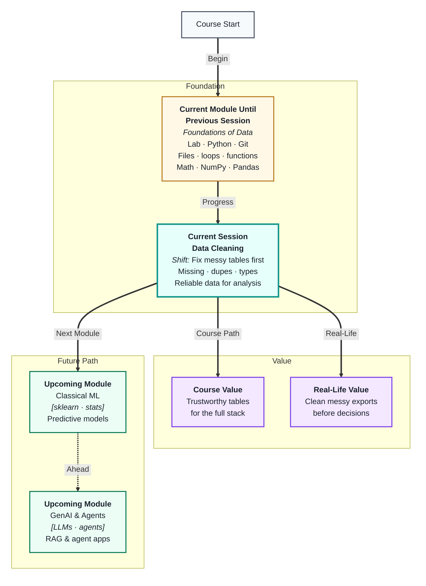
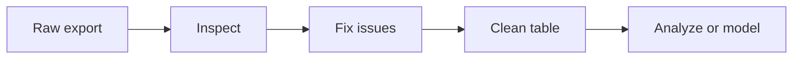
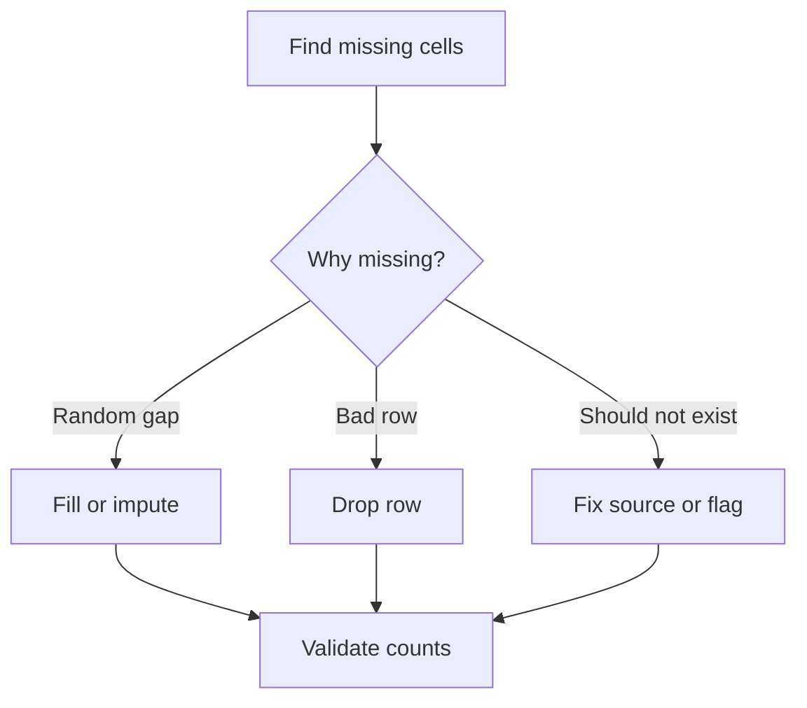
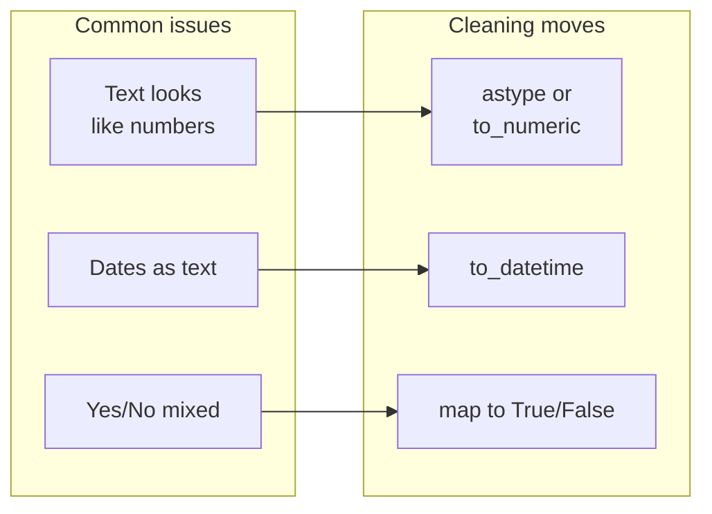

# Data Cleaning & Preparation
---

## Mental Map



## What You'll Learn

In this pre-read, you'll discover:

- Why real-world data is rarely ready to analyze on day one
- How to spot and handle **missing values** without breaking your dataset
- How to find and fix **duplicates** and inconsistent rows
- How to check **data types** and formats so columns behave correctly
- How to follow a simple, repeatable **cleaning workflow** before SQL, charts, or models

---

## A. Why Dirty Data Breaks Good Analysis

> 💡 **Analogy:** Imagine baking with a recipe, but someone swapped salt for sugar in the jar. Your cake might look fine until you taste it. **Dirty data** is like wrong ingredients in a spreadsheet—you cannot trust the result until you fix the inputs.

**One-line definition:** **Data cleaning** is the process of finding and fixing errors in a dataset so your analysis and models are based on trustworthy facts.



Most files you download from the web, HR systems, or sales tools arrive with problems:

- Blank cells where a value should be
- The same customer listed twice
- Ages stored as text like `"25 years"`
- Dates in three different formats

If you skip cleaning, your averages lie, your charts mislead, and your models learn noise instead of patterns. In this course you already load tables with **Pandas**—cleaning is what you do *right after* you read a file and *before* you query, plot, or train.

| Symptom in a report | Often caused by |
|---|---|
| Average salary looks too low | Missing values treated as zero |
| Top city appears twice | Duplicate rows not removed |
| Chart shows one giant bar | Wrong column type (text vs number) |
| Trend line jumps wildly | Outliers or mixed date formats |

**Key idea:** Cleaning is not “extra work.” It is the step that makes every later step honest.

---

## B. Missing Values — Gaps in Your Table

> 💡 **Analogy:** A attendance sheet with empty boxes is like a bus route with missing stops—you need to decide whether the person was absent, the teacher forgot to mark them, or the page got torn.

**One-line definition:** A **missing value** is a blank or unknown entry in your data, often shown as `NaN` (Not a Number) in Pandas.



**Ways to spot missing data in Pandas:**

- `df.isna().sum()` — counts blanks per column
- `df.info()` — shows non-null counts and dtypes

**Common strategies:**

| Strategy | When it fits | Risk |
|---|---|---|
| Drop rows | Few missing rows; row is useless without value | You lose records |
| Drop column | Almost entire column is empty | You lose a feature |
| Fill with median/mode | Numeric or category gaps for analysis | You hide real uncertainty |
| Fill with a label like `"Unknown"` | Categories where blank means “not provided” | Model may treat label as real |

There is no single “best” choice. You decide based on *how many* values are missing and *what the column means* (salary vs optional nickname).

**Rule of thumb:** Never fill missing values without looking at the column first. A blank age and a blank “middle name” mean very different things.

---

## C. Duplicates and Repeated Records

> 💡 **Analogy:** Scanning the same grocery receipt twice at self-checkout doubles your total. **Duplicate rows** do the same to counts, sums, and rankings in data.

**One-line definition:** A **duplicate** is a row (or key combination) that appears more than once when it should be unique.

Duplicates often happen when:

- Someone merges two spreadsheets without checking IDs
- A form is submitted twice
- Export tools repeat header rows as data

**In Pandas:**

- `df.duplicated()` — flags repeated rows
- `df.drop_duplicates()` — keeps one copy

| Duplicate type | Example | Typical fix |
|---|---|---|
| Exact copy | Same ID, name, date twice | `drop_duplicates()` |
| Same ID, different details | Two addresses for one user | Keep latest or merge by rules |
| Header row repeated | Column names as a data row | Delete those rows manually |

Always define what “unique” means for *your* problem. One order line per product might be correct, but two lines for the same product ID on the same day might be a mistake.

---

## D. Types, Formats, and Consistency

> 💡 **Analogy:** Your phone contacts app expects a number for “call,” not the word “five-five-five.” If one column mixes numbers and words, the app cannot sort or dial correctly. Data **types** work the same way.

**One-line definition:** A **data type** tells the computer how to store and calculate a column—numbers, text, dates, or true/false values.



**Checks worth running early:**

- `df.dtypes` — see how Pandas labeled each column
- `df['price'].astype(float)` — convert when safe
- `pd.to_datetime(df['order_date'])` — unify date formats

| Column role | Ideal type | Red flag |
|---|---|---|
| Age, price, score | Numeric | Letters inside cells |
| Order date | Datetime | `01/02/2023` vs `2023-02-01` mixed |
| City, product name | Text (object/string) | Numbers stored as categories by mistake |
| Is_active | Boolean | `yes`, `Y`, `1`, `true` all mixed |

**Consistency** also means the same label spelled the same way: `Mumbai`, `mumbai`, and `MUMBAI` look like three cities to a computer. Trimming spaces (`str.strip()`) and standardizing case (`str.lower()`) are small fixes with big impact.

---

## E. A Step-by-Step Cleaning Workflow in Pandas

> 💡 **Analogy:** Cleaning your room before guests arrive works best with a checklist: trash first, then surfaces, then floor. A **workflow** stops you from fixing random corners while missing the big mess.

**One-line definition:** A **cleaning workflow** is a repeatable order of steps you apply to every new dataset so nothing important is skipped.

**Suggested order:**

1. **Load and preview** — `head()`, `shape`, `info()`
2. **Profile problems** — missing counts, duplicates, dtypes
3. **Fix structure** — rename columns, drop junk rows
4. **Fix content** — missing values, duplicates, types, text consistency
5. **Validate** — row counts, min/max sanity checks, spot-check samples
6. **Save or pass on** — clean CSV or DataFrame for SQL / EDA / ML

| Step | Question you answer | Tool hint |
|---|---|---|
| Preview | What columns exist? | `head()`, `columns` |
| Profile | What is broken? | `isna().sum()`, `duplicated().sum()` |
| Fix | What rule applies? | `fillna`, `drop_duplicates`, `astype` |
| Validate | Does it still make sense? | `describe()`, business rules |

Pseudo-code for the mental model (not full syntax):

```
load table
report missing and duplicates
fix types and text
apply missing/duplicate rules
assert row count and key columns OK
export clean_table
```

After this session, you will connect cleaning to **query thinking**, **SQL**, and **exploratory charts**—all of them assume the table you feed them is trustworthy.

---

## Practice Exercises

**1. Pattern Recognition**  
You open a customer CSV. Column `signup_date` shows `2024-01-05`, `Jan 5, 2024`, and `05/01/24` in different rows. `age` shows `30`, `thirty`, and blank cells. List which cleaning topics from this pre-read (missing values, duplicates, types, workflow) apply to each problem.

**2. Concept Detective**  
A teammate says: “Our average order value dropped 40% after we cleaned the data, so cleaning must be wrong.” The only change they made was replacing all missing `order_total` values with `0`. What likely went wrong, and what would you check first?

**3. Real-Life Application**  
Name three situations outside class where messy data would cause a bad decision (for example: school marks, sports stats, or a personal budget). For each, name one cleaning action you would take before trusting a summary.

**4. Spot the Error**  
A script runs `df.drop_duplicates()` on a sales table, then reports “no duplicates left.” Later, you find two rows with the same `order_id` but different `shipping_address` values. Why might `drop_duplicates()` miss this, and what should define “duplicate” for orders?

**5. Planning Ahead**  
You receive a new employee dataset with columns: `emp_id`, `department`, `salary`, `join_date`, `manager_email`. Sketch a short cleaning plan (5–7 bullet steps) in the order you would run them. Say what you would check after each major step.

---

> ✅ **You're done!** You now see data cleaning as the bridge between raw exports and trustworthy analysis. Clean tables protect every chart, query, and model that follows. In upcoming sessions you will query cleaner data across tools, deepen Pandas and SQL skills, and tell clearer stories with exploration and visuals—starting from tables you can believe in.
