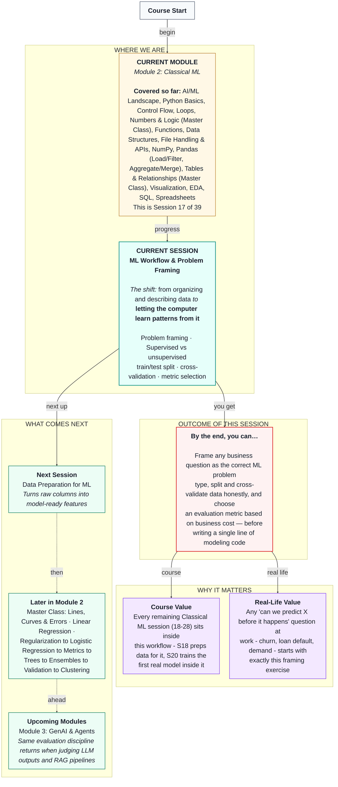

# Mental Map — ML Workflow & Problem Framing
> Academic Session 17 · Module 2: Classical ML

```mermaid
%%{init: {'themeVariables': {'fontSize': '32px', 'fontFamily': 'sans-serif'}, 'flowchart': {'htmlLabels': true, 'nodeSpacing': 50, 'rankSpacing': 80, 'wrappingWidth': 400, 'padding': 20}}}%%
flowchart TB

START["<b>Course Start</b>"]

subgraph foundation[" WHERE WE ARE "]
direction TB
    CURMOD["<b>CURRENT MODULE</b><br/><i>Module 2: Classical ML</i><br/>&nbsp;<br/><b>Covered so far:</b> AI/ML Landscape, Python Basics, Control Flow, Loops, Numbers &amp; Logic (Master Class), Functions, Data Structures, File Handling &amp; APIs, NumPy, Pandas (Load/Filter, Aggregate/Merge), Tables &amp; Relationships (Master Class), Visualization, EDA, SQL, Spreadsheets<br/>This is Session 17 of 39"]
    CURSES["<b>CURRENT SESSION</b><br/><b>ML Workflow &amp; Problem Framing</b><br/>&nbsp;<br/><i>The shift:</i> from organizing and describing data <i>to</i> <b>letting the computer learn patterns from it</b><br/>&nbsp;<br/>Problem framing · Supervised vs unsupervised<br/>train/test split · cross-validation · metric selection"]
end

subgraph outcome[" OUTCOME OF THIS SESSION "]
direction TB
    OUT["<b>By the end, you can…</b><br/>&nbsp;<br/>Frame any business question as the correct ML problem<br/>type, split and cross-validate data honestly, and choose<br/>an evaluation metric based on business cost — before<br/>writing a single line of modeling code"]
end

subgraph value[" WHY IT MATTERS "]
direction TB
    CVAL["<b>Course Value</b><br/>Every remaining Classical ML session (18-28) sits inside<br/>this workflow - S18 preps data for it, S20 trains the<br/>first real model inside it"]
    RVAL["<b>Real-Life Value</b><br/>Any 'can we predict X before it happens' question at<br/>work - churn, loan default, demand - starts with<br/>exactly this framing exercise"]
end

subgraph future[" WHAT COMES NEXT "]
direction TB
    U0["<b>Next Session</b><br/>Data Preparation for ML<br/><i>Turns raw columns into model-ready features</i>"]
    U1["<b>Later in Module 2</b><br/>Master Class: Lines, Curves &amp; Errors · Linear Regression ·<br/>Regularization to Logistic Regression to Metrics to<br/>Trees to Ensembles to Validation to Clustering"]
    U2["<b>Upcoming Modules</b><br/>Module 3: GenAI &amp; Agents<br/><i>Same evaluation discipline returns when judging LLM<br/>outputs and RAG pipelines</i>"]
end

START ==>|" begin "| CURMOD
CURMOD ==>|" progress "| CURSES
CURSES ==>|" you get "| OUT
OUT ==>|" course "| CVAL
OUT ==>|" real life "| RVAL
CURSES ==>|" next up "| U0
U0 -.->|" then "| U1
U1 -.->|" ahead "| U2

classDef startBox fill:#F7FAFC,stroke:#4A5568,stroke-width:2px,color:#1A202C
classDef curModBox fill:#FFF8E6,stroke:#B7791F,stroke-width:2px,color:#1A202C
classDef curSessBox fill:#E6FFFA,stroke:#0D9488,stroke-width:3px,color:#1A202C
classDef outBox fill:#FEF2F2,stroke:#DC2626,stroke-width:3px,color:#1A202C
classDef valueBox fill:#F3E8FF,stroke:#7C3AED,stroke-width:2px,color:#1A202C
classDef futureBox fill:#ECFDF5,stroke:#047857,stroke-width:2px,color:#1A202C

class START startBox
class CURMOD curModBox
class CURSES curSessBox
class OUT outBox
class CVAL,RVAL valueBox
class U0,U1,U2 futureBox

linkStyle default stroke-width:2px
```
