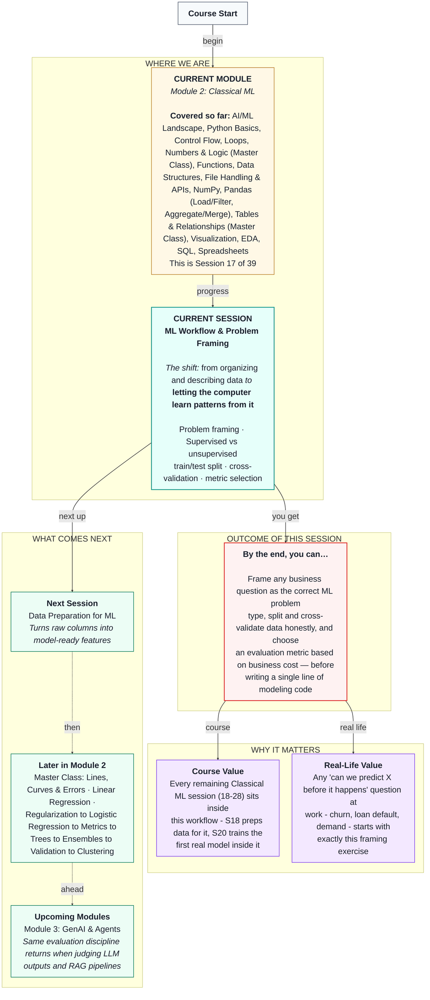

# Machine Learning: ML Workflow & Problem Framing
> **Pre-Read — Academic Session 17** | Module 2: Classical ML
---
## Mental Map
> 📄 Also provided as a printable PDF in this folder: **mental-map: ML Workflow & Problem Framing.pdf**



---

## What You'll Learn

In this pre-read, you'll discover:
- How to turn a vague business question into a precise ML problem type
- The real difference between supervised and unsupervised learning
- Why testing a model on its own training data is a trap — and how `train_test_split` avoids it
- Why one lucky (or unlucky) split isn't enough, and how `cross_val_score` fixes that
- Why "which metric should I use" is a business question, not a technical default

---

## A. From Business Question to ML Problem Type

**💡 Analogy:** Imagine you run the ops desk for a Swiggy delivery hub. Every month, some delivery partners quietly stop taking orders and leave. Replacing one costs money and slows down deliveries in that whole neighborhood for weeks. Your manager walks over and says: *"Can we figure out who's going to leave before they leave?"*

That sentence is a **business question**. It is not yet something a computer can work with. Your first job in any ML project is translating it into an **ML problem type** — one of three boxes.

**A business question always maps to one of three ML problem types, and getting the box wrong ruins everything downstream.**

| Business question | ML problem type | Why |
|---|---|---|
| "Will this partner churn next month?" | **Classification** | The outcome is a category: churn or no churn |
| "How many orders will this partner complete next month?" | **Regression** | The outcome is a number |
| "Are there natural groups of partner behavior we don't already know about?" | **Clustering** | There's no known outcome — we're looking for structure |

**Worked example:** Our Swiggy manager's question — "will this partner churn" — has exactly two possible answers (yes/no). That's a category, not a number, and we already have historical partners who did or didn't churn. So this is **classification**.

**⚠️ Common trap:** Students often jump straight to writing code before deciding which box the problem belongs in. If you skip this step, you might build a regression model for a problem that actually needed classification — and no amount of clever code fixes a wrongly framed problem.


---

## B. Supervised vs. Unsupervised Learning

**💡 Analogy:** A kirana shop owner has kept a credit ledger for three years. Looking back, she already **knows** exactly which customers eventually stopped paying on time. That history — a known outcome attached to every past case — is a **label**. Training a model on data that already has labels is **supervised learning**.

Now imagine instead she wants to group her regular customers into natural "types" of shoppers — without deciding in advance what the groups should be. There's no known correct answer sitting in her ledger for this. That's **unsupervised learning**.

**Supervised learning:** Learning from historical data where the outcome is already known.
**Unsupervised learning:** Finding structure in data with no known outcome to check against.

| Scenario | Supervised or Unsupervised? | Why |
|---|---|---|
| Predicting HDFC loan default | Supervised | Historical loans already show who defaulted |
| Grouping Zomato restaurants by cuisine + review patterns, no predefined categories | Unsupervised | No ground-truth "correct group" exists |
| Forecasting next month's Ola ride demand | Supervised | Past demand numbers are the label |
| Flagging unusual transactions with no prior fraud labels | Unsupervised | Nothing tells us in advance what "unusual" means |

**⚠️ Common trap:** Students sometimes think "grouping" always means clustering. But grouping customers into *known* categories (e.g., "will renew" vs. "won't renew," based on past renewal history) is still supervised — the label already exists. Clustering is specifically for when **no such label exists at all**.

**Quick check:** Is "segmenting customers by spending behavior for a marketing campaign, with no predefined segments" supervised or unsupervised? *(It's unsupervised — there's no ground-truth "correct segment" in the data to learn from.)*

---

## C. Why We Can't Grade Our Own Homework: Train/Test Split

**💡 Analogy:** Picture a student who memorizes the exact answer key from last year's exam instead of actually understanding the subject. Give them that same exam again, and they'll score perfectly. Give them a new exam covering the same topics with different questions, and they'll struggle. Memorization looks exactly like real learning — until the questions change.

A model evaluated only on the data it trained on suffers from this same illusion. It can "memorize" patterns specific to that data (including noise) rather than learning something that generalizes.

**Train/test split** is how we protect against this: we hold back a portion of our data, train the model only on the rest, and check performance only on the part it has never seen.

```python
from sklearn.model_selection import train_test_split

X_train, X_test, y_train, y_test = train_test_split(
    X, y, test_size=0.2, random_state=42
)
```

**Worked example:** Say we have 200 Swiggy delivery partners in our dataset. With `test_size=0.2`, 160 partners go into training and 40 are locked away purely for honest evaluation — like a manager keeping last month's outcomes completely sealed until it's time to check the model's predictions.

`random_state=42` simply makes the split reproducible — rerunning the code produces the exact same split every time, which matters when you want to fairly compare two different approaches later.

**⚠️ Common trap:** There's no single "correct" split ratio. 80/20 is common, but the real trade-off is: more training data usually means a better-learned model, while more test data means a more trustworthy evaluation. You can't maximize both at once.

---

## D. One Split Isn't Always Enough: Cross-Validation

**💡 Analogy:** A cricket selector wouldn't judge a batter's true form from a single innings — a great or terrible score that day could just be luck, or the pitch, or the bowling attack. Judging form across five different innings, in different conditions, gives a far more trustworthy read.

A single train/test split has the same weakness: by chance, your test set might be unusually easy or unusually hard, giving you a misleading performance number.

**Cross-validation** repeats the train/test process multiple times — each time holding out a different "fold" of the data — and averages the results into one reliable number.

```python
from sklearn.model_selection import cross_val_score

scores = cross_val_score(model, X, y, cv=5)
```

**Worked example:** With `cv=5`, our 200 partners are split into 5 equal chunks of 40. The model trains on 4 chunks and tests on the 1 held-out chunk — five times total, rotating which chunk is held out — producing five scores that get averaged into a single, more trustworthy estimate.


---

## E. Choosing the Right Metric Is a Business Decision

**💡 Analogy:** Back to our Swiggy churn problem. If the model wrongly says a partner **won't** churn, but they actually do (a **false negative**), we lose them with zero chance to step in. If the model wrongly says a partner **will** churn, but they actually stay (a **false positive**), we waste a retention offer on someone who was never leaving.

Neither mistake is free — and which one costs Swiggy more determines which metric the team should actually optimize for. This is a judgment call about the business, not a technical default you can look up.

**⚠️ Common trap:** Many beginners default to "accuracy" for every problem because it's the most familiar metric. But accuracy can be dangerously misleading — especially when one outcome (like "didn't churn") is far more common than the other. We'll build a concrete example of exactly this trap in Session 23.

For today, the goal is simply this: **before you compute any metric, ask which mistake is more expensive to the business.**

---

## Quick Reference — Choosing Your ML Problem Type

| Your situation | Use this | Because |
|---|---|---|
| You know the outcome for past cases, and it's a category | Classification | Labels exist and the target is discrete |
| You know the outcome for past cases, and it's a number | Regression | Labels exist and the target is continuous |
| You have no known outcome and want to find natural groups | Clustering | No labels exist to supervise against |
| You want an honest read of model performance | `train_test_split` + `cross_val_score` | Prevents testing on memorized data and reduces luck from a single split |
| You're deciding how to measure "good" | Ask which mistake costs the business more | Metric choice follows business cost, not habit |

---

## Practice Exercises

1. **Concept Detective** — An HDFC analytics team wants to predict whether a loan applicant will default. They already have five years of past applications with recorded outcomes (defaulted / didn't default). Is this classification, regression, or clustering? Is it supervised or unsupervised? Justify both answers.

2. **Real-Life Application** — List three situations in your own life, college, or work where you'd need to decide between classification, regression, and clustering before doing anything else. For each, name the problem type and why.

3. **Spot the Error** — A classmate builds a model, evaluates it *only* on the exact data it was trained on, and reports 99% accuracy to their manager as proof the model works. What's wrong with this claim, and what should they have done instead?

4. **Pattern Recognition** — A friend cross-validates a churn model with `cv=5` and gets scores of [0.91, 0.90, 0.92, 0.10, 0.91]. What might that one unusually low score (0.10) suggest about that particular fold of the data?

5. **Planning Ahead** — Ola wants to predict ride demand by city for the next hour, to reposition drivers. Frame this as an ML problem type, decide if it's supervised or unsupervised, and describe one business cost of a false negative versus a false positive in this scenario.

---

> ✅ **You're done!** You can now translate a business question into the correct ML problem type, explain why honest evaluation requires holding out data, and recognize that the "right" metric depends on what mistake actually costs your business the most.
>
> Next up: **Session 18 — Data Preparation for ML**, where we turn raw columns into features a model can actually consume.
