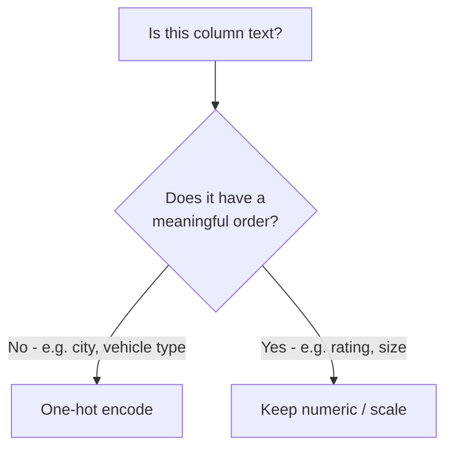

# Lecture Script: Machine Learning — Data Preparation for ML
> **Instructor Reference** — Module 2: Classical ML | Academic Session 18 | Duration: 2 Hours | Instructor: Aswath Rao

---

## Session Overview
**Goal:** By the end of this session, students can identify which preprocessing a raw column needs, build a `ColumnTransformer` + `Pipeline` that correctly encodes and scales mixed data, and explain how to structure preprocessing so it never leaks test-set information into training.

**Student profile at this point:** Comfortable with Pandas DataFrames and comfortable, after Session 17, with the idea of train/test splits and honest evaluation. They have **never** transformed raw columns into model-ready numeric form. Likely wrong assumption: several will think you can just assign numbers to categories (Bike=1, Scooter=2) and move on. Boredom risk: moderate — this session has real new syntax (`Pipeline`, `ColumnTransformer`), which helps engagement, but the leakage concept can feel abstract without a concrete "gotcha" moment.

**Key outcome:** Students should leave with an instinctive check: "did I fit this transformation on the whole dataset, or only on training data?" before trusting any preprocessing step.

> 🎯 **The one sentence this session must land:** *A model can only be as honest as the preprocessing that feeds it — and preprocessing must be split-aware, or your evaluation numbers are quietly lying to you.*

---

## Timing Breakdown

| Segment | Duration | Cumulative |
|---|---|---|
| Opening — "The Ingredient Problem" | 8 min | 8 min |
| Concept Block 1: Why Raw Data Isn't Model-Ready | 10 min | 18 min |
| Practical Block 1: Spot the Raw-Data Problems | 8 min | 26 min |
| Concept Block 2: Encoding Categorical Features | 12 min | 38 min |
| Practical Block 2: One-Hot Encode By Hand | 8 min | 46 min |
| **BREAK** | 10 min | 56 min |
| Concept Block 3: Scaling Numeric Features | 10 min | 66 min |
| Practical Block 3: Why Scale Changes Distance-Based Results | 6 min | 72 min |
| Concept Block 4: Pipeline and ColumnTransformer | 12 min | 84 min |
| Practical Block 4: Live Coding Demo (TA Code) | 12 min | 96 min |
| Concept Block 5: Data Leakage | 12 min | 108 min |
| Practical Block 5: Spot the Leak | 6 min | 114 min |
| Summary & Bridge | 3 min | 117 min |
| Q&A & Doubt Solving | 3 min | 120 min |

---

## Opening — "The Ingredient Problem" (8 min)

Open with this, verbatim-ish:

> "Picture a recipe that lists some ingredients in cups, some in grams, and one in 'a pinch' — with no conversion given anywhere. You literally cannot cook this dish until everything is measured the same way. Today, our Swiggy delivery-partner dataset has the exact same problem: some columns are text — city names, vehicle types — and some are numbers on wildly different scales. A model can't learn from any of it until everything speaks the same numeric language."

Pause. Ask the room:

> "Last session we decided *what kind* of problem we're solving and how we'll prove our answer is honest. Before any model, though — what do you think happens if we just feed it a column that says 'Hyderabad,' 'Pune,' 'Chennai' directly?"

(Let a couple of guesses land — someone usually says "it'll error out" or "it'll just ignore it.")

> "Right — it can't do math on words. Today we fix that, properly, and we do it in a way that protects the honest-evaluation habit we just built in Session 17."

**Pivot line:** "This session has almost no conceptual surprises left in it — it's mostly mechanics. But get the mechanics wrong here, even slightly, and every model you build for the rest of this module will be quietly compromised."

**Context for sessions ahead:** "Everything from Session 20 onward assumes your data walked in the door already prepared. This is the session where that preparation habit gets built once, correctly, so you never have to think about it again."

---

## Concept Block 1: Why Raw Data Isn't Model-Ready (10 min)

> "Let's look at our partner dataset with two new raw columns added: `city` and `vehicle_type`. Both are text. A model — any model — needs numbers in, numbers out. So step one, always: look at every column and ask, is this already numeric, or does it need converting?"

Write on the board:

| Column | Current form | Model-ready? |
|---|---|---|
| `orders_last_30_days` | Number | Yes, as-is (may still need scaling) |
| `avg_rating` | Number | Yes, as-is (may still need scaling) |
| `city` | Text | No — needs encoding |
| `vehicle_type` | Text | No — needs encoding |

### 🔴 The trap / highest-value moment
> "The tempting shortcut here is: just assign Bike=1, Scooter=2, Bicycle=3, done. Don't. That silently tells the model Bicycle is 'three times' Bike — which is meaningless nonsense the model will still try to learn from. Write this down: *never assign arbitrary numbers to unordered categories.*"

---

## Practical Block 1: Spot the Raw-Data Problems (8 min)

Show a small raw table on screen (5 rows: `partner_id`, `city`, `vehicle_type`, `orders_last_30_days`, `avg_rating`). Ask students, in pairs, to list every column that needs conversion before modeling and why. Cold-call 2 pairs.

**Answer key reasoning to say aloud:** `city` and `vehicle_type` both need encoding because they're unordered text categories. `orders_last_30_days` and `avg_rating` are already numeric but sit on very different ranges (0–60 vs. 3.0–5.0) — flag this now, we'll fix it in Concept Block 3.

---

## Concept Block 2: Encoding Categorical Features (12 min)

> "Think about a kirana shop's ledger tracking payment method: Cash, UPI, or Card. You can't do arithmetic on the word 'UPI.' Instead, imagine three separate checkmark columns — Paid by Cash? Paid by UPI? Paid by Card? — exactly one checked per row. That's one-hot encoding."

Draw the table on the board:

| `vehicle_type` | `vehicle_Bike` | `vehicle_Scooter` | `vehicle_Bicycle` |
|---|---|---|---|
| Bike | 1 | 0 | 0 |
| Scooter | 0 | 1 | 0 |

> "In sklearn, this is `OneHotEncoder`. Every unordered category becomes its own yes/no column."

### 🔴 The trap / highest-value moment
> "Don't one-hot encode a column that's already meaningfully ordered — like a 1-to-5 star rating. One-hot encoding is specifically for categories with **no** inherent order. An ordered numeric column should stay numeric, possibly scaled, but never one-hot encoded. Write this down: *one-hot encoding is for unordered categories only.*"



---

## Practical Block 2: One-Hot Encode By Hand (8 min)

Give students a small list of 6 partners with a `city` column (Hyderabad, Pune, Chennai — 2 each). Have them hand-draw the one-hot encoded table on paper or in their notebook, 3 minutes, then cold-call one student to fill it on the board.

💬 Expect a question: "what if a new city shows up later that we've never seen?" Welcome it. Say: "Great instinct — that's a real production concern. `OneHotEncoder` has a `handle_unknown` setting for exactly this, but we won't need it for today's fixed dataset."

---

## Concept Block 3: Scaling Numeric Features (10 min)

> "Comparing a batter's runs scored — often 0 to 150-plus — directly against strike rate — typically 50 to 200 — without adjustment lets whichever number happens to be bigger dominate, even if that's not the more meaningful stat. Many ML algorithms have this exact blind spot."

> "In our data, `orders_last_30_days` ranges roughly 0 to 60, while `avg_rating` ranges only 3.0 to 5.0. Without scaling, the order count's much bigger numbers could silently dominate the rating's influence in some models."

Write:

```python
from sklearn.preprocessing import StandardScaler
```

> "`StandardScaler` rescales each numeric column to mean 0, standard deviation 1 — same standard deviation concept from Session 12's Master Class, just applied here as a preprocessing tool."

### 🔴 The trap / highest-value moment
> "Not every model needs this — tree-based models in Sessions 25 and 26 don't care about scale at all. But it's a safe, cheap habit to build now, and it's required for the linear models coming in Sessions 20 and 22. Write this down: *when in doubt, scale — it rarely hurts and often matters a lot.*"

---

## Practical Block 3: Why Scale Changes Distance-Based Results (6 min)

Quick board demo: show two partners with `orders_last_30_days` of 10 and 50, and `avg_rating` of 4.9 and 4.0. Ask: "which partner is 'more similar' to a third partner with orders=12, rating=3.5, using raw numbers?" Students will find the order-count difference dominates the comparison. Then ask: "does that feel right, given rating might matter just as much?" This makes the scaling motivation concrete before moving on.

---

## Concept Block 4: Pipeline and ColumnTransformer (12 min)

> "Picture a Swiggy kitchen partner's prep line: every dish goes through the same stations — wash, chop, cook, plate — in the same order, every shift, no matter who's working. `Pipeline` is that same discipline applied to preprocessing."

> "But we have two different jobs here — encode the categorical columns, scale the numeric ones. `ColumnTransformer` routes each column to the right treatment."

Write the code on the board, building it up line by line:

```python
from sklearn.compose import ColumnTransformer
from sklearn.pipeline import Pipeline
from sklearn.preprocessing import OneHotEncoder, StandardScaler

preprocessor = ColumnTransformer(transformers=[
    ("categorical", OneHotEncoder(), ["city', 'vehicle_type"]),
    ("numeric", StandardScaler(), ["orders_last_30_days', 'avg_rating', 'months_active"]),
])

pipeline = Pipeline(steps=[
    ("preprocessing", preprocessor),
])
```

> "From Session 20 onward, we literally add one more step to this same `pipeline` object — the model itself. Today we're building the exact skeleton every future model plugs into."

### 🔴 The trap / highest-value moment
> "Any column you forget to list in the `ColumnTransformer` gets silently dropped from the output. No error, no warning — it just vanishes. Write this down: *every raw column needs an explicit destination, or it disappears.*"

---

## Practical Block 4: Live Coding Demo (TA Code) (12 min)

**Handoff line (must match TA code file's opening comment):** "Let's actually build this pipeline in code — same Swiggy partner dataset, now with the city and vehicle type columns added."

Hand off to `ta-code - Session 18 - Data Preparation for ML.py`, narrating each `# --- EXPLAIN ---` block aloud:

1. Extend the Session 17 synthetic dataset with `city` and `vehicle_type` columns
2. Split first with `train_test_split` (reused from Session 17) — emphasize aloud: "notice we split *before* touching any preprocessing — that's not an accident, that's the whole point of today's closing concept"
3. Build the `ColumnTransformer` + `Pipeline`
4. `fit_transform` on train, `transform` (not fit again) on test — pause here and ask the room why we don't call `fit` again on test
5. Show the resulting numeric array shape on screen so students see the raw text columns have become numbers

💬 Expect a question: "why does the pipeline output have more columns than we started with?" Welcome it. Say: "One-hot encoding expands each category into its own column — 3 cities plus 3 vehicle types adds several new columns. That's expected and correct."

---

## Concept Block 5: Data Leakage (12 min)

> "Imagine studying for an exam, but the answer key accidentally slipped into your practice materials beforehand. Your practice score looks outstanding — and tells you nothing real about the actual exam. Data leakage is the ML version: information from data the model should never have seen quietly shapes training anyway."

Write the mistake on the board explicitly:

```python
# THE MISTAKE - do not do this:
scaler.fit(X)  # fit on the FULL dataset, before splitting
X_train, X_test = train_test_split(X)  # too late - leakage already happened
```

> "By the time you split, the scaler's mean and standard deviation already 'know' about the test set. Your test evaluation is no longer honest."

Write the fix:

```python
# THE FIX:
X_train, X_test = train_test_split(X)   # split FIRST
scaler.fit(X_train)                      # fit ONLY on train
X_train_scaled = scaler.transform(X_train)
X_test_scaled = scaler.transform(X_test) # transform only, never re-fit
```

### 🔴 The trap / highest-value moment
> "This exact mistake — scaling the whole dataset before splitting — is one of the single most common real-world ML errors, and it silently makes your results look better than they actually are. Write this down: *split first, fit only on train, transform everywhere else.* A `Pipeline` makes this automatic once built correctly, which is exactly why we build one."

---

## Practical Block 5: Spot the Leak (6 min)

Show 3 short code snippets on screen, some leaky, some clean. Have students vote thumbs up/down for "leak-free" on each, then reveal answers with reasoning:

1. `scaler.fit(X_train)` then `scaler.transform(X_test)` → **Clean**
2. `scaler.fit(X)` on full data, then split → **Leaky**
3. `pipeline.fit(X_train, y_train)` then `pipeline.transform(X_test)` → **Clean** (the pipeline encapsulates the correct order automatically)

---

## Summary & Bridge (3 min)

| Concept | The one thing to remember |
|---|---|
| Raw data | Every column needs an explicit plan: encode, scale, or leave as-is |
| Encoding | One-hot encode unordered categories only — never assign arbitrary numbers |
| Scaling | Puts numeric features on comparable ranges so none dominates by size alone |
| Pipeline + ColumnTransformer | Locks preprocessing into one repeatable, correctly-ordered object |
| Data leakage | Always split first, fit only on train, transform everywhere else |

Close on the thesis line: "A model can only be as honest as the preprocessing that feeds it — and preprocessing must be split-aware, or your evaluation numbers are quietly lying to you."

**Bridge to next session:** "We've now decided what kind of problem we're solving and prepared honest, model-ready data for it. Session 19 is a Master Class — we go under the hood mathematically to see exactly what a model does with this prepared data when it 'learns': lines, residuals, and the idea of a derivative, building straight toward Linear Regression in Session 20."

---

## Q&A & Doubt Solving (3 min)

**Q: Do I always need both a `ColumnTransformer` and a `Pipeline`?**
→ `ColumnTransformer` is for routing different column types to different treatments. `Pipeline` is for chaining steps (including a `ColumnTransformer`) in a fixed order. Most real projects use both together, as we did today.

**Q: What happens if I one-hot encode a column with hundreds of unique values, like a pincode?**
→ It creates hundreds of new columns, which can make the dataset unwieldy and sparse. There are alternative techniques for high-cardinality columns, but they're beyond today's scope — for now, one-hot encoding is right for columns with a small, manageable number of categories.

**Q: Does scaling change the actual relationships in the data?**
→ No — it only changes the numeric range, not the underlying pattern. A `StandardScaler` transformation is fully reversible and preserves relative relationships between values.

**Q: Why didn't we add a real model to the pipeline today?**
→ We haven't learned one yet — Linear Regression arrives in Session 20. Today's pipeline ends at preprocessing on purpose; next session adds exactly one more step to it.

---

## Instructor Notes
- **Words not yet earned:** LinearRegression, LogisticRegression, coefficients, gradient descent, regularization, feature importance — all future sessions.
- **Biggest risk in this session:** the leakage concept can feel abstract without a concrete "gotcha." Counter this by making Practical Block 5's vote genuinely interactive rather than rushing through it.
- **Board management:** keep the "split first, fit only on train" rule visible on the board from Concept Block 5 onward — students will want to double-check every subsequent session's code against it.
- **Common confusions, numbered:**
  1. Assigning arbitrary numbers to unordered categories instead of one-hot encoding
  2. One-hot encoding an already-ordered numeric column unnecessarily
  3. Fitting a scaler or encoder on the full dataset before splitting
  4. Forgetting to route every raw column through the `ColumnTransformer`, causing silent column drops
- **Cross-references:** Session 20 (Linear Regression) adds the first real estimator step to today's pipeline; Session 27 (Model Validation & Leakage) formalizes leakage detection further with more complex scenarios (e.g., leakage through target-derived features, not just scaling order).
- **Local/cultural context notes:** keep extending the same Swiggy partner dataset from Session 17 verbatim — same partner IDs, same churn label — so students experience one continuous project rather than a new example every session.
