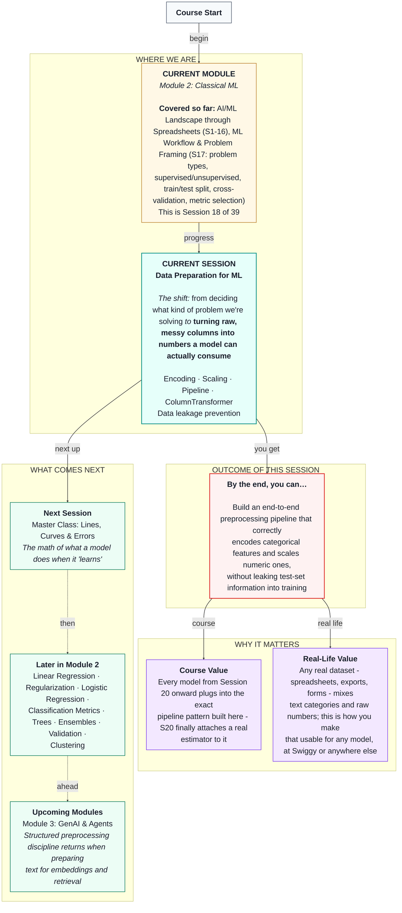

# Machine Learning: Data Preparation for ML
> **Pre-Read — Academic Session 18** | Module 2: Classical ML
---
## Mental Map
> 📄 Also provided as a printable PDF in this folder: **mental-map: Data Preparation for ML.pdf**



---

## What You'll Learn

In this pre-read, you'll discover:
- Why raw data almost never enters a model in the shape it's collected
- How to turn text categories into numbers a model can use, without inventing a false ranking
- Why putting numeric features on the same scale matters for many models
- How `Pipeline` and `ColumnTransformer` chain all of this into one repeatable object
- What data leakage is, and how to structure preprocessing so it never happens

---

## A. Why Raw Data Isn't Model-Ready

**💡 Analogy:** Imagine a recipe that lists some ingredients in cups and others in grams, with no conversion given. You can't combine them into a dish until everything is measured the same way. Raw ML data has the exact same problem: some columns are text categories ("Hyderabad," "Bike"), others are numbers on wildly different scales (ratings from 3–5, order counts from 0–60), and a model can't learn from any of it until it's all converted into a consistent numeric form.

**One-line definition: Data preparation is the set of steps that convert raw, mixed-format columns into a consistent numeric input a model can actually learn from.**

**Worked example:** Our Swiggy delivery-partner dataset from Session 17 now grows two new raw columns: `city` (text: "Hyderabad," "Pune," "Chennai") and `vehicle_type` (text: "Bike," "Scooter," "Bicycle"). Neither column is usable by a model as-is — a model needs numbers, not words.

**⚠️ Common trap:** A tempting shortcut is to just assign each category a number — Bike=1, Scooter=2, Bicycle=3 — and move on. This silently tells the model that Bicycle is "three times" Bike, which is meaningless. We fix this properly in section B.

---

## B. Encoding Categorical Features

**💡 Analogy:** Think of a kirana shop's payment ledger tracking method: Cash, UPI, or Card. You can't do arithmetic on the word "UPI." Instead, imagine three separate checkmark columns on the ledger page — "Paid by Cash? Y/N," "Paid by UPI? Y/N," "Paid by Card? Y/N" — with exactly one checked per row. That's precisely what **one-hot encoding** does.

**One-line definition: One-hot encoding turns each category into its own yes/no (1/0) column, so no false order or ranking is implied.**

| Original `vehicle_type` | `vehicle_Bike` | `vehicle_Scooter` | `vehicle_Bicycle` |
|---|---|---|---|
| Bike | 1 | 0 | 0 |
| Scooter | 0 | 1 | 0 |
| Bicycle | 0 | 0 | 1 |

In `sklearn`, this is `OneHotEncoder`.

**⚠️ Common trap:** Students sometimes one-hot encode a column that's already numeric and meaningfully ordered (like a 1–5 star rating) — don't. One-hot encoding is for **categories with no inherent order**. An already-numeric, ordered column should usually stay as-is or be scaled (section C), not encoded.


---

## C. Scaling Numeric Features

**💡 Analogy:** Comparing a batter's runs scored (often 0–150+) directly against their strike rate (typically 50–200) without adjustment unfairly lets whichever number happens to be bigger dominate any comparison — even if strike rate is the more meaningful stat for a given decision. Many ML algorithms have this exact blind spot: a feature with naturally larger numbers can silently dominate one with naturally smaller numbers, regardless of which one actually matters more.

**One-line definition: Scaling puts numeric features on a comparable range so no feature dominates purely because of its raw size.**

**Worked example:** In our partner dataset, `orders_last_30_days` ranges roughly 0–60, while `avg_rating` ranges only 3.0–5.0. Without scaling, the order count's much larger numbers could overwhelm the rating's influence in some models, even if rating matters just as much or more.

The most common tool is `StandardScaler`, which rescales each numeric column to have a mean of 0 and a standard deviation of 1 — this is the same standard deviation concept from Session 12's Master Class.

**⚠️ Common trap:** Not every model needs scaling — tree-based models (Sessions 25–26) are unaffected by feature scale. But it's a safe, low-cost habit to build now, and it's required for the linear models coming in Sessions 20 and 22.

---

## D. Chaining It Together: Pipeline and ColumnTransformer

**💡 Analogy:** Picture a Swiggy kitchen partner's prep line: every dish goes through the exact same sequence of stations — wash, chop, cook, plate — in the same order, every single time, no matter who's working that shift. Nothing gets forgotten, and nothing happens out of order. `Pipeline` is that same discipline applied to preprocessing: it locks a sequence of steps together into one object that always runs in the same order.

Because our dataset has **both** categorical columns (needing one-hot encoding) and numeric columns (needing scaling), we need to route each column type to the right treatment. That's exactly what `ColumnTransformer` does.

```python
from sklearn.compose import ColumnTransformer
from sklearn.pipeline import Pipeline
from sklearn.preprocessing import OneHotEncoder, StandardScaler

preprocessor = ColumnTransformer(transformers=[
    ("categorical", OneHotEncoder(), ["city', 'vehicle_type"]),
    ("numeric", StandardScaler(), ["orders_last_30_days', 'avg_rating', 'months_active"]),
])

pipeline = Pipeline(steps=[
    ("preprocessing", preprocessor),
])
```

**Worked example:** This `pipeline` object, once built, takes our raw Swiggy partner DataFrame — text columns and all — and outputs a fully numeric, appropriately scaled and encoded table, ready for a model. From Session 20 onward, we simply add one more step to this same pipeline: the actual model.

**⚠️ Common trap:** Forgetting to route a column through *either* transformer. Any column left out of the `ColumnTransformer` is silently dropped from the output — always double-check every raw column has a destination.

---

## E. Data Leakage: The Sneaky Way Preprocessing Can Ruin Everything

**💡 Analogy:** Imagine studying for an exam, but the answer key accidentally slipped into your practice materials beforehand. Your practice test score would look outstanding — and it would tell you nothing real about how you'd perform on the actual exam. **Data leakage** is the ML equivalent: information from your test set accidentally influencing anything learned during training, making your evaluation numbers lie to you.

**One-line definition: Data leakage happens when information from data the model should never have seen during training accidentally shapes the training process anyway.**

**Worked example of the mistake:** If you fit `StandardScaler` on your *entire* dataset (train + test combined) before splitting, the scaler's mean and standard deviation are computed using test-set values too. Your "test" evaluation is no longer honest — it's been quietly contaminated.

**The fix:** Always split first (Session 17's `train_test_split`), then `fit` your preprocessing steps *only* on the training data, and simply `transform` (never re-fit) the test data using what was learned from training alone. A `Pipeline` makes this easy to get right consistently, because `.fit()` and `.transform()` are called in the correct order automatically.


**⚠️ Common trap:** "Just scaling the whole dataset before splitting because it's simpler" is one of the single most common real-world ML mistakes — and it silently produces evaluation numbers that look better than they actually are.

---

## Quick Reference — Which Preprocessing Step Do I Need?

| Your situation | Use this | Because |
|---|---|---|
| Text column with no meaningful order (city, vehicle type) | One-hot encoding | Avoids inventing a false ranking between categories |
| Numeric column already meaningfully ordered (rating, count) | Keep as-is, then scale if needed | Order is real information, don't discard it |
| Numeric columns on very different scales | `StandardScaler` | Prevents one feature from dominating purely due to size |
| Dataset with both categorical and numeric columns | `ColumnTransformer` inside a `Pipeline` | Routes each column type to the correct treatment, in one repeatable object |
| Any preprocessing step at all | Fit only on train, transform on test | Prevents test-set information from leaking into training |

---

## Practice Exercises

1. **Concept Detective** — A dataset has a `payment_method` column (Cash/UPI/Card) and a `delivery_distance_km` column. Which preprocessing step does each need, and why?

2. **Spot the Error** — A classmate writes: `scaler.fit(X)` on the *full* dataset, then calls `train_test_split` afterward. What's wrong with this order, and what should change?

3. **Real-Life Application** — Think of a spreadsheet or form you've filled out recently (a job application, a loan form, a survey). Name two columns that would need one-hot encoding and two that would need scaling if this data were used to train a model.

4. **Pattern Recognition** — Why might one-hot encoding a `pincode` column with 500 unique values cause a different kind of problem than one-hot encoding a `vehicle_type` column with 3 values? (Hint: think about how many new columns get created.)

5. **Planning Ahead** — You're prepping an HDFC loan dataset with `employment_type` (text), `monthly_income` (number), and `credit_score` (number, already on a fixed 300–900 scale). Sketch which `ColumnTransformer` branch each column belongs in.

---

> ✅ **You're done!** You can now explain why raw data needs preparation, correctly encode categorical columns and scale numeric ones, chain both into a single `Pipeline` with `ColumnTransformer`, and structure that pipeline so test-set information never leaks into training.
>
> Next up: **Session 19 — Master Class: Lines, Curves & Errors**, where we go under the hood of what a model is actually doing mathematically when it "learns" from the data we've now prepared.
