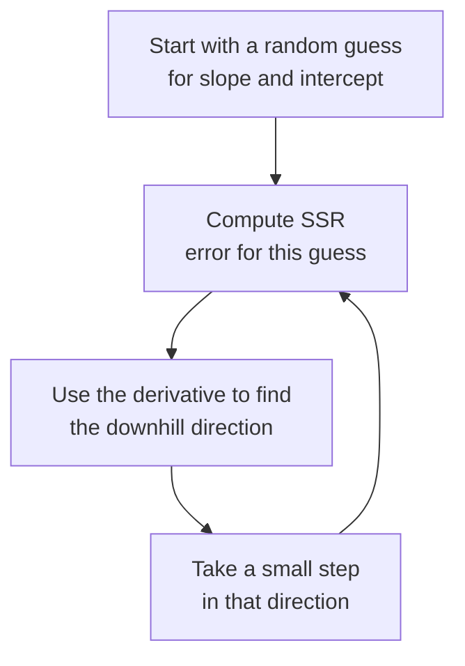

# Lecture Script: Mathematics of Machine Learning — Lines, Curves & Errors
> **Instructor Reference** — Module 2: Classical ML | Academic Session 19 (Master Class) | Duration: 1.5 Hours | Instructor: Abhinandhan

---

## Session Overview
**Goal:** By the end of this session, students can derive a line from two points, explain residuals and why we square them, describe a derivative geometrically, and connect gradient descent to what "learning" means in machine learning — entirely from first principles, without touching sklearn.

**Student profile at this point:** Strong with Pandas/NumPy and, after Sessions 17–18, comfortable with the ML workflow and prepared data. They have **not yet** trained any real model and have likely never thought about *why* a "best fit" line is called best. Likely wrong assumption: several will assume "best fit" is just eyeballed or that a computer "tries lines until one looks right" rather than following a precise mathematical procedure. Boredom/anxiety risk: master classes can trigger math anxiety — counter this aggressively with analogy-first delivery and delay all notation until intuition is solid. This is a tighter 90-minute session, so pacing must stay brisk without sacrificing the core analogies.

**Key outcome:** Students should leave with a working mental image — a blindfolded hiker feeling their way downhill — that they can recall the moment they see `LinearRegression()` in Session 20 and ask "so this is doing the hiker thing automatically?"

> 🎯 **The one sentence this session must land:** *A machine "learning" a line is nothing mysterious — it's just repeatedly nudging a guess downhill on an error curve until the error can't get any smaller.*

---

## Timing Breakdown

| Segment | Duration | Cumulative |
|---|---|---|
| Opening — "The Run-Rate Puzzle" | 6 min | 6 min |
| Concept Block 1: The Equation of a Line From Two Points | 10 min | 16 min |
| Practical Block 1: Derive the Line | 6 min | 22 min |
| Concept Block 2: Residuals | 10 min | 32 min |
| Practical Block 2: Compute Residuals for Three Points | 6 min | 38 min |
| **BREAK** | 8 min | 46 min |
| Concept Block 3: Sum of Squared Residuals & Best Fit | 10 min | 56 min |
| Concept Block 4: The Derivative, Geometrically | 8 min | 64 min |
| Concept Block 5: Gradient Descent | 10 min | 74 min |
| Practical Block 3: Live Coding Demo (TA Code) | 10 min | 84 min |
| Concept Block 6: Connecting the Math to "Learning" | 3 min | 87 min |
| Summary & Bridge | 2 min | 89 min |
| Q&A & Doubt Solving | 1 min | 90 min |

---

## Opening — "The Run-Rate Puzzle" (6 min)

Open with this, verbatim-ish:

> "A batter is scoring at a perfectly constant run rate. You know their score after 5 overs, and their score after 10 overs. Without watching a single more ball, can you tell me their score after 30 overs?"

Pause. Let the room work it out — most will say yes and figure out how.

> "Right — two points is all you need, because a constant rate is a straight line, and a straight line is completely determined by any two points on it. That's the entire mathematical idea behind today's session, and it's also, whether you realize it yet or not, the entire idea behind how a machine 'learns' a straight-line relationship from data."

**Pivot line:** "For two sessions now, you've prepared data and set up honest evaluation. Today we go one level deeper: what is a model actually *doing*, mathematically, when it 'learns'? No sklearn today — just the ideas underneath it."

**Context for sessions ahead:** "Everything in Session 20 — every line of `LinearRegression()` code — is automating exactly what we derive by hand today. If today lands, Session 20 will feel like watching a magic trick you already know the secret to."

---

## Concept Block 1: The Equation of a Line From Two Points (10 min)

> "A line is `y = mx + c`. `m` is the slope — how much `y` changes for every one-unit increase in `x`. `c` is the intercept — the value of `y` when `x` is zero."

Write the Swiggy example on the board:

> "A delivery takes 8 minutes for 1 km, and 20 minutes for 5 km."

Derive live, narrating each step:

$$m = \frac{20 - 8}{5 - 1} = \frac{12}{4} = 3$$

$$8 = 3(1) + c \implies c = 5$$

$$\text{delivery\_time} = 3 \times \text{distance} + 5$$

> "3 minutes per kilometer, plus a fixed 5-minute base handling time. Two points, one complete rule for predicting *any* distance."

### 🔴 The trap / highest-value moment
> "In the real world, data almost never lines up this perfectly. Real delivery times bounce around this line — traffic, weather, a dozen other factors. That gap between what actually happened and what the line predicts is exactly what we tackle next. Write this down: *real data doesn't sit exactly on a line — the gap is the story.*"

---

## Practical Block 1: Derive the Line (6 min)

Give students a new pair of points on the board: "10 minutes for 2 km, 22 minutes for 6 km." Have them derive `m` and `c` individually on paper, 2 minutes, then cold-call one student to walk the derivation on the board.

**Answer key reasoning to say aloud:** `m = (22-10)/(6-2) = 12/4 = 3`. Using the first point: `10 = 3(2) + c → c = 4`. Final line: `time = 3×distance + 4`.

---

## Concept Block 2: Residuals (10 min)

> "Now — our line says a 6 km delivery should take 23 minutes. The actual delivery took 27 minutes. That 4-minute gap is called a **residual** — actual minus predicted. Every single point in a real dataset has its own residual."

Build the table live on the board:

| Distance | Actual | Predicted | Residual |
|---|---|---|---|
| 2 | 12 | 11 | +1 |
| 4 | 15 | 17 | −2 |
| 6 | 27 | 23 | +4 |

### 🔴 The trap / highest-value moment
> "If you just add these residuals up — +1, −2, +4 — you get +3, which looks small and reassuring. But that's an illusion: positive and negative residuals are canceling each other out, hiding how wrong the line actually is at each individual point. Write this down: *raw residuals can cancel out and lie to you about total error.*"

---

## Practical Block 2: Compute Residuals for Three Points (6 min)

Give a new mini-table with actual and predicted values for 3 new points; have students compute residuals individually, then sum them naively and notice how close to zero the naive sum looks even when individual errors are large. Cold-call to surface this observation explicitly.

💬 Expect a question: "so is a sum of zero always bad?" Welcome it. Say: "Not always zero exactly, but a small or misleadingly reassuring sum is common whenever errors happen to balance out — which is precisely why we need a better way to add these up. That's next."

---

## BREAK (8 min)

---

## Concept Block 3: Sum of Squared Residuals & Best Fit (10 min)

> "Picture a kirana shop owner tracking daily cash-count discrepancies. A ₹500 shortage on Monday and a ₹500 surplus on Tuesday shouldn't 'cancel out' into a comforting zero-average-error story — both days are real mistakes. Squaring each residual before adding fixes exactly this: every error becomes positive, and bigger errors get penalized much more heavily than small ones."

Write the formula and compute live using the earlier table:

$$SSR = \sum (\text{actual} - \text{predicted})^2 = (1)^2 + (-2)^2 + (4)^2 = 1 + 4 + 16 = 21$$

> "'Best fit' has a precise meaning now: it's the specific slope and intercept that make this SSR number as small as it can possibly be, across the entire dataset."

### 🔴 The trap / highest-value moment
> "Squaring also means one large outlier can disproportionately drag the 'best fit' line toward itself. Write this down: *SSR treats big errors as much worse than small ones — including one single bad outlier.* We'll return to this sensitivity later in the course."

---

## Concept Block 4: The Derivative, Geometrically (8 min)

> "Picture walking a hilly path with a speedometer that shows, at every step, exactly how steep the ground is right under your feet — not the average steepness of the whole hill, just right now, right here. That's a derivative: the slope of a curve at one exact point."

Draw a simple bowl-shaped curve on the board — SSR on the vertical axis, possible slope values on the horizontal axis.

> "This bowl shape is what SSR looks like as we try different slopes. Steep on the sides, flat at the very bottom — where SSR is smallest. The derivative at any point on this bowl tells us which direction is downhill from where we're currently standing, and how steep."

### 🔴 The trap / highest-value moment
> "You do not need to calculate a derivative by formula today. The entire goal is the picture: derivative equals steepness at a point, and steepness of exactly zero means you've reached the very bottom of the bowl. Write this down: *zero steepness = the best-fit point.*"

---

## Concept Block 5: Gradient Descent (10 min)

> "Now imagine a blindfolded hiker standing somewhere on that bowl, trying to find the bottom with no sight at all — only able to feel, through their feet, which direction is currently downhill and how steep it is. So they take one small step downhill, feel again, take another step, and repeat."

Write the loop on the board as a diagram:

> "Each trip around this loop is called an **epoch**. The size of each step is the **learning rate** — too large, and the hiker overshoots the valley floor and stumbles past it; too small, and it takes forever to arrive."

### 🔴 The trap / highest-value moment
> "This is, quite literally, what 'learning' means in machine learning: starting with a bad guess and repeatedly nudging parameters downhill until error is as small as the process can make it. Write this down: *'the model learned' = 'gradient descent found a low point on the error bowl.'* There's no more mystery beyond this."

---

## Practical Block 3: Live Coding Demo (TA Code) (10 min)

**Handoff line (must match TA code file's opening comment):** "Let's actually watch a machine 'learn' a line in code — no sklearn yet, just the loop we just drew on the board, built from scratch."

Hand off to `ta-code - Session 19 - Master Class - Lines, Curves & Errors.py`, narrating each `# --- EXPLAIN ---` block aloud:

1. Build synthetic distance → delivery-time data (same Swiggy scenario, numeric-numeric this time)
2. Start slope and intercept at zero — a deliberately bad guess
3. Run the gradient descent loop for several epochs, printing SSR every so often
4. Watch the printed SSR values fall, epoch after epoch — point at the screen: "there — that number falling is the hiker walking downhill"
5. Compare the final learned slope/intercept to the true relationship used to generate the data

💬 Expect a question: "how did we know how big a step to take?" Welcome it. Say: "That's the learning rate we just discussed — we picked a small fixed value today. Choosing it well is its own skill, but it's outside today's scope."

---

## Concept Block 6: Connecting the Math to "Learning" (3 min)

> "Zoom out for a second. What did the machine actually do in that demo? It started with a bad guess, measured how wrong it was using squared residuals, used the derivative to find which direction reduces that wrongness, and took small steps in that direction — over and over — until it stopped improving much."

Ask quickly:

> "Did the computer need to 'understand' delivery logistics or Swiggy's business at all to do this?"

Land the point fast: no — it's pure numerical optimization. The "intelligence" is entirely in the procedure of minimizing error, not in any understanding of the real-world domain.

---

## Summary & Bridge (2 min)

| Concept | The one thing to remember |
|---|---|
| Line equation | Two points fully determine slope and intercept |
| Residual | Actual minus predicted, for one point |
| Sum of squared residuals | Squaring prevents errors from canceling out; "best fit" minimizes this |
| Derivative (geometric) | Steepness of a curve at a point; zero steepness = the minimum |
| Gradient descent | Iteratively stepping downhill using the derivative — literally what "learning" means here |

Close on the thesis line: "A machine 'learning' a line is nothing mysterious — it's just repeatedly nudging a guess downhill on an error curve until the error can't get any smaller."

**Bridge to next session:** "Everything we derived by hand today — the line, the residuals, the downhill steps — Session 20 hands over entirely to sklearn's `LinearRegression`. We'll train a real model in one line of code, then evaluate its predictions with MAE, RMSE, and R², and diagnose overfitting by comparing train versus test performance."

---

## Q&A & Doubt Solving (1 min)

Given the tight 90-minute window, take one live question if time allows; otherwise direct remaining questions to the tutorial session. Likely first question and model answer:

**Q: Do we ever calculate the derivative by formula in this course?**
→ Not by hand — the geometric intuition built today is what you need going forward. `sklearn` and other libraries compute the actual calculus internally.

---

## Instructor Notes
- **Words not yet earned:** LinearRegression, coefficients (as a formal term), MAE, RMSE, R², overfitting, regularization — all Session 20 onward. Today's language should stay geometric and narrative, not code-flavored.
- **Biggest risk in this session:** math anxiety triggered by notation, compounded by the tight 90-minute window. Counter by keeping every formula preceded by the plain-language analogy first, and by explicitly saying aloud "you will never be asked to compute a derivative by formula in this course."
- **Pacing note:** this is a 90-minute session, not the usual 120 — the timing table above is intentionally tighter than a standard Academic session. Do not let any single concept block run over; defer deep tangents to the tutorial session instead.
- **Board management:** keep the bowl-shaped SSR-vs-slope sketch and the gradient descent loop diagram visible from Concept Block 4 onward — students will refer back to both repeatedly through Concept Block 6.
- **Common confusions, numbered:**
  1. Believing "best fit" is subjective or eyeballed rather than a precise minimization
  2. Assuming a residual sum near zero always means a good fit
  3. Expecting to need calculus formulas to follow along
  4. Confusing the learning rate (step size) with the number of epochs (number of steps)
- **Cross-references:** Session 20 (Linear Regression) hands this entire derivation over to `sklearn`; Session 32 (Master Class: Vectors & Linear Algebra) extends today's geometric intuition into multiple dimensions.
- **Local/cultural context notes:** switching the running example from Session 17–18's churn scenario to a numeric distance-vs-delivery-time relationship works well here since today's math needs a numeric-to-numeric relationship — keep this same delivery-time example alive into Session 20, where it becomes the first real trained model.
