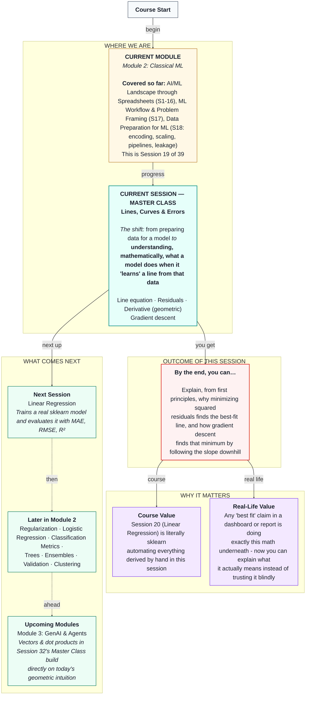

# Mental Map — Master Class: Lines, Curves & Errors
> Academic Session 19 · Module 2: Classical ML

```mermaid
%%{init: {'themeVariables': {'fontSize': '32px', 'fontFamily': 'sans-serif'}, 'flowchart': {'htmlLabels': true, 'nodeSpacing': 50, 'rankSpacing': 80, 'wrappingWidth': 400, 'padding': 20}}}%%
flowchart TB

START["<b>Course Start</b>"]

subgraph foundation[" WHERE WE ARE "]
direction TB
    CURMOD["<b>CURRENT MODULE</b><br/><i>Module 2: Classical ML</i><br/>&nbsp;<br/><b>Covered so far:</b> AI/ML Landscape through Spreadsheets (S1-16), ML Workflow &amp; Problem Framing (S17), Data Preparation for ML (S18: encoding, scaling, pipelines, leakage)<br/>This is Session 19 of 39"]
    CURSES["<b>CURRENT SESSION — MASTER CLASS</b><br/><b>Lines, Curves &amp; Errors</b><br/>&nbsp;<br/><i>The shift:</i> from preparing data for a model <i>to</i> <b>understanding, mathematically, what a model does when it 'learns' a line from that data</b><br/>&nbsp;<br/>Line equation · Residuals · Derivative (geometric)<br/>Gradient descent"]
end

subgraph outcome[" OUTCOME OF THIS SESSION "]
direction TB
    OUT["<b>By the end, you can…</b><br/>&nbsp;<br/>Explain, from first principles, why minimizing squared<br/>residuals finds the best-fit line, and how gradient descent<br/>finds that minimum by following the slope downhill"]
end

subgraph value[" WHY IT MATTERS "]
direction TB
    CVAL["<b>Course Value</b><br/>Session 20 (Linear Regression) is literally sklearn<br/>automating everything derived by hand in this session"]
    RVAL["<b>Real-Life Value</b><br/>Any 'best fit' claim in a dashboard or report is doing<br/>exactly this math underneath - now you can explain what<br/>it actually means instead of trusting it blindly"]
end

subgraph future[" WHAT COMES NEXT "]
direction TB
    U0["<b>Next Session</b><br/>Linear Regression<br/><i>Trains a real sklearn model and evaluates it with MAE, RMSE, R²</i>"]
    U1["<b>Later in Module 2</b><br/>Regularization · Logistic Regression · Classification Metrics ·<br/>Trees · Ensembles · Validation · Clustering"]
    U2["<b>Upcoming Modules</b><br/>Module 3: GenAI &amp; Agents<br/><i>Vectors &amp; dot products in Session 32's Master Class build<br/>directly on today's geometric intuition</i>"]
end

START ==>|" begin "| CURMOD
CURMOD ==>|" progress "| CURSES
CURSES ==>|" you get "| OUT
OUT ==>|" course "| CVAL
OUT ==>|" real life "| RVAL
CURSES ==>|" next up "| U0
U0 -.->|" then "| U1
U1 -.->|" ahead "| U2

classDef startBox fill:#F7FAFC,stroke:#4A5568,stroke-width:2px,color:#1A202C
classDef curModBox fill:#FFF8E6,stroke:#B7791F,stroke-width:2px,color:#1A202C
classDef curSessBox fill:#E6FFFA,stroke:#0D9488,stroke-width:3px,color:#1A202C
classDef outBox fill:#FEF2F2,stroke:#DC2626,stroke-width:3px,color:#1A202C
classDef valueBox fill:#F3E8FF,stroke:#7C3AED,stroke-width:2px,color:#1A202C
classDef futureBox fill:#ECFDF5,stroke:#047857,stroke-width:2px,color:#1A202C

class START startBox
class CURMOD curModBox
class CURSES curSessBox
class OUT outBox
class CVAL,RVAL valueBox
class U0,U1,U2 futureBox

linkStyle default stroke-width:2px
```
