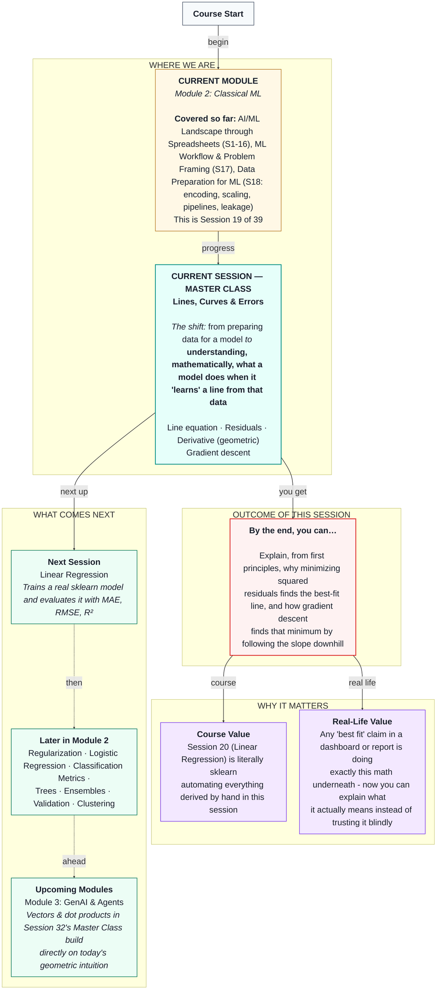

# Mathematics of Machine Learning: Lines, Curves & Errors
> **Pre-Read — Academic Session 19 (Master Class)** | Module 2: Classical ML
---
## Mental Map
> 📄 Also provided as a printable PDF in this folder: **mental-map: Master Class - Lines, Curves & Errors.pdf**

---

## What You'll Learn

In this pre-read, you'll discover:
- How two points fully determine the equation of a line
- What a residual is, and why we square it instead of just adding it up
- Why minimizing the sum of squared residuals gives you the single "best fit" line
- What a derivative represents geometrically — no formal calculus needed
- How gradient descent uses the derivative to let a machine "learn" the best line, step by step

---

## A. The Equation of a Line From Two Points

**💡 Analogy:** Imagine a batter scoring at a perfectly constant run rate. If you know the score after 5 overs and after 10 overs, you can calculate their exact run rate and predict their score at any over — 15, 20, even a full 50-over innings — without watching a single extra ball. Two points are enough to describe the *entire* line.

**One-line definition: A line is fully described by `y = mx + c`, where `m` is the slope (rate of change) and `c` is the intercept (starting value when x = 0).**

**Worked example:** Say a Swiggy delivery takes 8 minutes for a 1 km trip, and 20 minutes for a 5 km trip. The slope is:

$$m = \frac{20 - 8}{5 - 1} = \frac{12}{4} = 3 \text{ minutes per km}$$

Using one point to solve for `c`: `8 = 3(1) + c`, so `c = 5`. The full line is `delivery_time = 3 × distance + 5` — a 5-minute base handling time, plus 3 minutes for every kilometer.

**⚠️ Common trap:** In the real world, we almost never get data that lines up *perfectly* on a line like this example. Real delivery times bounce around the line due to traffic, weather, and a dozen other factors. That gap between what actually happened and what the line predicts is the subject of the next section.

---

## B. Residuals: The Gap Between Reality and the Line

**💡 Analogy:** Say our line predicts a 6 km delivery should take 23 minutes. The actual delivery took 27 minutes. That 4-minute gap — actual minus predicted — is a **residual**. Every single data point has its own residual: some deliveries arrive faster than predicted (negative residual), some slower (positive residual).

**One-line definition: A residual is the difference between an actual observed value and what the line predicted for that point.**

$$\text{residual} = \text{actual} - \text{predicted}$$

**Worked example:**

| Distance (km) | Actual time (min) | Predicted (3×distance + 5) | Residual |
|---|---|---|---|
| 2 | 12 | 11 | +1 |
| 4 | 15 | 17 | −2 |
| 6 | 27 | 23 | +4 |

**⚠️ Common trap:** If you just *add up* all the residuals to judge how good a line is, positive and negative residuals can cancel each other out, making a genuinely bad line look deceptively good on paper. This is exactly why we don't use raw residuals directly — see section C.

---

## C. Best Fit = Minimizing the Sum of Squared Residuals

**💡 Analogy:** A kirana shop owner tracking daily cash-count discrepancies wouldn't want a ₹500 shortage on Monday and a ₹500 surplus on Tuesday to "cancel out" into a reassuring "zero average error" — both days represent real mistakes that deserve attention. Squaring each residual before adding them up fixes exactly this: every error counts as a positive contribution, and larger errors are penalized disproportionately more than small ones.

**One-line definition: The best-fit line is the one that minimizes the sum of squared residuals (SSR) across every data point.**

$$SSR = \sum (\text{actual} - \text{predicted})^2$$

**Worked example, continuing the table above:**

$$SSR = (1)^2 + (-2)^2 + (4)^2 = 1 + 4 + 16 = 21$$

If we nudged the line's slope or intercept slightly and this number went *down*, that new line fits the data better. "Best fit" simply means: the specific slope and intercept that make this sum as small as possible.

**⚠️ Common trap:** Squaring residuals also means a single large outlier can disproportionately pull the "best fit" line toward itself — worth remembering when we revisit outlier sensitivity in later sessions.

---

## D. The Derivative, Geometrically

**💡 Analogy:** Imagine walking on a hilly path with a speedometer that shows, at every single step, exactly how steep the ground is right under your feet — not the average steepness of the whole hill, just *right now, right here*. That instantaneous steepness reading is exactly what a derivative represents.

**One-line definition: A derivative tells you the slope of a curve at one exact point — how fast the curve is rising or falling right there.**

Picture the SSR value as a curve itself — imagine plotting SSR on the vertical axis against different possible slope values on the horizontal axis. This curve typically looks like a bowl: very steep on the sides, flattening out to zero exactly at the bottom, where SSR is smallest. The derivative at any point on this bowl tells us which direction is "downhill" from where we're currently standing, and how steep that downhill direction is.

**⚠️ Common trap:** You do **not** need to calculate a derivative by formula today — that's not the goal of this session. The goal is purely the geometric picture: derivative = steepness at a point, and steepness of zero means you've reached the bottom of the bowl (the best-fit line).

---

## E. Gradient Descent: How a Machine "Learns" a Line

**💡 Analogy:** Imagine a blindfolded hiker standing somewhere on that bowl-shaped hill, trying to find the very bottom without being able to see anything. Their only tool: they can feel, with their feet, which direction is currently downhill and how steep it is. So they take a small step in the downhill direction, feel again, take another small step, and repeat — gradually approaching the bottom of the bowl without ever seeing the whole shape at once.

**One-line definition: Gradient descent is an iterative process that starts with a guess, uses the derivative to find the downhill direction, and takes small repeated steps until it reaches the point of minimum error.**

**Worked example (conceptual):** Start with a random guess for slope and intercept — say both equal to zero. Compute the SSR for this terrible line (it will be large). Use the derivative to find which direction reduces SSR, nudge the slope and intercept slightly in that direction, and recompute. Repeat this hundreds of times. Each repetition is called an **epoch**, and the size of each step is called the **learning rate** — too large a step and the hiker might overshoot the valley floor and stumble past it; too small a step and it takes forever to get there.

**This is, quite literally, what "learning" means in machine learning**: a model starts with a bad guess and repeatedly nudges its own parameters downhill until the error is as small as it can make it.

**⚠️ Common trap:** Gradient descent doesn't guarantee finding the bottom in one attempt, and a learning rate that's too large can cause the process to bounce around wildly instead of settling down. We won't tune this by hand today — just understand the loop.

---

## Quick Reference — Key Ideas at a Glance

| Term | What it means | Why it matters |
|---|---|---|
| Line equation (`y = mx + c`) | Two numbers, slope and intercept, define an entire predictive line | Every linear model, at its core, is finding the best `m` and `c` |
| Residual | Actual minus predicted, for one data point | Measures how wrong the line is for that specific point |
| Sum of squared residuals | Total squared error across all points | The number "best fit" actually minimizes |
| Derivative (geometric) | Steepness of a curve at one point | Tells you which direction reduces error |
| Gradient descent | Iterative steps downhill using the derivative | The literal mechanism by which a model "learns" |

---

## Practice Exercises

1. **Real-Life Application** — A delivery takes 10 minutes for a 2 km trip and 22 minutes for a 6 km trip. Derive the line's slope and intercept, and predict the time for a 4 km trip.

2. **Concept Detective** — Given actual and predicted values of (actual=15, predicted=13) and (actual=9, predicted=12), compute each residual and the sum of squared residuals. Which point contributes more to the total error, and why?

3. **Spot the Error** — A classmate says: "I averaged all my residuals and got exactly 0, so my line must be a perfect fit." What's wrong with this reasoning?

4. **Pattern Recognition** — If you nudge a line's slope and the SSR goes up, not down, what does that tell you about which direction you just moved in?

5. **Planning Ahead** — Explain, in your own words and without any formulas, why a machine "learning" a line and a blindfolded hiker finding the bottom of a valley are describing the same underlying process.

---

> ✅ **You're done!** You can now explain how a line is defined by two numbers, why squaring residuals prevents errors from canceling out, what a derivative represents geometrically, and how gradient descent uses that geometry to let a machine "learn" the best-fit line one small step at a time.
>
> Next up: **Session 20 — Linear Regression**, where sklearn's `LinearRegression` automates everything we derived by hand today, and we evaluate its predictions with MAE, RMSE, and R².
