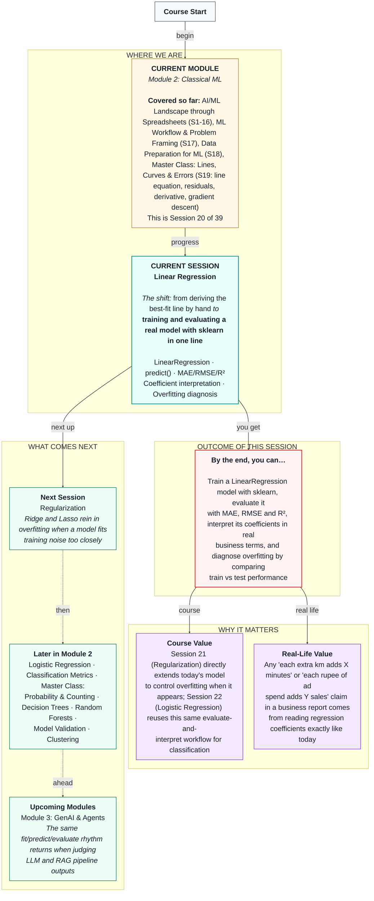

# Machine Learning: Linear Regression
> **Pre-Read — Academic Session 20** | Module 2: Classical ML
---
## Mental Map
> 📄 Also provided as a printable PDF in this folder: **mental-map: Linear Regression.pdf**



---

## What You'll Learn

In this pre-read, you'll discover:
- How to train a real `LinearRegression` model in sklearn, replacing last session's hand-rolled gradient descent
- How to generate predictions on new data using `.predict()`
- How to evaluate regression performance using MAE, RMSE, and R² — and what each one actually tells you
- How to read a model's coefficients as real, business-meaningful numbers
- How to diagnose overfitting by comparing train and test performance

---

## A. From Hand-Derived Line to sklearn's LinearRegression

**💡 Analogy:** Last session, you personally played the blindfolded hiker — computing gradients, taking small steps, watching the error fall epoch by epoch. Today, imagine hiring an expert who already knows exactly where the valley floor is and walks straight there, instantly. That's `sklearn.linear_model.LinearRegression` — the exact same goal (minimize the sum of squared residuals), reached in a fraction of a second.

**One-line definition: `LinearRegression` finds the best-fit line (or hyperplane, with multiple features) that minimizes squared residuals — automatically.**

```python
from sklearn.linear_model import LinearRegression

model = LinearRegression()
model.fit(X_train, y_train)
```

**Worked example:** Using our Swiggy delivery dataset — `distance_km` and `num_items` predicting `delivery_time_min` — `model.fit(X_train, y_train)` finds the best slope for each feature and the best intercept, without us writing a single gradient descent step ourselves.

**⚠️ Common trap:** `.fit()` only works on the training data you give it — always split first (Session 17's habit), and only call `.fit()` on `X_train`, `y_train`, never on the full dataset or on the test set.

---

## B. Generating Predictions with `.predict()`

**💡 Analogy:** Once a Swiggy dispatcher has an ETA formula, they don't re-derive it for every new order — they just plug in the new order's distance and item count to get an instant estimate. `.predict()` does exactly this: given new feature values, it applies the already-learned line to produce a prediction.

```python
predictions = model.predict(X_test)
```

**Worked example:** For a delivery with `distance_km=6` and `num_items=3`, `model.predict()` might return something like `27.4` minutes — a single number, generated instantly using the coefficients the model already learned.

**⚠️ Common trap:** `.predict()` on the test set only tells you what the model *thinks* — you still need to compare those predictions against the actual test values to know if the model is any good. That's section C.

---

## C. Evaluating Regression Performance: MAE, RMSE, R²

**💡 Analogy:** Imagine reporting to your manager how good your delivery-time predictions were, last month, across every single order. You wouldn't hand over hundreds of individual residuals — you'd summarize with one or two numbers. That's exactly what these three metrics do.

| Metric | One-line meaning | In plain words |
|---|---|---|
| **MAE** (Mean Absolute Error) | Average of `|actual − predicted|` across all points | "On average, our predictions were off by this many minutes" |
| **RMSE** (Root Mean Squared Error) | Square root of the average squared residual | Like MAE, but penalizes large individual misses more heavily — directly related to the SSR from Session 19 |
| **R²** (R-squared) | Proportion of variation in the outcome explained by the model, from 0 to 1 | "How much better is this model than just always guessing the average delivery time?" |

```python
from sklearn.metrics import mean_absolute_error, mean_squared_error, r2_score

mae = mean_absolute_error(y_test, predictions)
rmse = mean_squared_error(y_test, predictions) ** 0.5
r2 = r2_score(y_test, predictions)
```

**Worked example:** An MAE of 2.1 means our delivery-time predictions are, on average, off by about 2.1 minutes. An R² of 0.87 means our model explains about 87% of the variation in delivery times — far better than just guessing the same average time for every delivery.

**⚠️ Common trap:** MAE and RMSE are both in the *same units* as your target (minutes, here) — but if RMSE is noticeably larger than MAE, that's a signal some individual predictions are badly off, even if the average error looks fine. Never report just one of these without at least glancing at the other.

---

## D. Interpreting Coefficients

**💡 Analogy:** Think back to Session 19's line: `time = 3 × distance + 5`. That `3` is a **coefficient** — literally "3 extra minutes for every extra kilometer, holding everything else equal." With multiple features, each one gets its own coefficient, like a surcharge card listing exactly how much each factor adds.

**One-line definition: A coefficient tells you how much the predicted outcome changes for a one-unit increase in that feature, holding all other features constant.**

**Worked example:** Suppose our trained model reports:
- `distance_km` coefficient: 2.9
- `num_items` coefficient: 1.4
- intercept: 5.2

This reads as: "Each extra kilometer adds about 2.9 minutes to delivery time; each extra item in the order adds about 1.4 minutes; and every delivery has a baseline 5.2-minute handling time, before distance or item count are even considered."

**⚠️ Common trap:** "Holding all other features constant" is the important, easy-to-forget phrase. A coefficient describes the effect of *one* feature only if every other feature stays fixed — it does not describe what happens in the real world where features often move together.

---

## E. Diagnosing Overfitting: Train vs. Test Comparison

**💡 Analogy:** Recall Session 17's memorizing student — acing an exam made of exactly the questions they studied, then struggling the moment the questions change. A model that performs beautifully on training data but noticeably worse on test data is doing the exact same thing: memorizing quirks of the training set rather than learning something that generalizes.

**One-line definition: Overfitting is when a model performs much better on training data than on test data — a sign it has learned the training set's noise, not just its real pattern.**

**Worked example:** If our model's R² is 0.91 on training data but only 0.62 on test data, that gap is a red flag — the model may be fitting quirks specific to the training set that don't hold up on new data. If instead R² on train and test are close (say, 0.87 and 0.85), that's a healthy sign the model has learned something that generalizes.

**⚠️ Common trap:** A model performing *worse* on training data than on test data isn't "extra good" — it usually signals something else went wrong (an unusually easy test split, or a data leakage issue from Session 18). Always investigate a suspiciously large gap in either direction.

---

## Quick Reference — Reading Your Model's Results

| Your situation | Use this | Because |
|---|---|---|
| You want the average size of your prediction errors, in real units | MAE | Easy to explain to a non-technical stakeholder |
| You want to penalize occasional large misses more heavily | RMSE | Squaring inside the formula amplifies big errors |
| You want to know how much better your model is than guessing the average | R² | Directly measures explained variation, 0 to 1 |
| You want to know what one feature is "worth" in the prediction | The feature's coefficient | Shows effect per unit, holding others constant |
| You want to check if your model has memorized rather than learned | Compare train vs. test performance | A large gap signals overfitting |

---

## Practice Exercises

1. **Concept Detective** — A model reports MAE = 3.0 minutes and RMSE = 7.5 minutes. What does the large gap between these two numbers suggest about the model's errors?

2. **Real-Life Application** — An HDFC model predicting loan amounts reports a `monthly_income` coefficient of 0.02. In your own words, what does this coefficient mean for a business stakeholder?

3. **Spot the Error** — A classmate trains a model, gets R² = 0.95 on the training set, and immediately reports to their manager that the model is excellent — without checking test performance. What's missing from their evaluation?

4. **Pattern Recognition** — Model A: train R² = 0.80, test R² = 0.78. Model B: train R² = 0.97, test R² = 0.55. Which model would you trust more in production, and why?

5. **Planning Ahead** — You're building a model to predict monthly Zomato restaurant revenue from `num_orders` and `avg_order_value`. Sketch what you'd expect each coefficient's sign (positive or negative) to be, and explain what a large train-test R² gap would tell you about the model.

---

> ✅ **You're done!** You can now train a real `LinearRegression` model, generate predictions, evaluate performance with MAE, RMSE, and R², interpret coefficients as real per-unit effects, and diagnose overfitting by comparing train and test results.
>
> Next up: **Session 21 — Regularization**, where we apply Ridge and Lasso to rein in a model that's fitting training noise too closely, and explore the bias-variance tradeoff behind that decision.
