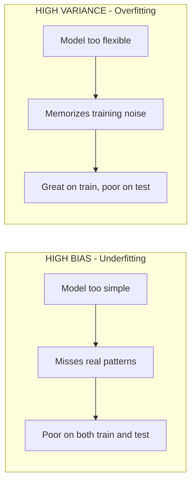

# Lecture Script: Machine Learning — Regularization
> **Instructor Reference** — Module 2: Classical ML | Academic Session 21 | Duration: 2 Hours | Instructor: Aswath Rao

---

## Session Overview
**Goal:** By the end of this session, students can recognize overfitting caused by excess model flexibility, apply Ridge and Lasso regression, tune the `alpha` hyperparameter and observe its effect on coefficients, and explain the bias-variance tradeoff in plain language.

**Student profile at this point:** Just trained their first real model in Session 20 and learned to diagnose overfitting by comparing train vs. test performance. They have **not yet** seen what to actually *do* once overfitting is detected. Likely wrong assumption: several will think overfitting means "using bad features" — worth correcting early, since even purely random noise features cause it. Boredom risk: low — this session has a strong "aha" moment built in (watching coefficients visibly shrink or vanish).

**Key outcome:** Students should leave able to look at a train-vs-test gap from Session 20's diagnostic and immediately reach for Ridge or Lasso as the next concrete step, not just note the gap and move on.

> 🎯 **The one sentence this session must land:** *Regularization deliberately trades a little bit of training accuracy for a model that generalizes better — and that trade is controlled by one dial, alpha.*

---

## Timing Breakdown

| Segment | Duration | Cumulative |
|---|---|---|
| Opening — "The Overzealous Analyst" | 8 min | 8 min |
| Concept Block 1: Recognizing Overfitting from Excess Flexibility | 10 min | 18 min |
| Practical Block 1: Spot the Too-Flexible Model | 8 min | 26 min |
| Concept Block 2: Ridge Regression (L2) | 12 min | 38 min |
| Practical Block 2: Predict the Effect of Ridge | 8 min | 46 min |
| **BREAK** | 10 min | 56 min |
| Concept Block 3: Lasso Regression (L1) | 12 min | 68 min |
| Practical Block 3: Live Coding Demo (TA Code) | 14 min | 82 min |
| Concept Block 4: Tuning Alpha | 10 min | 92 min |
| Concept Block 5: The Bias-Variance Tradeoff | 10 min | 102 min |
| Practical Block 4: Bias-Variance Scenario Ranking | 8 min | 110 min |
| Summary & Bridge | 5 min | 115 min |
| Q&A & Doubt Solving | 5 min | 120 min |

---

## Opening — "The Overzealous Analyst" (8 min)

Open with this, verbatim-ish:

> "Recall Session 17's memorizing student — the one who aced last year's exact exam questions and flopped on new ones. Now imagine a second, even stranger student: one who tries to explain *everything* about the practice exam — the color of the pen used, the time of day, how many questions were on the previous page — treating all of it as meaningful. They'll 'explain' the practice exam brilliantly. They'll flounder completely on the real one, which doesn't share those same irrelevant quirks."

Pause. Ask the room:

> "Session 20's model behaved well — train and test numbers stayed close. What do you think would happen if I handed that same model fifteen columns of pure random noise alongside the real features?"

(Let guesses land.)

> "It would happily assign every single noise column a coefficient — finding tiny, meaningless, coincidental patterns and treating them as real. That's today's problem, and regularization is the fix."

**Pivot line:** "Session 20 taught you to *detect* overfitting by comparing train and test performance. Today, we finally do something about it when we find it."

**Context for sessions ahead:** "This exact 'don't let the model memorize noise' idea returns in Session 22 for classification, and again, far later, when we judge whether a GenAI pipeline is hallucinating rather than genuinely retrieving facts."

---

## Concept Block 1: Recognizing Overfitting from Excess Flexibility (10 min)

> "Here's the key idea to lock in today: overfitting isn't caused by 'bad' features. Even purely random, meaningless noise columns get non-zero coefficients from plain `LinearRegression`, because the model has no built-in instinct to say 'this one doesn't matter.' It will always find *some* small pattern in a finite training set — even in pure noise."

Write on the board:

> "More features + not enough data relative to those features = more room for the model to fit noise instead of signal."

### 🔴 The trap / highest-value moment
> "Don't assume overfitting always means someone picked 'wrong' features. It's fundamentally a flexibility problem, not a data-quality problem — and it can happen even with perfectly clean, individually reasonable features. Write this down: *overfitting is about flexibility relative to data size, not about bad features.*"

---

## Practical Block 1: Spot the Too-Flexible Model (8 min)

Show two model summaries on screen:
- Model A: 3 features, 200 training rows, train R²=0.88, test R²=0.86
- Model B: 18 features, 40 training rows, train R²=0.99, test R²=0.70

Ask pairs to identify which is more likely overfitting and why, 3 minutes, then cold-call.

**Answer key reasoning to say aloud:** Model B has far more features relative to its training rows, and a large train-test R² gap — both classic overfitting signals. Model A's small, healthy gap and reasonable feature-to-row ratio suggest it's generalizing well.

---

## Concept Block 2: Ridge Regression (L2) (12 min)

> "Picture a strict manager who doesn't ban any single input to a decision but caps how much influence any one factor is allowed to have. Ridge regression does exactly this mathematically — it adds a penalty for having large coefficients, shrinking every coefficient toward zero, though never exactly to zero."

Write the code on the board:

```python
from sklearn.linear_model import Ridge

ridge_model = Ridge(alpha=10)
ridge_model.fit(X_train, y_train)
```

> "Where plain regression might give a noise feature a coefficient of 0.66, a properly tuned Ridge model might shrink it down to 0.46 — smaller, less influential, but still technically present. Meaningful features like `distance_km` keep coefficients close to their true values because they carry real signal worth preserving."

### 🔴 The trap / highest-value moment
> "Ridge never sets a coefficient to exactly zero, no matter how irrelevant that feature is. If you want the model to actively discard features, Ridge alone won't do it. Write this down: *Ridge shrinks everything; it removes nothing.*"

---

## Practical Block 2: Predict the Effect of Ridge (8 min)

Show the plain `LinearRegression` coefficient table from Session 20's demo dataset (now imagine 5 noise columns added) with fairly large noise coefficients. Ask students to predict, before running any code, roughly what direction each coefficient will move after applying Ridge. Cold-call 2-3 students, then confirm the general direction (all shrink toward zero, real features shrink least).

💬 Expect a question: "how much smaller, exactly?" Welcome it. Say: "That depends on `alpha` — which is exactly what we tune in Concept Block 4. For now, just predict direction, not magnitude."

---

## BREAK (10 min)

---

## Concept Block 3: Lasso Regression (L1) (12 min)

> "Now picture an even stricter manager: 'if a factor genuinely isn't contributing, drop it from the decision entirely.' Lasso applies exactly this — it can shrink some coefficients all the way to exactly zero, effectively removing that feature from the model."

```python
from sklearn.linear_model import Lasso

lasso_model = Lasso(alpha=0.3)
lasso_model.fit(X_train, y_train)
```

> "In our noisy delivery-time dataset, a properly tuned Lasso model can zero out most of the random noise features entirely, while keeping non-zero coefficients only for the genuinely meaningful ones. You get a built-in feature-selection report, essentially for free."

### 🔴 The trap / highest-value moment
> "Lasso's zeroing-out behavior is powerful but not infallible. With two genuinely useful, highly correlated features, Lasso can arbitrarily zero out one of them rather than the 'right' one. Write this down: *Lasso is a tool, not an oracle — inspect what it zeroes out, don't blindly trust it.*"

---

## Practical Block 3: Live Coding Demo (TA Code) (14 min)

**Handoff line (must match TA code file's opening comment):** "Let's actually watch this overfitting-and-fix cycle happen in code — same delivery-time scenario, now with a stack of random noise features added on purpose."

Hand off to `ta-code - Session 21 - Regularization.py`, narrating each `# --- EXPLAIN ---` block aloud:

1. Extend the Session 20 dataset with 15 random noise columns, and deliberately shrink the training set size to make overfitting show up clearly
2. Fit plain `LinearRegression` — show the train R² (≈0.99) vs. test R² (≈0.89) gap on screen, and point at several inflated noise coefficients
3. Fit `Ridge(alpha=10)` — show the narrowed train/test gap and visibly shrunk noise coefficients
4. Fit `Lasso(alpha=0.3)` — show several noise coefficients now at or near exactly zero, while `distance_km` and `num_items` remain strong
5. Print a side-by-side comparison table of all three models' train R², test R², and coefficient counts near zero

💬 Expect a question: "why didn't Lasso zero out literally every noise coefficient?" Welcome it. Say: "`alpha=0.3` wasn't extreme enough to force every single one to exactly zero — some are still small but nonzero. Push `alpha` higher and you'd see more go to zero, at some cost to the real features too."

---

## Concept Block 4: Tuning Alpha (10 min)

> "Think of `alpha` as a dial controlling how strict the shrinkage rule is. Turn it up too high, and even genuinely useful predictors get squashed toward zero — the model becomes too simple to capture the real pattern. Turn it too low, and it barely restrains anything — you're back to the original overfitting problem."

Draw a simple sketch on the board: x-axis = alpha (low to high), y-axis = test performance, showing a peak somewhere in the middle — poor at both extremes, best at some intermediate value.

### 🔴 The trap / highest-value moment
> "There's no universal correct alpha — it depends entirely on the specific dataset, and has to be found by trying several values and comparing test performance. Write this down: *alpha is tuned by experiment, not looked up.* Session 27's `GridSearchCV` automates exactly this search properly."

---

## Concept Block 5: The Bias-Variance Tradeoff (10 min)

> "Imagine two restaurant food-safety inspectors. Inspector A applies one broad, crude rule to every dish — fast and consistent, but too simple to catch real problems. That's high bias, underfitting. Inspector B obsesses over every tiny detail of each specific dish — plating angle, garnish placement, that day's specific chef's mood — catching nothing that generalizes and reacting wildly differently kitchen to kitchen. That's high variance, overfitting."

Draw the contrast diagram on the board:



> "Regularization is a deliberate trade: by adding a small amount of bias — shrinking coefficients away from their 'perfect' training-data values — we buy a meaningful reduction in variance. Usually a very good trade when the alternative is overfitting."

### 🔴 The trap / highest-value moment
> "More regularization is not always better. Push `alpha` too far and you swing straight past the sweet spot into underfitting. Write this down: *the goal is balance, not maximum shrinkage.*"

---

## Practical Block 4: Bias-Variance Scenario Ranking (8 min)

Present 3 model scenarios (train R², test R² pairs) on screen, covering underfitting, overfitting, and a well-balanced case. Have students individually label each as high bias, high variance, or well-balanced, then cold-call for reasoning.

---

## Summary & Bridge (5 min)

| Concept | The one thing to remember |
|---|---|
| Overfitting from flexibility | Too many features relative to data lets a model fit noise, even random noise |
| Ridge (L2) | Shrinks all coefficients toward zero, never exactly to zero |
| Lasso (L1) | Can zero out coefficients entirely, giving automatic feature selection |
| Alpha | Controls shrinkage strength; tuned by experiment, not a fixed rule |
| Bias-variance tradeoff | Regularization trades a little bias for less variance — usually a good trade |

Close on the thesis line: "Regularization deliberately trades a little bit of training accuracy for a model that generalizes better — and that trade is controlled by one dial, alpha."

**Bridge to next session:** "So far, every model we've built has predicted a number. Session 22 shifts to predicting a category — Logistic Regression trains on a yes/no outcome, and instead of a plain number, it gives us a predicted probability we can interpret and even threshold ourselves."

---

## Q&A & Doubt Solving (5 min)

**Q: Can I use Ridge and Lasso together?**
→ Yes — that combination is called Elastic Net, which blends both penalties. It's outside today's scope but good to know it exists.

**Q: Does regularization always improve test performance?**
→ Not automatically — it helps specifically when overfitting is the problem. If a model is already underfitting, adding regularization makes things worse, not better.

**Q: How do I choose between Ridge and Lasso if I'm not sure which fits my situation?**
→ A reasonable starting habit: try both, compare test performance, and check whether Lasso's zeroed-out features make business sense. If they do, Lasso's simplicity is often preferable.

**Q: Does a higher alpha always mean a worse model?**
→ No — up to a point, alpha helps close the overfitting gap and improves test performance. It's only past the "sweet spot" that further increases start hurting.

**Q: Is regularization something I need to do manually every time?**
→ In practice, you search across several alpha values systematically rather than guessing by hand — Session 27's `GridSearchCV` is exactly this, automated properly.

---

## Instructor Notes
- **Words not yet earned:** GridSearchCV, k-fold, stratified k-fold, Elastic Net, feature importance (tree-based) — Session 27 and beyond.
- **Biggest risk in this session:** students conflating "more regularization = always better" — repeat the bias-variance sweet-spot framing at least twice.
- **Board management:** keep the bias-variance contrast diagram and the alpha-vs-performance sketch both visible from Concept Block 4 onward.
- **Common confusions, numbered:**
  1. Assuming overfitting is caused by bad or wrong features rather than excess flexibility
  2. Expecting Ridge to zero out irrelevant coefficients like Lasso does
  3. Treating higher alpha as unconditionally better
  4. Forgetting that alpha must be tuned per-dataset, with no universal correct value
- **Cross-references:** Session 22 (Logistic Regression) reuses this exact regularization concept (`penalty` parameter) for a classification target; Session 27 (Model Validation & Leakage) formalizes proper alpha tuning via `GridSearchCV`.
- **Local/cultural context notes:** continue the same Swiggy distance/item-count delivery-time dataset from Sessions 19-20, now deliberately padded with noise columns — the continuity helps students see this as one evolving project rather than a new setup each time.
