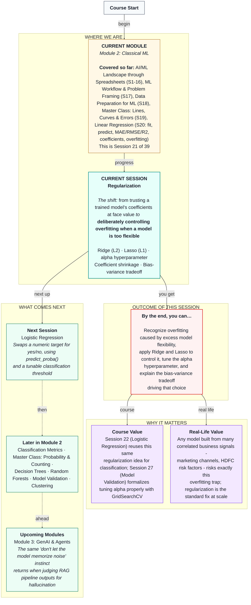

# Mental Map — Regularization
> Academic Session 21 · Module 2: Classical ML

```mermaid
%%{init: {'themeVariables': {'fontSize': '32px', 'fontFamily': 'sans-serif'}, 'flowchart': {'htmlLabels': true, 'nodeSpacing': 50, 'rankSpacing': 80, 'wrappingWidth': 400, 'padding': 20}}}%%
flowchart TB

START["<b>Course Start</b>"]

subgraph foundation[" WHERE WE ARE "]
direction TB
    CURMOD["<b>CURRENT MODULE</b><br/><i>Module 2: Classical ML</i><br/>&nbsp;<br/><b>Covered so far:</b> AI/ML Landscape through Spreadsheets (S1-16), ML Workflow &amp; Problem Framing (S17), Data Preparation for ML (S18), Master Class: Lines, Curves &amp; Errors (S19), Linear Regression (S20: fit, predict, MAE/RMSE/R2, coefficients, overfitting)<br/>This is Session 21 of 39"]
    CURSES["<b>CURRENT SESSION</b><br/><b>Regularization</b><br/>&nbsp;<br/><i>The shift:</i> from trusting a trained model's coefficients at face value <i>to</i> <b>deliberately controlling overfitting when a model is too flexible</b><br/>&nbsp;<br/>Ridge (L2) · Lasso (L1) · alpha hyperparameter<br/>Coefficient shrinkage · Bias-variance tradeoff"]
end

subgraph outcome[" OUTCOME OF THIS SESSION "]
direction TB
    OUT["<b>By the end, you can…</b><br/>&nbsp;<br/>Recognize overfitting caused by excess model flexibility,<br/>apply Ridge and Lasso to control it, tune the alpha<br/>hyperparameter, and explain the bias-variance tradeoff<br/>driving that choice"]
end

subgraph value[" WHY IT MATTERS "]
direction TB
    CVAL["<b>Course Value</b><br/>Session 22 (Logistic Regression) reuses this same<br/>regularization idea for classification; Session 27 (Model<br/>Validation) formalizes tuning alpha properly with GridSearchCV"]
    RVAL["<b>Real-Life Value</b><br/>Any model built from many correlated business signals -<br/>marketing channels, HDFC risk factors - risks exactly this<br/>overfitting trap; regularization is the standard fix at scale"]
end

subgraph future[" WHAT COMES NEXT "]
direction TB
    U0["<b>Next Session</b><br/>Logistic Regression<br/><i>Swaps a numeric target for yes/no, using predict_proba()<br/>and a tunable classification threshold</i>"]
    U1["<b>Later in Module 2</b><br/>Classification Metrics · Master Class: Probability &amp; Counting ·<br/>Decision Trees · Random Forests · Model Validation · Clustering"]
    U2["<b>Upcoming Modules</b><br/>Module 3: GenAI &amp; Agents<br/><i>The same 'don't let the model memorize noise' instinct<br/>returns when judging RAG pipeline outputs for hallucination</i>"]
end

START ==>|" begin "| CURMOD
CURMOD ==>|" progress "| CURSES
CURSES ==>|" you get "| OUT
OUT ==>|" course "| CVAL
OUT ==>|" real life "| RVAL
CURSES ==>|" next up "| U0
U0 -.->|" then "| U1
U1 -.->|" ahead "| U2

classDef startBox fill:#F7FAFC,stroke:#4A5568,stroke-width:2px,color:#1A202C
classDef curModBox fill:#FFF8E6,stroke:#B7791F,stroke-width:2px,color:#1A202C
classDef curSessBox fill:#E6FFFA,stroke:#0D9488,stroke-width:3px,color:#1A202C
classDef outBox fill:#FEF2F2,stroke:#DC2626,stroke-width:3px,color:#1A202C
classDef valueBox fill:#F3E8FF,stroke:#7C3AED,stroke-width:2px,color:#1A202C
classDef futureBox fill:#ECFDF5,stroke:#047857,stroke-width:2px,color:#1A202C

class START startBox
class CURMOD curModBox
class CURSES curSessBox
class OUT outBox
class CVAL,RVAL valueBox
class U0,U1,U2 futureBox

linkStyle default stroke-width:2px
```
