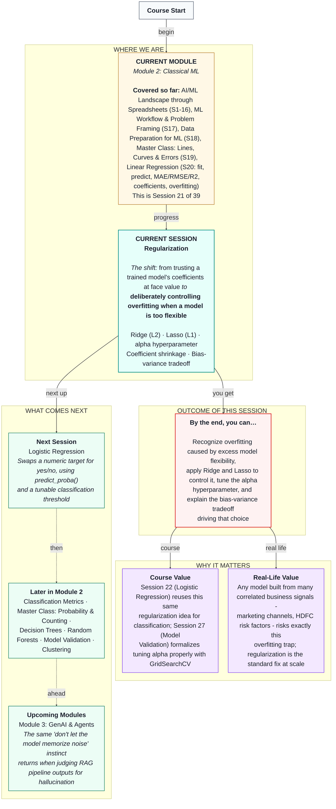

# Machine Learning: Regularization
> **Pre-Read — Academic Session 21** | Module 2: Classical ML
---
## Mental Map
> 📄 Also provided as a printable PDF in this folder: **mental-map: Regularization.pdf**



---

## What You'll Learn

In this pre-read, you'll discover:
- Why giving a linear model too many features can make it overfit, even when each feature is perfectly legitimate
- How Ridge regression shrinks coefficients to control this without removing any feature
- How Lasso regression can shrink some coefficients all the way to zero, effectively picking features for you
- How the `alpha` hyperparameter controls how aggressively either technique shrinks coefficients
- What the bias-variance tradeoff means, in plain language, and why it explains why regularization works

---

## A. Recognizing Overfitting Caused by Too Much Flexibility

**💡 Analogy:** Recall Session 17's memorizing student. Now imagine a second student who, instead of memorizing, tries to account for *every single detail* of the practice exam — the color of the pen used, the time of day, how many questions were on the previous page — treating all of it as meaningful. They'll ace the practice exam by "explaining" its quirks in absurd detail, and then flounder on the real exam, which doesn't share those same irrelevant quirks.

**One-line definition: A model overfits when it has enough flexibility (often from too many features relative to the amount of data) to fit noise in the training data as if it were a real pattern.**

**Worked example:** Take our Session 20 delivery-time model and add several columns of pure random noise — numbers with no real relationship to delivery time at all. A plain `LinearRegression` will still assign each of them a coefficient, because it will find *some* small, coincidental pattern in the training data's noise and treat it as real. With few training rows and many such features, this can inflate training performance while quietly hurting test performance.

**⚠️ Common trap:** Overfitting isn't caused by "bad" features — even genuinely irrelevant, purely random features get non-zero coefficients from plain linear regression, because the model has no built-in instinct to say "this one doesn't matter." That instinct has to be added deliberately — which is exactly what regularization does.

---

## B. Ridge Regression: Shrinking Without Removing

**💡 Analogy:** Picture a strict manager who doesn't ban any single input to a decision, but caps how much influence any one factor is allowed to have — discouraging the model from leaning too heavily on any single feature, without ever eliminating one outright.

**One-line definition: Ridge regression adds a penalty for having large coefficients, which shrinks every coefficient toward (but not exactly to) zero.**

```python
from sklearn.linear_model import Ridge

ridge_model = Ridge(alpha=10)
ridge_model.fit(X_train, y_train)
```

**Worked example:** Where plain `LinearRegression` might assign a noise feature a coefficient of `0.66`, Ridge with a properly tuned `alpha` might shrink that same coefficient down to `0.46` — smaller, less influential, but not eliminated. Meanwhile, the real, meaningful features (`distance_km`, `num_items`) keep coefficients close to their true values, since they carry an actual signal worth keeping.

**⚠️ Common trap:** Ridge never sets a coefficient to *exactly* zero, no matter how irrelevant that feature is. If you want the model to actively discard features, you need Lasso — section C.

---

## C. Lasso Regression: Shrinking All the Way to Zero

**💡 Analogy:** Now picture a manager who's even stricter: "if a factor genuinely isn't contributing, drop it from the decision entirely." Lasso applies exactly this discipline mathematically — it doesn't just shrink irrelevant coefficients, it can push them all the way to exactly zero, effectively removing that feature from the model.

**One-line definition: Lasso regression adds a penalty that can shrink some coefficients all the way to exactly zero, performing feature selection as a side effect.**

```python
from sklearn.linear_model import Lasso

lasso_model = Lasso(alpha=0.3)
lasso_model.fit(X_train, y_train)
```

**Worked example:** In our noisy delivery-time dataset, Lasso with a properly tuned `alpha` might zero out most of the 15 random noise features entirely, while keeping non-zero coefficients only for `distance_km`, `num_items`, and perhaps one or two features it's still slightly unsure about. This gives you, essentially, a built-in feature-selection report for free.

**⚠️ Common trap:** Lasso's zeroing-out behavior is powerful but not infallible — with correlated real features, it can arbitrarily zero out one of two genuinely useful, highly correlated features rather than the "right" one. It's a tool, not an oracle.

---

## D. Tuning the `alpha` Hyperparameter

**💡 Analogy:** Think of `alpha` as a dial controlling how strict the shrinkage rule is. Turn it up too high, and even genuinely useful predictors get squashed toward zero — the model becomes too simple to capture the real pattern (underfitting). Turn it too low, and it barely restrains anything — you're back to the original overfitting problem.

**One-line definition: `alpha` controls the strength of the regularization penalty — higher values shrink coefficients more aggressively.**

**Worked example:** At `alpha=10`, our Ridge model's noise-feature coefficients shrink noticeably while real-feature coefficients stay strong. Push `alpha` far higher, say to 1000, and even `distance_km`'s coefficient would start shrinking toward zero too, hurting the model's ability to capture the real pattern.

**⚠️ Common trap:** There's no universal "correct" alpha — it depends on the specific dataset and must be found by trying several values and comparing test performance (a proper, systematic version of this search is Session 27's `GridSearchCV`). Today, we tune by hand and observe the effect.

---

## E. The Bias-Variance Tradeoff, in Plain Language

**💡 Analogy:** Imagine two approaches to a restaurant food-quality inspection. Inspector A applies one broad, simple rule to every dish ("if it's above 60°C, it's fine") — fast, consistent, but too crude to catch real problems (**high bias**, underfitting). Inspector B obsesses over every tiny detail of each specific dish that day — plating angle, garnish placement, the exact mood of that day's chef — catching nothing generalizable and reacting wildly differently kitchen to kitchen (**high variance**, overfitting).

**One-line definition: The bias-variance tradeoff describes the balance between a model being too simple to capture real patterns (high bias) and too sensitive to the specific quirks of its training data (high variance).**

Regularization is a deliberate trade: by adding a small amount of bias (shrinking coefficients away from their "perfect" training-data values), we buy a meaningful reduction in variance (less sensitivity to that specific training set's noise) — usually a good trade when the alternative is overfitting.


**⚠️ Common trap:** Assuming more regularization is always better. Push `alpha` too far and you swing from overfitting straight past the sweet spot into underfitting — the goal is balance, not maximum shrinkage.

---

## Quick Reference — Which Regularization Do I Need?

| Your situation | Use this | Because |
|---|---|---|
| Plain regression overfits, but you believe every feature is somewhat relevant | Ridge | Shrinks all coefficients smoothly without discarding any feature |
| You suspect many features are irrelevant and want automatic feature selection | Lasso | Can zero out irrelevant coefficients entirely |
| You're unsure how strict the penalty should be | Try several `alpha` values and compare test performance | No universal correct value exists |
| Train performance is much higher than test performance | Regularization (Ridge or Lasso) | Directly targets the overfitting gap |
| Both train and test performance are poor | More/better features or a more flexible model, not regularization | That's underfitting, the opposite problem |

---

## Practice Exercises

1. **Concept Detective** — A model has 3 real features and 20 randomly generated noise features. Plain `LinearRegression` gives every noise feature a non-zero coefficient. Why does this happen even though the noise features have no real relationship to the target?

2. **Spot the Error** — A classmate sets `alpha=1000` for Ridge, sees train and test R² both drop to near zero, and concludes "regularization doesn't work." What actually happened?

3. **Real-Life Application** — An HDFC credit model includes both `monthly_income` and 15 loosely related transaction-category spending columns. Which regularization technique would you reach for first, and why?

4. **Pattern Recognition** — Model A (no regularization): train R²=0.99, test R²=0.70. Model B (Ridge, alpha=10): train R²=0.95, test R²=0.90. Which model would you deploy, and what does the comparison tell you about the tradeoff?

5. **Planning Ahead** — Sketch, in your own words, what you'd expect to happen to a Lasso model's coefficients as you slowly increase `alpha` from 0 to a very large number.

---

> ✅ **You're done!** You can now recognize overfitting driven by excess model flexibility, apply Ridge and Lasso to control it, explain what the `alpha` hyperparameter does, and describe the bias-variance tradeoff that explains why this all works.
>
> Next up: **Session 22 — Logistic Regression**, where we swap our numeric delivery-time target for a yes/no outcome, and learn to interpret predicted probabilities with `predict_proba()`.
