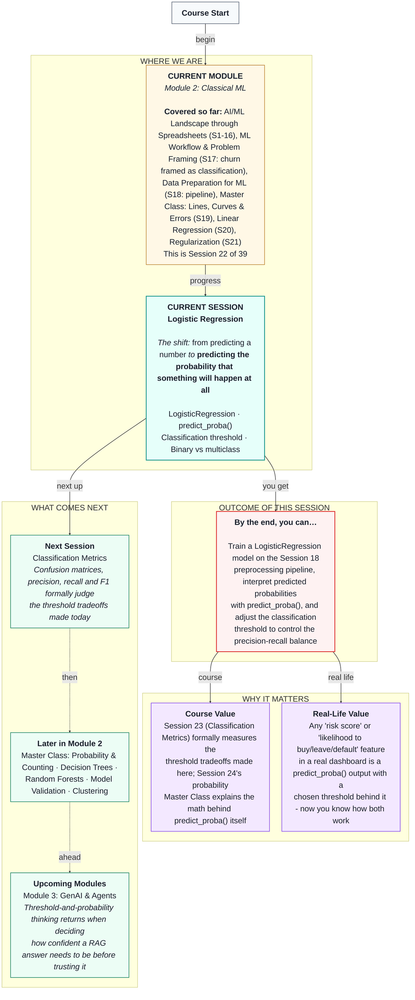

# Mental Map — Logistic Regression
> Academic Session 22 · Module 2: Classical ML

```mermaid
%%{init: {'themeVariables': {'fontSize': '32px', 'fontFamily': 'sans-serif'}, 'flowchart': {'htmlLabels': true, 'nodeSpacing': 50, 'rankSpacing': 80, 'wrappingWidth': 400, 'padding': 20}}}%%
flowchart TB

START["<b>Course Start</b>"]

subgraph foundation[" WHERE WE ARE "]
direction TB
    CURMOD["<b>CURRENT MODULE</b><br/><i>Module 2: Classical ML</i><br/>&nbsp;<br/><b>Covered so far:</b> AI/ML Landscape through Spreadsheets (S1-16), ML Workflow &amp; Problem Framing (S17: churn framed as classification), Data Preparation for ML (S18: pipeline), Master Class: Lines, Curves &amp; Errors (S19), Linear Regression (S20), Regularization (S21)<br/>This is Session 22 of 39"]
    CURSES["<b>CURRENT SESSION</b><br/><b>Logistic Regression</b><br/>&nbsp;<br/><i>The shift:</i> from predicting a number <i>to</i> <b>predicting the probability that something will happen at all</b><br/>&nbsp;<br/>LogisticRegression · predict_proba()<br/>Classification threshold · Binary vs multiclass"]
end

subgraph outcome[" OUTCOME OF THIS SESSION "]
direction TB
    OUT["<b>By the end, you can…</b><br/>&nbsp;<br/>Train a LogisticRegression model on the Session 18<br/>preprocessing pipeline, interpret predicted probabilities<br/>with predict_proba(), and adjust the classification<br/>threshold to control the precision-recall balance"]
end

subgraph value[" WHY IT MATTERS "]
direction TB
    CVAL["<b>Course Value</b><br/>Session 23 (Classification Metrics) formally measures the<br/>threshold tradeoffs made here; Session 24's probability<br/>Master Class explains the math behind predict_proba() itself"]
    RVAL["<b>Real-Life Value</b><br/>Any 'risk score' or 'likelihood to buy/leave/default' feature<br/>in a real dashboard is a predict_proba() output with a<br/>chosen threshold behind it - now you know how both work"]
end

subgraph future[" WHAT COMES NEXT "]
direction TB
    U0["<b>Next Session</b><br/>Classification Metrics<br/><i>Confusion matrices, precision, recall and F1 formally judge<br/>the threshold tradeoffs made today</i>"]
    U1["<b>Later in Module 2</b><br/>Master Class: Probability &amp; Counting · Decision Trees ·<br/>Random Forests · Model Validation · Clustering"]
    U2["<b>Upcoming Modules</b><br/>Module 3: GenAI &amp; Agents<br/><i>Threshold-and-probability thinking returns when deciding<br/>how confident a RAG answer needs to be before trusting it</i>"]
end

START ==>|" begin "| CURMOD
CURMOD ==>|" progress "| CURSES
CURSES ==>|" you get "| OUT
OUT ==>|" course "| CVAL
OUT ==>|" real life "| RVAL
CURSES ==>|" next up "| U0
U0 -.->|" then "| U1
U1 -.->|" ahead "| U2

classDef startBox fill:#F7FAFC,stroke:#4A5568,stroke-width:2px,color:#1A202C
classDef curModBox fill:#FFF8E6,stroke:#B7791F,stroke-width:2px,color:#1A202C
classDef curSessBox fill:#E6FFFA,stroke:#0D9488,stroke-width:3px,color:#1A202C
classDef outBox fill:#FEF2F2,stroke:#DC2626,stroke-width:3px,color:#1A202C
classDef valueBox fill:#F3E8FF,stroke:#7C3AED,stroke-width:2px,color:#1A202C
classDef futureBox fill:#ECFDF5,stroke:#047857,stroke-width:2px,color:#1A202C

class START startBox
class CURMOD curModBox
class CURSES curSessBox
class OUT outBox
class CVAL,RVAL valueBox
class U0,U1,U2 futureBox

linkStyle default stroke-width:2px
```
