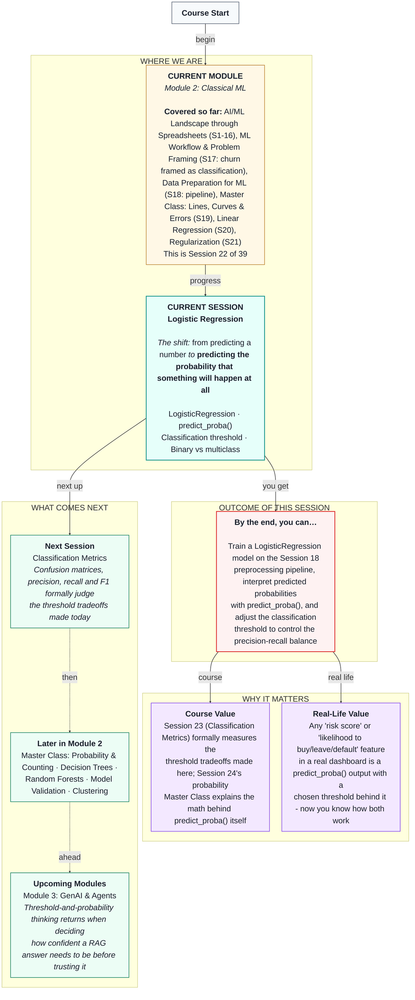

# Machine Learning: Logistic Regression
> **Pre-Read — Academic Session 22** | Module 2: Classical ML
---
## Mental Map
> 📄 Also provided as a printable PDF in this folder: **mental-map: Logistic Regression.pdf**



---

## What You'll Learn

In this pre-read, you'll discover:
- Why plain linear regression breaks down when predicting a yes/no outcome, and how logistic regression fixes it
- How to train a `LogisticRegression` model directly on top of Session 18's preprocessing pipeline
- How `predict_proba()` gives you a probability, not just a yes/no answer
- How adjusting the classification threshold changes which mistakes your model makes
- The difference between binary and multiclass classification

---

## A. From Predicting a Number to Predicting a Probability

**💡 Analogy:** Recall Session 17's Swiggy churn question — will this partner churn, yes or no? If we tried to answer this with plain linear regression, nothing would stop it from predicting nonsense values like `-0.3` or `1.4` — numbers that don't correspond to any sensible "probability of churning." We need something that always outputs a valid probability, between 0 and 1, no matter what.

**One-line definition: Logistic regression uses a mathematical function (the sigmoid) to squash any raw prediction into a valid probability between 0 and 1.**

**Worked example:** Think of the sigmoid as a pressure valve: no matter how strong the raw internal "score" going in, the output that comes out is always capped between 0 and 1 — this is what makes the output interpretable as a genuine probability rather than an arbitrary number.

**⚠️ Common trap:** Despite the name, logistic regression is a **classification** technique, not a regression one — the "regression" in the name is a historical artifact of how the underlying math developed, not a hint about what kind of problem it solves.

---

## B. Training LogisticRegression on the Session 18 Pipeline

**💡 Analogy:** Session 18 built an assembly line — wash, chop, cook, but never plate. Today, we finally attach the last station: the decision-maker.

```python
from sklearn.linear_model import LogisticRegression

pipeline = Pipeline(steps=[
    ("preprocessing", preprocessor),   # from Session 18
    ("classifier", LogisticRegression()),
])

pipeline.fit(X_train, y_train)
```

**Worked example:** Using the exact same `city`, `vehicle_type`, `orders_last_30_days`, `avg_rating`, and `months_active` columns from Session 18 — now predicting `churned` — this single `pipeline.fit()` call handles encoding, scaling, *and* training the classifier, all fit only on the training data, exactly as Session 18's leakage rule requires.

**⚠️ Common trap:** Nothing about adding a classifier changes the leakage discipline from Session 18 — `.fit()` still happens only once, on `X_train`, `y_train`. The pipeline handles keeping preprocessing and modeling in the correct order automatically.

---

## C. Interpreting `predict_proba()`

**💡 Analogy:** A weather forecast that says "70% chance of rain" is far more useful than a blunt "it will rain" or "it won't." `predict_proba()` gives you that same richer information for classification — a probability, not just a final yes/no call.

```python
probabilities = pipeline.predict_proba(X_test)
```

**Worked example:** For a given delivery partner, `predict_proba()` might return `[0.82, 0.18]` — an 82% chance of "no churn" and an 18% chance of "churn." `.predict()`, by contrast, just applies a default cutoff (0.5) and returns a single 0 or 1.

**⚠️ Common trap:** `.predict()`'s default 0.5 cutoff isn't a law of nature — it's just a default. Section D shows why changing it matters.

---

## D. Adjusting the Classification Threshold

**💡 Analogy:** Recall Session 17's cost-of-mistakes debate: missing a real churner (false negative) costs a lost partner with zero chance to intervene; flagging someone who wasn't leaving (false positive) wastes a retention incentive. The classification threshold is the exact dial that controls this balance.

**One-line definition: The classification threshold is the probability cutoff above which a prediction is called "positive" — lowering it catches more true positives but also more false alarms; raising it does the opposite.**

**Worked example, using our Swiggy churn model:**

| Threshold | Precision | Recall |
|---|---|---|
| 0.3 (lower — more cautious about missing churners) | 0.57 | 0.89 |
| 0.5 (default) | 0.83 | 0.56 |
| 0.7 (higher — more cautious about false alarms) | 1.00 | 0.11 |

At threshold 0.3, we catch 89% of actual churners, but only 57% of our "will churn" flags turn out correct. At threshold 0.7, every flag we raise is correct (100% precision), but we catch only 11% of actual churners.

**⚠️ Common trap:** There's no universally "correct" threshold — like `alpha` in Session 21, it must be chosen based on which mistake costs the business more, exactly the debate we had in Session 17.

---

## E. Binary vs. Multiclass Classification

**💡 Analogy:** Our churn question is **binary** — churn or no churn, exactly two outcomes. But imagine instead classifying each partner into "loyal," "at-risk," or "churned" — three categories, none of which is naturally "more positive" than another. That's **multiclass** classification.

**One-line definition: Binary classification has exactly two possible outcomes; multiclass classification has three or more.**

`LogisticRegression` handles both — for multiclass problems, it internally trains multiple binary comparisons (a strategy sometimes called one-vs-rest) and combines them, though the details are outside today's scope.

**⚠️ Common trap:** Don't confuse multiclass classification (multiple categories, one correct answer per row) with multi-label classification (multiple correct answers can apply to the same row) — the second is a different, more advanced problem we won't cover today.

---

## Quick Reference — Reading a Logistic Regression Model

| Your situation | Use this | Because |
|---|---|---|
| You need a probability, not just yes/no | `predict_proba()` | Returns the underlying probability for each class |
| You need a final yes/no decision at the default cutoff | `predict()` | Applies the standard 0.5 threshold automatically |
| Missing a positive case is costly | Lower the threshold | Increases recall, catches more true positives (at the cost of more false alarms) |
| False alarms are costly | Raise the threshold | Increases precision, reduces false alarms (at the cost of missing more true positives) |
| Your target has 3+ unordered categories | Multiclass classification | Binary classification only handles exactly two outcomes |

---

## Practice Exercises

1. **Concept Detective** — Why can't we just use Session 20's `LinearRegression` directly on a 0/1 churn label instead of `LogisticRegression`?

2. **Real-Life Application** — An HDFC fraud-detection model returns `predict_proba() = [0.35, 0.65]` for a transaction. In plain language, what does this mean, and what would `.predict()` return at the default threshold?

3. **Spot the Error** — A classmate says "I lowered my threshold and now my model is just better." What's incomplete about this claim?

4. **Pattern Recognition** — Using the threshold table in section D, describe in one sentence what happens to precision and recall as the threshold rises from 0.3 to 0.7.

5. **Planning Ahead** — A hospital wants to flag patients at risk of a rare but serious condition. Would you recommend a lower or higher classification threshold, and why, in terms of which mistake is more costly here?

---

> ✅ **You're done!** You can now explain why logistic regression squashes predictions into valid probabilities, train a classifier on top of a preprocessing pipeline, interpret `predict_proba()` output, adjust the classification threshold deliberately, and distinguish binary from multiclass classification.
>
> Next up: **Session 23 — Classification Metrics**, where we formally measure exactly what today's threshold choices trade off, using the confusion matrix, precision, recall, and F1.
