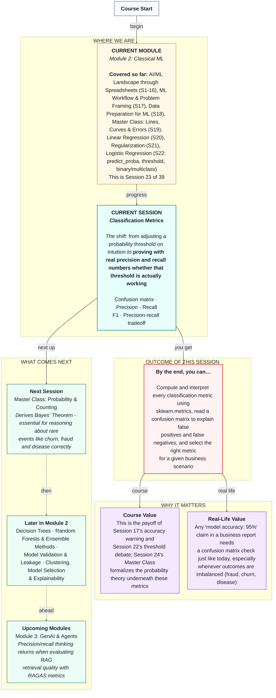

# Mental Map — Classification Metrics
> Academic Session 23 · Module 2: Classical ML

```mermaid
%%{init: {'themeVariables': {'fontSize': '32px', 'fontFamily': 'sans-serif'}, 'flowchart': {'htmlLabels': true, 'nodeSpacing': 50, 'rankSpacing': 80, 'wrappingWidth': 400, 'padding': 20}}}%%
flowchart TB

START["<b>Course Start</b>"]

subgraph foundation[" WHERE WE ARE "]
direction TB
    CURMOD["<b>CURRENT MODULE</b><br/><i>Module 2: Classical ML</i><br/>&nbsp;<br/><b>Covered so far:</b> AI/ML Landscape through Spreadsheets (S1-16), ML Workflow &amp; Problem Framing (S17), Data Preparation for ML (S18), Master Class: Lines, Curves &amp; Errors (S19), Linear Regression (S20), Regularization (S21), Logistic Regression (S22: predict_proba, threshold, binary/multiclass)<br/>This is Session 23 of 39"]
    CURSES["<b>CURRENT SESSION</b><br/><b>Classification Metrics</b><br/>&nbsp;<br/><i>The shift:</i> from adjusting a probability threshold on intuition <i>to</i> <b>proving with real precision and recall numbers whether that threshold is actually working</b><br/>&nbsp;<br/>Confusion matrix · Precision · Recall<br/>F1 · Precision-recall tradeoff"]
end

subgraph outcome[" OUTCOME OF THIS SESSION "]
direction TB
    OUT["<b>By the end, you can…</b><br/>&nbsp;<br/>Compute and interpret every classification metric using<br/>sklearn.metrics, read a confusion matrix to explain false<br/>positives and false negatives, and select the right metric<br/>for a given business scenario"]
end

subgraph value[" WHY IT MATTERS "]
direction TB
    CVAL["<b>Course Value</b><br/>This is the payoff of Session 17's accuracy warning and<br/>Session 22's threshold debate; Session 24's Master Class<br/>formalizes the probability theory underneath these metrics"]
    RVAL["<b>Real-Life Value</b><br/>Any 'model accuracy: 95%' claim in a business report needs<br/>a confusion matrix check just like today, especially<br/>whenever outcomes are imbalanced (fraud, churn, disease)"]
end

subgraph future[" WHAT COMES NEXT "]
direction TB
    U0["<b>Next Session</b><br/>Master Class: Probability &amp; Counting<br/><i>Derives Bayes' Theorem - essential for reasoning about rare<br/>events like churn, fraud and disease correctly</i>"]
    U1["<b>Later in Module 2</b><br/>Decision Trees · Random Forests &amp; Ensemble Methods ·<br/>Model Validation &amp; Leakage · Clustering, Model Selection<br/>&amp; Explainability"]
    U2["<b>Upcoming Modules</b><br/>Module 3: GenAI &amp; Agents<br/><i>Precision/recall thinking returns when evaluating RAG<br/>retrieval quality with RAGAS metrics</i>"]
end

START ==>|" begin "| CURMOD
CURMOD ==>|" progress "| CURSES
CURSES ==>|" you get "| OUT
OUT ==>|" course "| CVAL
OUT ==>|" real life "| RVAL
CURSES ==>|" next up "| U0
U0 -.->|" then "| U1
U1 -.->|" ahead "| U2

classDef startBox fill:#F7FAFC,stroke:#4A5568,stroke-width:2px,color:#1A202C
classDef curModBox fill:#FFF8E6,stroke:#B7791F,stroke-width:2px,color:#1A202C
classDef curSessBox fill:#E6FFFA,stroke:#0D9488,stroke-width:3px,color:#1A202C
classDef outBox fill:#FEF2F2,stroke:#DC2626,stroke-width:3px,color:#1A202C
classDef valueBox fill:#F3E8FF,stroke:#7C3AED,stroke-width:2px,color:#1A202C
classDef futureBox fill:#ECFDF5,stroke:#047857,stroke-width:2px,color:#1A202C

class START startBox
class CURMOD curModBox
class CURSES curSessBox
class OUT outBox
class CVAL,RVAL valueBox
class U0,U1,U2 futureBox

linkStyle default stroke-width:2px
```
