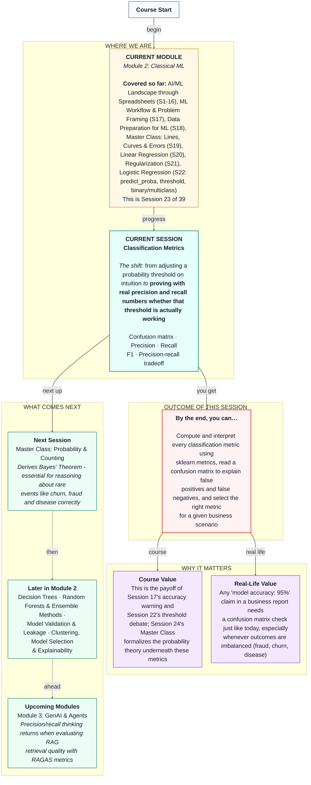

# Machine Learning: Classification Metrics
> **Pre-Read — Academic Session 23** | Module 2: Classical ML
---
## Mental Map
> 📄 Also provided as a printable PDF in this folder: **mental-map: Classification Metrics.pdf**

---

## What You'll Learn

In this pre-read, you'll discover:
- How a confusion matrix breaks every prediction into four honest categories
- Why accuracy alone can be dangerously misleading — and finally, the proof behind Session 17's warning
- What precision and recall each actually measure, and how they can pull in opposite directions
- How F1 balances the two when neither alone tells the full story
- How to choose the right metric for a specific business scenario

---

## A. The Confusion Matrix: Four Honest Categories

**💡 Analogy:** Recall Session 22's airport security analogy. Every bag screened falls into exactly one of four outcomes: a real threat correctly caught, an innocent bag wrongly flagged, a real threat missed entirely, or an innocent bag correctly cleared. A **confusion matrix** is simply this same four-way breakdown, applied to any classifier's predictions.

**One-line definition: A confusion matrix counts every prediction into four categories: True Positive, True Negative, False Positive, and False Negative.**

| | Predicted: No Churn | Predicted: Churn |
|---|---|---|
| **Actual: No Churn** | True Negative (TN) | False Positive (FP) |
| **Actual: Churn** | False Negative (FN) | True Positive (TP) |

**Worked example:** For our Swiggy churn model at the default 0.5 threshold, on 60 test partners, the confusion matrix might read: 45 True Negatives, 3 False Positives, 0 False Negatives, 12 True Positives. Every single test partner falls into exactly one of these four boxes — no exceptions.

**⚠️ Common trap:** Which class counts as "positive" is a choice, not a fact of nature — here, "churn" is positive because it's the outcome we care about detecting. Always confirm which class a confusion matrix treats as positive before reading it.

---

## B. Accuracy's Blind Spot — Finally, the Proof

**💡 Analogy:** Recall Session 17's `DummyClassifier` baseline, which scored roughly 91% accuracy on churn data just by always guessing "no churn" — because most partners genuinely don't churn. That number felt deceptively good. Today we can finally prove exactly why.

**One-line definition: Accuracy is the fraction of all predictions that were correct — but it treats every correct or incorrect prediction as equally important, which breaks down badly when one outcome is rare.**

**Worked example:** A `DummyClassifier` that always predicts "no churn" on a test set where 20% of partners actually churn will score 80% accuracy — while catching **zero** actual churners. Its confusion matrix reveals the truth immediately: 0 True Positives, 0 False Positives, but also 0 True Negatives correctly identified as risk cases — every single actual churner becomes a False Negative.

**⚠️ Common trap:** A high accuracy number, by itself, tells you almost nothing about whether a model is actually useful when outcomes are imbalanced. Always check the confusion matrix before trusting an accuracy figure — especially for rare-event problems like churn, fraud, or disease detection.

---

## C. Precision: Of What We Flagged, How Many Were Right?

**💡 Analogy:** Imagine a security team that flags 20 bags as suspicious in a day. If only 5 of those actually contained anything concerning, the team's flags aren't very trustworthy — lots of wasted investigation time on false alarms. **Precision** measures exactly this: of everything you flagged as positive, what fraction was actually correct?

**One-line definition: Precision = True Positives ÷ (True Positives + False Positives) — of everyone flagged as positive, what fraction really was.**

**Worked example:** Our churn model at threshold 0.5 flags 15 partners as "will churn." Of those, 12 actually do churn (True Positives) and 3 don't (False Positives). Precision = 12 ÷ (12 + 3) = 0.80 — 80% of our flagged partners were genuinely at risk.

**⚠️ Common trap:** High precision doesn't guarantee you're catching most real cases — a model that only flags the single most obvious churner and is right about it would have perfect precision (100%) while missing almost everyone else who actually churns. That's what recall measures instead.

---

## D. Recall: Of What We Should Have Caught, How Many Did We?

**💡 Analogy:** Back to airport security — if 10 real threats passed through screening that day, and the team's flags caught only 6 of them, **recall** is what measures that: of everything that should have been flagged, how much actually was?

**One-line definition: Recall = True Positives ÷ (True Positives + False Negatives) — of everyone who was actually positive, what fraction did we catch?**

**Worked example:** In our test set, 12 partners actually churned. Our model correctly flagged all 12 of them (0 False Negatives). Recall = 12 ÷ (12 + 0) = 1.00 — we caught every single real churner in this particular test set.

**⚠️ Common trap:** High recall doesn't guarantee your flags are trustworthy — a model that flags *everyone* as "will churn" achieves perfect recall (100%) automatically, since it never misses a real case, but its precision would likely be terrible. Precision and recall each tell only half the story.

---

## E. F1 Score and Choosing the Right Metric

**💡 Analogy:** Imagine grading a student who scored perfectly on one exam but skipped every other exam entirely. A simple average of their scores might look fine, but it hides how lopsided their actual performance was. **F1 score** is a way of combining precision and recall that specifically punishes this kind of imbalance — a model needs to be reasonably good at *both* to score well on F1, not just excellent at one while being terrible at the other.

**One-line definition: F1 is the harmonic mean of precision and recall, rewarding models that balance both rather than maximizing just one.**

**Worked example:** With precision = 0.80 and recall = 1.00, F1 ≈ 0.89 — a strong balanced score. If instead precision had been 0.80 but recall only 0.10, F1 would drop sharply, reflecting that catching only 10% of real churners is a serious problem even with trustworthy flags.

**The precision-recall tradeoff, revisited with real numbers:** Recall Session 22's threshold sweep. Lowering the threshold tends to raise recall (catching more true cases) while lowering precision (more false alarms); raising the threshold tends to do the opposite. There is no threshold that maximizes both simultaneously — the right choice depends entirely on which mistake costs the business more.

| Business scenario | Prioritize | Why |
|---|---|---|
| Missing a churner is very costly (hard to win them back later) | Recall | Better to over-flag and investigate than miss real churners |
| Wasting a retention incentive is very costly (limited budget) | Precision | Better to flag conservatively and be confident when you do |
| Both mistakes matter roughly equally | F1 | Balances the two rather than favoring either |

**⚠️ Common trap:** There is no universally "best" classification metric — the right one depends entirely on the specific business scenario's cost structure, echoing exactly what Session 17 and Session 22 both argued qualitatively. Today gives you the actual numbers to make that argument rigorously.

---

## Quick Reference — Which Metric Answers Which Question?

| Your situation | Use this | Because |
|---|---|---|
| You want to know how often the model is right overall | Accuracy | Simple, but misleading with imbalanced outcomes |
| You want to know if flagged cases can be trusted | Precision | Measures correctness among what was flagged |
| You want to know if real cases are being missed | Recall | Measures coverage among what should have been flagged |
| You want one balanced number reflecting both | F1 | Harmonic mean punishes lopsided precision/recall |
| You're deciding where to set the threshold | Compare precision and recall across thresholds | The right cutoff depends on business cost, not a formula |

---

## Practice Exercises

1. **Concept Detective** — A fraud model has confusion matrix values TP=40, FP=200, FN=10, TN=9750. Compute precision and recall, and explain in plain language what each number reveals about this model's real-world usefulness.

2. **Spot the Error** — A classmate reports "our model has 98% accuracy" as sole proof it's ready for production, on a dataset where only 2% of cases are actually positive. What's missing from this claim?

3. **Real-Life Application** — For an HDFC loan default model, would you prioritize precision or recall? Justify your answer using the cost of each type of mistake.

4. **Pattern Recognition** — Model A: precision=0.95, recall=0.40. Model B: precision=0.60, recall=0.85. Which model would you choose for a rare, high-cost disease screening test, and why?

5. **Planning Ahead** — Explain, using the confusion matrix, exactly why Session 17's `DummyClassifier` scored high accuracy while being completely useless for the churn problem.

---

> ✅ **You're done!** You can now build and read a confusion matrix, explain precisely why accuracy misleads on imbalanced data, compute precision and recall, combine them with F1, and choose the right metric for a specific business scenario.
>
> Next up: **Session 24 — Master Class: Probability & Counting**, where we derive Bayes' Theorem — essential mathematics for reasoning correctly about rare events like churn, fraud, and disease.
