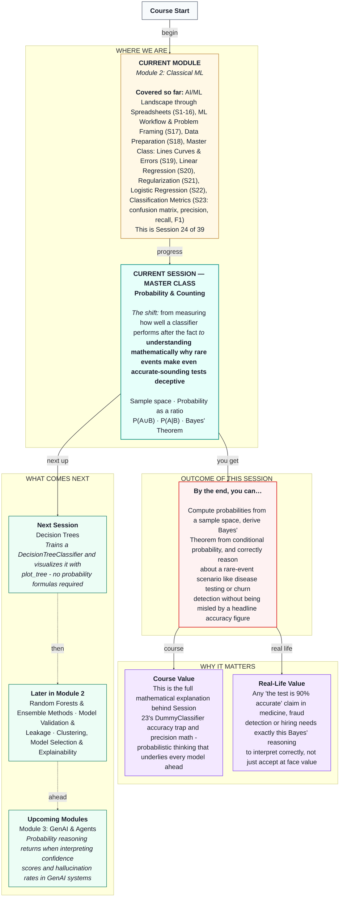

# Mental Map — Master Class: Probability & Counting
> Academic Session 24 · Module 2: Classical ML

```mermaid
%%{init: {'themeVariables': {'fontSize': '32px', 'fontFamily': 'sans-serif'}, 'flowchart': {'htmlLabels': true, 'nodeSpacing': 50, 'rankSpacing': 80, 'wrappingWidth': 400, 'padding': 20}}}%%
flowchart TB

START["<b>Course Start</b>"]

subgraph foundation[" WHERE WE ARE "]
direction TB
    CURMOD["<b>CURRENT MODULE</b><br/><i>Module 2: Classical ML</i><br/>&nbsp;<br/><b>Covered so far:</b> AI/ML Landscape through Spreadsheets (S1-16), ML Workflow &amp; Problem Framing (S17), Data Preparation (S18), Master Class: Lines Curves &amp; Errors (S19), Linear Regression (S20), Regularization (S21), Logistic Regression (S22), Classification Metrics (S23: confusion matrix, precision, recall, F1)<br/>This is Session 24 of 39"]
    CURSES["<b>CURRENT SESSION — MASTER CLASS</b><br/><b>Probability &amp; Counting</b><br/>&nbsp;<br/><i>The shift:</i> from measuring how well a classifier performs after the fact <i>to</i> <b>understanding mathematically why rare events make even accurate-sounding tests deceptive</b><br/>&nbsp;<br/>Sample space · Probability as a ratio<br/>P(A∪B) · P(A|B) · Bayes' Theorem"]
end

subgraph outcome[" OUTCOME OF THIS SESSION "]
direction TB
    OUT["<b>By the end, you can…</b><br/>&nbsp;<br/>Compute probabilities from a sample space, derive Bayes'<br/>Theorem from conditional probability, and correctly reason<br/>about a rare-event scenario like disease testing or churn<br/>detection without being misled by a headline accuracy figure"]
end

subgraph value[" WHY IT MATTERS "]
direction TB
    CVAL["<b>Course Value</b><br/>This is the full mathematical explanation behind Session<br/>23's DummyClassifier accuracy trap and precision math -<br/>probabilistic thinking that underlies every model ahead"]
    RVAL["<b>Real-Life Value</b><br/>Any 'the test is 90% accurate' claim in medicine, fraud<br/>detection or hiring needs exactly this Bayes' reasoning<br/>to interpret correctly, not just accept at face value"]
end

subgraph future[" WHAT COMES NEXT "]
direction TB
    U0["<b>Next Session</b><br/>Decision Trees<br/><i>Trains a DecisionTreeClassifier and visualizes it with<br/>plot_tree - no probability formulas required</i>"]
    U1["<b>Later in Module 2</b><br/>Random Forests &amp; Ensemble Methods · Model Validation &amp;<br/>Leakage · Clustering, Model Selection &amp; Explainability"]
    U2["<b>Upcoming Modules</b><br/>Module 3: GenAI &amp; Agents<br/><i>Probability reasoning returns when interpreting confidence<br/>scores and hallucination rates in GenAI systems</i>"]
end

START ==>|" begin "| CURMOD
CURMOD ==>|" progress "| CURSES
CURSES ==>|" you get "| OUT
OUT ==>|" course "| CVAL
OUT ==>|" real life "| RVAL
CURSES ==>|" next up "| U0
U0 -.->|" then "| U1
U1 -.->|" ahead "| U2

classDef startBox fill:#F7FAFC,stroke:#4A5568,stroke-width:2px,color:#1A202C
classDef curModBox fill:#FFF8E6,stroke:#B7791F,stroke-width:2px,color:#1A202C
classDef curSessBox fill:#E6FFFA,stroke:#0D9488,stroke-width:3px,color:#1A202C
classDef outBox fill:#FEF2F2,stroke:#DC2626,stroke-width:3px,color:#1A202C
classDef valueBox fill:#F3E8FF,stroke:#7C3AED,stroke-width:2px,color:#1A202C
classDef futureBox fill:#ECFDF5,stroke:#047857,stroke-width:2px,color:#1A202C

class START startBox
class CURMOD curModBox
class CURSES curSessBox
class OUT outBox
class CVAL,RVAL valueBox
class U0,U1,U2 futureBox

linkStyle default stroke-width:2px
```
