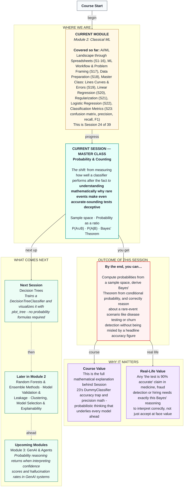

# Mathematics of Machine Learning: Probability & Counting
> **Pre-Read — Academic Session 24 (Master Class)** | Module 2: Classical ML
---
## Mental Map
> 📄 Also provided as a printable PDF in this folder: **mental-map: Master Class - Probability & Counting.pdf**

---

## What You'll Learn

In this pre-read, you'll discover:
- What a sample space and an event are, and how probability is just a ratio between them
- How to compute the probability of "either A or B" without double-counting
- How to compute the probability of "A given B," and why it's a fundamentally different question than "A and B together"
- How to derive Bayes' Theorem from conditional probability, from scratch
- Why a "90% accurate" test can still be wrong more often than right, when the thing it's testing for is rare

---

## A. Sample Space and Events

**💡 Analogy:** Think of every possible result of a T20 cricket match: Team A wins, Team B wins, or the match is tied/abandoned. That full list of every possible outcome is the **sample space**. "Team A wins" is one specific **event** — a subset of that sample space we're interested in.

**One-line definition: The sample space is the set of every possible outcome; an event is any subset of outcomes we care about.**

**Worked example:** Rolling a standard six-sided die, the sample space is {1, 2, 3, 4, 5, 6}. The event "rolling an even number" is the subset {2, 4, 6}.

**⚠️ Common trap:** An event doesn't have to be a single outcome — it can be any collection of outcomes from the sample space, including the whole space itself or none of it at all.

---

## B. Probability as a Ratio

**💡 Analogy:** A kirana shop owner notices that out of the last 30 days, sales exceeded ₹10,000 on 12 of them. The simplest possible estimate of "probability of a big sales day" is exactly this ratio: 12 out of 30.

**One-line definition: Probability of an event = (number of outcomes in the event) ÷ (number of outcomes in the sample space), assuming all outcomes are equally likely.**

**Worked example:** For our die, P(even number) = 3 outcomes {2,4,6} ÷ 6 total outcomes = 0.5.

**⚠️ Common trap:** This ratio definition only works cleanly when every individual outcome is equally likely. Real-world probabilities (like "chance of rain" or "chance a partner churns") are usually estimated from historical data rather than counted from a perfectly symmetric sample space — but the underlying ratio intuition still applies.

---

## C. P(A∪B): The Probability of Either Event

**💡 Analogy:** Imagine tracking customers at a Swiggy Instamart outlet: some bought snacks, some bought a cold drink, some bought both. If you want "the probability a customer bought snacks OR a cold drink," you can't just add the two separately — anyone who bought both would get counted twice.

**One-line definition: P(A∪B) = P(A) + P(B) − P(A∩B), where P(A∩B) is the probability of both happening together — subtracted once to undo the double-count.**

**Worked example:** Say P(bought snacks) = 0.4, P(bought cold drink) = 0.3, and P(bought both) = 0.1. Then P(bought snacks OR cold drink) = 0.4 + 0.3 − 0.1 = 0.6.

**⚠️ Common trap:** Forgetting to subtract the overlap is the single most common mistake with unions — it silently inflates the probability by double-counting anyone in both groups.

---

## D. P(A|B): The Probability of A, Given B

**💡 Analogy:** "What fraction of customers who bought a cold drink also bought snacks?" is a completely different question than "what fraction of all customers bought both?" The first question **shrinks your entire sample space down to just the cold-drink buyers first**, then asks about snacks only within that smaller group.

**One-line definition: P(A|B) = P(A∩B) ÷ P(B) — the probability of A, restricted to only the cases where B is already true.**

**Worked example:** Using the numbers above: P(snacks | cold drink) = P(both) ÷ P(cold drink) = 0.1 ÷ 0.3 ≈ 0.33. Even though only 10% of *all* customers bought both, a full 33% of cold-drink buyers also bought snacks — because we've narrowed our lens to just that group.

**⚠️ Common trap:** P(A|B) and P(A∩B) are **not the same number**, and confusing them is one of the most common reasoning errors in all of statistics. P(A∩B) is a slice of the *whole* sample space; P(A|B) is a slice of *just B's* portion of it.

---

## E. Deriving Bayes' Theorem — And Why It Matters

**💡 Analogy:** Suppose 1% of a population actually has a certain disease, and a diagnostic test is 90% accurate — meaning it correctly identifies 90% of people who truly have the disease (this is called **sensitivity**), and correctly clears 90% of people who don't (this is called **specificity**, implying a 10% false-positive rate among healthy people). If someone tests positive, what's the actual probability they have the disease? Most people's gut instinct says "around 90%." The real answer is dramatically lower — and Bayes' Theorem is exactly the tool that reveals why.

**Deriving it, from the definition of conditional probability alone — no shortcuts:**

We know: $$P(A|B) = \frac{P(A \cap B)}{P(B)}$$

And by the same definition, applied the other way: $$P(B|A) = \frac{P(A \cap B)}{P(A)} \implies P(A \cap B) = P(B|A) \times P(A)$$

Substituting this into the first equation gives us **Bayes' Theorem**:

$$P(A|B) = \frac{P(B|A) \times P(A)}{P(B)}$$

**Working the disease example numerically:**

- P(Disease) = 0.01 (1% of the population has it)
- P(Positive | Disease) = 0.90 (test correctly catches 90% of true cases — sensitivity)
- P(Positive | No Disease) = 0.10 (10% false-positive rate among the healthy — since specificity is 90%)

First, find P(Positive) overall, considering both groups:

$$P(\text{Positive}) = P(\text{Positive}|\text{Disease}) \times P(\text{Disease}) + P(\text{Positive}|\text{No Disease}) \times P(\text{No Disease})$$
$$P(\text{Positive}) = (0.90 \times 0.01) + (0.10 \times 0.99) = 0.009 + 0.099 = 0.108$$

Now apply Bayes' Theorem:

$$P(\text{Disease}|\text{Positive}) = \frac{0.90 \times 0.01}{0.108} = \frac{0.009}{0.108} \approx 0.083$$

**Only about 8.3%** — dramatically lower than the "90% accurate" headline number might suggest. This happens because the disease is so rare that the far larger group of healthy people, even with just a 10% false-positive rate, generates more false positives in absolute numbers than the small group of truly sick people generates true positives.

**⚠️ Common trap:** This is precisely the reasoning error behind Session 23's `DummyClassifier` discomfort, viewed from the opposite direction. When the positive class is rare, even a fairly accurate test or model produces a flood of false positives relative to true positives — which is exactly why precision (not just accuracy) matters so much for rare-event problems like churn, fraud, or disease detection.

---

## Quick Reference — Which Probability Concept Do I Need?

| Your situation | Use this | Because |
|---|---|---|
| Listing every possible outcome | Sample space | The foundation every other concept builds on |
| Estimating how likely one outcome is | Probability as a ratio | Favorable outcomes over total outcomes |
| "Either this or that happens" | P(A∪B) | Remember to subtract the overlap once |
| "Given that this happened, what about that?" | P(A\|B) | Restricts the sample space to the given condition first |
| "A test/model result is positive — what's the real probability of the underlying event?" | Bayes' Theorem | Accounts for how rare the event is, not just the test's accuracy |

---

## Practice Exercises

1. **Concept Detective** — A bag has 5 red and 3 blue marbles. What's the sample space, and what's P(drawing red)?

2. **Real-Life Application** — At a college, 40% of students play cricket, 25% play football, and 10% play both. What's P(plays cricket OR football)?

3. **Spot the Error** — A classmate computes P(A|B) by just dividing P(A) by P(B), ignoring the intersection entirely. What's wrong with this shortcut?

4. **Pattern Recognition** — If a disease is even rarer than 1% (say, 0.1%), and the test's accuracy stays the same, would you expect P(Disease|Positive) to go up or down compared to the worked example? Why?

5. **Planning Ahead** — A Swiggy fraud-detection model correctly flags 95% of true fraud cases and has a 5% false-positive rate among legitimate orders. If only 0.5% of all orders are actually fraudulent, use Bayes' Theorem to estimate what fraction of *flagged* orders are truly fraudulent — and compare this to Session 23's precision discussion.

---

> ✅ **You're done!** You can now define a sample space and event, compute probabilities as ratios, calculate P(A∪B) and P(A|B) correctly, derive Bayes' Theorem from conditional probability, and explain numerically why rare events make even "accurate" tests deceptive without careful reasoning.
>
> Next up: **Session 25 — Decision Trees**, where we shift from probability theory back to a hands-on classifier — training a `DecisionTreeClassifier` and visualizing exactly how it makes decisions with `plot_tree`.
