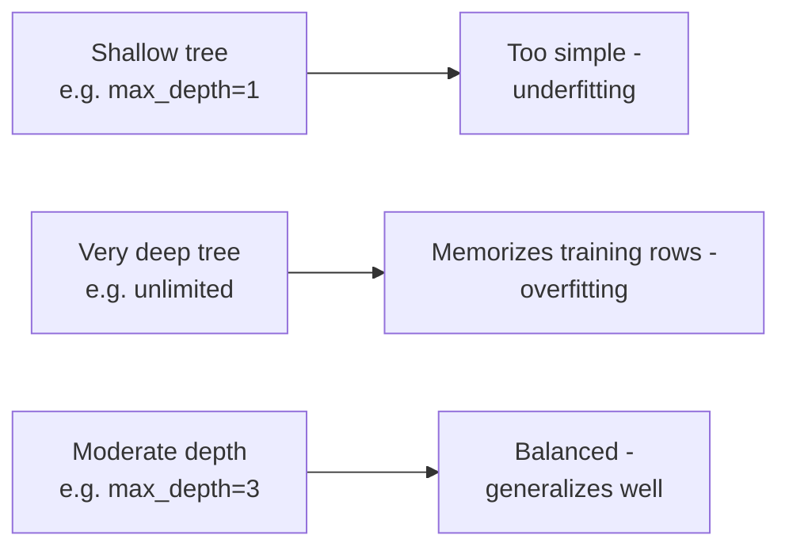

# Lecture Script: Machine Learning — Decision Trees
> **Instructor Reference** — Module 2: Classical ML | Academic Session 25 | Duration: 2 Hours | Instructor: Aswath Rao

---

## Session Overview
**Goal:** By the end of this session, students can train a `DecisionTreeClassifier`, visualize it with `plot_tree`, explain a specific prediction as a plain-language root-to-leaf path, and diagnose overfitting by comparing train/test accuracy across `max_depth` values.

**Student profile at this point:** Just finished a Master Class on probability and have a full toolkit of classification concepts (predict_proba, threshold, precision, recall) from Sessions 22-23. They have never worked with a genuinely interpretable model — every model so far has required reading numeric coefficients. Likely wrong assumption: several will assume more depth is always better, since "more detail = more accurate" feels intuitive. Boredom risk: low — visualizing an actual tree diagram is a strong hook, and this is the first model whose reasoning can be read in plain English.

**Key outcome:** Students should leave able to look at a train/test accuracy table across depths and correctly identify the sweet spot, using the exact same instinct built in Session 21 for regularization strength.

> 🎯 **The one sentence this session must land:** *A decision tree is a flowchart the algorithm builds for you — and max_depth is the exact same overfitting dial Session 21's alpha was, just controlling flexibility a different way.*

---

## Timing Breakdown

| Segment | Duration | Cumulative |
|---|---|---|
| Opening — "20 Questions, Automated" | 8 min | 8 min |
| Concept Block 1: What Is a Decision Tree? | 10 min | 18 min |
| Practical Block 1: Sketch a Tree By Hand | 8 min | 26 min |
| Concept Block 2: Training DecisionTreeClassifier | 10 min | 36 min |
| Concept Block 3: Visualizing with plot_tree | 10 min | 46 min |
| **BREAK** | 10 min | 56 min |
| Concept Block 4: Reading a Root-to-Leaf Path | 12 min | 68 min |
| Practical Block 2: Trace a Prediction | 8 min | 76 min |
| Concept Block 5: Overfitting via Depth | 12 min | 88 min |
| Practical Block 3: Live Coding Demo (TA Code) | 16 min | 104 min |
| Practical Block 4: Predict the Sweet Spot | 8 min | 112 min |
| Summary & Bridge | 4 min | 116 min |
| Q&A & Doubt Solving | 4 min | 120 min |

---

## Opening — "20 Questions, Automated" (8 min)

Open with this, verbatim-ish:

> "Who's played 20 Questions? You narrow down an answer by asking yes/no questions, each one cutting the space of possibilities roughly in half. 'Is it alive?' 'Is it bigger than a breadbox?' Today, we train a model that plays exactly this game with our data — except it figures out which questions to ask, and in what order, entirely on its own."

Pause. Ask the room:

> "Every model so far — linear regression, logistic regression — has made predictions using weighted combinations of numbers. Can anyone explain, in one plain-English sentence, *why* a specific customer got flagged as high-risk, using only the coefficients from Session 22?"

(Let someone try — it'll likely feel awkward or technical.)

> "That awkwardness ends today. Decision trees are the first model in this course whose reasoning you can read like a sentence."

**Pivot line:** "This session has two halves: first, how a tree makes decisions and how to read them; second, the exact same overfitting story from Session 21, told through a brand new dial."

**Context for sessions ahead:** "Session 26 takes today's single tree and combines many of them into a forest — everything you learn about how one tree thinks today directly explains why a forest of them works so well."

---

## Concept Block 1: What Is a Decision Tree? (10 min)

> "Think of a call-center troubleshooting flowchart: 'Is the device on?' If no, turn it on. If yes, 'Is it connected to Wi-Fi?' And so on — narrowing down step by step until you reach a final answer."

Write on the board:

> Node = one yes/no question about one feature
> Leaf = a final answer, reached after enough questions

> "For our Swiggy churn data, a tree might learn: 'orders_last_30_days ≤ 15?' → yes → 'avg_rating ≤ 4.3?' → yes → predict Churn."

### 🔴 The trap / highest-value moment
> "Unlike logistic regression, which applies the exact same weighted formula to every row, a tree can treat different rows completely differently depending on which questions they answer along the way. Write this down: *a tree's logic can branch; a linear model's logic can't.* This flexibility is both its biggest strength and, later this session, its biggest risk."

---

## Practical Block 1: Sketch a Tree By Hand (8 min)

Give students 4 sample partners (orders, rating) and their true churn labels. Ask them, in pairs, to sketch a simple 2-question tree on paper that would correctly classify all 4. 4 minutes, then cold-call a pair to draw theirs on the board.

---

## Concept Block 2: Training DecisionTreeClassifier (10 min)

> "Training a tree means letting the algorithm figure out which questions to ask and in what order — always picking, at each step, whichever yes/no split does the best job of separating churners from non-churners in the data it currently sees."

```python
from sklearn.tree import DecisionTreeClassifier

model = DecisionTreeClassifier(max_depth=3)
model.fit(X_train, y_train)
```

### 🔴 The trap / highest-value moment
> "Unlike `LogisticRegression` or `Ridge`, a tree doesn't need scaled numeric features — it only ever asks 'is this value above or below some threshold,' so raw scale doesn't affect which splits it finds. Write this down: *trees don't require feature scaling, unlike our linear models.*"

---

## Concept Block 3: Visualizing with `plot_tree` (10 min)

> "Imagine finally seeing that call-center flowchart drawn out on paper instead of experiencing it question by question. `plot_tree` does exactly this for a trained tree."

```python
from sklearn.tree import plot_tree
import matplotlib.pyplot as plt

plt.figure(figsize=(12, 8))
plot_tree(model, feature_names=feature_names, class_names=["No Churn', 'Churn"], filled=True)
plt.show()
```

> "The root question sits at the top, branches fan out for yes/no, and colored leaf boxes at the bottom show the final predicted class."

💬 Expect a question: "why is one leaf box a different shade than another?" Welcome it. Say: "`filled=True` colors each box by how confidently it favors one class — a useful visual cue we'll rely on when reading the diagram in a moment."

---

## BREAK (10 min)

---

## Concept Block 4: Reading a Root-to-Leaf Path (12 min)

> "Imagine explaining to a Swiggy ops manager exactly *why* the model flagged a specific partner — not 'the model said so,' but a clear trail: 'this partner placed fewer than 15 orders in the last 30 days, AND their rating was below 4.3 — exactly the pattern the model associates with churn.'"

Trace an example live on the board using the plotted tree from Concept Block 3:

> "Partner with orders=8, rating=4.1: root question 'orders ≤ 15?' → yes → next question 'rating ≤ 4.3?' → yes → leaf: Churn."

### 🔴 The trap / highest-value moment
> "This transparency is a genuine strength of a single tree, but it doesn't automatically survive once we combine many trees together next session. Write this down: *single-tree transparency is a trade-off we'll need to watch in Session 26.*"

---

## Practical Block 2: Trace a Prediction (8 min)

Show a new partner's feature values on screen and the plotted tree from earlier. Have students individually trace the root-to-leaf path and write the final prediction plus a one-sentence plain-English justification. Cold-call 2 students to read theirs aloud.

---

## Concept Block 5: Overfitting via Depth (12 min)

> "Recall Session 21's overzealous analyst, who explained every tiny detail of the training data instead of the real pattern. An unlimited-depth tree does exactly this — it keeps asking increasingly specific questions until every single training row is perfectly classified."

Draw the three-way contrast on the board:



### 🔴 The trap / highest-value moment
> "`max_depth` plays exactly the role `alpha` played in Session 21 — a dial trading flexibility for generalization. Write this down: *max_depth is this session's alpha.* There's no universally correct depth; it's found by comparing train and test performance across several values, exactly like Session 21's search."

---

## Practical Block 3: Live Coding Demo (TA Code) (16 min)

**Handoff line (must match TA code file's opening comment):** "Let's actually watch a tree overfit and then find its sweet spot in code — same Swiggy churn scenario, now with a decision tree instead of logistic regression."

Hand off to `ta-code - Session 25 - Decision Trees.py`, narrating each `# --- EXPLAIN ---` block aloud:

1. Rebuild the churn dataset (with a touch of realistic label noise added, so a perfect rule doesn't exist)
2. Fit an unlimited-depth tree — show train accuracy at 100% and a noticeably lower test accuracy, echoing Session 21's overfitting gap
3. Sweep `max_depth` from 1 to 10, printing train and test accuracy at each — point out the gap widening as depth increases
4. Identify the depth where test accuracy peaks — this is the sweet spot, exactly like Session 21's alpha search
5. Plot the tree at that sweet-spot depth using `plot_tree`, and trace one root-to-leaf example live, connecting back to Concept Block 4

💬 Expect a question: "why did accuracy stop improving with depth if the tree can perfectly fit training data?" Welcome it. Say: "That's exactly the overfitting story — perfectly fitting the training data doesn't mean perfectly capturing the real underlying pattern, especially once the tree starts reacting to noise we deliberately added."

---

## Practical Block 4: Predict the Sweet Spot (8 min)

Before revealing the final answer from the demo, show students a partial depth-sweep table (depths 1-5 only) and ask them to predict, in pairs, whether test accuracy will keep rising, plateau, or fall as depth increases further. Cold-call for predictions and reasoning, then reveal the full table from the demo to check.

---

## Summary & Bridge (4 min)

| Concept | The one thing to remember |
|---|---|
| Decision tree | A learned sequence of yes/no questions ending in a final answer |
| `DecisionTreeClassifier` | No feature scaling required, unlike linear models |
| `plot_tree` | Visualizes the full learned flowchart, best for shallow trees |
| Root-to-leaf path | A transparent, plain-English justification for any single prediction |
| `max_depth` | This session's overfitting dial — same role as Session 21's alpha |

Close on the thesis line: "A decision tree is a flowchart the algorithm builds for you — and max_depth is the exact same overfitting dial Session 21's alpha was, just controlling flexibility a different way."

**Bridge to next session:** "A single tree is transparent but can be unstable — small changes in training data can produce a very different tree. Session 26 fixes this by training many trees at once and combining their votes: Random Forests, which trade away some of today's plain-English interpretability for a substantial boost in accuracy and stability."

---

## Q&A & Doubt Solving (4 min)

**Q: Does a tree always split on the same feature at the root?**
→ Not necessarily — it depends on which feature and threshold best separates the classes at that point, which can change if the training data changes even slightly. This instability is exactly what Session 26 addresses.

**Q: Can a decision tree handle a numeric target instead of a category?**
→ Yes — `DecisionTreeRegressor` does this for numeric targets, using a similar splitting idea but predicting an average value at each leaf instead of a class.

**Q: What happens if two features would produce equally good splits?**
→ The algorithm picks one based on internal tie-breaking rules, but the choice can sometimes feel arbitrary — another reason single trees can be less stable than we'd like.

**Q: Is a shallower tree always more trustworthy?**
→ Not automatically — too shallow, and the tree may be too simple to capture a real pattern (underfitting). The right depth balances both risks, found by comparing train/test performance like we did today.

**Q: Do trees suffer from the same "accuracy is misleading" trap from Session 23?**
→ Yes, completely — a tree's predictions still need to be checked with precision, recall, and a confusion matrix on imbalanced data, exactly like any other classifier.

---

## Instructor Notes
- **Words not yet earned:** RandomForestClassifier, feature_importances_, joblib, bagging, ensemble — all Session 26.
- **Biggest risk in this session:** students assuming "more depth = more accurate" by default — repeat the max_depth-as-alpha framing at least twice to counter this.
- **Board management:** keep the three-way depth contrast diagram and the root-to-leaf trace example both visible from Concept Block 4 through Practical Block 4.
- **Common confusions, numbered:**
  1. Assuming deeper trees are always better, mirroring the "more regularization is worse" confusion from Session 21 but in reverse
  2. Expecting to need feature scaling for a tree, out of habit from Sessions 20-22
  3. Treating a single tree's root-to-leaf explanation as guaranteed to survive into ensemble methods
  4. Confusing a node's yes/no question with the final leaf's predicted class
- **Cross-references:** Session 26 (Random Forests) directly extends today's single-tree instability into an ensemble solution; Session 28 (Clustering, Model Selection & Explainability) revisits interpretability using feature importances built on today's tree-splitting logic.
- **Local/cultural context notes:** the churn dataset today deliberately includes a small amount of label noise (about 15% of labels flipped) so that overfitting genuinely appears in the depth sweep — without this noise, the clean rule used in Sessions 17-23 would let even a very deep tree generalize perfectly, hiding the exact lesson this session needs to teach.
