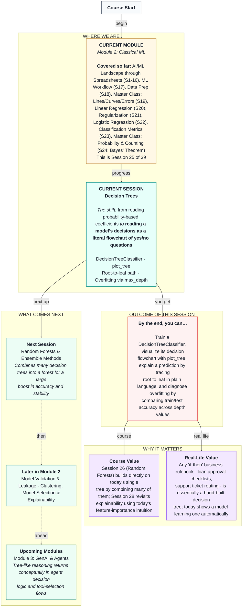

# Mental Map — Decision Trees
> Academic Session 25 · Module 2: Classical ML

```mermaid
%%{init: {'themeVariables': {'fontSize': '32px', 'fontFamily': 'sans-serif'}, 'flowchart': {'htmlLabels': true, 'nodeSpacing': 50, 'rankSpacing': 80, 'wrappingWidth': 400, 'padding': 20}}}%%
flowchart TB

START["<b>Course Start</b>"]

subgraph foundation[" WHERE WE ARE "]
direction TB
    CURMOD["<b>CURRENT MODULE</b><br/><i>Module 2: Classical ML</i><br/>&nbsp;<br/><b>Covered so far:</b> AI/ML Landscape through Spreadsheets (S1-16), ML Workflow (S17), Data Prep (S18), Master Class: Lines/Curves/Errors (S19), Linear Regression (S20), Regularization (S21), Logistic Regression (S22), Classification Metrics (S23), Master Class: Probability &amp; Counting (S24: Bayes' Theorem)<br/>This is Session 25 of 39"]
    CURSES["<b>CURRENT SESSION</b><br/><b>Decision Trees</b><br/>&nbsp;<br/><i>The shift:</i> from reading probability-based coefficients <i>to</i> <b>reading a model's decisions as a literal flowchart of yes/no questions</b><br/>&nbsp;<br/>DecisionTreeClassifier · plot_tree<br/>Root-to-leaf path · Overfitting via max_depth"]
end

subgraph outcome[" OUTCOME OF THIS SESSION "]
direction TB
    OUT["<b>By the end, you can…</b><br/>&nbsp;<br/>Train a DecisionTreeClassifier, visualize its decision<br/>flowchart with plot_tree, explain a prediction by tracing<br/>root to leaf in plain language, and diagnose overfitting by<br/>comparing train/test accuracy across depth values"]
end

subgraph value[" WHY IT MATTERS "]
direction TB
    CVAL["<b>Course Value</b><br/>Session 26 (Random Forests) builds directly on today's single<br/>tree by combining many of them; Session 28 revisits<br/>explainability using today's feature-importance intuition"]
    RVAL["<b>Real-Life Value</b><br/>Any 'if-then' business rulebook - loan approval checklists,<br/>support ticket routing - is essentially a hand-built decision<br/>tree; today shows a model learning one automatically"]
end

subgraph future[" WHAT COMES NEXT "]
direction TB
    U0["<b>Next Session</b><br/>Random Forests &amp; Ensemble Methods<br/><i>Combines many decision trees into a forest for a large<br/>boost in accuracy and stability</i>"]
    U1["<b>Later in Module 2</b><br/>Model Validation &amp; Leakage · Clustering, Model Selection &amp;<br/>Explainability"]
    U2["<b>Upcoming Modules</b><br/>Module 3: GenAI &amp; Agents<br/><i>Tree-like reasoning returns conceptually in agent decision<br/>logic and tool-selection flows</i>"]
end

START ==>|" begin "| CURMOD
CURMOD ==>|" progress "| CURSES
CURSES ==>|" you get "| OUT
OUT ==>|" course "| CVAL
OUT ==>|" real life "| RVAL
CURSES ==>|" next up "| U0
U0 -.->|" then "| U1
U1 -.->|" ahead "| U2

classDef startBox fill:#F7FAFC,stroke:#4A5568,stroke-width:2px,color:#1A202C
classDef curModBox fill:#FFF8E6,stroke:#B7791F,stroke-width:2px,color:#1A202C
classDef curSessBox fill:#E6FFFA,stroke:#0D9488,stroke-width:3px,color:#1A202C
classDef outBox fill:#FEF2F2,stroke:#DC2626,stroke-width:3px,color:#1A202C
classDef valueBox fill:#F3E8FF,stroke:#7C3AED,stroke-width:2px,color:#1A202C
classDef futureBox fill:#ECFDF5,stroke:#047857,stroke-width:2px,color:#1A202C

class START startBox
class CURMOD curModBox
class CURSES curSessBox
class OUT outBox
class CVAL,RVAL valueBox
class U0,U1,U2 futureBox

linkStyle default stroke-width:2px
```
