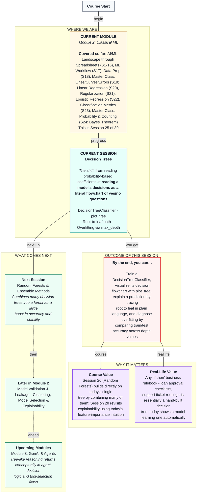

# Machine Learning: Decision Trees
> **Pre-Read — Academic Session 25** | Module 2: Classical ML
---
## Mental Map
> 📄 Also provided as a printable PDF in this folder: **mental-map: Decision Trees.pdf**



---

## What You'll Learn

In this pre-read, you'll discover:
- How a decision tree is really just a learned sequence of yes/no questions
- How to train a `DecisionTreeClassifier` and visualize it with `plot_tree`
- How to read any single prediction as a plain-language path from root to leaf
- Why an unlimited-depth tree memorizes training data, and how `max_depth` controls that

---

## A. What Is a Decision Tree?

**💡 Analogy:** Think of the game "20 Questions," or a call-center support agent's troubleshooting flowchart: "Is the device turned on?" → if no, "Please turn it on." → if yes, "Is it connected to Wi-Fi?" → and so on, narrowing down the answer one yes/no question at a time until you reach a final conclusion.

**One-line definition: A decision tree predicts an outcome by asking a sequence of yes/no questions about the data, each one narrowing down the possibilities, until it reaches a final answer.**

**Worked example:** For our Swiggy churn problem, a decision tree might learn: "Is `orders_last_30_days` less than 15?" → if yes, "Is `avg_rating` less than 4.3?" → if yes, predict "churn"; if no, predict "no churn." Every branch point (called a **node**) asks one question about one feature; the tree keeps splitting until it reaches a final answer (called a **leaf**).

**⚠️ Common trap:** Unlike logistic regression's coefficients, which apply the *same* weighted combination to every row, a tree can treat different rows completely differently depending on which questions they answer along the way — this flexibility is both its biggest strength and, as we'll see in section E, its biggest risk.

---

## B. Training a DecisionTreeClassifier

**💡 Analogy:** Training a tree means letting the algorithm itself figure out which questions to ask, and in what order — always picking, at each step, whichever yes/no question does the best job of separating churners from non-churners in the data it currently sees.

```python
from sklearn.tree import DecisionTreeClassifier

model = DecisionTreeClassifier(max_depth=3)
model.fit(X_train, y_train)
```

**Worked example:** Given our churn features (city, vehicle type, orders, rating, months active), `.fit()` searches through possible yes/no splits on each feature and builds the tree automatically — no manual rule-writing required.

**⚠️ Common trap:** A tree doesn't need scaled numeric features the way `LogisticRegression` or `Ridge` do (Sessions 20-21) — since it only ever asks "is this value above or below some threshold," the actual scale of the numbers doesn't affect which splits it finds. Scaling doesn't hurt, but it isn't required here the way it was for our linear models.

---

## C. Visualizing the Tree with `plot_tree`

**💡 Analogy:** Imagine finally seeing the call-center troubleshooting flowchart drawn out on paper, instead of just experiencing it question by question. `plot_tree` does exactly this for a trained decision tree — it draws the entire learned flowchart visually.

```python
from sklearn.tree import plot_tree
import matplotlib.pyplot as plt

plt.figure(figsize=(12, 8))
plot_tree(model, feature_names=feature_names, class_names=["No Churn', 'Churn"], filled=True)
plt.show()
```

**Worked example:** The resulting diagram shows the root question at the top (e.g., "orders_last_30_days ≤ 15?"), with branches fanning out below for "yes" and "no," eventually ending in colored leaf boxes showing the final predicted class.

**⚠️ Common trap:** A very deep tree produces an enormous, unreadable diagram. `plot_tree` is most useful for genuinely interpreting a *shallow* tree — for deeper trees, other tools (like feature importances, covered in Session 26) become more practical than trying to read the whole diagram by eye.

---

## D. Reading a Root-to-Leaf Path in Plain Language

**💡 Analogy:** Imagine explaining to a Swiggy operations manager exactly *why* the model flagged a specific partner as likely to churn — not with a black-box "the model said so," but with a clear, human-readable trail: "this partner placed fewer than 15 orders in the last 30 days, AND their average rating was below 4.3 — that's exactly the combination the model has learned to associate with churn."

**One-line definition: Reading a decision tree's prediction means tracing the exact sequence of yes/no answers a specific row gave, from the root question down to the leaf where it landed.**

**Worked example:** A partner with `orders_last_30_days=8` and `avg_rating=4.1` would trace: root question "orders ≤ 15?" → yes → next question "rating ≤ 4.3?" → yes → leaf: "Churn." This entire reasoning chain is fully transparent and explainable in plain English — a genuine advantage over the coefficient-based reasoning from Sessions 20-22.

**⚠️ Common trap:** This transparency is a real strength of single decision trees, but it doesn't automatically carry over once we combine many trees together in Session 26's Random Forests — that trade-off between interpretability and performance is worth watching for.

---

## E. Overfitting via Depth: The Tree's Own Regularization Dial

**💡 Analogy:** Recall Session 21's overzealous analyst, who explained every tiny detail of the training data rather than the real pattern. An unlimited-depth decision tree does exactly this — it keeps asking increasingly specific questions until every single training row is perfectly classified, effectively memorizing the training set's individual quirks rather than learning a generalizable rule.

**One-line definition: `max_depth` limits how many yes/no questions a tree is allowed to ask before it must stop and commit to an answer — shallower trees are simpler and more general; deeper trees are more flexible but risk memorizing noise.**

**Worked example:** On our churn dataset, an unlimited-depth tree reaches 100% training accuracy but only about 71% test accuracy — a large overfitting gap. Sweeping across `max_depth` values from 1 to 10 reveals a sweet spot around `max_depth=3`, where test accuracy peaks before declining again as deeper trees start memorizing training noise.


**⚠️ Common trap:** `max_depth` plays exactly the same conceptual role here that `alpha` played for Ridge and Lasso in Session 21 — a dial that trades flexibility for generalization. There's no universally correct depth; it must be found by comparing train and test performance across several values, just like Session 21's alpha search.

---

## Quick Reference — Working with Decision Trees

| Your situation | Use this | Because |
|---|---|---|
| You want a model whose reasoning you can explain in plain English | Decision tree | Every prediction traces to an explicit root-to-leaf path |
| You want to see the tree's learned logic visually | `plot_tree` | Draws the full flowchart, best for shallow trees |
| Train accuracy is much higher than test accuracy | Reduce `max_depth` | Limits how specific the tree's questions can get |
| Both train and test accuracy are low | Increase `max_depth` (a little) | The tree may be too simple to capture the real pattern |
| You need to explain one specific prediction to a stakeholder | Trace its root-to-leaf path | Gives a transparent, human-readable justification |

---

## Practice Exercises

1. **Concept Detective** — A tree's root question is "months_active ≤ 6?" For a partner with `months_active=3`, which branch do they follow, and why might a newer partner be more likely to churn?

2. **Spot the Error** — A classmate trains a `DecisionTreeClassifier` with no `max_depth` limit, gets 100% training accuracy, and reports the model as "perfect." What's the likely problem?

3. **Real-Life Application** — Sketch a 3-question decision tree (in plain English, no code) that an HDFC loan officer might use to approve or reject a loan application.

4. **Pattern Recognition** — In a depth sweep, test accuracy peaks at `max_depth=3` and declines afterward while train accuracy keeps climbing. What does this pattern tell you about depths beyond 3?

5. **Planning Ahead** — Explain, in your own words, why a decision tree doesn't require feature scaling the way `LogisticRegression` does.

---

> ✅ **You're done!** You can now train a `DecisionTreeClassifier`, visualize it with `plot_tree`, explain any single prediction as a plain-language root-to-leaf path, and diagnose overfitting by comparing train/test accuracy across `max_depth` values.
>
> Next up: **Session 26 — Random Forests & Ensemble Methods**, where we combine many decision trees into a forest, trading some interpretability for a substantial boost in accuracy and stability.
