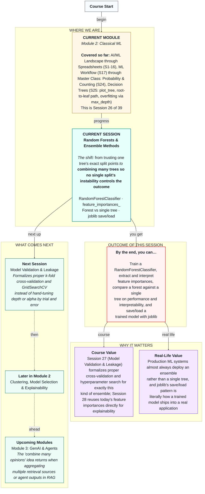

# Mental Map — Random Forests & Ensemble Methods
> Academic Session 26 · Module 2: Classical ML

```mermaid
%%{init: {'themeVariables': {'fontSize': '32px', 'fontFamily': 'sans-serif'}, 'flowchart': {'htmlLabels': true, 'nodeSpacing': 50, 'rankSpacing': 80, 'wrappingWidth': 400, 'padding': 20}}}%%
flowchart TB

START["<b>Course Start</b>"]

subgraph foundation[" WHERE WE ARE "]
direction TB
    CURMOD["<b>CURRENT MODULE</b><br/><i>Module 2: Classical ML</i><br/>&nbsp;<br/><b>Covered so far:</b> AI/ML Landscape through Spreadsheets (S1-16), ML Workflow (S17) through Master Class: Probability &amp; Counting (S24), Decision Trees (S25: plot_tree, root-to-leaf path, overfitting via max_depth)<br/>This is Session 26 of 39"]
    CURSES["<b>CURRENT SESSION</b><br/><b>Random Forests &amp; Ensemble Methods</b><br/>&nbsp;<br/><i>The shift:</i> from trusting one tree's exact split points <i>to</i> <b>combining many trees so no single split's instability controls the outcome</b><br/>&nbsp;<br/>RandomForestClassifier · feature_importances_<br/>Forest vs single tree · joblib save/load"]
end

subgraph outcome[" OUTCOME OF THIS SESSION "]
direction TB
    OUT["<b>By the end, you can…</b><br/>&nbsp;<br/>Train a RandomForestClassifier, extract and interpret<br/>feature importances, compare a forest against a single<br/>tree on performance and interpretability, and save/load a<br/>trained model with joblib"]
end

subgraph value[" WHY IT MATTERS "]
direction TB
    CVAL["<b>Course Value</b><br/>Session 27 (Model Validation &amp; Leakage) formalizes proper<br/>cross-validation and hyperparameter search for exactly this<br/>kind of ensemble; Session 28 reuses today's feature<br/>importances directly for explainability"]
    RVAL["<b>Real-Life Value</b><br/>Production ML systems almost always deploy an ensemble<br/>rather than a single tree, and joblib's save/load pattern is<br/>literally how a trained model ships into a real application"]
end

subgraph future[" WHAT COMES NEXT "]
direction TB
    U0["<b>Next Session</b><br/>Model Validation &amp; Leakage<br/><i>Formalizes proper k-fold cross-validation and GridSearchCV<br/>instead of hand-tuning depth or alpha by trial and error</i>"]
    U1["<b>Later in Module 2</b><br/>Clustering, Model Selection &amp; Explainability"]
    U2["<b>Upcoming Modules</b><br/>Module 3: GenAI &amp; Agents<br/><i>The 'combine many opinions' idea returns when aggregating<br/>multiple retrieval sources or agent outputs in RAG</i>"]
end

START ==>|" begin "| CURMOD
CURMOD ==>|" progress "| CURSES
CURSES ==>|" you get "| OUT
OUT ==>|" course "| CVAL
OUT ==>|" real life "| RVAL
CURSES ==>|" next up "| U0
U0 -.->|" then "| U1
U1 -.->|" ahead "| U2

classDef startBox fill:#F7FAFC,stroke:#4A5568,stroke-width:2px,color:#1A202C
classDef curModBox fill:#FFF8E6,stroke:#B7791F,stroke-width:2px,color:#1A202C
classDef curSessBox fill:#E6FFFA,stroke:#0D9488,stroke-width:3px,color:#1A202C
classDef outBox fill:#FEF2F2,stroke:#DC2626,stroke-width:3px,color:#1A202C
classDef valueBox fill:#F3E8FF,stroke:#7C3AED,stroke-width:2px,color:#1A202C
classDef futureBox fill:#ECFDF5,stroke:#047857,stroke-width:2px,color:#1A202C

class START startBox
class CURMOD curModBox
class CURSES curSessBox
class OUT outBox
class CVAL,RVAL valueBox
class U0,U1,U2 futureBox

linkStyle default stroke-width:2px
```
