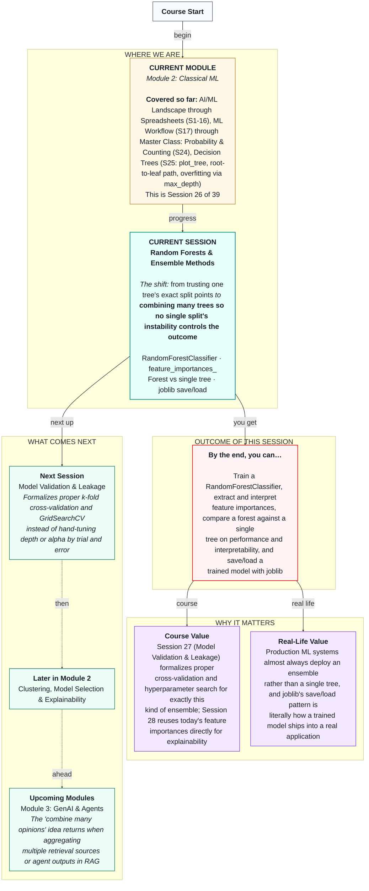

# Machine Learning: Random Forests & Ensemble Methods
> **Pre-Read — Academic Session 26** | Module 2: Classical ML
---
## Mental Map
> 📄 Also provided as a printable PDF in this folder: **mental-map: Random Forests & Ensemble Methods.pdf**



---

## What You'll Learn

In this pre-read, you'll discover:
- Why combining many decision trees tends to outperform any single one
- How to train a `RandomForestClassifier`
- How to extract and interpret `feature_importances_` across the whole forest
- The real trade-off between a forest's performance and a single tree's plain-English explainability
- How to save a trained model with `joblib` and load it back without retraining

---

## A. The Wisdom of the Crowd: Why Many Trees Beat One

**💡 Analogy:** Imagine asking a single cricket pundit to predict a match outcome versus polling 100 different pundits, each with slightly different information and blind spots, and taking the majority verdict. The crowd's aggregated opinion tends to smooth out any one expert's individual quirks or biases, landing closer to the truth more consistently than any single expert alone.

**One-line definition: A Random Forest trains many decision trees, each on a slightly different random sample of the data and a random subset of features at each split, then combines all their votes into one final prediction.**

**Worked example:** Recall Session 25's single tree — its exact root split threshold shifted noticeably (from about −0.52 to −1.08) just from resampling the training data slightly. A Random Forest sidesteps this instability by training hundreds of such trees, each seeing a different resampled slice of data, and letting their votes average out any one tree's particular quirks.

**⚠️ Common trap:** "Random" here has a specific meaning — each tree is deliberately trained on a randomly resampled subset of rows (called **bagging**) and considers only a random subset of features at each split. This deliberate randomness, paradoxically, is exactly what makes the combined forest more stable than any single deterministic tree.

---

## B. Training a RandomForestClassifier

**💡 Analogy:** Instead of consulting one troubleshooting flowchart, imagine consulting a whole committee of slightly different flowcharts built by different people who each saw a slightly different slice of past cases, then going with whatever the majority of them conclude.

```python
from sklearn.ensemble import RandomForestClassifier

model = RandomForestClassifier(n_estimators=200)
model.fit(X_train, y_train)
```

**Worked example:** `n_estimators=200` means the forest trains 200 individual decision trees internally, each seeing a bootstrapped (randomly resampled with replacement) version of the training data. `.predict()` on this forest returns the majority vote across all 200 trees.

**⚠️ Common trap:** More trees (`n_estimators`) generally improves stability but with diminishing returns and increasing computation time — doubling from 200 to 400 trees rarely changes results dramatically, unlike Session 25's `max_depth`, which directly controls overfitting risk per tree.

---

## C. Feature Importances: What the Whole Forest Relies On

**💡 Analogy:** Instead of reading one tree's specific root question, imagine surveying all 200 trees in the forest and asking, "across all of you, which features got used most often, and how much did they help separate churners from non-churners?" That aggregate summary is a **feature importance** score.

```python
importances = model.feature_importances_
```

**Worked example:** On our Swiggy churn forest, `orders_last_30_days` and `avg_rating` consistently rank as the top two most important features across the whole forest — matching exactly what we'd expect from Session 25's single-tree root and second-level splits, but now backed by hundreds of trees' worth of agreement rather than just one.

**⚠️ Common trap:** A high feature importance tells you a feature was frequently useful for splitting, but it doesn't tell you the *direction* of that effect (unlike a logistic regression coefficient's sign) — for that kind of directional interpretation, you'd need additional tools beyond today's scope.

---

## D. Random Forest vs. Single Tree: Performance and Interpretability

**💡 Analogy:** A single tree is like one person's clearly explainable opinion — easy to follow, but easily swayed by whichever specific data they happened to see. A forest is like a large committee's aggregated verdict — more reliable, but you can no longer point to one simple flowchart and say "this is exactly why."

| | Single Decision Tree | Random Forest |
|---|---|---|
| **Interpretability** | High — full root-to-leaf path is readable | Lower — no single flowchart represents the whole forest |
| **Stability** | Lower — small data changes can shift splits noticeably | Higher — many trees average out individual instability |
| **Typical test performance** | Good, but sensitive to depth tuning | Usually better and more consistent, less depth-sensitive |
| **Best used when** | You need to explain one specific decision in plain English | You need the most reliable prediction and can accept less transparency |

**Worked example:** On our churn dataset, a well-tuned single tree (`max_depth=3`) reached about 78% test accuracy, while a Random Forest reached around 82% — a meaningful improvement, achieved without needing to hand-tune a depth parameter at all.

**⚠️ Common trap:** Don't assume a Random Forest is *always* the better choice — if a stakeholder genuinely needs a plain-English justification for one specific prediction (like Session 25's root-to-leaf trace), a single, well-tuned tree may still be the more appropriate tool despite the accuracy trade-off.

---

## E. Saving and Loading a Model with joblib

**💡 Analogy:** Imagine spending hours perfecting a complex recipe, then having to start completely from scratch every single time you want to cook it again. Saving a trained model is like writing that recipe down permanently — train once, then reuse the exact same trained model anywhere, anytime, without retraining.

```python
import joblib

joblib.dump(model, "churn_model.joblib")

loaded_model = joblib.load("churn_model.joblib")
loaded_model.predict(X_test)
```

**Worked example:** After training our Random Forest once, `joblib.dump()` saves the entire fitted model (including everything it learned) to a file. Later — even in a completely different script or application — `joblib.load()` restores that exact same trained model, ready to make predictions immediately, with no retraining required.

**⚠️ Common trap:** A saved model is only as good as the preprocessing it expects — if you saved a full `Pipeline` (preprocessing + model together, as we've done since Session 18), always load and use that same pipeline object, rather than trying to feed raw, unprocessed data directly into a loaded model that expects already-transformed input.

---

## Quick Reference — Random Forest Essentials

| Your situation | Use this | Because |
|---|---|---|
| A single tree's splits feel unstable across resamples | `RandomForestClassifier` | Averages many trees' votes to smooth out individual instability |
| You need to know which features matter most overall | `model.feature_importances_` | Aggregates split usefulness across the whole forest |
| You need a plain-English explanation for one prediction | A single, well-tuned decision tree instead | A forest has no single readable flowchart |
| You've finished training and want to reuse the model later | `joblib.dump()` / `joblib.load()` | Saves the fitted model so it never needs retraining |
| You're deploying a full preprocessing + model pipeline | Save and load the entire `Pipeline` object | Keeps preprocessing and model bundled together correctly |

---

## Practice Exercises

1. **Concept Detective** — Explain, in your own words, why training each tree in a forest on a different resampled subset of data helps reduce the forest's overall instability compared to a single tree.

2. **Spot the Error** — A classmate saves only the trained `RandomForestClassifier` object with `joblib`, but not the `ColumnTransformer` preprocessing step, then tries to feed raw unprocessed data into the loaded model. What will go wrong?

3. **Real-Life Application** — An HDFC risk team needs both a highly accurate fraud model AND the ability to explain individual flagged transactions to auditors. How might they use both a single tree and a Random Forest together to satisfy both needs?

4. **Pattern Recognition** — If a Random Forest's `feature_importances_` shows one feature completely dominating (importance close to 1.0, all others close to 0), what might that suggest about the dataset, and what earlier session's concept does this connect to?

5. **Planning Ahead** — Sketch a short plan for how you'd decide, for a brand-new classification problem, whether to reach for a single decision tree or a Random Forest first.

---

> ✅ **You're done!** You can now train a `RandomForestClassifier`, extract and interpret feature importances across the whole forest, weigh the real trade-off between a forest's performance and a single tree's interpretability, and save/load a trained model with `joblib`.
>
> Next up: **Session 27 — Model Validation & Leakage**, where k-fold cross-validation and `GridSearchCV` finally replace the hand-tuning of `max_depth`, `alpha`, and `n_estimators` we've been doing by trial and error since Session 21.
