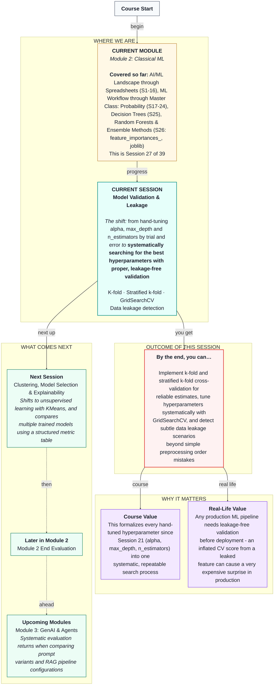

# Mental Map — Model Validation & Leakage
> Academic Session 27 · Module 2: Classical ML

```mermaid
%%{init: {'themeVariables': {'fontSize': '32px', 'fontFamily': 'sans-serif'}, 'flowchart': {'htmlLabels': true, 'nodeSpacing': 50, 'rankSpacing': 80, 'wrappingWidth': 400, 'padding': 20}}}%%
flowchart TB

START["<b>Course Start</b>"]

subgraph foundation[" WHERE WE ARE "]
direction TB
    CURMOD["<b>CURRENT MODULE</b><br/><i>Module 2: Classical ML</i><br/>&nbsp;<br/><b>Covered so far:</b> AI/ML Landscape through Spreadsheets (S1-16), ML Workflow through Master Class: Probability (S17-24), Decision Trees (S25), Random Forests &amp; Ensemble Methods (S26: feature_importances_, joblib)<br/>This is Session 27 of 39"]
    CURSES["<b>CURRENT SESSION</b><br/><b>Model Validation &amp; Leakage</b><br/>&nbsp;<br/><i>The shift:</i> from hand-tuning alpha, max_depth and n_estimators by trial and error <i>to</i> <b>systematically searching for the best hyperparameters with proper, leakage-free validation</b><br/>&nbsp;<br/>K-fold · Stratified k-fold · GridSearchCV<br/>Data leakage detection"]
end

subgraph outcome[" OUTCOME OF THIS SESSION "]
direction TB
    OUT["<b>By the end, you can…</b><br/>&nbsp;<br/>Implement k-fold and stratified k-fold cross-validation for<br/>reliable estimates, tune hyperparameters systematically with<br/>GridSearchCV, and detect subtle data leakage scenarios<br/>beyond simple preprocessing order mistakes"]
end

subgraph value[" WHY IT MATTERS "]
direction TB
    CVAL["<b>Course Value</b><br/>This formalizes every hand-tuned hyperparameter since<br/>Session 21 (alpha, max_depth, n_estimators) into one<br/>systematic, repeatable search process"]
    RVAL["<b>Real-Life Value</b><br/>Any production ML pipeline needs leakage-free validation<br/>before deployment - an inflated CV score from a leaked<br/>feature can cause a very expensive surprise in production"]
end

subgraph future[" WHAT COMES NEXT "]
direction TB
    U0["<b>Next Session</b><br/>Clustering, Model Selection &amp; Explainability<br/><i>Shifts to unsupervised learning with KMeans, and compares<br/>multiple trained models using a structured metric table</i>"]
    U1["<b>Later in Module 2</b><br/>Module 2 End Evaluation"]
    U2["<b>Upcoming Modules</b><br/>Module 3: GenAI &amp; Agents<br/><i>Systematic evaluation returns when comparing prompt<br/>variants and RAG pipeline configurations</i>"]
end

START ==>|" begin "| CURMOD
CURMOD ==>|" progress "| CURSES
CURSES ==>|" you get "| OUT
OUT ==>|" course "| CVAL
OUT ==>|" real life "| RVAL
CURSES ==>|" next up "| U0
U0 -.->|" then "| U1
U1 -.->|" ahead "| U2

classDef startBox fill:#F7FAFC,stroke:#4A5568,stroke-width:2px,color:#1A202C
classDef curModBox fill:#FFF8E6,stroke:#B7791F,stroke-width:2px,color:#1A202C
classDef curSessBox fill:#E6FFFA,stroke:#0D9488,stroke-width:3px,color:#1A202C
classDef outBox fill:#FEF2F2,stroke:#DC2626,stroke-width:3px,color:#1A202C
classDef valueBox fill:#F3E8FF,stroke:#7C3AED,stroke-width:2px,color:#1A202C
classDef futureBox fill:#ECFDF5,stroke:#047857,stroke-width:2px,color:#1A202C

class START startBox
class CURMOD curModBox
class CURSES curSessBox
class OUT outBox
class CVAL,RVAL valueBox
class U0,U1,U2 futureBox

linkStyle default stroke-width:2px
```
