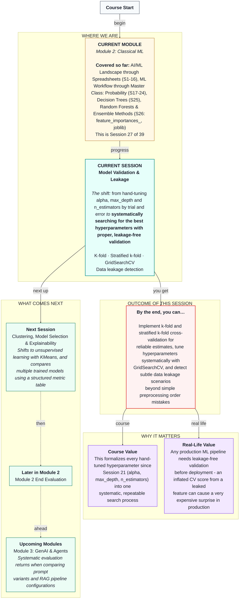

# Machine Learning: Model Validation & Leakage
> **Pre-Read — Academic Session 27** | Module 2: Classical ML
---
## Mental Map
> 📄 Also provided as a printable PDF in this folder: **mental-map: Model Validation & Leakage.pdf**



---

## What You'll Learn

In this pre-read, you'll discover:
- How k-fold cross-validation formalizes the idea introduced back in Session 17
- Why plain k-fold can silently produce badly imbalanced folds, and how stratified k-fold fixes it
- How `GridSearchCV` replaces hand-tuning `alpha`, `max_depth`, or `n_estimators` one value at a time
- How to read `GridSearchCV`'s results properly
- How to spot data leakage scenarios that go beyond Session 18's "scale before splitting" mistake

---

## A. K-Fold Cross-Validation, Formalized

**💡 Analogy:** Recall Session 17's cricket selector, who wouldn't judge a batter's form from a single innings — five different innings in different conditions gives a far more trustworthy read. **K-fold cross-validation** is this same idea, formalized: split the data into *k* equal chunks ("folds"), train on *k−1* of them and test on the remaining one, repeat *k* times rotating which fold is held out, then average the results.

**One-line definition: K-fold cross-validation trains and evaluates a model k separate times, each time holding out a different fold, producing k performance estimates that get averaged into one more trustworthy number.**

```python
from sklearn.model_selection import KFold, cross_val_score

kf = KFold(n_splits=5, shuffle=True, random_state=1)
scores = cross_val_score(pipeline, X, y, cv=kf)
```

**Worked example:** With `n_splits=5`, our churn dataset splits into 5 folds of 30 rows each; the model trains on 120 rows and tests on 30, five times, rotating which 30 rows are held out.

**⚠️ Common trap:** Always set `shuffle=True` (with a fixed `random_state` for reproducibility) unless you have a specific reason not to — without shuffling, if your data happens to be sorted or grouped in any way, some folds can end up wildly unrepresentative, which is exactly section B's problem.

---

## B. Stratified K-Fold: Why Order and Imbalance Matter

**💡 Analogy:** Imagine randomly splitting a class into 5 groups for a mock election, but the class list happens to be sorted by which candidate students support. Even with shuffling turned on, a plain random split could still occasionally cluster too many or too few supporters of one candidate into a single group by chance — and if the data isn't shuffled at all, that clustering becomes guaranteed rather than just possible.

**One-line definition: Stratified k-fold ensures every fold preserves roughly the same proportion of each class as the overall dataset, instead of leaving that to chance.**

**Worked example:** If our churn data happens to be sorted (a very common real-world scenario, since data pulled from a database is often exported grouped by some field), a plain unshuffled `KFold` can produce genuinely broken folds — imagine one fold with **zero** churners at all, and another fold that is **100% churners**, purely because of how the data happened to be ordered. `StratifiedKFold` prevents this entirely, guaranteeing each fold reflects the dataset's true ~25% churn rate regardless of ordering.

```python
from sklearn.model_selection import StratifiedKFold

skf = StratifiedKFold(n_splits=5, shuffle=True, random_state=1)
```

**⚠️ Common trap:** This isn't just a theoretical worst case — real-world datasets pulled from databases or spreadsheets are very often sorted by date, region, or some other field, making this exact failure mode more common in practice than most beginners expect. Default to `StratifiedKFold` for classification problems, especially with imbalanced classes.

---

## C. GridSearchCV: Systematic Hyperparameter Search

**💡 Analogy:** Recall hand-tuning `alpha` in Session 21, `max_depth` in Session 25, and `n_estimators` in Session 26 — trying one value, checking the result, trying another. `GridSearchCV` automates this entirely: give it a list of values for each hyperparameter, and it exhaustively tries every combination, using proper cross-validation for each one, and reports which combination performed best.

**One-line definition: GridSearchCV systematically tests every combination of specified hyperparameter values using cross-validation, and identifies the combination with the best average performance.**

```python
from sklearn.model_selection import GridSearchCV

param_grid = {
    "classifier__n_estimators": [50, 100, 200],
    "classifier__max_depth": [3, 5, None],
}

grid_search = GridSearchCV(pipeline, param_grid, cv=skf, scoring="accuracy")
grid_search.fit(X, y)
```

**Worked example:** With 3 values for `n_estimators` and 3 for `max_depth`, this searches all 9 combinations, each evaluated with 5-fold cross-validation — 45 total model fits — and returns the single best-performing combination automatically.

**⚠️ Common trap:** Because `GridSearchCV` wraps the entire `Pipeline` (preprocessing included), each fold's preprocessing is correctly fit only on that fold's training portion — this is exactly Session 18's "fit only on train" rule, now applied automatically and correctly across every fold, with no risk of the leakage mistake from that session.

---

## D. Reading GridSearchCV Results

**💡 Analogy:** After the exhaustive search, you don't just want the single winning combination — you often want to see the full leaderboard, to understand how sensitive performance was to each choice.

**Key attributes to read:**

| Attribute | What it tells you |
|---|---|
| `grid_search.best_params_` | The single best-performing combination found |
| `grid_search.best_score_` | The average cross-validated score for that best combination |
| `grid_search.cv_results_` | A full table of every combination tried, with mean and standard deviation of scores |

**Worked example:** On our churn data, `GridSearchCV` might report `best_params_ = {'max_depth': 5, 'n_estimators': 50}` with `best_score_ ≈ 0.82` — notably, not necessarily the largest `n_estimators` value tried, since more trees doesn't always mean better performance, echoing Session 26's diminishing-returns point.

**⚠️ Common trap:** The "best" combination found is only best *for this specific dataset and this specific scoring metric*. Changing the scoring metric (say, from accuracy to F1, per Session 23) can sometimes change which combination wins — always confirm you're optimizing for the metric that actually matches your business scenario.

---

## E. Data Leakage Scenarios Beyond Preprocessing Order

**💡 Analogy:** Session 18 taught you one specific leakage mistake — scaling before splitting. But leakage can be far subtler: imagine a churn dataset that includes a column called `flagged_for_retention_call` — a flag that customer support only sets *after* they've already identified someone as likely to churn. Training a model on this feature would be like predicting the outcome of a cricket match using a "player of the match" award that's only given out after the match ends — the feature technically exists in your dataset, but it wouldn't actually be available at the moment you need to make a real prediction.

**One-line definition: Feature leakage occurs when a feature encodes information that would not actually be available at prediction time, often because it's causally downstream of the outcome itself.**

**Worked example:** Adding a feature that closely tracks the churn outcome (even with some noise) can make cross-validated accuracy jump dramatically — say, from a genuine ~81% up to a suspicious ~97% — a red flag that should prompt investigation rather than celebration.

**⚠️ Common trap:** An unusually large jump in performance after adding a new feature is not automatically good news — it's exactly as likely to be a leakage red flag as a genuine improvement. Always ask: "would this exact feature value have been available and known *before* the outcome happened, in a real deployment?" If the answer is no, or "only after," the feature likely leaks the target.

---

## Quick Reference — Validation and Leakage Checklist

| Your situation | Use this | Because |
|---|---|---|
| You want a reliable performance estimate | K-fold cross-validation | Averages several splits instead of trusting one |
| Your target classes are imbalanced | `StratifiedKFold` | Guarantees every fold reflects the true class balance |
| You're hand-tuning a hyperparameter one value at a time | `GridSearchCV` | Systematically searches every combination with proper CV |
| Performance jumps suspiciously after adding a feature | Investigate for leakage | Real improvements are rarely dramatic overnight jumps |
| You're unsure if a feature would exist at prediction time | Ask "would I know this before the outcome happens?" | Directly tests for feature leakage |

---

## Practice Exercises

1. **Concept Detective** — A dataset is sorted by signup date, and churn is rare. Explain why using plain `KFold` without shuffling could produce a badly broken fold.

2. **Spot the Error** — A classmate runs `GridSearchCV` searching over `max_depth` values, but wraps only the classifier (not the full preprocessing pipeline) inside it. What could go wrong?

3. **Real-Life Application** — An HDFC loan default model includes a feature called `days_since_last_missed_payment_notice`. Is this feature at risk of leakage? Explain your reasoning.

4. **Pattern Recognition** — A model's cross-validated accuracy jumps from 78% to 99% the moment one new feature is added. What should your first reaction be, and what would you check?

5. **Planning Ahead** — Sketch, in plain language, how you'd design a `GridSearchCV` search for a Random Forest churn model, including which hyperparameters you'd search and why you'd use `StratifiedKFold` rather than plain `KFold`.

---

> ✅ **You're done!** You can now implement k-fold and stratified k-fold cross-validation, search hyperparameters systematically with `GridSearchCV`, read its results correctly, and detect subtle data leakage scenarios beyond simple preprocessing order mistakes.
>
> Next up: **Session 28 — Clustering, Model Selection & Explainability**, where we shift to unsupervised learning with `KMeans` and compare multiple trained models side by side using a structured metric table.
