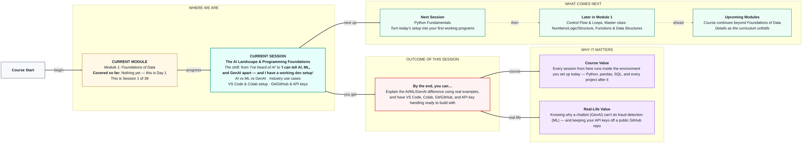

# Mental Map — The AI Landscape & Programming Foundations
> Academic Session 1 · Module 1: Foundations of Data

```mermaid
%%{init: {"theme": "default", "themeVariables": { "fontSize": "28px", "fontFamily": "sans-serif" }, "flowchart": {"useMaxWidth": false, "htmlLabels": true, "nodeSpacing": 100, "rankSpacing": 140, "wrappingWidth": 700, "padding": 40}}}%%
flowchart LR

START["`**Course Start**`"]

subgraph foundation[" WHERE WE ARE "]
direction TB
    CURMOD["`**CURRENT MODULE**
*Module 1: Foundations of Data*

**Covered so far:** Nothing yet — this is Day 1
This is Session 1 of 39`"]
    CURSES["`**CURRENT SESSION**
**The AI Landscape & Programming Foundations**

*The shift:* from *'I've heard of AI'* to **'I can tell AI, ML, and GenAI apart — and I have a working dev setup'**

AI vs ML vs GenAI · Industry use cases
VS Code & Colab setup · Git/GitHub & API keys`"]
end

subgraph outcome[" OUTCOME OF THIS SESSION "]
direction TB
    OUT["`**By the end, you can…**

Explain the AI/ML/GenAI difference using real examples,
and have VS Code, Colab, Git/GitHub, and API key handling ready to build with`"]
end

subgraph value[" WHY IT MATTERS "]
direction TB
    CVAL["`**Course Value**
Every session from here runs inside the environment you set up today — Python, pandas, SQL, and every project after it`"]
    RVAL["`**Real-Life Value**
Knowing why a chatbot (GenAI) can't do fraud detection (ML) — and keeping your API keys off a public GitHub repo`"]
end

subgraph future[" WHAT COMES NEXT "]
direction TB
    U0["`**Next Session**
Python Fundamentals
*Turn today's setup into your first working programs*`"]
    U1["`**Later in Module 1**
Control Flow & Loops, Master class: Numbers/Logic/Structure, Functions & Data Structures`"]
    U2["`**Upcoming Modules**
Course continues beyond Foundations of Data
*Details as the curriculum unfolds*`"]
end

START ==>|" begin "| CURMOD
CURMOD ==>|" progress "| CURSES
CURSES ==>|" you get "| OUT
OUT ==>|" course "| CVAL
OUT ==>|" real life "| RVAL
CURSES ==>|" next up "| U0
U0 -.->|" then "| U1
U1 -.->|" ahead "| U2

classDef startBox fill:#F7FAFC,stroke:#4A5568,stroke-width:2px,color:#1A202C
classDef curModBox fill:#FFF8E6,stroke:#B7791F,stroke-width:2px,color:#1A202C
classDef curSessBox fill:#E6FFFA,stroke:#0D9488,stroke-width:3px,color:#1A202C
classDef outBox fill:#FEF2F2,stroke:#DC2626,stroke-width:3px,color:#1A202C
classDef valueBox fill:#F3E8FF,stroke:#7C3AED,stroke-width:2px,color:#1A202C
classDef futureBox fill:#ECFDF5,stroke:#047857,stroke-width:2px,color:#1A202C

class START startBox
class CURMOD curModBox
class CURSES curSessBox
class OUT outBox
class CVAL,RVAL valueBox
class U0,U1,U2 futureBox
```
