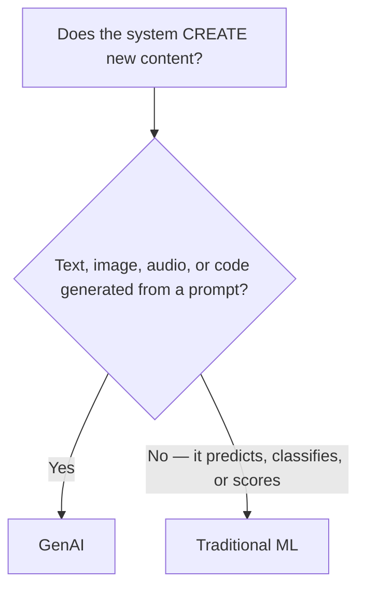
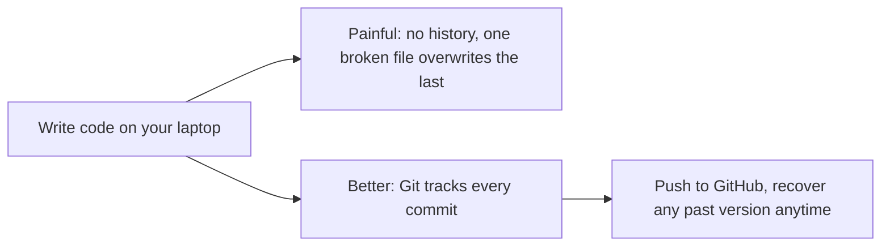

# Foundations of Data: The AI Landscape & Programming Foundations
> **Pre-Read — Academic Session 1** | Module 1: Foundations of Data
---
## Mental Map
> 📄 Also provided as a printable PDF in this folder: **mental-map: The AI Landscape & Programming Foundations.pdf**

```mermaid
%%{init: {'flowchart': {'useMaxWidth': false, 'htmlLabels': true, 'nodeSpacing': 60, 'rankSpacing': 95, 'wrappingWidth': 620, 'padding': 18}}}%%
flowchart LR

START["<b>Course Start</b>"]

subgraph foundation[" WHERE WE ARE "]
direction TB
    CURMOD["<b>CURRENT MODULE</b><br/><i>Module 1: Foundations of Data</i><br/>&nbsp;<br/><b>Covered so far:</b> Nothing yet — this is Day 1<br/>This is Session 1 of 39"]
    CURSES["<b>CURRENT SESSION</b><br/><b>The AI Landscape & Programming Foundations</b><br/>&nbsp;<br/><i>The shift:</i> from <i>'I've heard of AI'</i> to <b>'I can tell AI, ML, and GenAI apart — and I have a working dev setup'</b><br/>&nbsp;<br/>AI vs ML vs GenAI · Industry use cases<br/>VS Code & Colab setup · Git/GitHub & API keys"]
end

subgraph outcome[" OUTCOME OF THIS SESSION "]
direction TB
    OUT["<b>By the end, you can…</b><br/>&nbsp;<br/>Explain the AI/ML/GenAI difference using real examples,<br/>and have VS Code, Colab, Git/GitHub, and API key handling ready to build with"]
end

subgraph value[" WHY IT MATTERS "]
direction TB
    CVAL["<b>Course Value</b><br/>Every session from here runs inside the environment you set up today — Python, pandas, SQL, and every project after it"]
    RVAL["<b>Real-Life Value</b><br/>Knowing why a chatbot (GenAI) can't do fraud detection (ML) — and keeping your API keys off a public GitHub repo"]
end

subgraph future[" WHAT COMES NEXT "]
direction TB
    U0["<b>Next Session</b><br/>Python Fundamentals<br/><i>Turn today's setup into your first working programs</i>"]
    U1["<b>Later in Module 1</b><br/>Control Flow & Loops, Master class: Numbers/Logic/Structure, Functions & Data Structures"]
    U2["<b>Upcoming Modules</b><br/>Course continues beyond Foundations of Data<br/><i>Details as the curriculum unfolds</i>"]
end

START ==>|" begin "| CURMOD
CURMOD ==>|" progress "| CURSES
CURSES ==>|" you get "| OUT
OUT ==>|" course "| CVAL
OUT ==>|" real life "| RVAL
CURSES ==>|" next up "| U0
U0 -.->|" then "| U1
U1 -.->|" ahead "| U2

classDef startBox fill:#F7FAFC,stroke:#4A5568,stroke-width:2px,color:#1A202C
classDef curModBox fill:#FFF8E6,stroke:#B7791F,stroke-width:2px,color:#1A202C
classDef curSessBox fill:#E6FFFA,stroke:#0D9488,stroke-width:3px,color:#1A202C
classDef outBox fill:#FEF2F2,stroke:#DC2626,stroke-width:3px,color:#1A202C
classDef valueBox fill:#F3E8FF,stroke:#7C3AED,stroke-width:2px,color:#1A202C
classDef futureBox fill:#ECFDF5,stroke:#047857,stroke-width:2px,color:#1A202C

class START startBox
class CURMOD curModBox
class CURSES curSessBox
class OUT outBox
class CVAL,RVAL valueBox
class U0,U1,U2 futureBox
```

## What You'll Learn
In this pre-read, you'll discover:
- What actually separates **AI**, **ML**, and **GenAI** — and why people mix them up
- Where each of these shows up in real Indian companies you already use
- How to set up **VS Code** and **Google Colab**, and when to use which
- The basics of **Git** and **GitHub** — tracking and sharing your code safely
- How to handle **API keys** without accidentally leaking them to the world

---

## A. AI vs ML vs GenAI

- 💡 **Analogy** — Think of your smartphone. The **phone itself** — camera, GPS, calling, apps working together to feel "smart" — is **AI**: the broad idea of a machine doing tasks that normally need human intelligence. Your **predictive keyboard**, the one that learns you type "kal milte hai" more than "kal milenge," is **ML** — a system that gets better at one narrow task by learning from your data. An app that can **write an entire birthday message for you** from a one-line prompt is **GenAI** — a system that creates new content (text, images, code) rather than just predicting or classifying.

- **AI is the goal. ML is a method to reach it. GenAI is a type of ML that creates new content instead of just predicting.**

- **Core explanation:**

| Term | What it is | What it does | Example |
|---|---|---|---|
| **AI** (Artificial Intelligence) | The overall field/goal | Any machine behaving "intelligently" | A chess-playing computer, a self-driving car |
| **ML** (Machine Learning) | A method to *achieve* AI | Learns patterns from data instead of being explicitly programmed | Swiggy predicting your delivery time from past orders |
| **GenAI** (Generative AI) | A *type* of ML | Generates new content — text, images, audio, code | ChatGPT writing an essay, an app generating a logo from a prompt |

- **Worked example:** Say a bank wants to stop credit card fraud.
  - **AI** is the overall ambition: "build a system that catches fraud like a smart human analyst would."
  - **ML** is how they actually do it: feed the system 2 lakh past transactions labeled "fraud" or "not fraud," and it learns the pattern (e.g., ₹40,000 spent at 3 AM in a city you've never visited).
  - **GenAI** would only enter the picture if the bank also wanted a chatbot that *explains* the fraud alert to you in plain Hindi or English — generating that explanation is a GenAI task, catching the fraud itself is a classic ML task.

- ⚠️ **Common trap:** People say "we're using AI" when they mean "we built a GenAI chatbot." Not all AI is GenAI — most AI in daily use (Swiggy's ETA, Ola's surge pricing, YouTube's recommendations) is ML that predicts or classifies, and never generates anything new.

---

## B. Industry Use Cases

- 💡 **Analogy** — Picture a **cricket team's support staff**. The head coach making overall strategy calls is like **AI** as a discipline. The video analyst who studies your last 50 innings to predict where you're weak against spin is **ML**. The commentator who can generate live, flowing commentary in real time is **GenAI**.

- **Same technology, different jobs across industries — and most companies use several types at once.**

- **Core explanation:**

| Company / Sector | AI/ML/GenAI in action | Type |
|---|---|---|
| Swiggy / Zomato | Predicting your delivery time, recommending dishes | ML |
| Ola / Uber | Surge pricing based on demand patterns | ML |
| HDFC / ICICI | Flagging suspicious transactions | ML |
| Zomato / Swiggy support chat | Auto-drafting replies to customer complaints | GenAI |
| Flipkart / Amazon | "Customers who bought this also bought…" | ML |
| Canva / Adobe | "Generate a poster from this one-line brief" | GenAI |

- **Worked example:** When you open Instagram and see Reels picked "just for you" — that's ML, learning your watch pattern. When you use an Instagram AI filter that turns your selfie into a cartoon — that's GenAI, creating a brand-new image.

- ⚠️ **Common trap:** Assuming a company needs GenAI to be "doing AI." Most of the ₹ value companies get from AI today — fraud detection, delivery ETAs, demand forecasting — is quiet, unglamorous ML, not chatbots.

---

## C. Setting Up VS Code & Google Colab

- 💡 **Analogy** — **VS Code** is like cooking in **your own kitchen at home** — full control, but you have to install and organize your own ingredients (software, libraries) before you start. **Google Colab** is like ordering from a **cloud kitchen** — Google's servers do the heavy lifting, you just open a browser tab and start cooking, no installation needed.

- **VS Code is a code editor installed on your machine; Colab is a free, browser-based notebook that runs on Google's servers.**

- **Core explanation:**

| Situation | Use this | Why |
|---|---|---|
| Quick experiment, no GPU needed on your laptop | Colab | Nothing to install, runs in-browser, free GPU access |
| Building a real multi-file project | VS Code | Better for organizing folders, extensions, and version control |
| Spotty or shared laptop, want to save local storage | Colab | Runs on Google's machines, saves to your Drive |
| Working offline | VS Code | Doesn't need internet once installed |

- **Worked example:** For today's setup — install VS Code on your laptop (with the Python extension), and open Colab at colab.research.google.com using your Google account. You'll use both throughout this course: Colab for quick data exploration, VS Code for building complete projects.

- ⚠️ **Common trap:** Trying to install every Python library locally before you've even opened Colab once. Start in Colab — it comes with most data science libraries (pandas, NumPy, matplotlib) pre-installed.

---

## D. Git & GitHub Basics

- 💡 **Analogy** — Imagine your family's **shared photo album on WhatsApp**, except every time someone edits a photo, the old version disappears — chaos. **Git** is a system that keeps every version of your project labeled and recoverable, like a photo album where nothing ever truly gets lost. **GitHub** is where you keep that album online so your whole team can see and add to it.

- **Git tracks changes to your code over time; GitHub is the cloud platform where you store and share that tracked history.**

- **Core explanation:**

| Term | What it means |
|---|---|
| **Repository (repo)** | The project folder Git is tracking |
| **Commit** | A saved "snapshot" of your code at a point in time, with a message describing the change |
| **Push** | Sending your commits from your laptop to GitHub |
| **Pull** | Downloading the latest commits from GitHub to your laptop |
| **Clone** | Copying an entire GitHub repo onto your machine for the first time |

- **Worked example:** You write a script that calculates ₹ sales totals. You `commit` it with the message "add sales total calculation." Next day you break it while adding a new feature — instead of panicking, you can look at your commit history and go back to the version that worked, just like flipping back a few pages in that photo album.

- ⚠️ **Common trap:** Writing vague commit messages like "update" or "fix" — six months later, neither you nor your teammates will know what changed or why. Always write what changed and why, in a few words.

---

## E. API Keys & Secrets

- 💡 **Analogy** — An **API key** is like your **ATM PIN**. It proves to a service (like a bank locker, or an AI model provider) that you're allowed to use it. Writing your API key directly into code you upload to GitHub is like **writing your ATM PIN on the outside of your card** — anyone who finds the card can now use your account, and in the API world, that often means someone racking up charges on your bill.

- **An API key is a secret string that authenticates your program to an external service — and it must never be shared publicly.**

- **Core explanation:**

| Do | Don't |
|---|---|
| Store keys in a `.env` file or environment variable | Paste keys directly into your `.py` file |
| Add `.env` to your `.gitignore` file | Push a file containing a key to GitHub |
| Regenerate a key immediately if it leaks | Assume "I'll delete it later" is safe enough |
| Share keys only through secure channels (password managers) | Share keys over WhatsApp or email |

- **Worked example:** You sign up for an API (say, a weather API) and get a key like `sk-9x7B...`. You save it in a file called `.env` as `WEATHER_API_KEY=sk-9x7B...`, and your Python code reads it from there using a library like `python-dotenv`, instead of typing the key straight into your script.

- ⚠️ **Common trap:** Committing a `.env` file to GitHub by accident. Within minutes, bots that scan public GitHub repos for exposed keys can find and misuse it — this has cost real developers thousands of dollars in unexpected charges.

---

## Quick Reference — Which Tool, When

| Your situation | Use this | Because |
|---|---|---|
| You want to quickly test an idea, no setup | Google Colab | Free, browser-based, GPU-ready |
| You're building a full project with multiple files | VS Code | Better project structure & Git integration |
| You need to track and recover past versions of your code | Git | Every change is saved as a recoverable commit |
| You need to share code with teammates or the world | GitHub | Cloud home for your Git-tracked repo |
| You're using a paid or rate-limited service in your code | Environment variables / `.env` | Keeps your API key out of your code and off GitHub |

---

## Practice Exercises

**1. Concept Detective**
A food delivery app shows you a "recommended for you" list *and* has a support chatbot that writes personalized replies to complaints. Identify which feature is ML and which is GenAI, and explain your reasoning in one sentence each.

**2. Real-Life Application**
List three apps or services you personally use every week, and for each one, name whether the "smart" feature you're thinking of is more likely AI/ML (predicting, recommending, classifying) or GenAI (creating new content).

**3. Spot the Error**
A friend commits code to GitHub with the message "update," and their `.env` file — containing their API key — is visible in the same commit. Name two mistakes here and what they should have done instead.

**4. Pattern Recognition**
You're setting up a new laptop for this course. Decide, with reasoning, whether you'd start your very first practice script in VS Code or Colab, and explain what would make you switch to the other one later.

**5. Planning Ahead**
Next week you'll write your first real Python program. Based on today's session, list the three things you need to have "ready" before you start writing code (environment, version control, and key management) — for each, name the specific tool you'll use.

---
> ✅ **You're done!** You can now tell AI, ML, and GenAI apart with real examples, and you have VS Code, Colab, Git/GitHub, and safe API key handling ready to go.
Next session, we turn this setup into your first working Python code in **Python Fundamentals**.
