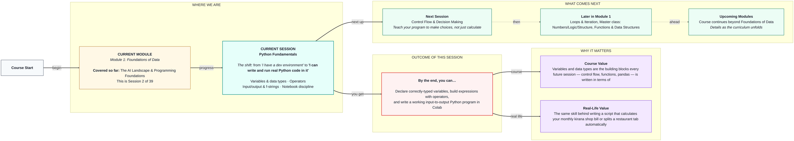

# Mental Map — Python Fundamentals
> Academic Session 2 · Module 1: Foundations of Data

```mermaid
%%{init: {"theme": "default", "themeVariables": { "fontSize": "28px", "fontFamily": "sans-serif" }, "flowchart": {"useMaxWidth": false, "htmlLabels": true, "nodeSpacing": 100, "rankSpacing": 140, "wrappingWidth": 700, "padding": 40}}}%%
flowchart LR

START["<b>Course Start</b>"]

subgraph foundation[" WHERE WE ARE "]
direction TB
    CURMOD["<b>CURRENT MODULE</b><br/><i>Module 1: Foundations of Data</i><br/>&nbsp;<br/><b>Covered so far:</b> The AI Landscape & Programming Foundations<br/>This is Session 2 of 39"]
    CURSES["<b>CURRENT SESSION</b><br/><b>Python Fundamentals</b><br/>&nbsp;<br/><i>The shift:</i> from <i>'I have a dev environment'</i> to <b>'I can write and run real Python code in it'</b><br/>&nbsp;<br/>Variables & data types · Operators<br/>Input/output & f-strings · Notebook discipline"]
end

subgraph outcome[" OUTCOME OF THIS SESSION "]
direction TB
    OUT["<b>By the end, you can…</b><br/>&nbsp;<br/>Declare correctly-typed variables, build expressions with operators,<br/>and write a working input-to-output Python program in Colab"]
end

subgraph value[" WHY IT MATTERS "]
direction TB
    CVAL["<b>Course Value</b><br/>Variables and data types are the building blocks every future session — control flow, functions, pandas — is written in terms of"]
    RVAL["<b>Real-Life Value</b><br/>The same skill behind writing a script that calculates your monthly kirana shop bill or splits a restaurant tab automatically"]
end

subgraph future[" WHAT COMES NEXT "]
direction TB
    U0["<b>Next Session</b><br/>Control Flow & Decision Making<br/><i>Teach your program to make choices, not just calculate</i>"]
    U1["<b>Later in Module 1</b><br/>Loops & Iteration, Master class: Numbers/Logic/Structure, Functions & Data Structures"]
    U2["<b>Upcoming Modules</b><br/>Course continues beyond Foundations of Data<br/><i>Details as the curriculum unfolds</i>"]
end

START ==>|" begin "| CURMOD
CURMOD ==>|" progress "| CURSES
CURSES ==>|" you get "| OUT
OUT ==>|" course "| CVAL
OUT ==>|" real life "| RVAL
CURSES ==>|" next up "| U0
U0 -.->|" then "| U1
U1 -.->|" ahead "| U2

classDef startBox fill:#F7FAFC,stroke:#4A5568,stroke-width:2px,color:#1A202C
classDef curModBox fill:#FFF8E6,stroke:#B7791F,stroke-width:2px,color:#1A202C
classDef curSessBox fill:#E6FFFA,stroke:#0D9488,stroke-width:3px,color:#1A202C
classDef outBox fill:#FEF2F2,stroke:#DC2626,stroke-width:3px,color:#1A202C
classDef valueBox fill:#F3E8FF,stroke:#7C3AED,stroke-width:2px,color:#1A202C
classDef futureBox fill:#ECFDF5,stroke:#047857,stroke-width:2px,color:#1A202C

class START startBox
class CURMOD curModBox
class CURSES curSessBox
class OUT outBox
class CVAL,RVAL valueBox
class U0,U1,U2 futureBox
```
