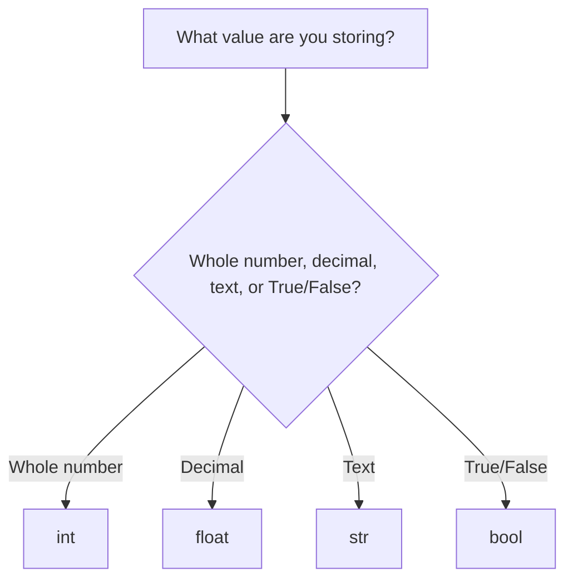

# Foundations of Data: Python Fundamentals
> **Pre-Read — Academic Session 2** | Module 1: Foundations of Data
---
## Mental Map
> 📄 Also provided as a printable PDF in this folder: **mental-map: Python Fundamentals.pdf**

```mermaid
%%{init: {'flowchart': {'useMaxWidth': false, 'htmlLabels': true, 'nodeSpacing': 60, 'rankSpacing': 95, 'wrappingWidth': 620, 'padding': 18}}}%%
flowchart LR

START["<b>Course Start</b>"]

subgraph foundation[" WHERE WE ARE "]
direction TB
    CURMOD["<b>CURRENT MODULE</b><br/><i>Module 1: Foundations of Data</i><br/>&nbsp;<br/><b>Covered so far:</b> The AI Landscape & Programming Foundations<br/>This is Session 2 of 39"]
    CURSES["<b>CURRENT SESSION</b><br/><b>Python Fundamentals</b><br/>&nbsp;<br/><i>The shift:</i> from <i>'I have a dev environment'</i> to <b>'I can write and run real Python code in it'</b><br/>&nbsp;<br/>Variables & data types · Operators<br/>Input/output & f-strings · Notebook discipline"]
end

subgraph outcome[" OUTCOME OF THIS SESSION "]
direction TB
    OUT["<b>By the end, you can…</b><br/>&nbsp;<br/>Declare correctly-typed variables, build expressions with operators,<br/>and write a working input-to-output Python program in Colab"]
end

subgraph value[" WHY IT MATTERS "]
direction TB
    CVAL["<b>Course Value</b><br/>Variables and data types are the building blocks every future session — control flow, functions, pandas — is written in terms of"]
    RVAL["<b>Real-Life Value</b><br/>The same skill behind writing a script that calculates your monthly kirana shop bill or splits a restaurant tab automatically"]
end

subgraph future[" WHAT COMES NEXT "]
direction TB
    U0["<b>Next Session</b><br/>Control Flow & Decision Making<br/><i>Teach your program to make choices, not just calculate</i>"]
    U1["<b>Later in Module 1</b><br/>Loops & Iteration, Master class: Numbers/Logic/Structure, Functions & Data Structures"]
    U2["<b>Upcoming Modules</b><br/>Course continues beyond Foundations of Data<br/><i>Details as the curriculum unfolds</i>"]
end

START ==>|" begin "| CURMOD
CURMOD ==>|" progress "| CURSES
CURSES ==>|" you get "| OUT
OUT ==>|" course "| CVAL
OUT ==>|" real life "| RVAL
CURSES ==>|" next up "| U0
U0 -.->|" then "| U1
U1 -.->|" ahead "| U2

classDef startBox fill:#F7FAFC,stroke:#4A5568,stroke-width:2px,color:#1A202C
classDef curModBox fill:#FFF8E6,stroke:#B7791F,stroke-width:2px,color:#1A202C
classDef curSessBox fill:#E6FFFA,stroke:#0D9488,stroke-width:3px,color:#1A202C
classDef outBox fill:#FEF2F2,stroke:#DC2626,stroke-width:3px,color:#1A202C
classDef valueBox fill:#F3E8FF,stroke:#7C3AED,stroke-width:2px,color:#1A202C
classDef futureBox fill:#ECFDF5,stroke:#047857,stroke-width:2px,color:#1A202C

class START startBox
class CURMOD curModBox
class CURSES curSessBox
class OUT outBox
class CVAL,RVAL valueBox
class U0,U1,U2 futureBox
```



## What You'll Learn
In this pre-read, you'll discover:
- How Python stores information using **variables** and the four basic **data types**
- How to build expressions using **arithmetic** and **comparison operators**
- How to get information from a user and print formatted results using **f-strings**
- How to keep your Colab notebooks organized so your code runs the same way every time

---

## A. Variables & Data Types

- 💡 **Analogy** — Think of your neighborhood **kirana shop's shelves**. Each shelf is labeled and holds one kind of thing — the rice sack, the oil bottle, the price tag. A **variable** in Python is exactly that: a labeled box that holds one value. The *type* of value it holds — a whole number, a decimal, text, or a yes/no — decides what shelf it belongs on.

- **A variable is a named container that stores a value; its data type determines what kind of value it can hold.**

- **Core explanation:**

| Type | Stands for | Example | Looks like |
|---|---|---|---|
| `int` | Integer (whole number) | Number of items in a cart | `5` |
| `float` | Decimal number | Price with paise | `49.50` |
| `str` | String (text) | A name or message | `"Priya"` |
| `bool` | Boolean (true/false) | Is the order paid? | `True` |

- **Worked example:**
```python
item_count = 3          # int
price_per_item = 49.5   # float
customer_name = "Priya" # str
is_paid = True          # bool
```
Here, `item_count` is on the "whole number" shelf, `price_per_item` is on the "decimal" shelf, and so on — Python figures out the type automatically based on how you write the value.

- ⚠️ **Common trap:** Writing `"5"` (with quotes) when you mean the number `5`. `"5"` is text — you can't do maths with it directly. Python will let you *store* it, but `"5" + 1` will crash your program with a type error.



---

## B. Operators

- 💡 **Analogy** — Think of a **cricket scoreboard**. Adding runs after every ball is **arithmetic** (`+`, `-`, `*`, `/`). Checking "is Team A's score greater than Team B's?" is **comparison** (`>`, `<`, `==`) — it doesn't calculate a new number, it gives you a True or False answer.

- **Operators combine values into new values — arithmetic operators produce numbers, comparison operators produce True/False.**

- **Core explanation:**

| Category | Operator | Meaning | Example | Result |
|---|---|---|---|---|
| Arithmetic | `+` `-` `*` `/` | Add, subtract, multiply, divide | `10 + 3` | `13` |
| Arithmetic | `//` | Floor (whole-number) division | `10 // 3` | `3` |
| Arithmetic | `%` | Remainder (modulo) | `10 % 3` | `1` |
| Comparison | `==` | Equal to | `5 == 5` | `True` |
| Comparison | `!=` | Not equal to | `5 != 3` | `True` |
| Comparison | `>` `<` | Greater / less than | `7 > 4` | `True` |

- **Worked example:** A local team scores `184` runs, the visiting team scores `179`.
```python
home_score = 184
away_score = 179
run_difference = home_score - away_score   # arithmetic: 5
home_won = home_score > away_score          # comparison: True
```

- ⚠️ **Common trap:** Confusing `=` with `==`. A single `=` *assigns* a value ("put this in the box"). A double `==` *compares* two values ("are these equal?"). Mixing them up is one of the most common beginner errors in any language.

---

## C. Input, Output & f-strings

- 💡 **Analogy** — Think of taking an order at a **café counter**. `input()` is you asking the customer "what would you like?" and writing down their answer. `print()` with an **f-string** is the receipt you hand back — a message that weaves the customer's own order into a neatly formatted line.

- **`input()` collects information from the user as text; `print()` with an f-string displays a formatted message that can include variable values directly.**

- **Core explanation:**

| Task | Code | Notes |
|---|---|---|
| Ask the user for input | `name = input("What's your name? ")` | Always returns a string, even if you type a number |
| Print a plain message | `print("Order placed!")` | No variables involved |
| Print with variables (f-string) | `print(f"Thanks, {name}!")` | The `f` before the quotes lets you drop variables inside `{}` |

- **Worked example:**
```python
name = input("What's your name? ")
item_count = int(input("How many items? "))
price = 49.5
total = item_count * price
print(f"Hi {name}, your total for {item_count} items is ₹{total}")
```
Notice `int(input(...))` — since `input()` always gives back text, you must convert it to a number before doing maths with it.

- ⚠️ **Common trap:** Forgetting the `f` before the string quotes. Without it, `print("Hi {name}")` will literally print the text `{name}` instead of the value stored in the variable.

---

## D. Notebook Discipline in Colab

- 💡 **Analogy** — A Colab notebook is like following a **family recipe book**. If you skip a step, or run step 5 before step 3, the dish comes out wrong — even though every individual step was written correctly. Cells in a notebook are meant to be run **in order, top to bottom**.

- **Notebook discipline means running cells in a predictable, top-to-bottom order so your code behaves the same way every time you (or someone else) runs it.**

- **Core explanation:**

| Good habit | Why it matters |
|---|---|
| Run cells top to bottom, in order | Variables defined later can't be used earlier — order matters |
| Use "Restart runtime and run all" before sharing/submitting | Catches hidden errors from out-of-order runs |
| Keep one clear task per cell | Easier to debug and re-run just the part that broke |
| Add short comments above tricky cells | Future-you (and your instructor) will understand it faster |

- **Worked example:** If you define `price = 49.5` in cell 3, then re-run cell 2 (which uses `price`) without re-running cell 3 first, Colab will still remember the *old* value of `price` from before — leading to confusing, "it worked a second ago" bugs. Always re-run from the top when in doubt.

- ⚠️ **Common trap:** Submitting a notebook that only "works" because of the exact order you happened to click cells in, not because the code is actually correct top-to-bottom. Always do "Restart runtime and run all" as a final check.

---

## Quick Reference — Which Python Building Block, When

| Your situation | Use this | Because |
|---|---|---|
| You need to store a whole number | `int` | Whole numbers, no decimals |
| You need to store a price or measurement | `float` | Needs decimal precision |
| You need to store a name or message | `str` | Text data |
| You need a yes/no or on/off flag | `bool` | Only two possible states |
| You need to calculate a new number from existing ones | Arithmetic operator | `+ - * / // %` |
| You need to check if two things are equal or which is bigger | Comparison operator | `== != > <` |
| You need text from the user | `input()` | Always returns a string |
| You need to show a variable's value inside a message | f-string | `f"...{variable}..."` |

---

## Practice Exercises

**1. Concept Detective**
Given this line — `is_available = stock_count > 0` — identify which part is a variable, which part is an operator, and what data type `is_available` will end up being.

**2. Real-Life Application**
List three everyday numbers you deal with (like a phone bill, a cricket score, or a shop total) and identify whether each is best stored as an `int`, `float`, `str`, or `bool`, and why.

**3. Spot the Error**
Find the bug: `age = input("Enter your age: ")` followed by `next_year_age = age + 1`. Explain why this crashes and how to fix it.

**4. Pattern Recognition**
Look at this code: it runs fine the first time, but gives a wrong answer when a student re-runs only the second cell after editing the first. What notebook discipline habit would have caught this before submission?

**5. Planning Ahead**
You're about to write a small program that asks for a customer's name and order total, then prints a thank-you message with both values. List the exact steps, in order, using today's four building blocks (variable, data type, operator, f-string).

---
> ✅ **You're done!** You can now declare correctly-typed variables, build expressions with operators, and write a real input-to-output Python program that behaves the same way every time you run it.
Next session, you'll teach your programs to make decisions on their own in **Control Flow & Decision Making**.
