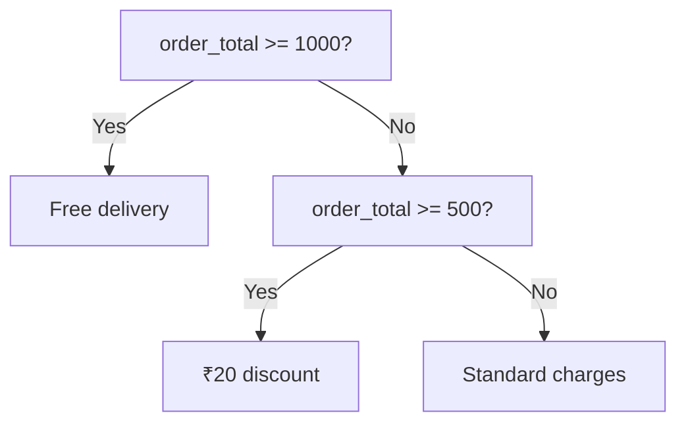

# Foundations of Data: Control Flow & Decision Making
> **Pre-Read — Academic Session 3** | Module 1: Foundations of Data
---
## Mental Map
> 📄 Also provided as a printable PDF in this folder: **mental-map: Control Flow & Decision Making.pdf**

```mermaid
%%{init: {'flowchart': {'useMaxWidth': false, 'htmlLabels': true, 'nodeSpacing': 60, 'rankSpacing': 95, 'wrappingWidth': 620, 'padding': 18}}}%%
flowchart LR

START["<b>Course Start</b>"]

subgraph foundation[" WHERE WE ARE "]
direction TB
    CURMOD["<b>CURRENT MODULE</b><br/><i>Module 1: Foundations of Data</i><br/>&nbsp;<br/><b>Covered so far:</b> The AI Landscape & Programming Foundations; Python Fundamentals<br/>This is Session 3 of 39"]
    CURSES["<b>CURRENT SESSION</b><br/><b>Control Flow & Decision Making</b><br/>&nbsp;<br/><i>The shift:</i> from <i>'my program always does the same thing'</i> to <b>'my program chooses what to do'</b><br/>&nbsp;<br/>if/elif/else · Boolean logic<br/>Comparison operators · Nested conditions"]
end

subgraph outcome[" OUTCOME OF THIS SESSION "]
direction TB
    OUT["<b>By the end, you can…</b><br/>&nbsp;<br/>Build if/elif/else blocks for real decisions, combine conditions with and/or/not,<br/>and trace nested conditions to predict output"]
end

subgraph value[" WHY IT MATTERS "]
direction TB
    CVAL["<b>Course Value</b><br/>Every filter, every business rule, and every data-cleaning check later in this course is built from today's if/elif/else logic"]
    RVAL["<b>Real-Life Value</b><br/>The same logic behind a bank deciding whether to approve a loan, or an app deciding whether you qualify for free delivery"]
end

subgraph future[" WHAT COMES NEXT "]
direction TB
    U0["<b>Next Session</b><br/>Loops, Iteration & Repetitive Logic<br/><i>Teach your program to repeat a decision, not just make it once</i>"]
    U1["<b>Later in Module 1</b><br/>Master class: Numbers/Logic/Structure, Functions, Python Data Structures"]
    U2["<b>Upcoming Modules</b><br/>Course continues beyond Foundations of Data<br/><i>Details as the curriculum unfolds</i>"]
end

START ==>|" begin "| CURMOD
CURMOD ==>|" progress "| CURSES
CURSES ==>|" you get "| OUT
OUT ==>|" course "| CVAL
OUT ==>|" real life "| RVAL
CURSES ==>|" next up "| U0
U0 -.->|" then "| U1
U1 -.->|" ahead "| U2

classDef startBox fill:#F7FAFC,stroke:#4A5568,stroke-width:2px,color:#1A202C
classDef curModBox fill:#FFF8E6,stroke:#B7791F,stroke-width:2px,color:#1A202C
classDef curSessBox fill:#E6FFFA,stroke:#0D9488,stroke-width:3px,color:#1A202C
classDef outBox fill:#FEF2F2,stroke:#DC2626,stroke-width:3px,color:#1A202C
classDef valueBox fill:#F3E8FF,stroke:#7C3AED,stroke-width:2px,color:#1A202C
classDef futureBox fill:#ECFDF5,stroke:#047857,stroke-width:2px,color:#1A202C

class START startBox
class CURMOD curModBox
class CURSES curSessBox
class OUT outBox
class CVAL,RVAL valueBox
class U0,U1,U2 futureBox
```



## What You'll Learn
In this pre-read, you'll discover:
- How to build **if/elif/else** blocks that make your program choose between paths
- How to combine multiple conditions with **and, or, not** (Boolean logic)
- How to reuse **comparison operators** inside conditions
- How to trace **nested conditions** — a condition inside another condition — and predict what runs

---

## A. if / elif / else

- 💡 **Analogy** — Think of the **security guard at a housing society gate**. He checks conditions in strict order: *if* you live there, wave you in. *Else if* you're on today's visitor list, call up first. *Else*, you're turned away. He never checks all the rules at once — he checks them top to bottom, and stops at the first one that matches.

- **`if` runs a block only when a condition is True; `elif` checks another condition only if the previous one was False; `else` catches everything else.**

- **Core explanation:**

| Keyword | When it runs |
|---|---|
| `if` | Runs if its condition is `True` |
| `elif` | Only checked if all conditions above it were `False` |
| `else` | Runs only if nothing above it matched |

- **Worked example:**
```python
order_total = 650

if order_total >= 1000:
    print("You get free delivery!")
elif order_total >= 500:
    print("You get a ₹20 discount on delivery.")
else:
    print("Standard delivery charges apply.")
```
Python checks `order_total >= 1000` first (False), then `order_total >= 500` (True) — prints the discount message, and never even looks at the `else`.

- ⚠️ **Common trap:** Using multiple separate `if` statements instead of `elif` when only one branch should run. With separate `if`s, Python checks *every* condition independently — which can accidentally trigger more than one block when you only wanted one.



---

## B. Boolean Logic (and / or / not)

- 💡 **Analogy** — Think of a **college admission rule**: you need a minimum score **AND** a minimum attendance to qualify normally. But a sports quota lets you in with just one of two conditions — a state-level medal **OR** a national-level medal. And a rule might say **NOT** blacklisted from a previous year.

- **`and` requires every condition to be True; `or` requires at least one to be True; `not` flips a True to False and vice versa.**

- **Core explanation:**

| Operator | Requires | Example | Result |
|---|---|---|---|
| `and` | Both sides True | `score >= 80 and attendance >= 75` | True only if both hold |
| `or` | At least one side True | `has_state_medal or has_national_medal` | True if either holds |
| `not` | Flips the value | `not is_blacklisted` | True when `is_blacklisted` is False |

- **Worked example:**
```python
score = 82
attendance = 78
is_blacklisted = False

eligible = score >= 80 and attendance >= 75 and not is_blacklisted
print(eligible)   # True
```

- ⚠️ **Common trap:** Assuming `and`/`or` work like everyday English exactly. In English, "I want tea or coffee" often implies "just one." In Python, `or` is True even if *both* sides are True — it only fails when both are False.

---

## C. Comparison Operators, Revisited

- 💡 **Analogy** — Same **cricket scoreboard** from Session 1.2 — but now the comparison result doesn't just get printed, it *decides* what happens next.

- **Comparison operators produce the True/False values that if/elif/else and Boolean logic act on — they're the raw ingredient of every condition.**

- **Core explanation:**

| Operator | Meaning |
|---|---|
| `==` | Equal to |
| `!=` | Not equal to |
| `>` `<` | Greater / less than |
| `>=` `<=` | Greater-or-equal / less-or-equal |

- **Worked example:**
```python
runs_needed = 12
balls_left = 6

if runs_needed <= balls_left * 2:
    print("This is gettable!")
else:
    print("Tough chase.")
```

- ⚠️ **Common trap:** Writing `if is_paid == True:` instead of simply `if is_paid:`. Both work, but the second is the convention Python programmers actually use — a boolean variable is already True or False, so comparing it to `True` again is redundant.

---

## D. Nested Conditions

- 💡 **Analogy** — Think of **withdrawing cash at an ATM**. First check: is the PIN correct? Only *if* that passes does the ATM even check the second condition: is there enough balance? That second check is "nested" inside the first — it never even runs if the PIN was wrong.

- **A nested condition is an if/elif/else block placed inside another one — the inner block only runs if the outer condition was already True.**

- **Core explanation:**

| Concept | What it means |
|---|---|
| Outer condition | The first gate that must pass |
| Inner condition | Only checked once the outer condition is True |
| Indentation | Python uses indentation (spacing) to know which block is "inside" which |

- **Worked example:**
```python
pin_correct = True
balance = 500
withdrawal_amount = 700

if pin_correct:
    if withdrawal_amount <= balance:
        print("Cash dispensed.")
    else:
        print("Insufficient balance.")
else:
    print("Incorrect PIN.")
```
Here, the balance check is never even reached if `pin_correct` is False — tracing this top to bottom is exactly how you predict the output.

- ⚠️ **Common trap:** Incorrect indentation. Python uses indentation, not curly braces, to define which lines belong inside which block — a misaligned line can silently move code out of the block you intended, without necessarily throwing an error.

---

## Quick Reference — Which Logic Tool, When

| Your situation | Use this | Because |
|---|---|---|
| Exactly one of several branches should run | `if / elif / else` | Stops at the first match, top to bottom |
| All conditions must hold together | `and` | Fails if even one condition is False |
| Any one condition is enough | `or` | Succeeds if at least one condition is True |
| You need the opposite of a condition | `not` | Flips True and False |
| A decision depends on an earlier decision already passing | Nested if | Inner block only runs after outer condition is True |

---

## Practice Exercises

**1. Concept Detective**
Given `if score >= 90: ... elif score >= 75: ... else: ...` and `score = 82`, identify exactly which branch runs and why the others don't.

**2. Real-Life Application**
Describe a real eligibility rule you've encountered (loan approval, exam qualification, discount coupon) that uses `and` or `or`, and write it as a single Boolean expression.

**3. Spot the Error**
A student writes three separate `if` statements to decide a single delivery charge, instead of `if/elif/else`. Explain what could go wrong and rewrite it correctly.

**4. Pattern Recognition**
Trace this code by hand and predict the output: `pin_correct = False`, then a nested if/else checking `pin_correct` and then `balance`. What prints, and why does the balance check never run?

**5. Planning Ahead**
You want to check whether a customer qualifies for a loyalty discount: they must have made at least 5 orders AND either be a premium member OR have spent over ₹5000 total. Write this as a single Boolean expression using `and`/`or`.

---
> ✅ **You're done!** You can now build if/elif/else blocks, combine conditions with Boolean logic, and trace nested conditions to predict exactly what a program will do.
Next session, you'll learn to repeat these decisions automatically across many items in **Loops, Iteration & Repetitive Logic**.
