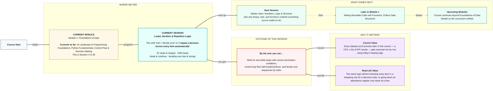

# Mental Map — Loops, Iteration & Repetitive Logic
> Academic Session 4 · Module 1: Foundations of Data

```mermaid
%%{init: {"theme": "default", "themeVariables": { "fontSize": "28px", "fontFamily": "sans-serif" }, "flowchart": {"useMaxWidth": false, "htmlLabels": true, "nodeSpacing": 100, "rankSpacing": 140, "wrappingWidth": 700, "padding": 40}}}%%
flowchart LR

START["<b>Course Start</b>"]

subgraph foundation[" WHERE WE ARE "]
direction TB
    CURMOD["<b>CURRENT MODULE</b><br/><i>Module 1: Foundations of Data</i><br/>&nbsp;<br/><b>Covered so far:</b> AI Landscape & Programming Foundations; Python Fundamentals; Control Flow & Decision Making<br/>This is Session 4 of 39"]
    CURSES["<b>CURRENT SESSION</b><br/><b>Loops, Iteration & Repetitive Logic</b><br/>&nbsp;<br/><i>The shift:</i> from <i>'I decide once'</i> to <b>'I repeat a decision across every item automatically'</b><br/>&nbsp;<br/>for loops & range() · while loops<br/>break & continue · iterating over lists & strings"]
end

subgraph outcome[" OUTCOME OF THIS SESSION "]
direction TB
    OUT["<b>By the end, you can…</b><br/>&nbsp;<br/>Write for and while loops with correct termination conditions,<br/>control loop flow with break/continue, and iterate over sequences by index"]
end

subgraph value[" WHY IT MATTERS "]
direction TB
    CVAL["<b>Course Value</b><br/>Every dataset you'll process later in this course — a CSV, a list of API results — gets scanned row by row using today's looping logic"]
    RVAL["<b>Real-Life Value</b><br/>The same logic behind checking every item in a shopping cart for a discount code, or going down an attendance register one name at a time"]
end

subgraph future[" WHAT COMES NEXT "]
direction TB
    U0["<b>Next Session</b><br/>Master class: Numbers, Logic & Structure<br/><i>See why binary, sets, and functions underlie everything you've coded so far</i>"]
    U1["<b>Later in Module 1</b><br/>Writing Reusable Code with Functions, Python Data Structures"]
    U2["<b>Upcoming Modules</b><br/>Course continues beyond Foundations of Data<br/><i>Details as the curriculum unfolds</i>"]
end

START ==>|" begin "| CURMOD
CURMOD ==>|" progress "| CURSES
CURSES ==>|" you get "| OUT
OUT ==>|" course "| CVAL
OUT ==>|" real life "| RVAL
CURSES ==>|" next up "| U0
U0 -.->|" then "| U1
U1 -.->|" ahead "| U2

classDef startBox fill:#F7FAFC,stroke:#4A5568,stroke-width:2px,color:#1A202C
classDef curModBox fill:#FFF8E6,stroke:#B7791F,stroke-width:2px,color:#1A202C
classDef curSessBox fill:#E6FFFA,stroke:#0D9488,stroke-width:3px,color:#1A202C
classDef outBox fill:#FEF2F2,stroke:#DC2626,stroke-width:3px,color:#1A202C
classDef valueBox fill:#F3E8FF,stroke:#7C3AED,stroke-width:2px,color:#1A202C
classDef futureBox fill:#ECFDF5,stroke:#047857,stroke-width:2px,color:#1A202C

class START startBox
class CURMOD curModBox
class CURSES curSessBox
class OUT outBox
class CVAL,RVAL valueBox
class U0,U1,U2 futureBox
```
