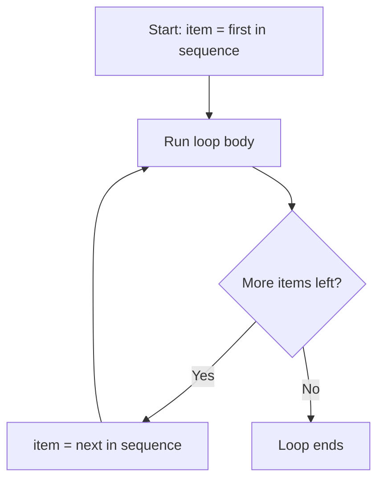

# Foundations of Data: Loops, Iteration & Repetitive Logic
> **Pre-Read — Academic Session 4** | Module 1: Foundations of Data
---
## Mental Map
> 📄 Also provided as a printable PDF in this folder: **mental-map: Loops, Iteration & Repetitive Logic.pdf**

```mermaid
%%{init: {'flowchart': {'useMaxWidth': false, 'htmlLabels': true, 'nodeSpacing': 60, 'rankSpacing': 95, 'wrappingWidth': 620, 'padding': 18}}}%%
flowchart LR

START["<b>Course Start</b>"]

subgraph foundation[" WHERE WE ARE "]
direction TB
    CURMOD["<b>CURRENT MODULE</b><br/><i>Module 1: Foundations of Data</i><br/>&nbsp;<br/><b>Covered so far:</b> AI Landscape & Programming Foundations; Python Fundamentals; Control Flow & Decision Making<br/>This is Session 4 of 39"]
    CURSES["<b>CURRENT SESSION</b><br/><b>Loops, Iteration & Repetitive Logic</b><br/>&nbsp;<br/><i>The shift:</i> from <i>'I decide once'</i> to <b>'I repeat a decision across every item automatically'</b><br/>&nbsp;<br/>for loops & range() · while loops<br/>break & continue · iterating over lists & strings"]
end

subgraph outcome[" OUTCOME OF THIS SESSION "]
direction TB
    OUT["<b>By the end, you can…</b><br/>&nbsp;<br/>Write for and while loops with correct termination conditions,<br/>control loop flow with break/continue, and iterate over sequences by index"]
end

subgraph value[" WHY IT MATTERS "]
direction TB
    CVAL["<b>Course Value</b><br/>Every dataset you'll process later in this course — a CSV, a list of API results — gets scanned row by row using today's looping logic"]
    RVAL["<b>Real-Life Value</b><br/>The same logic behind checking every item in a shopping cart for a discount code, or going down an attendance register one name at a time"]
end

subgraph future[" WHAT COMES NEXT "]
direction TB
    U0["<b>Next Session</b><br/>Master class: Numbers, Logic & Structure<br/><i>See why binary, sets, and functions underlie everything you've coded so far</i>"]
    U1["<b>Later in Module 1</b><br/>Writing Reusable Code with Functions, Python Data Structures"]
    U2["<b>Upcoming Modules</b><br/>Course continues beyond Foundations of Data<br/><i>Details as the curriculum unfolds</i>"]
end

START ==>|" begin "| CURMOD
CURMOD ==>|" progress "| CURSES
CURSES ==>|" you get "| OUT
OUT ==>|" course "| CVAL
OUT ==>|" real life "| RVAL
CURSES ==>|" next up "| U0
U0 -.->|" then "| U1
U1 -.->|" ahead "| U2

classDef startBox fill:#F7FAFC,stroke:#4A5568,stroke-width:2px,color:#1A202C
classDef curModBox fill:#FFF8E6,stroke:#B7791F,stroke-width:2px,color:#1A202C
classDef curSessBox fill:#E6FFFA,stroke:#0D9488,stroke-width:3px,color:#1A202C
classDef outBox fill:#FEF2F2,stroke:#DC2626,stroke-width:3px,color:#1A202C
classDef valueBox fill:#F3E8FF,stroke:#7C3AED,stroke-width:2px,color:#1A202C
classDef futureBox fill:#ECFDF5,stroke:#047857,stroke-width:2px,color:#1A202C

class START startBox
class CURMOD curModBox
class CURSES curSessBox
class OUT outBox
class CVAL,RVAL valueBox
class U0,U1,U2 futureBox
```



## What You'll Learn
In this pre-read, you'll discover:
- How **for loops** and `range()` repeat an action a known number of times
- How **while loops** repeat an action until a condition changes
- How **break** and **continue** give you fine control over a running loop
- How to **iterate over lists and strings**, and access elements by index

---

## A. for Loops & range()

- 💡 **Analogy** — Think of **distributing prasad to everyone in a queue** at a temple. You know exactly how many people are in line, and you go one by one, in order, until you've served everyone. A `for` loop does the same thing — it runs its block once for each item in a known sequence.

- **A `for` loop repeats a block of code once for every item in a sequence — you know it will run a fixed, countable number of times.**

- **Core explanation:**

| Tool | What it does | Example |
|---|---|---|
| `for item in sequence:` | Runs once per item in the sequence | `for name in names:` |
| `range(n)` | Generates numbers `0` to `n-1` | `range(5)` → `0,1,2,3,4` |
| `range(start, stop)` | Generates numbers from `start` to `stop-1` | `range(1, 6)` → `1,2,3,4,5` |

- **Worked example:**
```python
for person_number in range(1, 6):
    print(f"Serving prasad to person {person_number}")
```
This runs exactly 5 times — once for each number from 1 to 5 — no more, no less.

- ⚠️ **Common trap:** Expecting `range(5)` to include `5`. It actually stops one short — `range(5)` gives `0,1,2,3,4`, never `5`.



---

## B. while Loops & Termination Conditions

- 💡 **Analogy** — Think of **waiting at a bus stop**. You don't know exactly how many minutes it'll take — you just keep waiting *while* the bus hasn't arrived. The moment it arrives, you stop. A `while` loop repeats *as long as* a condition stays True — you don't necessarily know in advance how many times.

- **A `while` loop keeps running its block as long as its condition is True — it stops the moment the condition becomes False.**

- **Core explanation:**

| Concept | What it means |
|---|---|
| Condition | Checked *before* every repetition |
| Termination | Something inside the loop must eventually make the condition False |
| Infinite loop | A bug where the condition never becomes False — the loop never stops |

- **Worked example:**
```python
bus_arrived = False
minutes_waited = 0

while not bus_arrived:
    minutes_waited += 1
    print(f"Waited {minutes_waited} minute(s)...")
    if minutes_waited == 7:
        bus_arrived = True

print("Bus arrived!")
```

- ⚠️ **Common trap:** Forgetting to update the variable that controls the condition (like `minutes_waited` or `bus_arrived`) inside the loop. If nothing ever changes, the condition stays True forever — an infinite loop that freezes your program.

---

## C. break & continue

- 💡 **Analogy** — Think of an **airport security line**. If the metal detector alarms seriously, security pulls you out of the line entirely — that's `break`, stopping the loop completely. If someone just forgot to remove their belt, they step aside, fix it, and rejoin at the next check — that's `continue`, skipping just this one iteration and moving to the next.

- **`break` exits the loop immediately, no matter what's left; `continue` skips the rest of the current iteration and moves to the next one.**

- **Core explanation:**

| Keyword | Effect |
|---|---|
| `break` | Stops the entire loop immediately |
| `continue` | Skips to the next iteration, loop keeps running |

- **Worked example:**
```python
for item_price in [200, 150, 0, 300, 450]:
    if item_price == 0:
        continue          # skip invalid price, keep checking others
    if item_price > 400:
        break              # stop entirely once we hit an out-of-budget item
    print(f"Item within budget: ₹{item_price}")
```

- ⚠️ **Common trap:** Confusing `break` and `continue`. `continue` still lets the loop carry on to the next item; `break` ends the loop right there, even if items remain.

---

## D. Iterating Over Lists & Strings

- 💡 **Analogy** — Think of an **attendance register**. Each name has a row number (its index), and a teacher can either read names in order top to bottom, or jump straight to "row number 5" to check one specific student.

- **Lists and strings are sequences — you can loop through every element in order, or access a specific one directly using its index (starting from 0).**

- **Core explanation:**

| Task | Code | Notes |
|---|---|---|
| Loop through every item | `for student in roll_call:` | Visits each item in order |
| Access by index | `roll_call[0]` | Gets the first item (index starts at 0) |
| Loop through a string | `for letter in "Python":` | Strings are sequences of characters too |
| Get index while looping | `for i, student in enumerate(roll_call):` | Gives you both position and value |

- **Worked example:**
```python
roll_call = ["Aditi", "Rohan", "Meera"]

for i, student in enumerate(roll_call):
    print(f"Row {i}: {student}")
```
Output: `Row 0: Aditi`, `Row 1: Rohan`, `Row 2: Meera` — indexing always starts counting from 0, not 1.

- ⚠️ **Common trap:** Assuming the first item is at index `1`. In Python, indexing always starts at `0` — the first item is `roll_call[0]`, not `roll_call[1]`.

---

## Quick Reference — Which Loop, When

| Your situation | Use this | Because |
|---|---|---|
| You know exactly how many times to repeat | `for` loop with `range()` | Fixed, countable repetitions |
| You're repeating for every item in a list/string | `for item in sequence:` | Visits each item once, in order |
| You don't know in advance how many repeats you'll need | `while` loop | Repeats until a condition changes |
| You need to stop a loop entirely early | `break` | Exits immediately |
| You need to skip just one iteration, not the whole loop | `continue` | Moves to the next item |
| You need both the position and the value while looping | `enumerate()` | Gives index and item together |

---

## Practice Exercises

**1. Concept Detective**
Explain, in your own words, why `range(5)` produces `0,1,2,3,4` and not `1,2,3,4,5`.

**2. Real-Life Application**
Describe a daily task you do that's naturally a `for` loop (a known, fixed count) and one that's naturally a `while` loop (repeat until something changes) — explain why each fits its category.

**3. Spot the Error**
A student writes a `while` loop to countdown from 5 to 0, but forgets to decrease the counter inside the loop. What happens when they run it, and how do they fix it?

**4. Pattern Recognition**
Trace this loop by hand: `for price in [100, 0, 250, 500]:` with a `continue` on `price == 0` and a `break` on `price > 400`. List exactly what gets printed, in order.

**5. Planning Ahead**
You have a list of 20 customer orders and want to print only the first order that exceeds ₹1000, then stop checking the rest. Which loop and which keyword (`break` or `continue`) would you use, and why?

---
> ✅ **You're done!** You can now write for and while loops with correct termination conditions, control loop flow with break and continue, and iterate over lists and strings by index.
Next session is a Master class — **Numbers, Logic & Structure** — where you'll see the mathematics quietly underneath everything you've coded so far.
